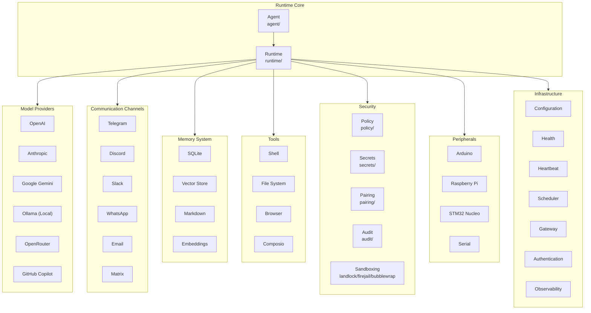

# Agent Runtime Architecture

## Overview

The Corvus Agent Runtime is an autonomous agent execution system optimized for high performance,
high efficiency, high stability, high extensibility, high sustainability, and high security. This
documentation describes the internal architecture of the runtime, its main components, and the
design decisions that enable these properties.

The runtime is implemented in Rust, a language that offers memory control without garbage
collection, zero-cost concurrency, and compile-time type safety. This choice is not arbitrary: the
Agent Runtime is designed to run in environments where latency, resource consumption, and
reliability are critical.

## Design Principles

### Trait-Driven Architecture

The runtime uses a trait-driven architecture pattern to maximize extensibility. Each main component
is defined by a trait that establishes a clear contract. Concrete implementations can be replaced or
extended without modifying the core code.

This design decision allows the system to evolve without breaking the Open/Closed principle: open
for extension, closed for modification. When a new model provider or communication channel needs to
be added, the developer implements the corresponding trait and registers the implementation in the
module factory.

### Security by Default

The system adopts a "deny by default" principle on all risk surfaces. Filesystem, network, and
command execution operations are subject to configurable security policies that can restrict the
agent's capability scope. The security modules (`security/`) implement multiple protection layers
including kernel-level sandboxing using Landlock, Bubblewrap, and Firejail, auditing of sensitive
operations, anomaly detection, and encrypted secret storage.

### Resilience

Model providers are wrapped in a resilience system (`providers/reliable.rs`) that handles automatic
retries, configurable timeouts, and fallback between providers. If a primary provider fails, the
system can automatically try alternative providers without interrupting agent execution.

## Main Components

### Agent

The `agent/` module contains the agent orchestration logic. It defines the execution lifecycle, from
message reception to response generation. This module is responsible for maintaining conversation
state, managing context, and coordinating interactions with other system components.

The agent uses an execution loop pattern that alternates between thinking phases and action phases.
During thinking phases, the agent analyzes available context and decides which tools to invoke.
During action phases, it executes selected tools and processes results.

### Providers

The `providers/` module includes implementations for multiple language model providers. Each
provider is an implementation of the `Provider` trait that defines methods for sending prompts,
receiving responses, and managing authentication.

Supported providers include OpenAI (GPT-4, GPT-4o, GPT-4o-mini), Anthropic (Claude 3.5, Claude 3),
Google Gemini, Ollama for local execution, OpenRouter as an aggregator, GitHub Copilot, and
OpenAI-compatible models. The routing system (`providers/router.rs`) can direct requests to
different providers based on configuration, cost, or availability.

### Channels

The `channels/` module implements integration with multiple communication platforms. Each channel is
an implementation of the `Channel` trait that handles message reception, response sending, and
health checks.

Supported channels include Telegram, Discord, Slack, WhatsApp, Email, Matrix, Signal, IRC, Lark,
DingTalk, QQ, Mattermost, iMessage, and an interactive CLI. This variety allows the agent to operate
across multiple platforms simultaneously, unifying the user experience.

### Memory

The memory system (`memory/`) is one of the most differentiating components of the Agent Runtime.
Unlike simple agents that only maintain conversation context, Corvus implements a multidimensional
memory system that includes short-term memory (current conversation), long-term memory (SQLite
persistence), vector storage for semantic search, embedding generation for numerical text
representations, intelligent chunking for large documents, and response caching to avoid
regenerating identical content.

### Tools

The `tools/` module defines the agent's executive capabilities. Each tool is an implementation of
the `Tool` trait that receives structured parameters, executes an operation, and returns a
structured result. Built-in tools include shell command execution, filesystem access, web browser
control, Composio integration for external tools, and memory tools for persisting and retrieving
information.

#### MCP Tool Runtime

MCP tools are integrated as first-class `Tool` adapters through `tools/mcp/` with a strict
namespace contract: `mcp.<server>.<tool>`. Registration happens at startup only when
`mcp.enabled = true`.

Security and resilience behavior:

- Discovery is fail-isolated per server (one broken server does not block healthy servers).
- Name collisions fail closed for MCP registration to avoid ambiguous dispatch.
- MCP tool calls are classified as risk-bearing and require explicit approval by default.
- Runtime enforces per-call timeouts and output byte caps.
- Transport and timeout failures return structured machine-readable errors.
- Diagnostics are redacted before logging to avoid credential leakage.

### Peripherals

The `peripherals/` module extends the agent to the physical world. It allows controlling devices
such as Arduino development boards, Raspberry Pi via GPIO, STM32 Nucleo microcontrollers, generic
serial devices, and firmware flash capabilities. This module enables the agent to interact with real
hardware, opening possibilities for physical automation.

### Security

The security subsystem implements multiple protection layers. Security policy (`security/policy.rs`)
defines which operations are permitted under which conditions. Secret handling (
`security/secrets.rs`) provides encrypted storage for credentials and API keys. Pairing (
`security/pairing.rs`) allows establishing trust relationships between the agent and users or
services. Audit (`security/audit.rs`) records all sensitive operations for later review.

Sandboxing mechanisms use Linux kernel capabilities to restrict resources available to the agent.
Landlock applies filesystem and network restrictions without requiring root privileges. Bubblewrap
creates lightweight containers with complete isolation. Firejail provides established sandboxing
with multiple pre-configured profiles.

### Infrastructure

Several modules provide essential infrastructure capabilities. The configuration module (`config/`)
handles loading and merging options from multiple sources. The health system (`health/`) performs
periodic checks of system components. The heartbeat (`heartbeat/`) provides liveness signals for
external monitoring. The cron scheduler (`cron/`) allows executing commands at specific times or at
regular intervals. The gateway (`gateway/`) exposes the agent as a web service with webhooks.
Authentication (`auth/`) manages user profiles and access tokens. Observability (`observability/`)
provides logging, metrics, and tracing.

## Execution Flow

The typical execution flow begins when a message arrives through a communication channel. The
channel authenticates the user, validates the message, and passes it to the agent. The agent
analyzes the message, queries memory for relevant context, and determines what actions to take.

If the agent decides to use tools, it constructs appropriate tool calls with necessary parameters.
Tools execute with configured security restrictions. Results return to the agent, which may decide
to invoke more tools or generate a final response.

The response sends back through the same channel it arrived on. The agent updates its memory with
the conversation, saving relevant information for future interactions.

## Extensibility

To add a new model provider, the developer creates a new file in `providers/` that implements the
`Provider` trait. The implementation must define how to convert a prompt into a provider API
request, how to parse the response, and how to handle provider-specific errors. Finally, the new
implementation registers in `providers/mod.rs`.

To add a new communication channel, the process is similar. Create an implementation of the
`Channel` trait that handles the platform-specific protocol (Telegram Bot API, Discord API, etc.).
Register the channel in `channels/mod.rs` and it becomes immediately available to receive and send
messages.

To add new tools, implement the `Tool` trait with the specific tool logic. Tools can declare strict
parameter schemas that enable automatic input validation.

## Performance Considerations

The runtime is optimized to minimize end-to-end latency. Connection to model providers remains
persistent when possible, avoiding TLS handshake overhead. The memory system uses optimized indexes
for fast searches. I/O operations are asynchronous, enabling concurrent processing of multiple
requests.

Memory consumption is controlled through configurable limits in the memory system. Embeddings
generate on-demand and cache for reuse. Large documents process in chunks that fit in available
memory.

## Security Model

The Agent Runtime security model follows the principle of least privilege. Each operation requires
explicit permissions. Users can define policies that restrict what files the agent can access, what
commands it can execute, what network it can reach, and what peripherals it can control.

For MCP specifically, the default posture is conservative: MCP tools are denied for direct
execution unless an approval path explicitly allows the call. This keeps remote tool providers
behind the same oversight boundary as other high-risk operations.

Policies express in a declarative language that allows granular configurations. For example, a
policy can allow read access to a specific directory but deny all access to paths outside that
directory. The audit system records every policy decision for security review.

## Conclusion

The Corvus Agent Runtime architecture reflects a commitment between performance, security, and
extensibility. The use of Rust provides the foundations for performance and memory safety. The
trait-based architecture allows continuous evolution without breakage. Multiple security layers
protect both the system and users. The modular design ensures each component can be improved or
replaced independently.

This architecture is designed to serve as a foundation platform for building complex autonomous
agents that operate in demanding environments, from personal automation to infrastructure
coordination.
