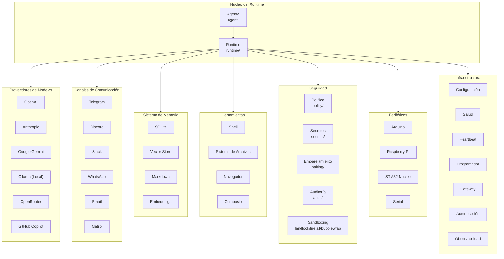

# Arquitectura del Agent Runtime

## Visión General

El Agent Runtime de Corvus es un sistema de ejecución de agentes autónomos optimizado para lograr alto rendimiento, eficiencia, estabilidad, extensibilidad, sostenibilidad y seguridad. Esta documentación describe la arquitectura interna del runtime, sus componentes principales y las decisiones de diseño que permiten estas propiedades.

El runtime está implementado en Rust, un lenguaje que ofrece control de memoria sin recolector de basura, concurrencia sin costos adicionales y seguridad de tipos en tiempo de compilación. Esta elección no es arbitraria: el Agent Runtime está diseñado para ejecutarse en entornos donde la latencia, el consumo de recursos y la confiabilidad son críticos.

## Principios de Diseño

### Trait-Driven Architecture

El runtime utiliza un patrón de arquitectura basada en traits para maximizar la extensibilidad. Cada componente principal está definido por un trait que establece un contrato claro. Las implementaciones concretas pueden ser reemplazadas o extendidas sin modificar el código del núcleo.

Esta decisión de diseño permite que el sistema evolucione sin romper el principio Open/Closed: abierto para extensión, cerrado para modificación. Cuando un nuevo proveedor de modelos o un nuevo canal de comunicación necesita ser añadido, el desarrollador implementa el trait correspondiente y registra la implementación en la fábrica del módulo.

### Seguridad por Defecto

El sistema adopta el principio de "denegar por defecto" en todas las superficies de riesgo. Las operaciones de filesystem, red y ejecución de comandos están sujetas a políticas de seguridad configurables que pueden restringir el alcance de las capacidades del agente. Los módulos de seguridad (`security/`) implementan múltiples capas de protección incluyendo sandboxing a nivel de kernel mediante Landlock, Bubblewrap y Firejail, auditoría de operaciones sensibles, detección de anomalías, y gestión de secretos cifrada.

### Resiliencia

Los proveedores de modelos están envueltos en un sistema de resiliencia (`providers/reliable.rs`) que maneja reintentos automáticos, timeouts configurables y fallback entre proveedores. Si un proveedor primario falla, el sistema puede automáticamente intentar con proveedores alternativos sin interrumpir la ejecución del agente.

## Componentes Principales

### Agente

El módulo `agent/` contiene la lógica de orquestación del agente. Define el ciclo de vida de ejecución, desde la recepción de un mensaje hasta la generación de una respuesta. Este módulo es responsable de mantener el estado de la conversación, gestionar el contexto y coordinar las interacciones con los otros componentes del sistema.

El agente utiliza un patrón de loop de ejecución que alterna entre fases de pensamiento y fases de acción. Durante las fases de pensamiento, el agente analiza el contexto disponible y decide qué herramientas invocar. Durante las fases de acción, ejecuta las herramientas seleccionadas y procesa los resultados.

### Proveedores

El módulo `providers/` incluye implementaciones para múltiples proveedores de modelos de lenguaje. Cada proveedor es una implementación del trait `Provider` que define los métodos para enviar prompts, recibir respuestas y gestionar la autenticación.

Los proveedores soportados incluyen OpenAI (GPT-4, GPT-4o, GPT-4o-mini), Anthropic (Claude 3.5, Claude 3), Google Gemini, Ollama para ejecución local, OpenRouter como agregador, GitHub Copilot y modelos compatibles con la API de OpenAI. El sistema de enrutamiento (`providers/router.rs`) puede dirigir solicitudes a diferentes proveedores basado en configuración, costo o disponibilidad.

### Canales

El módulo `channels/` implementa la integración con múltiples plataformas de comunicación. Cada canal es una implementación del trait `Channel` que maneja la recepción de mensajes, el envío de respuestas y las verificaciones de salud.

Los canales soportados incluyen Telegram, Discord, Slack, WhatsApp, Email, Matrix, Signal, IRC, Lark, DingTalk, QQ, Mattermost, iMessage y un CLI interactivo. Esta variedad permite que el agente opere en múltiples plataformas simultáneamente, unificando la experiencia del usuario.

### Memoria

El sistema de memoria (`memory/`) es uno de los componentes más diferenciadores del Agent Runtime. A diferencia de agentes simples que solo mantienen contexto de conversación, Corvus implementa un sistema de memoria multidimensional que incluye memoria a corto plazo (conversación actual), memoria a largo plazo (SQLite persistido), almacenamiento vectorial para búsqueda semántica, generación de embeddings para representaciones numéricas de texto, chunking inteligente para documentos grandes, y caching de respuestas para evitar regenerar contenido idéntico.

### Herramientas

El módulo `tools/` define las capacidades ejecutivas del agente. Cada herramienta es una implementación del trait `Tool` que recibe parámetros estructurados, ejecuta una operación y devuelve un resultado estructurado. Las herramientas integradas incluyen ejecución de comandos shell, acceso al sistema de archivos, control de navegador web, integración con Composio para herramientas externas, y herramientas de memoria para persistir y recuperar información.

### Periféricos

El módulo `peripherals/` extiende el agente al mundo físico. Permite controlar dispositivos como placas de desarrollo Arduino, Raspberry Pi a través de GPIO, microcontroladores STM32 Nucleo, dispositivos serie genéricos, y capacidades de flash de firmware. Este módulo permite que el agente interactúe con hardware real, abriendo posibilidades para automatización física.

### Seguridad

El subsistema de seguridad implementa múltiples capas de protección. La política de seguridad (`security/policy.rs`) define qué operaciones están permitidas bajo qué condiciones. El manejo de secretos (`security/secrets.rs`) proporciona almacenamiento cifrado para credenciales y claves API. El emparejamiento (`security/pairing.rs`) permite establecer relaciones de confianza entre el agente y usuarios o servicios. La auditoría (`security/audit.rs`) registra todas las operaciones sensibles para revisión posterior.

Los mecanismos de sandboxing utilizan las capacidades del kernel de Linux para restringir los recursos disponibles al agente. Landlock aplica restricciones de filesystem y red sin requerir privilegios de root. Bubblewrap crea contenedores livianos con aislamiento completo. Firejail proporciona sandboxing establecido con múltiples perfiles preconfigurados.

### Infraestructura

Varios módulos proporcionan capacidades de infraestructura esenciales. El módulo de configuración (`config/`) maneja la carga y fusión de opciones desde múltiples fuentes. El sistema de salud (`health/`) realiza verificaciones periódicas de los componentes del sistema. El heartbeat (`heartbeat/`) proporciona señales de vida para monitoreo externo. El programador cron (`cron/`) permite ejecutar comandos en horarios específicos o con intervalos regulares. El gateway (`gateway/`) expone el agente como un servicio web con webhooks. La autenticación (`auth/`) gestiona los perfiles de usuario y tokens de acceso. La observabilidad (`observability/`) proporciona logging, métricas y tracing.

## Flujo de Ejecución

El flujo de ejecución típico comienza cuando un mensaje llega a través de un canal de comunicación. El canal autentica al usuario, valida el mensaje y lo pasa al agente. El agente analiza el mensaje, consulta la memoria para contexto relevante, y determina qué acciones tomar.

Si el agente decide usar herramientas, construye las llamadas a las herramientas apropiadas con los parámetros necesarios. Las herramientas se ejecutan con las restricciones de seguridad configuradas. Los resultados se devuelven al agente, que puede decidir invocar más herramientas o generar una respuesta final.

La respuesta se envía de vuelta a través del mismo canal por el que llegó el mensaje. El agente actualiza su memoria con la conversación, guardando información relevante para futuras interacciones.

## Extensibilidad

Para añadir un nuevo proveedor de modelos, el desarrollador crea un nuevo archivo en `providers/` que implementa el trait `Provider`. La implementación debe definir cómo convertir el prompt en una solicitud a la API del proveedor, cómo parsear la respuesta, y cómo manejar errores específicos del proveedor. Finalmente, se registra la nueva implementación en `providers/mod.rs`.

Para añadir un nuevo canal de comunicación, el proceso es similar. Se crea una implementación del trait `Channel` que maneja el protocolo específico de la plataforma (Telegram Bot API, Discord API, etc.). El canal se registra en `channels/mod.rs` y queda inmediatamente disponible para recibir y enviar mensajes.

Para añadir nuevas herramientas, se implementa el trait `Tool` con la lógica específica de la herramienta. Las herramientas pueden declararse con esquemas de parámetros estrictos que permiten validación automática de las entradas.

## Consideraciones de Rendimiento

El runtime está optimizado para minimizar la latencia de extremo a extremo. La conexión con proveedores de modelos se mantiene persistente cuando es posible, evitando el overhead de establecimiento de conexión TLS. El sistema de memoria utiliza índices optimizados para búsquedas rápidas. Las operaciones de I/O son asíncronas, permitiendo procesamiento concurrente de múltiples solicitudes.

El consumo de memoria está controlado mediante límites configurables en el sistema de memoria. Los embeddings se generan bajo demanda y se cachean para reutilización. Los documentos grandes se procesan en chunks que caben en memoria disponible.

## Modelo de Seguridad

El modelo de seguridad del Agent Runtime sigue el principio de menor privilegio. Cada operación requiere permisos explícitos. Los usuarios pueden definir políticas que restringen qué archivos puede acceder el agente, qué comandos puede ejecutar, qué red puede alcanzar, y qué periféricos puede controlar.

Las políticas se expresan en un lenguaje declarativo que permite configuraciones granulares. Por ejemplo, una política puede permitir acceso de lectura a un directorio específico, pero denegar todo acceso a rutas fuera de ese directorio. El sistema de auditoría registra cada decisión de política para revisión de seguridad.

## Conclusión

La arquitectura del Agent Runtime de Corvus refleja un compromiso entre rendimiento, seguridad y extensibilidad. El uso de Rust proporciona las bases de rendimiento y seguridad de memoria. La arquitectura basada en traits permite evolución continua sin ruptura. Los múltiples niveles de seguridad protegen tanto al sistema como a los usuarios. El diseño modular asegura que cada componente pueda ser mejorado o reemplazado independientemente.

Esta arquitectura está diseñada para servir como plataforma base para construir agentes autónomos complejos que operan en entornos exigentes, desde automatización personal hasta coordinación de infraestructura.
