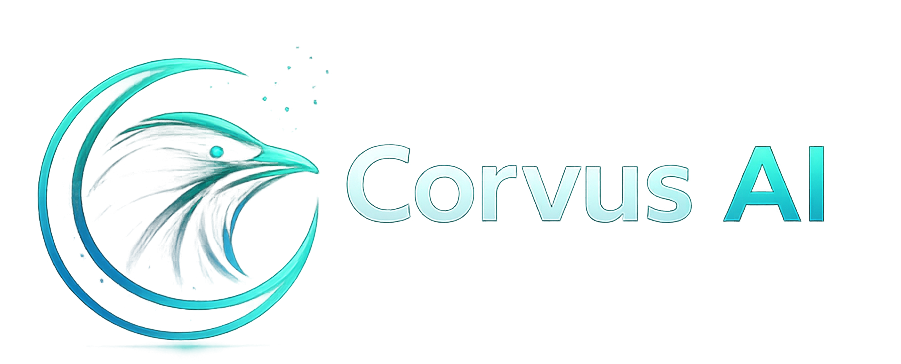

# Bienvenido a Corvus

**Corvus** es una plataforma agéntica altamente extensible y multi-interfaz diseñada para cerrar la brecha entre la autonomía de la IA y la supervisión humana. Construida con una base robusta en **Kotlin Multiplatform** e impulsada por un runtime de alto rendimiento en **Rust**, Corvus proporciona un entorno seguro y aislado (sandboxed) para que los agentes de IA realicen tareas complejas de múltiples pasos.



## ✨ Características

- **Soporte Multi-Interfaz**: Interactúa con Corvus a través de la CLI, una aplicación de escritorio Compose Multiplatform o un panel de control web.
- **Autonomía Siempre Activa**: Un modo demonio para agentes de larga duración que pueden manejar tareas en segundo plano y orquestación persistente.
- **Sandboxing Seguro**: Ejecuta comandos peligrosos de forma segura dentro de contenedores Docker aislados o runtimes nativos restringidos.
- **Identidad Estandarizada (AIEOS)**: Soporte para AIEOS v1.1, permitiendo personas de IA portátiles y agnósticas al modelo.
- **Modelo de Memoria Híbrido**: Backends de memoria conectables, incluyendo SQLite, Neo4j y SurrealDB para recuperación de alto contexto.
- **Integraciones Ricas**: Soporte de primera clase para WhatsApp (vía Meta Cloud API), git, npm, cargo y más.

## 🛠️ Pila tecnológica

- **Núcleo de la lógica**: [Kotlin Multiplatform (KMP)](https://kotlinlang.org/docs/multiplatform.html)
- **Runtime de Agente**: [Rust](https://rust-lang.org/) (Sidecars de alto rendimiento y CLI)
- **UI de Escritorio**: [Compose Multiplatform](https://kotlinlang.org/compose-multiplatform/)
- **Pila web**: [Astro](https://astro.build/), [Vue 3](https://vuejs.org/) y [Tailwind CSS](https://tailwindcss.com/docs/installation/using-vite)
- **Documentación**: [Starlight](https://starlight.astro.build/)
- **Sistema de construcción**: [Gradle](https://gradle.org/) y [Makefile](https://www.gnu.org/software/make/)

## 📂 Estructura del Proyecto

Este repositorio está organizado como un monorepo:

```text
corvus/
├── clients/
│   ├── agent-runtime/    # Núcleo del Agente en Rust de alto rendimiento y CLI
│   ├── composeApp/       # Lógica de UI compartida para Escritorio/Móvil
│   ├── web/              # Monorepo Web (Docs, Dashboard, Marketing)
│   ├── androidApp/       # Wrapper específico para Android
│   └── iosApp/           # Wrapper específico para iOS
├── modules/
│   └── agent-core-kmp/   # Lógica core en Kotlin Multiplatform y contratos
├── dev/                  # Entorno de desarrollo local (Docker/Sandbox)
├── gradle/               # Lógica de construcción y configuraciones
└── Makefile              # Punto de entrada estándar para tareas de desarrollo
```

## Siguientes Pasos

¿Listo para empezar?

- **[Primeros Pasos](../guides/getting-started/)**: Instala y ejecuta tu primer agente.
- **[Referencia de la CLI](../guides/cli-reference/)**: Domina la interfaz de línea de comandos.
- **[Arquitectura](../guides/architecture/)**: Comprende el diseño del sistema.
