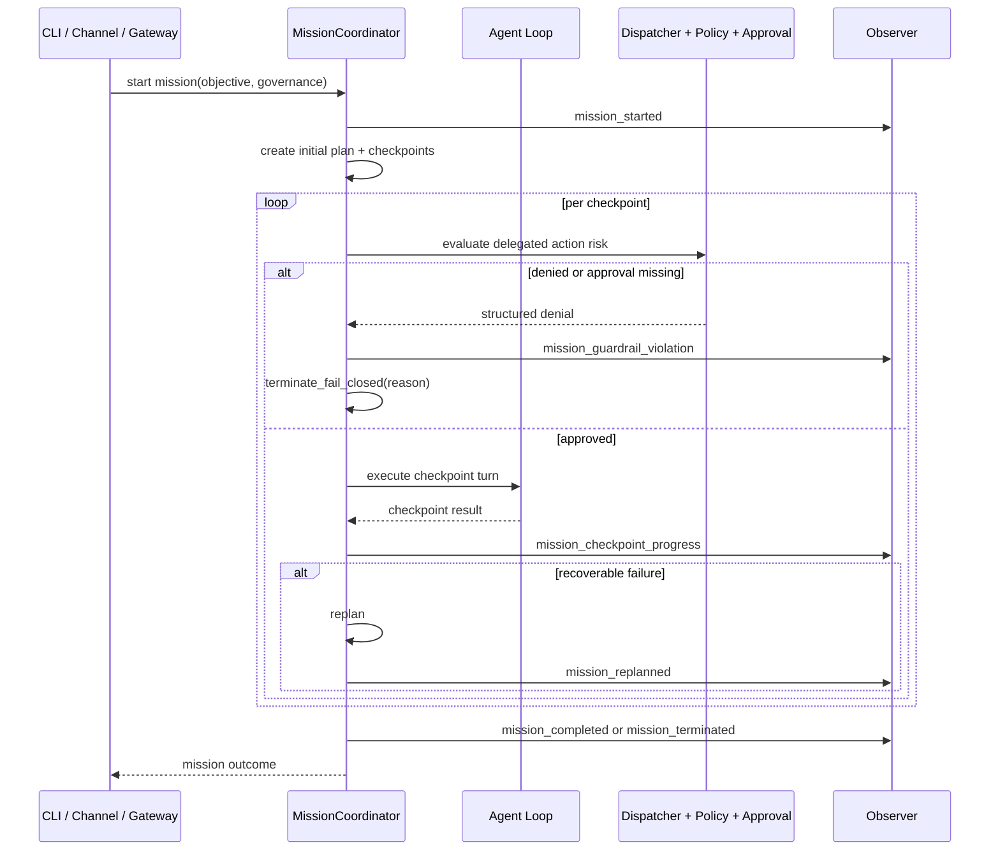
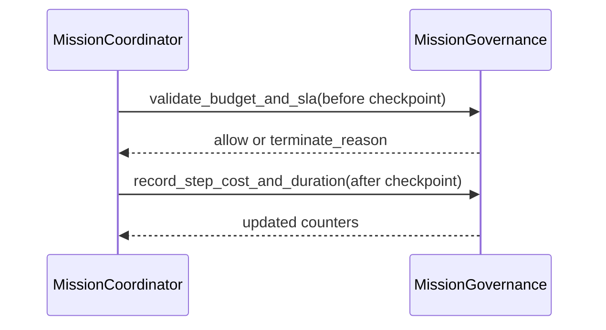

# Design: Agent Runtime Mission Layer

## Technical Approach

Add a minimal mission orchestration layer inside `clients/agent-runtime` that wraps the existing
agent loop and dispatcher stack, instead of introducing a new control plane. Mission execution
remains bounded and fail-closed by reusing current approval, policy, timeout, and retry primitives.

This design maps directly to the change delta at
`openspec/changes/agent-runtime-mission-layer/specs/agent-loop/spec.md` by adding:

- mission lifecycle state handling,
- mission-level governance controls,
- delegated orchestration over existing dispatcher/tool routes,
- mission KPI telemetry,
- integration coverage for parity and regression safety.

## Architecture Decisions

### Decision: Additive Mission Coordinator Over Existing Loop

**Choice**: Introduce a mission coordinator module that drives lifecycle transitions and invokes the
existing `Agent` turn/tool execution path.
**Alternatives considered**: Replace the core loop with a mission-only runtime; create a separate
mission daemon service.
**Rationale**: Additive orchestration minimizes regression risk and preserves backward compatibility
with current CLI/channel/gateway behavior.

### Decision: Explicit Mission State Machine With Deterministic Termination

**Choice**: Model mission states and transitions explicitly (objective, planned, active,
checkpointing, replanning, completed, terminated).
**Alternatives considered**: Implicit status flags in ad hoc metadata; provider-defined mission
control flow.
**Rationale**: Deterministic transitions are required for testability, auditability, and fail-closed
governance behavior.

### Decision: Governance Enforced at Mission and Step Boundaries

**Choice**: Evaluate budget and SLA constraints before/after each checkpoint and before delegated
execution, with fail-closed handling on unknown accounting state.
**Alternatives considered**: Best-effort governance checks at mission end only.
**Rationale**: Pre/post checkpoint enforcement prevents overruns and closes bypass windows for
high-cost or long-running delegated steps.

### Decision: Reuse Existing Dispatcher/Policy/Approval Path for Delegation

**Choice**: Mission decomposition outputs standard tool/delegate calls routed through
`dispatcher -> security policy -> approval`.
**Alternatives considered**: Mission-specific execution path that invokes tools directly.
**Rationale**: Reuse guarantees security parity and avoids introducing a second authorization model.

### Decision: Mission KPIs Through Existing Observer Surface

**Choice**: Extend observability events/metrics with mission attributes and lifecycle markers.
**Alternatives considered**: Standalone mission telemetry subsystem.
**Rationale**: Existing observer backends already support event/metric emission and avoid extra
infrastructure complexity.

## Data Flow

### Mission orchestration and checkpoint execution



### Governance evaluation timeline



## File Changes

| File                                                            | Action | Description                                                                           |
|-----------------------------------------------------------------|--------|---------------------------------------------------------------------------------------|
| `clients/agent-runtime/src/agent/mission.rs`                    | Create | Mission domain types, lifecycle transitions, checkpoint/replan orchestration.         |
| `clients/agent-runtime/src/agent/mod.rs`                        | Modify | Export mission module and keep existing loop exports intact.                          |
| `clients/agent-runtime/src/agent/agent.rs`                      | Modify | Add mission execution entry hooks that reuse current turn/tool dispatch flow.         |
| `clients/agent-runtime/src/agent/dispatcher.rs`                 | Modify | Preserve delegated action risk classification for mission-originated calls.           |
| `clients/agent-runtime/src/config/schema.rs`                    | Modify | Add mission config block for governance ceilings and mission enablement defaults.     |
| `clients/agent-runtime/src/daemon/mod.rs`                       | Modify | Wire optional mission checkpoint supervision into existing daemon lifecycle.          |
| `clients/agent-runtime/src/security/policy.rs`                  | Modify | Reuse/extend policy decision helpers for mission-originated delegated actions.        |
| `clients/agent-runtime/src/approval/mod.rs`                     | Modify | Ensure mission delegated actions produce structured denial parity.                    |
| `clients/agent-runtime/src/observability/traits.rs`             | Modify | Add mission lifecycle and governance telemetry events/metrics.                        |
| `clients/agent-runtime/tests/mission_lifecycle_integration.rs`  | Create | Integration tests for objective->plan->checkpoint->terminal mission flow.             |
| `clients/agent-runtime/tests/mission_governance_integration.rs` | Create | Integration coverage for budget/SLA termination and fail-closed behavior.             |
| `clients/agent-runtime/tests/mission_security_parity.rs`        | Create | Integration checks that mission delegation still enforces dispatcher/policy/approval. |
| `clients/agent-runtime/tests/legacy_loop_guard.rs`              | Modify | Extend regression assertions to verify mission layer does not alter legacy loop path. |

## Interfaces / Contracts

```rust
// clients/agent-runtime/src/agent/mission.rs
#[derive(Debug, Clone, PartialEq, Eq)]
pub enum MissionState {
  ObjectiveAccepted,
  Planned,
  Active,
  Replanning,
  Completed,
  Terminated,
}

#[derive(Debug, Clone, PartialEq, Eq)]
pub enum MissionTerminationReason {
  BudgetExhausted,
  SlaExceeded,
  PolicyDenied,
  ApprovalDenied,
  GuardrailViolation,
  Unrecoverable,
}

#[derive(Debug, Clone)]
pub struct MissionGovernance {
  pub max_runtime_ms: u64,
  pub max_steps: u32,
  pub max_estimated_cost_cents: u32,
}

#[derive(Debug, Clone)]
pub struct MissionCheckpoint {
  pub index: u32,
  pub objective_fragment: String,
}

#[derive(Debug, Clone)]
pub struct MissionOutcome {
  pub mission_id: String,
  pub state: MissionState,
  pub termination: Option<MissionTerminationReason>,
  pub checkpoints_completed: u32,
}
```

```rust
// clients/agent-runtime/src/config/schema.rs (additive)
#[derive(Debug, Clone, Serialize, Deserialize)]
pub struct MissionConfig {
  #[serde(default)]
  pub enabled: bool,
  #[serde(default = "default_mission_max_runtime_ms")]
  pub max_runtime_ms: u64,
  #[serde(default = "default_mission_max_steps")]
  pub max_steps: u32,
  #[serde(default = "default_mission_max_estimated_cost_cents")]
  pub max_estimated_cost_cents: u32,
}
```

## Testing Strategy

| Layer       | What to Test                                 | Approach                                                                                                                         |
|-------------|----------------------------------------------|----------------------------------------------------------------------------------------------------------------------------------|
| Unit        | Mission state transition invariants          | Table-driven transition tests in `src/agent/mission.rs` for valid and invalid transitions.                                       |
| Unit        | Governance accounting and fail-closed checks | Budget/SLA boundary tests including unknown accounting inputs and deterministic termination reasons.                             |
| Integration | Mission lifecycle progression and replanning | New integration tests that run objective, checkpoint progression, recoverable failure, replan, and completion paths.             |
| Integration | Security and approval parity for delegation  | Exercise mission-originated delegate/risky tool calls and assert same structured denial/approval semantics as non-mission paths. |
| Integration | Telemetry emission                           | Assert mission lifecycle and guardrail events are emitted on observer backends without sensitive payload leakage.                |
| Regression  | Backward compatibility for existing loop     | Run existing loop suites plus legacy guard assertions with mission disabled and verify unchanged behavior.                       |

## Migration / Rollout

- Phase 1: Introduce mission config + state machine scaffolding behind `mission.enabled = false` by
  default.
- Phase 2: Wire mission coordinator through existing runtime entrypoints and dispatcher path.
- Phase 3: Add KPI telemetry and integration hardening.
- Rollback: disable mission mode (config flag) to route all requests through the existing loop path.

No data migration required.

## Open Questions

- [ ] Should mission KPI overhead limits be enforced with an explicit p95 latency threshold in CI or
  tracked first as an observational metric?
- [ ] Should daemon-driven mission checkpoint supervision run only when cron/scheduler is enabled,
  or
  independently as its own lightweight supervised component?
