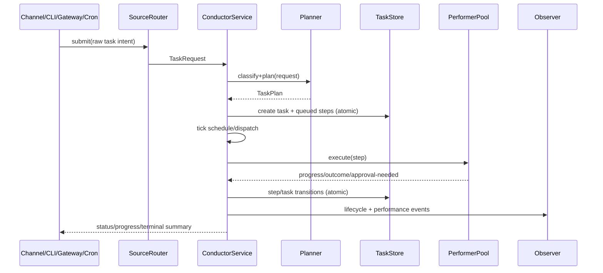
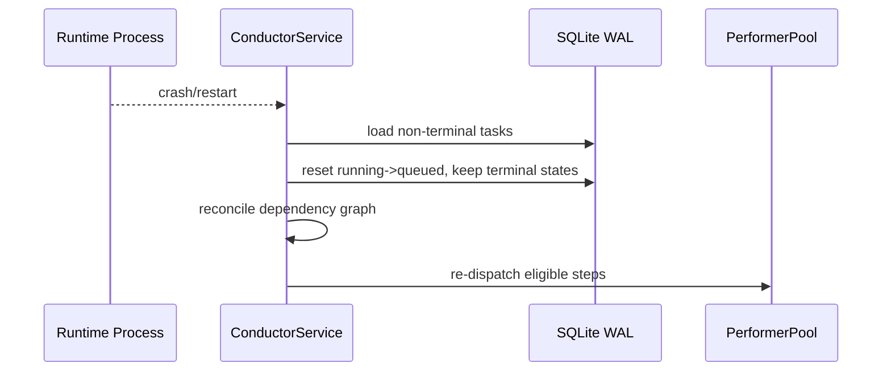

# Design: Conductor Architecture

## Technical Approach

Introduce an in-process Conductor subsystem in `clients/agent-runtime` as a bounded orchestration
plane that runs alongside the existing AgentLoop, not inside it. The design follows the approved
Conductor architecture baseline and keeps rollout risk controlled via explicit feature gating
(`conductor.enabled = false` by default), phased integration, and fail-closed execution semantics.

The implementation strategy is:

1. Add the Conductor core module and control contracts (`ConductorHandle`, service loop, planner,
   task store, performer pool).
2. Wire ingestion and status surfaces (channels `/task`, CLI `task`, gateway task endpoints,
   cron `ConductorTask`) while preserving existing non-task behavior.
3. Enforce security/governance through existing sandbox/policy/approval layers with Conductor
   domain-specific guards.
4. Add observability parity (events + metrics + redaction) and deterministic recovery on restart.

## Architecture Decisions

### Decision: In-Process Conductor as a Separate Bounded Subsystem

**Choice**: Run Conductor as its own daemon-supervised worker inside `agent-runtime`, with a
channel-based local handle for other runtime components.
**Alternatives considered**: Extend mission coordinator to emulate conductor behavior; launch an
external process for Conductor in MVP.
**Rationale**: Preserves architecture intent, minimizes integration latency, reuses existing runtime
primitives, and leaves a clean seam for future remote extraction.

### Decision: Explicit Module Boundaries by Responsibility

**Choice**: Create `src/conductor/` submodules for `types`, `service`, `planner`, `task_store`,
`performers`, `sources`, and `workspace`.
**Alternatives considered**: Single large conductor module; scattering logic across `agent`,
`cron`, and `gateway` modules.
**Rationale**: Keeps ownership clear, improves testability, and avoids accidental coupling with
conversational paths.

### Decision: Dual-Layer State Model (Hot In-Memory + Durable SQLite WAL)

**Choice**: Use in-memory concurrent maps for scheduling hot-path and SQLite WAL for durable
authoritative recovery records.
**Alternatives considered**: Memory-only state; SQLite-only state.
**Rationale**: Memory-only cannot satisfy crash recovery; SQLite-only increases scheduling latency.
Hybrid model balances throughput and determinism.

### Decision: Rule-Based Fast Path Before LLM Planning

**Choice**: Attempt deterministic single-domain classification first; call planner LLM only for
ambiguous or composite tasks.
**Alternatives considered**: Always call planner LLM; no decomposition support.
**Rationale**: Protects latency and cost for common simple tasks while preserving composite plan
quality for multi-step work.

### Decision: Tick-Based Scheduler with Reactive Mini-Ticks

**Choice**: Keep periodic reconcile/schedule/dispatch ticks and add immediate mini-ticks on
completion events.
**Alternatives considered**: Pure polling; fully event-driven scheduler without periodic reconcile.
**Rationale**: Periodic sweep guarantees eventual consistency, while mini-ticks remove avoidable
dependency-unblock latency.

### Decision: Fail-Closed Security and Approval for Risky Execution

**Choice**: System-domain actions must run through sandbox wrappers and explicit approval gates;
unknown/unsafe states block execution.
**Alternatives considered**: Best-effort warnings; allow execution on policy uncertainty.
**Rationale**: Security-first requirement and existing runtime posture require deny-by-default on
ambiguous risk.

### Decision: Conductor Observability Through Existing Observer Contracts

**Choice**: Add Conductor lifecycle events/metrics to existing `ObserverEvent`/`ObserverMetric`
pipelines and backend mappings.
**Alternatives considered**: Dedicated Conductor telemetry pipeline.
**Rationale**: Preserves operability tooling and avoids telemetry fragmentation.

## Module Boundaries

| Module | Responsibility | Inbound Contracts | Outbound Contracts |
|------|--------|-------------|-------------|
| `conductor::types` | Task/step IDs, statuses, plans, domain enums | Sources, planner, scheduler | Store, gateway, observer |
| `conductor::traits` | `ConductorHandle`, `Performer`, `Source`, `TaskClassifier` traits | All modules consuming trait abstractions | Implementors (service, performers, sources) |
| `conductor::events` | `ConductorEvent`, `ConductorCmd`, `ProgressEvent` envelopes | Service command loop, observer bridge | Broadcast subscribers, observer pipeline |
| `conductor::service` | Main loop (`full_tick`, `mini_tick`, command handling, shutdown/recovery) | Daemon worker + handle commands | Planner, store, performer pool, event bus |
| `conductor::tick_loop` | `TickLoop` with `reconcile -> schedule -> dispatch -> notify` phases | Service main loop | Store queries, pool dispatch, nudge signals |
| `conductor::planner` | LLM-powered decomposition, DAG validation, plan generation | `TaskRequest` via service | `TaskPlan` + planning errors |
| `conductor::classifier` | `RuleBasedClassifier` (fast-path), `LlmClassifier`, `ChainedClassifier` | Planner (pre-planning classification) | `TaskDomain` + `Confidence` result |
| `conductor::task_store` | Atomic task/step transitions, persistence, recovery snapshots | Service + pool callbacks | SQLite WAL + in-memory maps |
| `conductor::performers` | Domain execution adapters (coding/research/browser/system) | Dispatcher from service | Step outcomes, progress, approval-needed signals |
| `conductor::sources` | Normalize channel/CLI/gateway/cron submissions into `TaskRequest` | External surfaces | Service submit channel |
| `conductor::workspace` | Per-task filesystem lifecycle, hook execution, artifact layout | Service + performers | Sandboxed hook execution + artifact paths |
| `conductor::config` | `ConductorConfig` parsing, defaults, TOML/env/front-matter merging | Daemon startup, hot-reload watcher | Validated config to service + all modules |
| `conductor::recovery` | Crash recovery from SQLite: load non-terminal tasks, reset transients | Service startup | Reconciled task/step state to in-memory store |

Existing runtime integrations remain additive:

- `daemon/mod.rs`: supervisor registration for `conductor` worker.
- `channels/mod.rs`: explicit `/task` routing only.
- `main.rs` + `lib.rs`: new CLI/task command surface and exports.
- `cron/types.rs` + `cron/scheduler.rs`: new `ConductorTask` dispatch path.
- `gateway/mod.rs`: task CRUD/snapshot/stream endpoints.
- `config/schema.rs`: `ConductorConfig` defaults and validation.

## Control and Data Flow

### End-to-end task lifecycle



### Failure and recovery flow



## Persistence Model

- Primary write path is `TaskStore::transition(...)` that performs in-memory mutation and SQLite
  write in one operation boundary; failed persistence prevents in-memory commit.
- Durable entities: task metadata, plan JSON, step state history, approval wait metadata,
  produced artifact metadata.
- WAL mode is mandatory for crash tolerance and reduced writer contention.
- Recovery contract on startup:
  - `Running` and transient `Scheduled` steps become `Queued`.
  - `WaitingForApproval` remains waiting (requires explicit user action).
  - Terminal states (`Completed`, `Failed`, `Cancelled`) are immutable.
- Data retention for MVP: keep task records for audit/forensics; cleanup policies are
  configurable and non-destructive by default.

## Scheduling Model

- Scheduler executes four phases per full tick: `reconcile -> schedule -> dispatch -> notify`.
- `mini_tick` runs `reconcile -> schedule -> dispatch` on nudge signals from step completions.
- Concurrency controls:
  - global semaphore (total running steps),
  - per-domain semaphores (coding/research/browser/system caps).
- Dispatch eligibility:
  - all dependencies complete,
  - no unresolved approval gate,
  - concurrency permit available,
  - retry backoff elapsed for retry-queued steps.
- Retry policy:
  - bounded attempts per step,
  - exponential backoff + jitter,
  - deterministic dependency cancellation when retries exhaust.

## Security Model

- Conductor reuses and strengthens existing `SecurityPolicy` and approval workflow.
- Mandatory controls:
  - system performer command execution always wrapped by sandbox trait,
  - policy validation + risk classification before execution,
  - approval gates for medium/high-risk operations in supervised mode,
  - deny on unknown tool source/risk classification,
  - redacted logs/events for sensitive payload patterns.
- Surface protections:
  - channels parse only explicit `/task` commands (no implicit interception),
  - gateway task endpoints require existing pairing/auth policy,
  - cron conductor jobs pass through the same policy path as interactive submissions.
- Safety invariant: no bypass path from Conductor to unsandboxed shell or direct filesystem writes
  outside policy constraints.

## Observability Plan

- Extend `ObserverEvent` with Conductor task/step lifecycle events, scheduler health events
  (`tick_completed`, `stall_detected`), approval wait/resume, retry/failure causality.
- Extend `ObserverMetric` mapping with:
  - active task count,
  - queued/running step depth,
  - planner latency,
  - step duration by domain,
  - retry count and terminal failure rates.
- Emit events at state transition boundaries only (single source of truth = TaskStore transitions)
  to avoid duplicate telemetry.
- Preserve backend compatibility (`log`, `prometheus`, `otel`) by mapping new events through
  existing adapters.

## Tradeoffs

| Area | Choice | Benefit | Cost / Limitation |
|------|--------|---------|-------------------|
| Deployment | In-process subsystem | Low integration friction, shared primitives | Resource contention risk with interactive loop |
| State | Memory + SQLite | Fast scheduling + crash recovery | Higher implementation complexity |
| Scheduling | Tick + mini-tick | Deterministic sweeps + responsive unblocking | More moving parts than pure polling |
| Planning | Rule fast-path + LLM fallback | Lower latency/cost for simple tasks | Heuristic misclassification risk |
| Security | Fail-closed approvals/sandbox | Strong safety posture | More user friction for risky operations |
| API | Additive ingestion surfaces | Backward compatibility | Broader integration test matrix |

## Failure Modes and Handling

| Failure Mode | Detection | Handling Strategy | Residual Risk |
|------|--------|-------------|-------------|
| Planner timeout or malformed plan | Planner result validation + timeout | mark task failed with explicit reason; no partial execution | Reduced automation for ambiguous tasks |
| Dependency cycle in plan | DAG validator | reject plan before persistence | User-facing planning failure |
| Performer panic/crash | JoinHandle result + health events | fail step, apply retry policy, escalate to task failure if exhausted | repeated panic loops under bad performer build |
| Runtime restart during running step | startup reconciliation | reset transient running states to queued and replay | duplicate external side effects if step non-idempotent |
| SQLite write failure | transition write result | fail transition, halt affected task, emit critical event | temporary queue growth under storage faults |
| Approval never resolved | approval timeout monitor | transition to failed/cancelled with reason; unblock dependents deterministically | long-lived waiting tasks if timeout too permissive |
| Concurrency starvation | queue/latency metrics + stall detection | enforce per-domain fairness, cap long-running slots, tune tick interval | degraded throughput under sustained heavy load |
| Unauthorized task API use | gateway auth and pairing checks | reject request with explicit 401/403, audit event | misconfiguration if pairing disabled intentionally |

## File Changes

| File | Action | Description |
|------|--------|-------------|
| `clients/agent-runtime/src/conductor/mod.rs` | Create | Conductor module exports and service bootstrap helpers. |
| `clients/agent-runtime/src/conductor/types.rs` | Create | Core task/step/event/command data contracts. |
| `clients/agent-runtime/src/conductor/service.rs` | Create | Main orchestration loop, command handling, tick phases. |
| `clients/agent-runtime/src/conductor/planner.rs` | Create | Rule-based + LLM planning and DAG validation. |
| `clients/agent-runtime/src/conductor/task_store.rs` | Create | Atomic transitions, in-memory index, SQLite WAL persistence/recovery. |
| `clients/agent-runtime/src/conductor/performers/*.rs` | Create | Domain performers and performer pool coordination. |
| `clients/agent-runtime/src/conductor/sources/*.rs` | Create | Normalization of channel/CLI/gateway/cron task requests. |
| `clients/agent-runtime/src/conductor/workspace.rs` | Create | Task workspace lifecycle and artifact paths/hook orchestration. |
| `clients/agent-runtime/src/config/schema.rs` | Modify | Add `ConductorConfig` and secure defaults. |
| `clients/agent-runtime/src/daemon/mod.rs` | Modify | Register supervised conductor worker and health wiring. |
| `clients/agent-runtime/src/channels/mod.rs` | Modify | Route explicit `/task` messages to conductor handle. |
| `clients/agent-runtime/src/cron/types.rs` | Modify | Add `ConductorTask` job type schema. |
| `clients/agent-runtime/src/cron/scheduler.rs` | Modify | Dispatch `ConductorTask` jobs through conductor handle. |
| `clients/agent-runtime/src/gateway/mod.rs` | Modify | Add task endpoints, snapshot endpoint, event stream endpoint. |
| `clients/agent-runtime/src/observability/traits.rs` | Modify | Add Conductor event and metric enums. |
| `clients/agent-runtime/src/lib.rs` | Modify | Export conductor module and task CLI command enums. |
| `clients/agent-runtime/src/main.rs` | Modify | Add `task` CLI subcommands and handlers. |
| `clients/agent-runtime/Cargo.toml` | Modify | Add minimal crates required for store concurrency and watcher logic. |

## Interfaces / Contracts

```rust
#[async_trait::async_trait]
pub trait ConductorHandle: Send + Sync {
  async fn submit(&self, request: TaskRequest) -> anyhow::Result<TaskId>;
  async fn cancel(&self, task_id: &TaskId) -> anyhow::Result<()>;
  async fn status(&self, task_id: &TaskId) -> anyhow::Result<TaskState>;
  async fn step_status(&self, task_id: &TaskId, step_id: &StepId) -> anyhow::Result<StepState>;
  async fn list_tasks(&self, filter: TaskFilter) -> anyhow::Result<Vec<TaskState>>;
  async fn snapshot(&self) -> anyhow::Result<ConductorSnapshot>;
  async fn subscribe(&self) -> tokio::sync::broadcast::Receiver<ConductorEvent>;
}

pub enum ConductorCmd {
  Submit { request: TaskRequest, reply: tokio::sync::oneshot::Sender<anyhow::Result<TaskId>> },
  Cancel { task_id: TaskId, reply: tokio::sync::oneshot::Sender<anyhow::Result<()>> },
  Status { task_id: TaskId, reply: tokio::sync::oneshot::Sender<anyhow::Result<TaskState>> },
  StepStatus { task_id: TaskId, step_id: StepId, reply: tokio::sync::oneshot::Sender<anyhow::Result<StepState>> },
  ListTasks { filter: TaskFilter, reply: tokio::sync::oneshot::Sender<anyhow::Result<Vec<TaskState>>> },
  Snapshot { reply: tokio::sync::oneshot::Sender<anyhow::Result<ConductorSnapshot>> },
  Nudge,
}
```

```rust
#[derive(Debug, Clone, Serialize, Deserialize)]
pub struct ConductorConfig {
  pub enabled: bool,                          // Must be explicitly enabled
  pub tick_interval_ms: u64,                  // Default: 30000 (30s)
  pub stall_timeout_ms: u64,                  // Default: 300000 (5min)
  pub max_retries: u32,                       // Default: 3
  pub workspace_root: String,                 // Default: "~/.corvus/workspaces"
  pub artifact_retention_days: u32,           // Default: 7
  pub token_budget_per_tick: Option<u32>,     // Optional secondary rate-limit guard
  pub planner: PlannerConfig,
  pub concurrency: ConcurrencyConfig,
  pub retry: RetryConfig,
  pub performers: PerformerConfigs,
}

#[derive(Debug, Clone, Serialize, Deserialize)]
pub struct PlannerConfig {
  pub model: String,                          // Default: "claude-sonnet-4-20250514"
  pub temperature: f32,                       // Default: 0.3
  pub max_planning_time_ms: u64,              // Default: 30000 (30s)
}

#[derive(Debug, Clone, Serialize, Deserialize)]
pub struct ConcurrencyConfig {
  pub global_max: usize,                      // Default: 10
  pub coding_max: usize,                      // Default: 3
  pub research_max: usize,                    // Default: 5
  pub browser_max: usize,                     // Default: 2
  pub system_max: usize,                      // Default: 2
}

#[derive(Debug, Clone, Serialize, Deserialize)]
pub struct RetryConfig {
  pub max_retries: u32,                       // Default: 3
  pub initial_backoff_ms: u64,                // Default: 5000 (5s)
  pub max_backoff_ms: u64,                    // Default: 300000 (5min)
  pub backoff_multiplier: f64,                // Default: 2.0
}

#[derive(Debug, Clone, Serialize, Deserialize)]
pub struct PerformerConfigs {
  pub coding: PerformerConfig,
  pub research: PerformerConfig,
  pub browser: PerformerConfig,
  pub system: PerformerConfig,
}

#[derive(Debug, Clone, Serialize, Deserialize)]
pub struct PerformerConfig {
  pub model: String,
  pub max_iterations: u32,
  pub timeout_ms: u64,
  pub tools: Vec<String>,
  pub approval_required: bool,                // Default: false (true for system)
}
```

## Testing Strategy

| Layer | What to Test | Approach |
|-------|-------------|----------|
| Unit | Planner classification and DAG validation | Table-driven tests for fast-path, fallback, cycle rejection, invalid domains. |
| Unit | TaskStore atomic transitions and recovery rules | Transition invariant tests + SQLite failure injection + restart replay checks. |
| Unit | Scheduler fairness/retry semantics | Deterministic tick simulation with virtual time. |
| Unit | Security gates per performer domain | Assert sandbox usage, approval requirements, and deny-by-default behavior. |
| Integration | Ingestion surfaces (`/task`, CLI, gateway, cron) | End-to-end submission to terminal state with shared assertions for parity. |
| Integration | Observer event/metric emission | Assert lifecycle event sequence and metric increments across success/failure paths. |
| Integration | Backward compatibility | Non-task channel flows and existing gateway admin/webhook routes remain unchanged. |
| Resilience | Crash/restart and panic recovery | Kill/restart tests verifying running->queued reset and deterministic continuation. |

## Rollout Plan

1. Phase 1 (Foundation): core types, TaskStore with DashMap + SQLite, ConductorConfig, daemon
   integration scaffold behind `conductor.enabled=false`.
2. Phase 2 (Tick Loop & Performer Pool): implement TickLoop with reconcile/schedule/dispatch,
   PerformerPool with semaphore-based concurrency, ConductorService main loop, LocalConductorHandle,
   nudge mechanism, dependency resolution, failure cascade.
3. Phase 3 (Planner & Classifier): RuleBasedClassifier fast-path, LlmClassifier fallback,
   ChainedClassifier, Planner with LLM decomposition, plan validation (DAG check, domain check),
   atomic task fast-path, CONDUCTOR.md prompt loading. Planner before Performers to prevent
   hardcoded PlannedStep fields in performer tests.
4. Phase 4 (Performers): Performer trait, domain performers (Coding, Research, Browser, System),
   mandatory sandboxing for System, PerformerContext construction, progress reporting via mpsc.
5. Phase 5 (Sources & Sinks): SourceRouter, channel `/task` integration, CLI `corvus task`
   subcommand, gateway HTTP endpoints, cron ConductorTask dispatch, channel reply sink,
   WorkspaceManager.
6. Phase 6 (Observability & Polish): ObserverEvent variants for conductor, ConductorEvent →
   ObserverEvent bridge, WebSocket event stream for dashboard, CONDUCTOR.md hot-reload via notify,
   crash recovery (SQLite → DashMap), graceful shutdown, Prometheus metrics.
7. Controlled enablement: turn on in staging/workbench configs first, then production-like
   environments with conservative concurrency defaults.

## Rollback Strategy

- Immediate rollback lever: set `conductor.enabled = false` and restart daemon.
- Disable ingress paths (`/task`, gateway task endpoints, cron conductor job type, CLI handlers)
  if partial rollback is required while preserving existing runtime features.
- Keep persisted conductor records intact for incident analysis; do not purge automatically.
- Revert conductor worker registration from daemon if runtime stability is impacted.
- Re-enable only after reproducer test exists and fix passes verification gates.

## Resolved Questions

These were open during initial design and have been closed by the architecture baseline
(CONDUCTOR.md §12):

- **Planner timeout scope:** Domain-sensitive in MVP. Each performer has its own `timeout_ms` in
  config; the planner has a separate `max_planning_time_ms`. The Conductor-level `stall_timeout_ms`
  detects stuck ticks. (CONDUCTOR.md Q1 decision: separate model + timeout config per component.)
- **Artifact retention:** Time-based pruning by default. 7-day retention for workspace + artifact
  content (configurable via `conductor.artifact_retention_days`). SQLite metadata persists
  indefinitely for audit trail. Workspace cleanup runs as a periodic task in the TickLoop.
  (CONDUCTOR.md Q4 decision.)
- **Gateway event stream:** WebSocket, not SSE. The dashboard connects via
  `WS /api/conductor/events` for real-time event delivery. SSE is not used.
  (CONDUCTOR.md §5.4: explicit WebSocket endpoint.)
