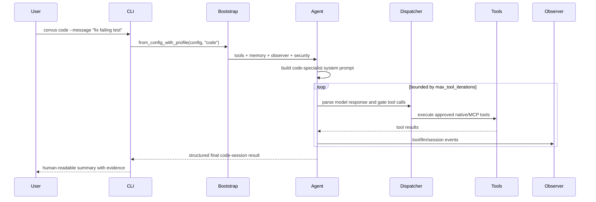
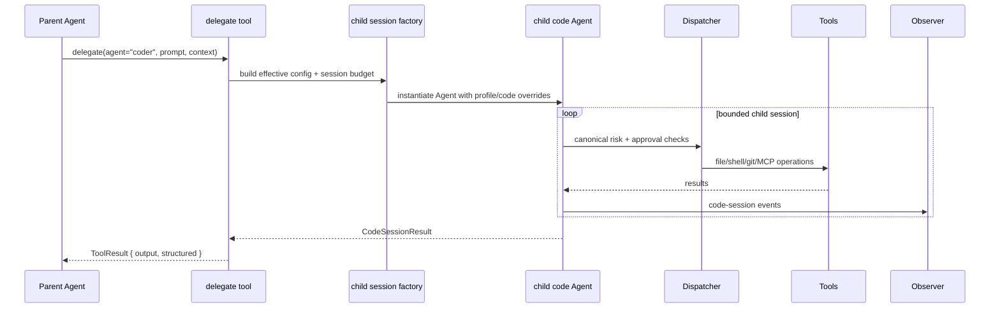

# Design: Code Agent Specialist

## Technical Approach

This change productizes Corvus' existing `code` profile as a first-class coding mode and extends
delegation from a one-shot provider call into a bounded specialized agent session. The MVP stays on
top of the current bootstrap, prompt builder, canonical dispatcher loop, approval manager, and
security policy instead of introducing a parallel runtime.

The implementation is split into two additive paths that share the same runtime primitives:

1. Primary code mode: a dedicated CLI/runtime entry that launches the normal `Agent` stack with the
   `code` profile plus code-specialist prompt/output guidance.
2. Delegated code session: a `delegate` execution branch that instantiates a bounded child `Agent`
   using the same tool gating, approvals, MCP rules, and iteration limits as any other canonical
   loop execution.

This maps directly to the proposal goals and preserves the existing contracts in
`openspec/specs/agent-loop/spec.md` and `openspec/specs/mcp-runtime/spec.md`:

- code mode remains a canonical loop entry point, not a special-case executor;
- delegated sessions reuse the canonical dispatcher boundary, so approval and policy stay aligned;
- MCP continues to be registered and enforced through the existing fail-closed tool registry.

## Architecture Decisions

### Decision: Reuse the existing runtime stack for code mode

**Choice**: Add a thin code-specialist entry on top of `Agent::from_config_with_profile(...)` /
`Agent::code_from_config(...)`, with profile-aware prompt and output behavior.

**Alternatives considered**: Build a separate code binary/runtime; fork bootstrap and tool registry
for coding sessions.

**Rationale**: The repository already has the right seams in `bootstrap/mod.rs`, `agent/agent.rs`,
and `agent/prompt.rs`. Reusing them keeps profile filtering, workspace bootstrap injection,
approval, observability, and MCP behavior consistent with the canonical agent loop.

### Decision: Evolve `delegate` into a session runner, not a smarter one-shot prompt

**Choice**: Keep the existing `delegate` tool identity, but add a session-backed branch that can
launch a bounded child `Agent` for code-specialist work.

**Alternatives considered**: Add a second tool just for delegated coding; keep `delegate` as a
provider-only call and rely on prompt shaping.

**Rationale**: The PRD gap is operational, not cosmetic. A provider-only branch cannot inspect,
edit, verify, or emit auditable tool history. Reusing the canonical loop closes RF3/RF4/RF9 while
preserving current user-facing tool names and avoiding a parallel delegation framework.

### Decision: Model code-session behavior declaratively in config

**Choice**: Extend existing config schema with additive code-session settings and delegate-session
overrides rather than hard-coding workflow assumptions in prompts.

**Alternatives considered**: Put workflow instructions only in the prompt; infer all validation
behavior dynamically from the repository.

**Rationale**: Prompt-only behavior is brittle and hard to audit. Additive schema fields fit the
existing config architecture and let operators control iteration budgets, output contracts, and
validation commands without weakening policy defaults.

### Decision: Keep security and approval semantics identical to the canonical loop

**Choice**: Child code sessions MUST execute through the same dispatcher risk checks, tool policy,
approval manager, shell/path validation, and MCP gating used by direct sessions.

**Alternatives considered**: Allow delegated sessions to auto-approve because the parent agent
already chose to delegate; create code-specific bypass logic for shell/git/file tools.

**Rationale**: The repo is security-first and already has strong controls in
`security/policy.rs`, `approval/mod.rs`, and the native tools. Delegation must not become a bypass
path for filesystem, shell, git, or MCP actions.

## Data Flow

### Primary Code Mode



### Delegated Code Session



### Narrative Flow

1. CLI or parent agent selects a code-specialist path.
2. Runtime builds an effective config by layering explicit code-session overrides on top of the
   existing `Config`.
3. `BootstrapContext` assembles the standard observer/runtime/security/memory/tool set for the
   effective profile (`code` by default).
4. The `Agent` runs through the canonical iterative loop in `agent.rs`, including dispatcher risk
   checks, approval-required denials, bounded tool execution, and history compaction.
5. A code-session collector records changed files, commands, validations, and blockers from tool
   results and explicit validation steps.
6. The final session result is rendered for humans at the CLI boundary and returned as structured
   data for delegated callers.

## File Changes

| File | Action | Description |
|------|--------|-------------|
| `clients/agent-runtime/src/main.rs` | Modify | Add explicit `code` entry point (or equivalent profile-specific command path) that reuses canonical pre-checks and runtime execution. |
| `clients/agent-runtime/src/agent/agent.rs` | Modify | Add effective-config/session-override construction, code-mode launch helpers, and final report emission for direct and delegated sessions. |
| `clients/agent-runtime/src/agent/prompt.rs` | Modify | Add code-specialist prompt section(s) describing inspect-plan-edit-verify workflow and required final result format. |
| `clients/agent-runtime/src/agent/code_session.rs` | Create | Hold code-session contracts, result/report rendering, validation planning, and delegated child-session orchestration helpers. |
| `clients/agent-runtime/src/bootstrap/mod.rs` | Modify | Keep profile-based bootstrap as the single assembly path and formalize code-specific defaults without adding a second runtime. |
| `clients/agent-runtime/src/config/schema.rs` | Modify | Add declarative config for code sessions, validation commands, delegated budgets, and delegate execution mode/profile overrides. |
| `clients/agent-runtime/src/tools/delegate.rs` | Modify | Preserve one tool surface while adding session-backed delegation and structured result return. |
| `clients/agent-runtime/src/tools/traits.rs` | Modify | Extend `ToolResult` with optional structured payload metadata so delegated code sessions can return machine-readable output without breaking text consumers. |
| `clients/agent-runtime/src/observability/traits.rs` | Modify | Add dedicated code-session observer events/metrics for launch, validation, completion, and delegated-session outcomes. |
| `clients/agent-runtime/src/security/audit.rs` | Modify | Add additive audit payloads for code-session summary data (commands, validation status, delegated session id). |
| `clients/agent-runtime/src/security/policy.rs` | Modify | Preserve policy decisions for delegated origin and ensure no code-session bypass for shell/file/git/MCP actions. |
| `clients/agent-runtime/src/approval/mod.rs` | Modify | Ensure delegated sessions surface approval-required results consistently with canonical sessions. |

## Interfaces / Contracts

### Effective Session Overrides

Add a small override layer instead of branching bootstrap logic:

```rust
pub struct AgentSessionOverrides {
    pub profile: Option<String>,
    pub provider: Option<String>,
    pub model: Option<String>,
    pub temperature: Option<f64>,
    pub max_tool_iterations: Option<usize>,
    pub session_timeout_secs: Option<u64>,
    pub mode: AgentSessionMode,
}

pub enum AgentSessionMode {
    Standard,
    CodePrimary,
    CodeDelegate,
}
```

This gives direct code mode and delegated code sessions one common launch contract while keeping
`Config` as the source of truth.

### Code Session Config

Additive config under existing runtime schema:

```rust
pub struct CodeSessionConfig {
    pub enabled: bool,
    pub final_output_format: CodeSessionOutputFormat,
    pub max_validation_commands: usize,
    pub default_validation: Vec<ValidationCommandConfig>,
}

pub struct ValidationCommandConfig {
    pub id: String,
    pub command: String,
    pub required: bool,
    pub timeout_secs: u64,
}

pub enum CodeSessionOutputFormat {
    Text,
    Json,
    TextAndJson,
}
```

Placement can be either `agent.code_session` or an equivalent additive nested field, but it MUST
remain within the existing runtime config file and validation path.

### Delegate Agent Config Extension

Extend existing delegate definitions instead of replacing them:

```rust
pub struct DelegateAgentConfig {
    pub provider: String,
    pub model: String,
    pub system_prompt: Option<String>,
    pub api_key: Option<String>,
    pub temperature: Option<f64>,
    pub max_depth: u32,
    pub profile: Option<String>,
    pub execution_mode: DelegateExecutionMode,
    pub max_tool_iterations: Option<usize>,
    pub session_timeout_secs: Option<u64>,
    pub validation: Vec<ValidationCommandConfig>,
}

pub enum DelegateExecutionMode {
    OneShot,
    Session,
}
```

Backward compatibility comes from defaulting existing entries to `OneShot` and `profile = None`.
The code-specialist MVP uses `Session + profile=code`.

### Structured Session Result

Use a native report type and render outward as needed:

```rust
pub struct CodeSessionResult {
    pub status: CodeSessionStatus,
    pub summary: String,
    pub changed_files: Vec<String>,
    pub commands: Vec<ExecutedCommandSummary>,
    pub validations: Vec<ValidationRunResult>,
    pub blockers: Vec<String>,
    pub pending_work: Vec<String>,
    pub session_id: String,
}

pub enum CodeSessionStatus {
    Completed,
    CompletedWithWarnings,
    Blocked,
    Failed,
}

pub struct ExecutedCommandSummary {
    pub command: String,
    pub success: bool,
    pub risk_level: Option<String>,
}

pub struct ValidationRunResult {
    pub id: String,
    pub command: String,
    pub success: bool,
    pub required: bool,
}
```

### Tool Result Extension

To preserve current text-based tools while enabling machine-readable delegate output:

```rust
pub struct ToolResult {
    pub success: bool,
    pub output: String,
    pub error: Option<String>,
    pub structured: Option<serde_json::Value>,
}
```

Only `delegate` needs this in the MVP. Existing tools can keep `structured = None`.

## Testing Strategy

| Layer | What to Test | Approach |
|-------|--------------|----------|
| Unit | Config defaults and validation for code-session fields and delegate session mode | Extend `config/schema.rs` serde and validation tests with fail-safe defaults and invalid-profile/invalid-timeout cases. |
| Unit | Prompt builder includes code-specialist workflow and final output instructions only when code mode is active | Add focused prompt tests in `agent/prompt.rs`. |
| Unit | Delegate depth, timeout, and backward-compatible one-shot/session branching | Add `delegate.rs` tests with mocked provider/session factory. |
| Unit | Structured `CodeSessionResult` rendering and `ToolResult.structured` serialization | Add tests in `agent/code_session.rs` and `tools/traits.rs`. |
| Unit | Security parity for delegated sessions | Add tests around delegated origin using existing policy/approval helpers; assert approval-required results still surface for MCP/high-risk operations. |
| Integration | CLI `code` entry uses the same canonical pre-checks and loop semantics as `agent` | Add command-path tests around `main.rs`/agent launch helper with preview/canonical flags preserved. |
| Integration | Child delegated code session can execute bounded file/shell/git workflow inside workspace and emit structured result | Add an integration-style test using temp workspace and mocked provider responses to drive multiple tool iterations. |
| Integration | MCP tools remain namespaced and approval-gated inside delegated code sessions | Reuse current MCP dispatcher tests with a child-session launch path. |
| Spec conformance | `agent-loop` invariants still hold for code mode and delegated sessions | Verify iteration budgets, approval-required denials, timeout aborts, and context continuity. |
| Spec conformance | `mcp-runtime` invariants still hold | Verify no delegated-session path bypasses fail-closed registration, namespacing, or approval semantics. |

## Migration / Rollout

No external data migration is required.

MVP rollout is additive and backward compatible:

1. Add schema fields with safe defaults so existing configs remain valid.
2. Introduce the explicit code-mode CLI entry as a thin alias over the existing agent runtime.
3. Add code-session result/report plumbing for direct code mode.
4. Enable delegated code sessions behind per-agent config (`execution_mode = "session"`).
5. Keep legacy one-shot delegation intact for existing non-code agents until follow-up changes move
   them intentionally.

Rollback stays localized: remove the explicit code entry and session branch while leaving config
fields ignored or defaulted. No bootstrap, workspace, or MCP registration migration is needed.

## Verification Strategy

The MVP is considered technically sound when all of the following are true:

- direct code mode launches through the same bootstrap, dispatcher, and approval stack as the
  standard CLI agent;
- delegated code sessions execute through the canonical loop and stop on configured iteration or
  timeout budgets;
- the final result contains status, files changed, commands run, validations attempted, and
  blockers/pending work;
- shell/file/git/MCP actions inside child sessions remain subject to existing workspace-only and
  approval controls;
- observer and audit outputs capture delegated code-session identity without exposing secrets.

## Open Questions

- [ ] None for MVP design.
