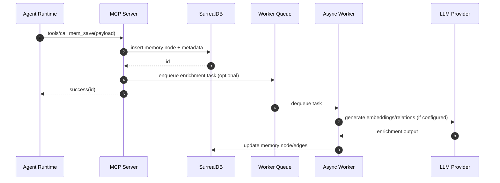
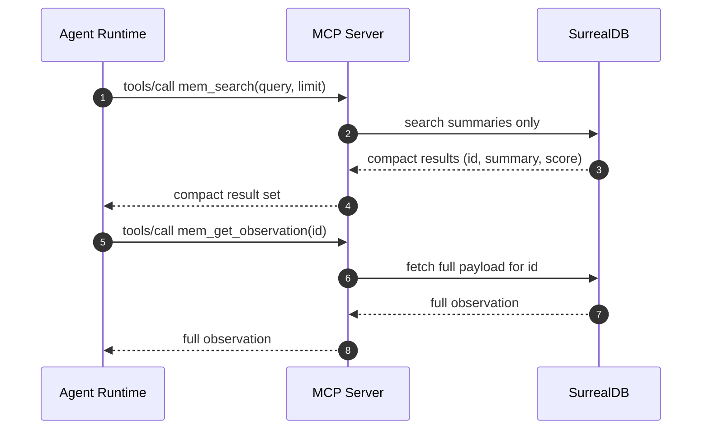

# Design: Cerebro Spec Refresh (2026-03-17)

## Technical Approach

Refresh the Cerebro spec by reconciling the current `openspec/specs/cerebro/spec.md` with the
archived change narrative and the updated product philosophy. The design codifies the target
architecture (sync MCP server + async worker), embedded SurrealDB as a Cerebro service deployment
mode (not runtime), optional LLM enrichment pipeline, node/edge data model, and optional TUI
components. The refreshed spec will explicitly document drill-in retrieval to prevent context bloat.

## Architecture Decisions

### Decision: Sync MCP server with async enrichment worker

**Choice**: Keep a synchronous MCP request path for tool calls, backed by an optional async worker
for enrichment tasks (embeddings, relation extraction, timeline inference).
**Alternatives considered**: Fully synchronous enrichment; separate enrichment-only service.
**Rationale**: Sync-first preserves low-latency MCP responses and predictable error handling. Async
worker isolates expensive LLM calls and allows disabling enrichment without breaking core storage.

### Decision: Embedded SurrealDB is a Cerebro service deployment mode

**Choice**: Document embedded SurrealDB as a supported deployment mode for the Cerebro service
binary, while keeping the agent runtime free of SurrealDB.
**Alternatives considered**: Removing embedded mode entirely; allowing runtime-local SurrealDB.
**Rationale**: Embedded mode simplifies local or single-node deployments while preserving the
security boundary and runtime separation guarantees.

### Decision: Optional LLM pipeline for progressive enhancement

**Choice**: Specify LLM-based enrichment as optional and off by default. The system must function
without LLM configuration.
**Alternatives considered**: Require LLM configuration; block storage when LLM fails.
**Rationale**: Keeps Cerebro useful in constrained environments and avoids hard dependency on
external providers.

### Decision: Node/edge data model for memory graph

**Choice**: Represent core entities as nodes (`session`, `memory`, `prompt`) and relationships as
edges (`CREATED_IN`, `RELATES_TO`, `FOLLOWS`), with soft-delete filtering by default.
**Alternatives considered**: Flat tables only; denormalized timeline storage.
**Rationale**: Graph structure supports drill-in exploration, topic linking, and timeline traversal
while keeping the sync storage path simple.

### Decision: Optional TUI as a non-blocking, read-optimized UI

**Choice**: Document TUI components (dashboard, explorer, timeline, live tool-call stream) as an
optional phase with no impact on core MCP behavior.
**Alternatives considered**: In-scope MVP requirement; removing TUI from the spec.
**Rationale**: Preserves future product direction without forcing implementation changes in this
spec refresh.

## Data Flow

Core sync + async enrichment flow:

```
Agent ── MCP tools/call ──→ Cerebro MCP server ──→ SurrealDB (embedded or remote)
  │                               │
  │                               └── Enrichment Queue ──→ Async Worker ──→ LLM/Embeddings
  │
  └── Response (success/error)
```

Sequence diagram: `mem_save` with optional enrichment



Sequence diagram: drill-in retrieval to avoid context bloat



## File Changes

| File | Action | Description |
|------|--------|-------------|
| `openspec/changes/2026-03-17-cerebro-spec-refresh/design.md` | Create | Document architecture decisions and data flow for the refreshed Cerebro spec. |
| `openspec/specs/cerebro/spec.md` | Modify | Refresh the main Cerebro spec with updated architecture, data model, drill-in retrieval, and TUI scope decisions. |

## Interfaces / Contracts

MCP tools (authoritative list retained from the archived Cerebro change):

- Session management: `mem_session_start`, `mem_session_end`, `mem_session_summary`, `mem_context`
- Memory operations: `mem_save`, `mem_update`, `mem_delete`, `mem_suggest_topic_key`
- Drill-in: `mem_search`, `mem_get_observation`, `mem_timeline`
- System utilities: `mem_save_prompt`, `mem_stats`

Contract notes to reflect in the refreshed spec:

- `mem_search` returns compact summaries only (id, summary, score, topic_key) to limit context.
- `mem_get_observation` returns full What/Why/Where/Learned payload only on demand.
- Soft-deleted records are excluded from default search and timeline results.
- Authentication via `Authorization: Bearer <token>` for all MCP calls.

## Trade-offs

- **Sync + async split**: Improves latency and failure isolation, but introduces eventual
  consistency for enrichment outputs.
- **Embedded SurrealDB**: Simplifies local deployment, but couples storage lifecycle to the
  Cerebro binary (backup/restore must be defined).
- **Optional LLM pipeline**: Avoids hard dependencies, but yields lower-quality recall without
  embeddings or relation extraction.
- **Graph model**: Enables drill-in and relationships, but requires edge management and hygiene
  policies to avoid noisy links.
- **Optional TUI**: Preserves roadmap, but may create expectation gaps without a delivery plan.

## Drill-in Retrieval and Context Bloat Avoidance

The spec will explicitly define a two-step retrieval flow:

1. `mem_search` returns compact summaries only, bounded by token budgets and limited fields.
2. `mem_get_observation` and `mem_timeline` are invoked selectively to pull full payloads.

This pattern reduces context bloat by ensuring large observation payloads are fetched only when
needed. The prompt template guidance will instruct agents to prefer summary-first retrieval and
request full details only for the few relevant memories.

## Testing Strategy

| Layer | What to Test | Approach |
|-------|-------------|----------|
| Documentation | Spec consistency with proposal and archived change | Manual review against `openspec/changes/archive/2026-03-16-cerebro/cerebro.md` and `openspec/specs/cerebro/spec.md` |
| Contract | Tool list and drill-in semantics | Verify updated spec text includes required tool surface and summary/full payload separation |
| Security | Auth and secure defaults | Ensure spec language continues to enforce Bearer token and loopback-only insecure transport |

## Migration / Rollout

No migration required for this design artifact. The refreshed spec should reiterate the existing
runtime separation policy and note that embedded SurrealDB applies only to the Cerebro service.

## Open Questions

- [ ] None
