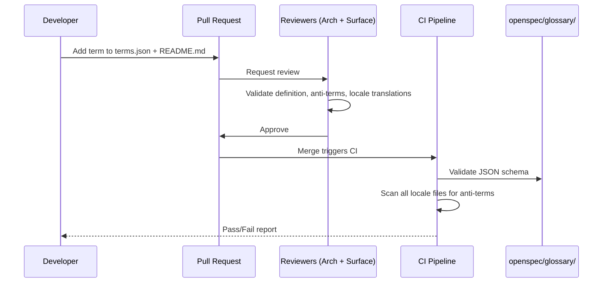
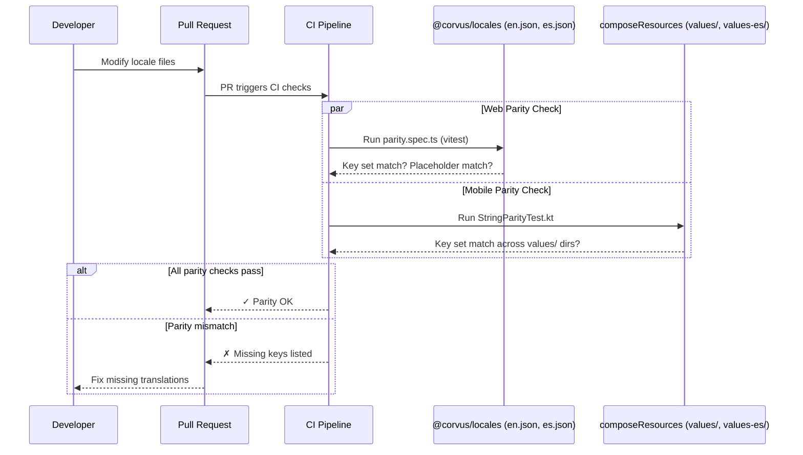
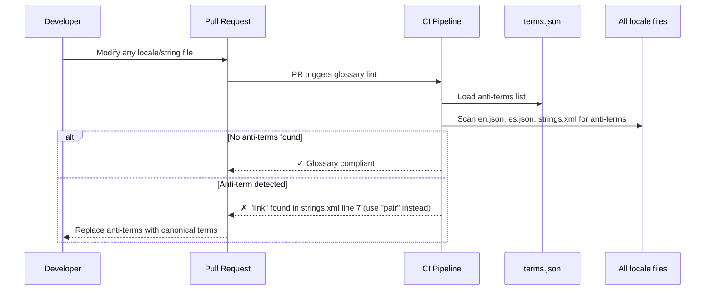

# Design: Cross-Client i18n Governance and Shared UX/UI Language

## Technical Approach

This change produces **governance artifacts only** — specifications, a canonical glossary, surface
contract amendments, and CI enforcement rules. No runtime code is modified. The approach maps
directly to the proposal's four phases:

1. A dual-format glossary (JSON + Markdown) stored under `openspec/glossary/`
2. An i18n governance spec under `openspec/specs/i18n/` defining locale tiers, key naming, and
   parity requirements
3. Amendments to all 7 surface contracts adding i18n sections
4. Design token governance rules for cross-platform naming consistency

The existing `@corvus/locales` package (252-key en/es JSON with `parity.spec.ts`) and Compose
Resources (`values/strings.xml` with 12 strings in en/es) are the implementation baselines. This
design governs their evolution — it does not change them.

## Architecture Decisions

### ADR-1: Glossary Format — Dual JSON + Markdown

**Choice**: Maintain two representations of the canonical glossary:

- `openspec/glossary/terms.json` — machine-readable, CI-lintable
- `openspec/glossary/README.md` — human-readable, onboarding-friendly

**JSON schema**:

```json
{
  "version": "1.0.0",
  "terms": {
    "<canonical_key>": {
      "canonical": "string — English canonical form",
      "definition": "string — what this term means in Corvus context",
      "context": "string — where/when to use this term",
      "aliases": [
        "string — acceptable synonyms"
      ],
      "anti_terms": [
        "string — disallowed synonyms that MUST NOT be used"
      ],
      "locales": {
        "es": "string — canonical Spanish translation"
      }
    }
  }
}
```

**Alternatives considered**:

- *YAML-only*: Rejected — YAML is human-friendly but harder to validate in CI without a schema
  parser; JSON has native schema validation in every CI environment.
- *Database / CMS*: Rejected — over-engineered for ~30 terms; adds infrastructure dependency for
  what is fundamentally a spec artifact.
- *Markdown-only*: Rejected — cannot be consumed programmatically by CI linters without fragile
  parsing.

**Rationale**: JSON enables CI linting (key presence checks, anti-term scanning in locale files).
Markdown enables PR review and contributor onboarding. Both are generated from the same source of
truth — the JSON file is canonical; the README is derived (initially hand-authored, with a future
CI check that they stay in sync).

### ADR-2: Locale Tier Enforcement — Spec + CI

**Choice**: Locale tiers are defined in the i18n governance spec AND embedded in each surface
contract. CI enforces parity for Tier 1 surfaces.

**Tier model**:

| Tier                      | Locales | Surfaces                                     | Enforcement                                         |
|---------------------------|---------|----------------------------------------------|-----------------------------------------------------|
| **Tier 1 — Full**         | en, es  | Web Chat, Web Dashboard, Mobile (ComposeApp) | Parity tests mandatory; CI blocks on missing keys   |
| **Tier 2 — Content**      | en, es  | Docs (Starlight)                             | File-based content parity; manual review            |
| **Tier 3 — English-only** | en      | CLI (Rust), Marketing (Astro)                | No parity required; glossary compliance recommended |

**Enforcement mechanism**: Extend the existing `parity.spec.ts` pattern from `@corvus/locales` to
a generalizable rule. Mobile (Compose Resources) gets an equivalent Kotlin test. CI runs parity
tests for all Tier 1 surfaces on every PR that touches locale files.

**Alternatives considered**:

- *Runtime enforcement*: Rejected — too heavy for governance; adds latency and complexity to
  every surface for what is a build-time concern.
- *Single centralized parity test*: Rejected — each surface uses a different i18n technology
  (vue-i18n JSON, Compose XML, Starlight MDX); a single test cannot span all formats without
  becoming a fragile polyglot parser.

**Rationale**: Spec is the source of truth (human-reviewed, versioned). CI prevents drift between
spec and implementation. Per-surface tests match each surface's native i18n format.

### ADR-3: Key Naming Convention — Domain.Feature.Element

**Choice**: `{domain}.{feature}.{element}` hierarchical key format.

- **Domain**: Matches spec domain — `onboarding`, `chat`, `dashboard`, `common`, `auth`, `form`,
  `errors`, `webhook`
- **Feature**: Feature area within domain — `steps`, `recovery`, `session`, `config`
- **Element**: UI element type — `title`, `description`, `button`, `error`, `placeholder`, `label`

**Examples from existing `@corvus/locales` (already conformant)**:

```text
onboarding.steps.runtime.title        → "Runtime available"
chat.welcome                          → "Hello, I am {modelName}..."
chatOnboarding.recovery.credential_missing.title → "Bearer token missing"
form.baseUrlPlaceholder               → "/api"
```

**Compose Resources mapping**: Compose `strings.xml` uses flat `snake_case` names
(`onboarding_title_runtime_available`). The governance rule maps: dots become underscores, same
hierarchy. Example: `onboarding.steps.runtime.title` → `onboarding_title_runtime_available`.

**Alternatives considered**:

- *Flat keys* (`runtime_available_title`): Rejected — doesn't scale; exploration found 252 web
  keys already organized hierarchically.
- *Path-based* (`/onboarding/steps/runtime/title`): Rejected — couples key naming to file
  structure; breaks when files are reorganized.

**Rationale**: Matches the existing `@corvus/locales` pattern established across 252 keys.
Extensible to new domains. The dot-to-underscore mapping for Compose is mechanical and lintable.

### ADR-4: Design Token Namespace — corvus.category.property.variant

**Choice**: `corvus.{category}.{property}.{variant}` canonical token namespace.

**Platform mappings**:

| Canonical Token               | Web (CSS Custom Property)           | Compose (Theme)                     |
|-------------------------------|-------------------------------------|-------------------------------------|
| `corvus.color.bg.primary`     | `--corvus-color-bg-primary`         | `CorvusTheme.colors.bgPrimary`      |
| `corvus.color.accent.default` | `--corvus-color-accent-default`     | `CorvusTheme.colors.accentDefault`  |
| `corvus.font.heading`         | `--corvus-font-heading`             | `CorvusTheme.typography.heading`    |
| `corvus.radius.md`            | `--corvus-radius-md`                | `CorvusTheme.shape.radiusMd`        |

**Categories**: `color`, `font`, `radius`, `spacing`, `transition`, `glass`, `gradient`

**Current state**: Web tokens in `tokens.css` already use `--corvus-{category}-{property}` naming
(116 lines, well-structured). Compose has no shared token file — theming is inline. This ADR
governs the **naming convention**, not the implementation. A follow-up issue will create the
Compose theme object.

**Alternatives considered**:

- *Per-platform naming*: Rejected — no governance possible if each platform invents its own names;
  cross-platform audits become impossible.
- *Design token JSON file as source*: Considered but deferred — the `tokens.css` file is already
  the web source of truth; adding a JSON intermediary is a future optimization, not a governance
  requirement.

**Rationale**: Single namespace prevents collision. Platform mapping is mechanical and documented.
The existing `tokens.css` already follows this convention; this ADR canonicalizes it.

### ADR-5: Surface Contract Amendment Strategy — Co-located i18n Sections

**Choice**: Add an `## i18n Requirements` section to each of the 7 surface contracts rather than
creating a separate cross-cutting document.

**Each contract section includes**:

- Locale tier assignment (Tier 1/2/3)
- Parity requirement (yes/no, with test type)
- Glossary compliance mandate
- String externalization rules
- Key naming convention reference

**Alternatives considered**:

- *Single cross-cutting i18n spec only*: Rejected — too disconnected from surface owners; when a
  developer reads the chat contract, they should see i18n requirements in context, not need to
  cross-reference a separate document.
- *i18n spec replaces contract sections*: Rejected — the i18n spec defines the governance model;
  contracts define per-surface obligations. Both are needed.

**Rationale**: Keeps all surface requirements co-located. Surface maintainers see their i18n
obligations when reading their own contract. The i18n governance spec remains the authoritative
source for tier definitions and rules; contracts reference it.

## Glossary Structure Design

```text
openspec/glossary/
├── README.md          # Human-readable glossary with definitions, usage, anti-terms
├── terms.json         # Machine-readable canonical terms (CI-lintable)
└── GOVERNANCE.md      # Process: how to add/modify/deprecate terms
```

### terms.json — Initial Term Set

Based on the exploration's terminology audit, the initial glossary covers these canonical terms:

| Key          | Canonical (en) | Anti-terms                | Notes                                         |
|--------------|----------------|---------------------------|-----------------------------------------------|
| `agent`      | Corvus Agent   | assistant, bot, AI        | Product name, always capitalized              |
| `session`    | Session        | conversation, thread      | Consistent across all surfaces                |
| `chat`       | Chat           | message, conversation     | The action/surface for messaging              |
| `surface`    | Surface        | app, client, frontend     | Corvus term for any client interface          |
| `pairing`    | Pair / Pairing | link, linking, connect    | **Resolves mobile "link" inconsistency**      |
| `trust`      | Trust          | authorize, approve        | The onboarding step for surface authorization |
| `runtime`    | Runtime        | server, backend, engine   | The Rust agent runtime process                |
| `gateway`    | Gateway        | API, proxy, server        | HTTP gateway for web transport                |
| `bridge`     | Bridge         | connector, adapter        | CLI bridge for mobile transport               |
| `onboarding` | Onboarding     | setup, wizard, first-run  | The initial surface configuration flow        |
| `tool`       | Tool           | function, action, command | MCP tool invoked by the agent                 |
| `memory`     | Memory         | context, history, recall  | Cerebro memory system                         |
| `operator`   | Operator       | admin, administrator      | Human managing the runtime                    |

### README.md Format

```markdown
# Corvus Product Glossary

> Canonical product terminology for all Corvus surfaces.
> Source of truth: `terms.json`. This document is the human-readable reference.

## Terms

### Agent

**Canonical**: Corvus Agent
**Definition**: The AI agent powered by the Corvus runtime.
**Context**: Always use "Corvus Agent" (capitalized) in user-facing text.
**Anti-terms**: assistant, bot, AI (too generic; loses product identity)

### Pairing

**Canonical**: Pair / Pairing
**Definition**: The one-time trust exchange where a surface receives credentials.
**Context**: Web surfaces exchange a pairing code for a bearer token. Mobile surfaces
perform local linking (but the *concept* is still "pairing" — the glossary governs
the user-facing term, not the technical mechanism).
**Anti-terms**: link, linking (mobile previously used "link" — this is now deprecated)
...
```

### GOVERNANCE.md — Term Lifecycle

Defines the process for:

1. **Proposing** a new term (PR to `terms.json` + `README.md`)
2. **Reviewing** (requires approval from architecture + one surface maintainer)
3. **Deprecating** a term (move to `deprecated` field, keep for 2 versions)
4. **Anti-term enforcement** (CI scans locale files for anti-terms)

## Governance Flow Diagrams

### New Term Addition Flow



### Translation Key Parity Validation Flow



### Glossary Compliance Lint Flow



## Data Flow

The governance artifacts flow through the system as follows:

```text
openspec/glossary/terms.json ──────────────────────────────────┐
    │                                                          │
    │  (canonical terms, anti-terms)                           │
    │                                                          │
    ▼                                                          ▼
CI Glossary Lint ◄──── PR with locale changes ────► CI Parity Tests
    │                                                          │
    │  (anti-term scan)                     (key set matching) │
    │                                                          │
    ▼                                                          ▼
Pass/Fail on PR                                    Pass/Fail on PR


openspec/specs/i18n/spec.md ──── defines ───► Tier model, rules
    │
    │  (referenced by)
    │
    ▼
Surface contracts (7 files) ──── embed ───► Per-surface i18n section
```

## File Changes

### New Files

| File                                                                                | Description                                                                         |
|-------------------------------------------------------------------------------------|-------------------------------------------------------------------------------------|
| `openspec/glossary/terms.json`                                                      | Machine-readable canonical glossary (13+ terms, JSON schema)                        |
| `openspec/glossary/README.md`                                                       | Human-readable glossary with definitions, context, anti-terms                       |
| `openspec/glossary/GOVERNANCE.md`                                                   | Process for adding, modifying, deprecating terms                                    |
| `openspec/specs/i18n/spec.md`                                                       | i18n governance specification: tier model, key naming, parity rules, CI enforcement |
| `openspec/specs/i18n/design-tokens.md`                                              | Design token governance: cross-platform naming conventions                          |
| `openspec/changes/2026-03-24-cross-client-i18n-governance/specs/i18n-governance.md` | Delta spec for the governance rules (change-scoped)                                 |
| `openspec/changes/2026-03-24-cross-client-i18n-governance/specs/glossary.md`        | Delta spec for the glossary structure (change-scoped)                               |
| `openspec/changes/2026-03-24-cross-client-i18n-governance/specs/design-tokens.md`   | Delta spec for token governance (change-scoped)                                     |

### Modified Files

| File                                                                    | Change Description                                                         |
|-------------------------------------------------------------------------|----------------------------------------------------------------------------|
| `openspec/specs/client-surfaces/spec.md`                                | Add i18n Tier column to capability matrix table                            |
| `openspec/specs/client-surfaces/surface-contracts/web-chat.md`          | Add `## i18n Requirements` section (Tier 1, parity mandatory)              |
| `openspec/specs/client-surfaces/surface-contracts/web-dashboard.md`     | Add `## i18n Requirements` section (Tier 1, parity mandatory)              |
| `openspec/specs/client-surfaces/surface-contracts/composeapp-mobile.md` | Add `## i18n Requirements` section (Tier 1, parity mandatory)              |
| `openspec/specs/client-surfaces/surface-contracts/composeapp-shared.md` | Add `## i18n Requirements` section (Tier 1 contracts, glossary compliance) |
| `openspec/specs/client-surfaces/surface-contracts/agent-runtime-cli.md` | Add `## i18n Requirements` section (Tier 3, glossary recommended)          |
| `openspec/specs/client-surfaces/surface-contracts/web-docs.md`          | Add `## i18n Requirements` section (Tier 2, content parity)                |
| `openspec/specs/client-surfaces/surface-contracts/web-marketing.md`     | Add `## i18n Requirements` section (Tier 3, English-only)                  |

**Total**: 8 new files, 8 modified files, 0 deleted files.

## Interfaces / Contracts

### Glossary JSON Schema (terms.json)

```json
{
  "$schema": "https://json-schema.org/draft/2020-12/schema",
  "type": "object",
  "required": [
    "version",
    "terms"
  ],
  "properties": {
    "version": {
      "type": "string",
      "pattern": "^\\d+\\.\\d+\\.\\d+$"
    },
    "terms": {
      "type": "object",
      "additionalProperties": {
        "type": "object",
        "required": [
          "canonical",
          "definition",
          "context"
        ],
        "properties": {
          "canonical": {
            "type": "string"
          },
          "definition": {
            "type": "string"
          },
          "context": {
            "type": "string"
          },
          "aliases": {
            "type": "array",
            "items": {
              "type": "string"
            }
          },
          "anti_terms": {
            "type": "array",
            "items": {
              "type": "string"
            }
          },
          "locales": {
            "type": "object",
            "additionalProperties": {
              "type": "string"
            }
          }
        }
      }
    }
  }
}
```

### Surface Contract i18n Section Template

Each surface contract amendment follows this structure:

```markdown
## i18n Requirements

**Locale Tier**: {Tier 1 — Full | Tier 2 — Content | Tier 3 — English-only}
**Supported Locales**: {en, es | en}
**Parity Requirement**: {Mandatory — CI-enforced | Recommended | None}
**Glossary Compliance**: {Mandatory | Recommended}

### String Externalization

- All user-facing strings MUST be externalized to locale files (Tier 1/2)
- No hardcoded user-facing strings in source code (Tier 1)
- Key naming MUST follow `{domain}.{feature}.{element}` convention

### Parity Testing

- {Description of parity test mechanism for this surface}

### References

- [i18n Governance Spec](../../i18n/spec.md)
- [Canonical Glossary](../../../glossary/README.md)
```

### Capability Matrix Amendment

The existing capability matrix in `spec.md` gains an i18n column:

```markdown
| Surface | Chat | Config | ... | **i18n Tier** |
|---------|------|--------|-----|---------------|
| `agent-runtime` (CLI) | Yes | Yes | ... | Tier 3 |
| `web/apps/chat` | **Yes** | No | ... | **Tier 1** |
| `web/apps/dashboard` | No | Yes | ... | **Tier 1** |
| `composeApp` (mobile) | **Yes** | No | ... | **Tier 1** |
| `web/apps/docs` | No | No | ... | Tier 2 |
| `web/apps/marketing` | No | No | ... | Tier 3 |
| `composeApp` (shared) | Contracts | Contracts | ... | Exempt |
```

## Testing Strategy

| Layer            | What to Test                               | Approach                                                                                        |
|------------------|--------------------------------------------|-------------------------------------------------------------------------------------------------|
| Schema           | `terms.json` validates against JSON Schema | CI job: `ajv validate` or equivalent JSON schema validator                                      |
| Parity (Web)     | en/es key set and placeholder parity       | Existing `parity.spec.ts` in `@corvus/locales` (already passing)                                |
| Parity (Mobile)  | en/es key set parity in Compose Resources  | New Kotlin test: `StringParityTest.kt` reading `values/` and `values-es/` XML (follow-up issue) |
| Glossary Lint    | Anti-terms not present in any locale file  | CI script: grep locale files for terms in `anti_terms` arrays from `terms.json`                 |
| Spec Consistency | README.md terms match terms.json entries   | CI script: parse both, compare term lists                                                       |

**Note**: Testing for this governance change validates the **spec artifacts**, not application
behavior. Application-level i18n tests are follow-up implementation issues.

## Migration / Rollout

No migration required. This change produces only specification files under `openspec/`. No runtime
artifacts, databases, or deployed services are affected.

**Rollout sequence**:

1. Merge glossary files (`openspec/glossary/`) — establishes the canonical vocabulary
2. Merge i18n governance spec (`openspec/specs/i18n/`) — establishes the tier model and rules
3. Merge surface contract amendments (all 7 contracts) — embeds i18n requirements per surface
4. Merge capability matrix update (`spec.md`) — adds i18n tier column
5. Create follow-up implementation issues from the spec

Steps 1–4 can land in a single PR since they are all spec artifacts with no runtime impact.

## Follow-up Issues

These implementation issues SHOULD be created after this governance spec lands:

| Issue                               | Priority | Description                                                                                                               |
|-------------------------------------|----------|---------------------------------------------------------------------------------------------------------------------------|
| Mobile i18n parity                  | High     | Expand Compose Resources from 12 strings to full coverage; add `StringParityTest.kt`; resolve "link" → "pair" terminology |
| CI glossary lint tool               | High     | Script/action that validates locale files against `terms.json` anti-terms on every PR                                     |
| CI schema validation                | Medium   | Validate `terms.json` against JSON schema on PRs touching `openspec/glossary/`                                            |
| Design token Compose implementation | Medium   | Create `CorvusTheme` object in composeApp matching `tokens.css` naming convention                                         |
| CLI i18n infrastructure             | Low      | If/when Tier 3 CLI is promoted; evaluate `rust-i18n` or `fluent-rs`                                                       |
| Marketing i18n infrastructure       | Low      | If/when marketing needs localization                                                                                      |
| README ↔ JSON sync check            | Low      | CI check that `README.md` glossary entries match `terms.json`                                                             |
| Third locale scaffolding            | Deferred | When a locale beyond en/es is needed; update tier model and all Tier 1 surfaces                                           |

## Open Questions

- [x] Glossary format → **Resolved**: Dual JSON + Markdown (ADR-1)
- [x] "Link" vs "pair" → **Resolved**: "Pair" wins; "link" becomes an anti-term (ADR-1 glossary)
- [x] CI enforcement scope → **Resolved**: Parity tests per Tier 1 surface + glossary anti-term
  lint (ADR-2)
- [x] Design token governance scope → **Resolved**: Naming convention only; implementation
  deferred (ADR-4)
- [ ] Glossary ownership: The `GOVERNANCE.md` proposes architecture team + surface maintainer
  approval. Confirm this is the right ownership model before merging.
