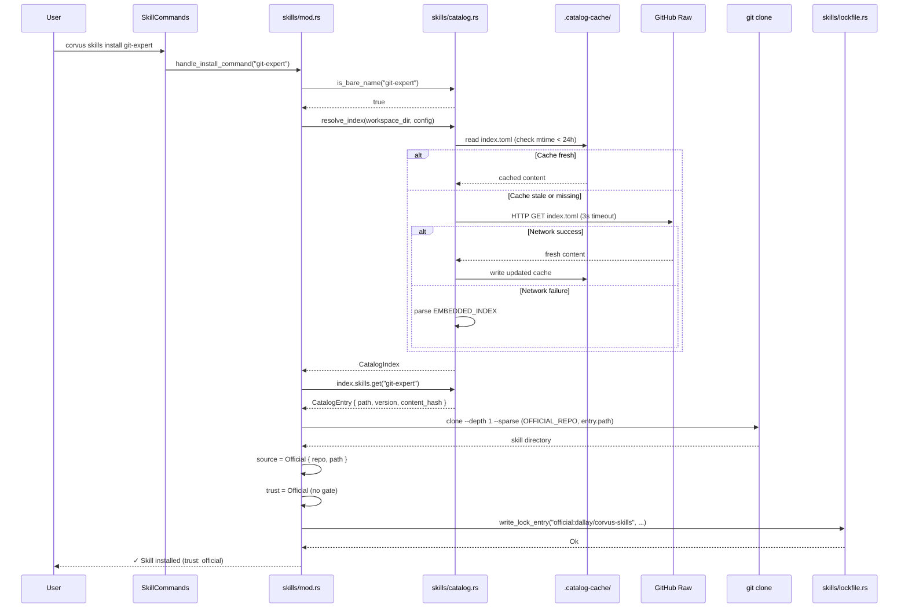
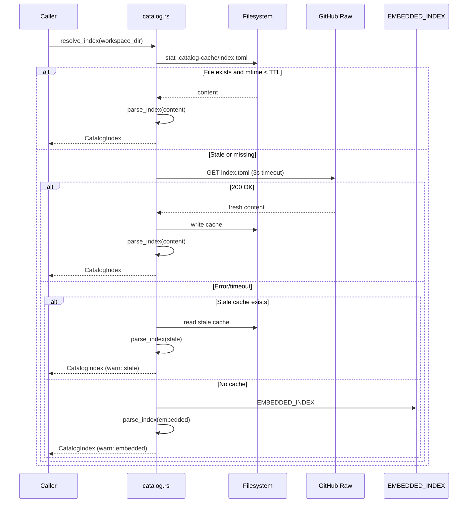

# Design: Official Skills Catalog

## Technical Approach

Deliver the official skills catalog infrastructure for Corvus by:
1. Defining a TOML-based catalog index format with `CatalogIndex`/`CatalogEntry` types
2. Embedding a committed index snapshot via `build.rs` + `include_str!` for offline-first operation
3. Adding catalog-aware install (bare-name resolution), search, update, and lock-repair commands
4. Deprecating SKILL.toml in favor of extended SKILL.md frontmatter
5. Restricting SkillForge to display-only discovery (no auto-integrate)

The implementation follows the proposal's phased sub-release model (2a → 2b → 2c) and builds
directly on the Phase 1 trust model infrastructure in `skills/trust.rs`, `skills/lockfile.rs`,
`skills/frontmatter.rs`, and `skills/mod.rs`.

## Architecture Decisions

### AD1: Catalog as Committed Snapshot

**Choice**: Commit `catalog/index.toml` to the agent-runtime repo; `build.rs` embeds it via
`include_str!` as a compile-time constant.

**Alternatives considered**:
- `build.rs` fetches from network at build time — rejected: breaks reproducible/offline builds
- Git submodule pointing to `dallay/corvus-skills` — rejected: adds contributor friction,
  complicates CI, version coupling
- No embedded index (always fetch at runtime) — rejected: violates zero-network cold start
  requirement; `corvus skills search git` must work on first run without internet

**Rationale**: A committed snapshot file is the simplest approach that guarantees deterministic
builds and offline operation. The embedded index is a floor — runtime fetches fresh data when
online. Staleness is bounded by periodic maintainer/CI updates to the snapshot.

### AD2: Lazy Cached Index with TTL Fallback Chain

**Choice**: Parse embedded index lazily on first catalog operation. Attempt to fetch fresh index
from GitHub raw URL with 24h TTL cache at `{workspace}/.catalog-cache/index.toml`. Fallback
chain: cache (if < 24h) → network fetch (3s timeout) → embedded constant.

**Alternatives considered**:
- Eager parse at startup — rejected: adds latency to all commands, most don't need catalog
- No caching (always fetch) — rejected: unnecessary network traffic, slow offline degradation
- Longer/shorter TTL — 24h balances freshness vs. traffic; configurable via `SkillsConfig`

**Rationale**: Lazy parsing keeps the startup path lean (per AGENTS.md §3.1). The fallback chain
ensures search/install work in all network conditions. The 3s timeout prevents blocking on slow
connections.

### AD3: Bare Name Heuristic

**Choice**: If the install source string contains none of `/`, `\`, `.`, or `:`, treat it as a
catalog bare-name lookup. Everything else routes to existing URL or path install.

**Alternatives considered**:
- Explicit `--catalog` flag — rejected: worse UX for the common case; `skills install git-expert`
  is more natural than `skills install --catalog git-expert`
- Namespace prefix (`official:git-expert`) — rejected: adds typing for users; the heuristic is
  unambiguous since catalog names are simple identifiers

**Rationale**: The heuristic is conservative — any path separator, dot, or colon triggers URL/path
mode. Valid catalog names (`git-expert`, `rust-expert`) never contain these characters. This
preserves backward compatibility with all existing install invocations.

### AD4: SkillForge as Display-Only Discovery

**Choice**: Replace the auto-integrate pipeline with `corvus skills discover`, which runs
Scout → Evaluate and displays results as a table. No files are written. Users install via
`corvus skills install <url>` (standard ThirdParty flow).

**Alternatives considered**:
- Keep auto-integrate with ThirdParty trust — rejected: auto-writing to disk without consent
  contradicts the explicit-consent trust model from Phase 1
- Remove SkillForge entirely — rejected: discovery is still useful; just needs trust boundaries

**Rationale**: Phase 1 established that trust requires explicit action. Discovery should inform,
not act. The `auto_integrate` config option is deprecated with a warning.

### AD5: Official Source Security Invariant

**Choice**: Only the catalog install code path (bare-name → index lookup → hardcoded repo URL →
clone) can produce `SkillSource::Official`. URL-based installs of the same repo produce
`ThirdParty`. Lockfile `trust` field is re-derived from `source` at load time.

**Alternatives considered**:
- Allow URL installs from official repo to get Official trust — rejected: privilege escalation
  vector; user could clone a fork with the same URL pattern
- Trust the lockfile `trust` field directly — rejected: violates Phase 1 invariant that trust
  is always derived from source variant

**Rationale**: This is the core security invariant. The `SkillSource::Official` variant can only
be constructed through a controlled code path that validates the skill exists in the catalog
index and fetches from a hardcoded constant URL. This prevents privilege escalation.

### AD6: No New Dependencies

**Choice**: Implement all new functionality using existing crates (`toml`, `sha2`, `hex`,
`reqwest`, `chrono`, `serde`). The frontmatter parser remains hand-rolled.

**Alternatives considered**:
- Add `serde_yaml` for frontmatter — rejected: AGENTS.md §3.1 requires minimal dependencies;
  the hand-rolled parser handles the simple flat structure adequately
- Add `fuzzy-matcher` crate — rejected: simple substring/contains matching is sufficient for
  catalog search; catalog is small enough that O(n) scan is fast

**Rationale**: Per AGENTS.md, prefer minimal dependencies. All required functionality can be
built with existing crates. The `reqwest` crate (already in tree with `blocking` feature) handles
HTTP fetching for index refresh.

## Data Flow

### Catalog Install Flow

```
User: `corvus skills install git-expert`
  │
  ▼
is_bare_name("git-expert") ── true ──► resolve_catalog_index()
  │                                        │
  │                                        ▼
  │                              cache < 24h? ──yes──► parse cached index
  │                                   │ no
  │                                   ▼
  │                              fetch from GitHub (3s timeout)
  │                                   │
  │                              success? ──yes──► update cache, parse
  │                                   │ no
  │                                   ▼
  │                              parse EMBEDDED_INDEX
  │                                   │
  │                                   ▼
  │                              lookup "git-expert" in index
  │                                   │
  │                              found? ──no──► error("not found in catalog")
  │                                   │ yes
  │                                   ▼
  ▼                              CatalogEntry { path, version, content_hash }
  │                                   │
  │◄──────────────────────────────────┘
  │
  ▼
clone_from_official_repo(OFFICIAL_REPO, entry.path)
  │
  ▼
SkillSource::Official { repo: OFFICIAL_REPO, path: entry.path }
  │
  ▼
trust = SkillTrust::Official  (no trust gate needed)
  │
  ▼
write_lock_entry(source="official:dallay/corvus-skills", trust="official",
                 path=entry.path, ref=index.meta.commit)
  │
  ▼
"✓ Skill installed successfully! (trust: official)"
```

### Index Cache Refresh Flow

```
resolve_catalog_index()
  │
  ▼
read cache file at {workspace}/.catalog-cache/index.toml
  │
  ├── exists and mtime < 24h ──► parse and return CatalogIndex
  │
  ├── exists but stale, or missing
  │     │
  │     ▼
  │   HTTP GET {catalog_repo_url}/raw/main/index.toml (3s timeout)
  │     │
  │     ├── 200 OK ──► write to cache file, parse and return CatalogIndex
  │     │
  │     └── error/timeout
  │           │
  │           ├── stale cache exists ──► parse stale cache (warn "using stale")
  │           │
  │           └── no cache ──► parse EMBEDDED_INDEX (warn "using embedded")
  │
  └── parse error on any source ──► try next in chain
```

### Skills Discover Flow

```
User: `corvus skills discover rust`
  │
  ▼
GitHubScout::discover("rust")  ──► GitHub Search API
  │
  ▼
Evaluator::evaluate(candidates) ──► score each candidate
  │
  ▼
Display table:
  NAME          URL                                    SCORE  STARS
  rust-patterns https://github.com/user/rust-patterns  0.85   120
  rust-tips     https://github.com/user/rust-tips      0.72    45
  │
  ▼
"Install with: corvus skills install <url>"
(no files written, no auto-integration)
```

### Lock Repair Flow

```
User: `corvus skills lock repair`
  │
  ▼
scan {workspace}/skills/ for dirs with SKILL.md or SKILL.toml
  │
  ▼
read existing lockfile (tolerate corruption → start empty)
  │
  ▼
for each skill on disk:
  ├── lockfile entry exists, hash matches ──► "verified" (keep)
  ├── lockfile entry exists, hash mismatch ──► recompute hash, "updated"
  └── no lockfile entry ──► create Local entry, "added"
  │
  ▼
for each lockfile entry not on disk:
  └── remove entry, "removed (orphan)"
  │
  ▼
write repaired lockfile
  │
  ▼
Print summary:
  ✓ 3 entries verified
  ⚠ 1 entry updated (hash mismatch: docker-expert)
  + 2 entries added (my-notes, quick-fix)
  - 1 entry removed (deleted-skill)
```

## File Changes

| File | Action | Description |
|------|--------|-------------|
| `clients/agent-runtime/src/skills/catalog.rs` | Create | `CatalogIndex`, `CatalogEntry`, `CatalogMeta` types; TOML parse/load; `resolve_index()` with cache + embedded fallback; `search()` fuzzy match; bare-name detection; `OFFICIAL_REPO` constant |
| `clients/agent-runtime/src/skills/catalog_index.toml` | Create | Committed index snapshot (initially minimal with seed entries or empty `[meta]`) |
| `clients/agent-runtime/build.rs` | Create | Read `src/skills/catalog_index.toml`, generate const via `include_str!` in OUT_DIR |
| `clients/agent-runtime/src/skills/mod.rs` | Modify | Add `pub mod catalog;` declaration. Update `handle_command()` to route new `SkillCommands` variants. Update `handle_install_command()` to detect bare names → catalog resolve. Add `handle_search_command()`, `handle_update_command()`, `handle_lock_repair_command()`, `handle_list_catalog()`. Add SKILL.toml deprecation warning in `load_skill_toml()`. Wire frontmatter `version`/`author`/`tags` into `load_skill_md()`. |
| `clients/agent-runtime/src/skills/frontmatter.rs` | Modify | Add `version`, `author`, `tags` fields to `SkillFrontmatter`. Extend `parse_frontmatter_block()` to parse these fields (same hand-rolled approach). |
| `clients/agent-runtime/src/skills/lockfile.rs` | Modify | Update `lock_entry_to_origin()` to recognize `"official:"` prefix → `SkillSource::Official`. Update `build_lock_entry()` to accept optional `path` parameter. Add `repair_lockfile()` function. |
| `clients/agent-runtime/src/skills/trust.rs` | No change | Types already support `Official` variant. No modifications needed. |
| `clients/agent-runtime/src/skillforge/mod.rs` | Modify | Add `discover()` public method that runs Scout → Evaluate and returns results without integrating. Deprecate `auto_integrate` config field (warn when set). |
| `clients/agent-runtime/src/skillforge/integrate.rs` | Modify | Stop generating SKILL.toml in `integrate()`. Generate only SKILL.md with YAML frontmatter header. |
| `clients/agent-runtime/src/lib.rs` | Modify | Expand `SkillCommands` enum with `Search`, `Update`, `Lock`, `Discover` variants. Add `LockCommands` sub-enum. |
| `clients/agent-runtime/src/config/schema.rs` | Modify | Expand `SkillsConfig` with `catalog_repo_url`, `catalog_cache_ttl_hours` fields. |
| `clients/agent-runtime/src/main.rs` | Modify | Route new `SkillCommands` variants to handlers (discover requires async). |
| `clients/agent-runtime/Cargo.toml` | Modify | Add `build = "build.rs"` declaration. No new dependency crates. |

## Interfaces / Contracts

### Catalog Types (`skills/catalog.rs`)

```rust
use serde::{Deserialize, Serialize};
use std::collections::BTreeMap;

/// Hardcoded official skills repository.
pub const OFFICIAL_REPO: &str = "dallay/corvus-skills";

/// Raw content URL template for fetching index.toml.
const OFFICIAL_INDEX_URL: &str =
    "https://raw.githubusercontent.com/dallay/corvus-skills/main/index.toml";

/// Default cache TTL in hours.
const DEFAULT_CACHE_TTL_HOURS: u64 = 24;

/// Network fetch timeout in seconds.
const INDEX_FETCH_TIMEOUT_SECS: u64 = 3;

/// Embedded index compiled into the binary at build time.
pub const EMBEDDED_INDEX: &str = include_str!(concat!(env!("OUT_DIR"), "/catalog_index.toml"));

/// Top-level catalog parsed from index.toml.
#[derive(Debug, Clone, Serialize, Deserialize)]
pub struct CatalogIndex {
    pub meta: CatalogMeta,
    #[serde(default)]
    pub skills: BTreeMap<String, CatalogEntry>,
}

/// Catalog metadata.
#[derive(Debug, Clone, Serialize, Deserialize)]
pub struct CatalogMeta {
    /// Schema version, must be 1.
    pub version: u32,
    /// ISO 8601 timestamp of index generation.
    pub generated_at: String,
    /// Git SHA of the skills repo at generation time.
    pub commit: String,
}

/// A single skill entry in the catalog.
#[derive(Debug, Clone, Serialize, Deserialize)]
pub struct CatalogEntry {
    pub description: String,
    /// SemVer version string.
    pub version: String,
    /// "sha256:<hex>" content hash of the skill directory.
    pub content_hash: String,
    /// Relative path in the skills repo (e.g., "skills/git-expert").
    pub path: String,
    #[serde(default)]
    pub tags: Vec<String>,
}

/// Returns true if the source string is a bare catalog name
/// (contains no `/`, `\`, `.`, or `:`).
pub fn is_bare_name(source: &str) -> bool {
    !source.is_empty()
        && !source.contains('/')
        && !source.contains('\\')
        && !source.contains('.')
        && !source.contains(':')
}

/// Resolve the catalog index using the fallback chain:
/// 1. Cached index (if < TTL)
/// 2. Fresh fetch from GitHub (with timeout)
/// 3. Embedded index
pub fn resolve_index(
    workspace_dir: &std::path::Path,
    cache_ttl_hours: Option<u64>,
    catalog_url: Option<&str>,
) -> anyhow::Result<CatalogIndex> {
    let ttl = cache_ttl_hours.unwrap_or(DEFAULT_CACHE_TTL_HOURS);
    let url = catalog_url.unwrap_or(OFFICIAL_INDEX_URL);
    let cache_dir = workspace_dir.join(".catalog-cache");
    let cache_path = cache_dir.join("index.toml");

    // 1. Try cache
    if let Some(index) = try_cached_index(&cache_path, ttl) {
        return Ok(index);
    }

    // 2. Try network fetch
    if let Some(index) = try_fetch_index(url, &cache_dir, &cache_path) {
        return Ok(index);
    }

    // 3. Fall back to embedded
    tracing::info!("Using embedded catalog index");
    parse_index(EMBEDDED_INDEX)
}

/// Search the catalog index for skills matching a query.
/// Matches against name, description, and tags (case-insensitive substring).
pub fn search(index: &CatalogIndex, query: &str) -> Vec<(&String, &CatalogEntry)> {
    let q = query.to_ascii_lowercase();
    index
        .skills
        .iter()
        .filter(|(name, entry)| {
            name.to_ascii_lowercase().contains(&q)
                || entry.description.to_ascii_lowercase().contains(&q)
                || entry.tags.iter().any(|t| t.to_ascii_lowercase().contains(&q))
        })
        .collect()
}

fn try_cached_index(
    cache_path: &std::path::Path,
    ttl_hours: u64,
) -> Option<CatalogIndex> { /* ... */ }

fn try_fetch_index(
    url: &str,
    cache_dir: &std::path::Path,
    cache_path: &std::path::Path,
) -> Option<CatalogIndex> { /* ... */ }

fn parse_index(content: &str) -> anyhow::Result<CatalogIndex> {
    toml::from_str(content).map_err(Into::into)
}
```

### Extended SkillCommands (`lib.rs`)

```rust
/// Skills management subcommands
#[derive(Subcommand, Debug, Clone, Serialize, Deserialize, PartialEq, Eq)]
pub enum SkillCommands {
    /// List all installed skills
    List {
        /// Show all available official skills from the catalog
        #[arg(long)]
        catalog: bool,
    },
    /// Install a new skill from catalog name, URL, or local path
    Install {
        /// Catalog name, source URL, or local path
        source: String,
        /// Acknowledge trust for third-party skills with tools
        #[arg(long)]
        trust: bool,
    },
    /// Remove an installed skill
    Remove {
        /// Skill name to remove
        name: String,
    },
    /// Search for skills in the official catalog
    Search {
        /// Search query (matched against name, description, tags)
        query: String,
    },
    /// Update installed skills to latest versions
    Update {
        /// Skill name to update (omit to update all)
        name: Option<String>,
    },
    /// Lockfile maintenance commands
    Lock {
        #[command(subcommand)]
        cmd: LockCommands,
    },
    /// Discover third-party skills from external sources (GitHub, etc.)
    Discover {
        /// Search query for discovery
        query: Option<String>,
    },
}

/// Lockfile subcommands
#[derive(Subcommand, Debug, Clone, Serialize, Deserialize, PartialEq, Eq)]
pub enum LockCommands {
    /// Repair lockfile: rebuild from disk state, fix orphans and hash mismatches
    Repair,
}
```

### Extended SkillsConfig (`config/schema.rs`)

```rust
#[derive(Debug, Clone, Serialize, Deserialize)]
pub struct SkillsConfig {
    /// Enable deprecated open-skills auto-clone behavior.
    /// Default: false. Will be removed in a future release.
    #[serde(default)]
    pub legacy_open_skills: bool,

    /// Official catalog repository URL for index fetching.
    /// Default: GitHub raw content URL for dallay/corvus-skills.
    #[serde(default)]
    pub catalog_repo_url: Option<String>,

    /// Cache TTL in hours for the catalog index.
    /// Default: 24.
    #[serde(default)]
    pub catalog_cache_ttl_hours: Option<u64>,
}

impl Default for SkillsConfig {
    fn default() -> Self {
        Self {
            legacy_open_skills: false,
            catalog_repo_url: None,
            catalog_cache_ttl_hours: None,
        }
    }
}
```

### Extended SkillFrontmatter (`skills/frontmatter.rs`)

```rust
/// Parsed frontmatter from a SKILL.md file.
#[derive(Debug, Clone, Default)]
pub struct SkillFrontmatter {
    pub name: Option<String>,
    pub description: Option<String>,
    pub version: Option<String>,
    pub author: Option<String>,
    pub tags: Vec<String>,
    pub allowed_tools: Vec<String>,
}
```

The `parse_frontmatter_block()` function is extended with three new match arms:

```rust
match key {
    "name" => fm.name = Some(value.to_string()),
    "description" => fm.description = Some(value.to_string()),
    "version" => fm.version = Some(value.to_string()),
    "author" => fm.author = Some(value.to_string()),
    "allowed-tools" => { /* existing list logic */ }
    "tags" => {
        if value.is_empty() {
            in_tags = true;  // new list state, same pattern as allowed-tools
        }
    }
    _ => {}
}
```

Tags parsing reuses the same list-item pattern already used for `allowed-tools`.

### Updated lock_entry_to_origin (`skills/lockfile.rs`)

```rust
pub fn lock_entry_to_origin(entry: &LockEntry) -> SkillOrigin {
    let source = if entry.source == "local" {
        SkillSource::Local
    } else if let Some(repo) = entry.source.strip_prefix("official:") {
        SkillSource::Official {
            repo: repo.to_string(),
            path: entry.path.clone().unwrap_or_default(),
        }
    } else {
        SkillSource::GitRepo {
            url: entry.source.clone(),
        }
    };
    SkillOrigin {
        source,
        installed_at: entry.installed_at.clone(),
        pinned_ref: entry.pinned_ref.clone(),
        content_hash: entry.content_hash.clone(),
    }
}
```

### Lockfile Repair (`skills/lockfile.rs`)

```rust
/// Result of a lockfile repair operation.
#[derive(Debug, Default)]
pub struct RepairSummary {
    pub verified: usize,
    pub updated: Vec<String>,   // names with hash mismatch
    pub added: Vec<String>,     // names not in lockfile
    pub removed: Vec<String>,   // orphaned lockfile entries
}

/// Scan disk and rebuild/repair the lockfile.
pub fn repair_lockfile(workspace_dir: &Path) -> Result<RepairSummary> {
    // Implementation: scan skills/ dir, compare with lockfile entries,
    // recompute hashes, add missing, remove orphans, write result.
    todo!()
}
```

### build.rs

```rust
//! Build script: embeds the catalog index snapshot as a compile-time constant.

use std::env;
use std::fs;
use std::path::Path;

fn main() {
    let out_dir = env::var("OUT_DIR").unwrap();
    let source = Path::new("src/skills/catalog_index.toml");

    // Copy the committed snapshot to OUT_DIR so include_str! can find it.
    let dest = Path::new(&out_dir).join("catalog_index.toml");
    fs::copy(source, &dest).expect("Failed to copy catalog_index.toml to OUT_DIR");

    // Re-run if snapshot changes.
    println!("cargo:rerun-if-changed=src/skills/catalog_index.toml");
}
```

### Catalog Index Snapshot (`src/skills/catalog_index.toml`)

```toml
# Committed snapshot of the official skills catalog index.
# Updated periodically from dallay/corvus-skills.
# Do not edit manually — regenerated by CI or maintainer sync.

[meta]
version = 1
generated_at = "2026-03-24T00:00:00Z"
commit = "0000000000000000000000000000000000000000"

# Seed entries will be added as the official skills repo is populated.
# [skills.git-expert]
# description = "Git operations, branching strategies, and conflict resolution"
# version = "1.0.0"
# content_hash = "sha256:0000000000000000000000000000000000000000000000000000000000000000"
# path = "skills/git-expert"
# tags = ["git", "vcs"]
```

## Sequence Diagrams

### Catalog Install Flow



### Index Cache Refresh Flow



## Testing Strategy

| Layer | What to Test | Approach |
|-------|-------------|----------|
| Unit | `CatalogIndex`/`CatalogEntry` TOML parsing (valid, invalid, missing fields) | `catalog.rs` — parse sample TOML strings, verify struct fields |
| Unit | `is_bare_name()` — positive cases (`git-expert`, `rust`) and negative (`./path`, `https://url`, `a.b`, `a:b`, `a/b`) | `catalog.rs` — exhaustive assertions |
| Unit | `search()` — matches name, description, tags; case-insensitive; no-match returns empty | `catalog.rs` — build test index, verify search results |
| Unit | `resolve_index()` fallback chain — cached/embedded paths (network mocked or skipped) | `catalog.rs` — use tempdir, write/omit cache file, verify fallback to embedded |
| Unit | Extended `SkillFrontmatter` parsing — `version`, `author`, `tags` fields | `frontmatter.rs` — add test cases mirroring existing style |
| Unit | `tags` list parsing (same pattern as `allowed-tools`) | `frontmatter.rs` — verify list items parsed correctly |
| Unit | `lock_entry_to_origin()` — `"official:dallay/corvus-skills"` → `SkillSource::Official` | `lockfile.rs` — add test case alongside existing ones |
| Unit | `repair_lockfile()` — verified/added/removed/updated scenarios | `lockfile.rs` — tempdir with skills on disk + lockfile, verify summary |
| Unit | `build_lock_entry()` with `path` field for official skills | `lockfile.rs` — verify path is populated |
| Integration | Catalog install end-to-end: bare name → index lookup → mock clone → lockfile entry | `skills/mod.rs` — tempdir workspace, embedded index, verify Official trust |
| Integration | SKILL.toml deprecation warning emitted on load | `skills/mod.rs` — existing `load_skill_toml` test + tracing subscriber capture |
| Regression | All existing Phase 1 tests pass unchanged | `cargo test` — no modifications to existing test assertions |
| Regression | Existing `SkillCommands::List`, `Install` (URL/path), `Remove` continue to work | Existing tests in `skills/mod.rs` cover these paths |

### Key Test Invariants

1. **Privilege escalation prevention**: URL-based install of `https://github.com/dallay/corvus-skills`
   must still produce `ThirdParty` trust, never `Official`. Add explicit test.
2. **Offline operation**: `resolve_index()` with no cache and no network returns embedded index
   successfully. Search works against embedded index.
3. **Backward compatibility**: `handle_install_command("https://github.com/someone/skill")` continues
   to work identically to Phase 1 behavior.
4. **Lock repair idempotency**: Running repair twice produces the same result.

## Migration / Rollout

No migration required. This change is purely additive:

- New `SkillCommands` variants are new CLI subcommands; existing commands unchanged.
- `SkillsConfig` new fields have defaults (optional/None); existing configs parse without changes.
- `SkillFrontmatter` new fields are optional; existing SKILL.md files continue to parse.
- SKILL.toml deprecation is warning-only; no behavior change.
- `lock_entry_to_origin()` change is backward-compatible — existing lockfile entries without
  `"official:"` prefix continue to map to `GitRepo`.
- `build.rs` addition requires `build = "build.rs"` in `Cargo.toml` but has no runtime impact.

### Recommended Rollout Order

Following the proposal's phased approach:

1. **Phase 2a** (Foundation): `catalog.rs` types + `build.rs` + embedded index + frontmatter
   extensions + SKILL.toml deprecation warning + `lock_entry_to_origin` Official support.
   No external infra needed. Single PR.

2. **Phase 2b** (Catalog UX): Search, catalog install, list --catalog, update commands.
   Requires embedded index from 2a. Single PR.

3. **Phase 2c** (Cleanup): SkillForge discover command, auto-integrate deprecation, lock repair,
   integrator SKILL.toml removal. Independent of 2b. Single PR.

## Open Questions

- [x] Official repo name: `dallay/corvus-skills` (confirmed in proposal)
- [x] Catalog name format: Flat names (`git-expert`) — no namespacing (confirmed in proposal)
- [ ] Sparse checkout vs shallow clone: Should the catalog install use `git clone --filter=blob:none --sparse` or fall back to full shallow clone? The design uses sparse checkout with shallow clone fallback, but the minimum git version requirement should be documented.
- [ ] SKILL.toml `[[tools]]` migration: The proposal says official skills should not use `[[tools]]`. Should the frontmatter parser ever support tool declarations, or is that permanently out of scope? Current design: tools stay in SKILL.toml only, not in frontmatter.
