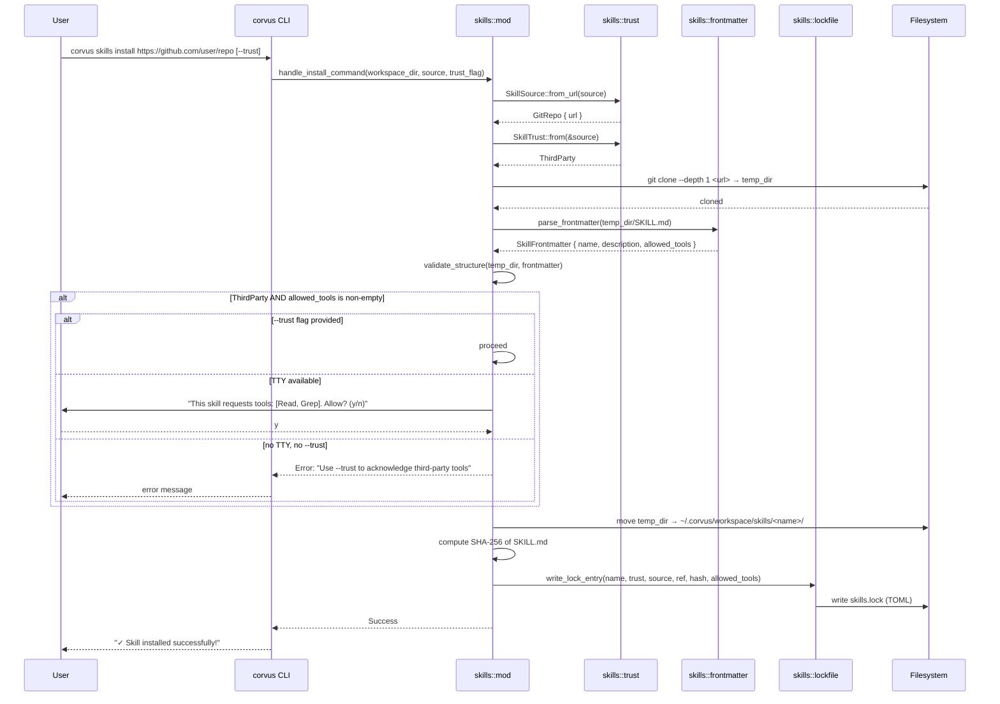

# Design: Trusted Skills Distribution — Phase 1

## Technical Approach

Introduce a trust model into the Corvus agent runtime's skills subsystem by adding trust
derivation, origin tracking, a TOML lockfile, trust-aware prompt rendering, `allowed-tools`
frontmatter parsing, and trust-gated install flow. All changes are confined to the
`clients/agent-runtime/` Rust crate, primarily in `src/skills/`, `src/agent/prompt.rs`,
`src/config/schema.rs`, and `src/lib.rs`.

The approach follows the proposal's phased plan: Phase 1 closes the immediate security gaps
(open-skills default off, trust tiers, lockfile, prompt differentiation) without requiring
external infrastructure. The implementation adds three new submodules under `src/skills/`
(`trust.rs`, `lockfile.rs`, `frontmatter.rs`) and modifies four existing files.

## Architecture Decisions

### AD1: Trust as Derived Property

**Choice**: `SkillTrust` is computed from `SkillSource` at load time via
`impl From<&SkillSource> for SkillTrust`. The `trust` field on `Skill` is populated during
`load_skills()` and never serialized independently.

**Alternatives considered**: (a) Store trust tier in lockfile and load it directly — rejected
because a lockfile edit could escalate a third-party skill to official. (b) User-annotated trust
per skill — rejected because it shifts security responsibility to the user and is error-prone.

**Rationale**: Deriving trust from origin is the only approach that prevents privilege escalation.
A git-cloned skill can never claim `Official` status regardless of lockfile state. The lockfile
records trust for display/audit purposes, but the runtime always re-derives it.

### AD2: Lockfile as Advisory

**Choice**: The lockfile (`~/.corvus/workspace/skills.lock`) is written on install/update but
treated as advisory at load time. Missing lockfile → skills default to `Local` trust. Corrupt
lockfile → log warning, continue loading with defaults.

**Alternatives considered**: (a) Strict lockfile — refuse to load skills without valid lock
entries — rejected because it breaks existing installs and adds friction for a single-user tool.
(b) No lockfile — derive everything from filesystem — rejected because we lose install metadata
(source URL, pinned ref, content hash, timestamp).

**Rationale**: Availability over strict consistency for a single-user CLI tool. The lockfile
enriches the loading path with metadata but never blocks it. This also provides a clean upgrade
path: existing users with pre-lockfile installs see their skills default to `Local` with no
breakage.

### AD3: Backward Compatibility

**Choice**: Existing skills on disk without lock entries are treated as `Local`. `SKILL.toml`
remains supported (not deprecated in Phase 1). Open-skills is available via explicit opt-in
(`skills.legacy_open_skills` config or `CORVUS_OPEN_SKILLS` env var).

**Alternatives considered**: (a) Hard removal of open-skills — rejected because it breaks
existing users without warning. (b) Deprecate SKILL.toml immediately — rejected because it adds
scope without security benefit.

**Rationale**: Phase 1 focuses on closing security gaps, not on format migration. SKILL.toml
deprecation is deferred to Phase 2 when the official skills catalog provides a migration target.

### AD4: Frontmatter Parsing with `serde_yaml` Avoidance

**Choice**: Parse YAML frontmatter from SKILL.md using a minimal hand-rolled parser that extracts
only the fields we need (`name`, `description`, `allowed-tools`). Do not add `serde_yaml` as a
dependency.

**Alternatives considered**: (a) Add `serde_yaml` crate — rejected because it pulls in
`unsafe-libyaml` or `yaml-rust2`, adding ~15 transitive deps for parsing a trivial frontmatter
block. (b) Use `toml` to parse frontmatter — rejected because SKILL.md frontmatter is YAML per
the Agent Skills standard.

**Rationale**: The frontmatter we need to parse is a flat key-value block with one list field.
A focused parser (~60 lines) avoids a heavy dependency while correctly handling the standard
format. If Phase 3 requires full YAML validation, `serde_yaml` can be added then.

## Data Flow

### `load_skills()` — Trust Population

```
load_skills(workspace_dir)
    │
    ├─ open_skills_enabled(config)?
    │   ├─ true → log deprecation warning
    │   │         load_open_skills(repo_dir)
    │   │           → each skill gets:
    │   │               source = GitRepo { url: OPEN_SKILLS_REPO_URL }
    │   │               trust  = ThirdParty  (derived from source)
    │   │               origin = { source, installed_at: None, pinned_ref: None, content_hash: None }
    │   └─ false → skip (default)
    │
    ├─ read_lockfile(workspace_dir)?
    │   ├─ Ok(lockfile) → HashMap<String, LockEntry>
    │   └─ Err(_) → log warning, use empty HashMap
    │
    └─ load_workspace_skills(workspace_dir, &lockfile)
        └─ for each skill directory:
            ├─ load SKILL.toml or SKILL.md
            ├─ parse frontmatter (if SKILL.md) → extract allowed_tools
            ├─ lookup lock entry by skill name
            │   ├─ found → populate origin from lock entry
            │   │          derive trust from origin.source
            │   └─ not found → source = Local, trust = Local
            └─ attach trust, origin, allowed_tools to Skill struct
```

### `skills install` — Trust Gating

```
skills install <source> [--trust]
    │
    ├─ parse source → determine SkillSource variant
    │   ├─ starts_with("https://") → GitRepo { url }
    │   └─ local path → Local or LinkedLocal { target }
    │
    ├─ derive SkillTrust from SkillSource
    │
    ├─ fetch/clone to temp location
    │
    ├─ validate structure
    │   ├─ SKILL.md exists?
    │   ├─ parse frontmatter → extract name, allowed_tools
    │   └─ name matches directory?
    │
    ├─ trust gate (ThirdParty + has allowed_tools?)
    │   ├─ --trust flag → proceed
    │   ├─ TTY available → interactive confirmation
    │   └─ neither → abort with instructions
    │
    ├─ move to ~/.corvus/workspace/skills/<name>/
    │
    ├─ compute SHA-256 of SKILL.md content
    │
    └─ write/update lock entry in skills.lock
```

### Prompt Rendering — Trust-Aware Output

```
render_skills_section(workspace_dir, skills)
    │
    ├─ sort skills: Official → Local → ThirdParty
    │
    ├─ has_third_party = skills.iter().any(|s| s.trust == ThirdParty)
    │   └─ true → prepend preamble note
    │
    └─ for each skill:
        ├─ <skill trust="{tier}">
        │   ├─ <name>, <description>, <location>
        │   └─ if ThirdParty → <note>caution text</note>
        └─ </skill>
```

## Sequence Diagram: Install Flow



## File Changes

| File | Action | Description |
|------|--------|-------------|
| `src/skills/trust.rs` | **Create** | `SkillTrust` enum, `SkillOrigin` struct, `SkillSource` enum, `impl From<&SkillSource> for SkillTrust` |
| `src/skills/lockfile.rs` | **Create** | `SkillsLockfile` struct, `LockEntry` struct, `read_lockfile()`, `write_lock_entry()`, `remove_lock_entry()` |
| `src/skills/frontmatter.rs` | **Create** | `SkillFrontmatter` struct, `parse_frontmatter()` for YAML frontmatter extraction from SKILL.md |
| `src/skills/mod.rs` | **Modify** | Add `trust`, `origin`, `allowed_tools` fields to `Skill`. Update `load_skills()` to populate trust/origin. Update `open_skills_enabled()` default. Update install flow with trust gating. Add config-based open-skills check. |
| `src/agent/prompt.rs` | **Modify** | Update `render_skills_section()` for trust-aware rendering: sort by tier, add `trust` attribute, add third-party caution note and preamble. |
| `src/config/schema.rs` | **Modify** | Add `SkillsConfig` struct with `legacy_open_skills: bool` field. Add `skills` field to top-level `Config`. |
| `src/config/mod.rs` | **Modify** | Re-export `SkillsConfig`. |
| `src/lib.rs` | **Modify** | Add `--trust` flag to `SkillCommands::Install`. |

## Interfaces / Contracts

### `src/skills/trust.rs`

```rust
use serde::{Deserialize, Serialize};
use std::path::PathBuf;

/// Trust tier for a skill, derived from its origin.
/// Never stored independently — always re-derived from SkillSource.
#[derive(Debug, Clone, Copy, PartialEq, Eq, PartialOrd, Ord, Serialize, Deserialize)]
pub enum SkillTrust {
    /// From official Corvus skills repo (Phase 2 — no skills qualify yet)
    Official,
    /// Created by user in workspace, or symlinked from local path
    Local,
    /// Installed from any external git source
    ThirdParty,
}

impl SkillTrust {
    /// Returns the string representation used in lockfile and prompt XML.
    pub fn as_str(&self) -> &'static str {
        match self {
            Self::Official => "official",
            Self::Local => "local",
            Self::ThirdParty => "third-party",
        }
    }
}

/// Where a skill was installed from.
#[derive(Debug, Clone, Serialize, Deserialize)]
pub enum SkillSource {
    /// From the official Corvus skills registry (Phase 2)
    Official { repo: String, path: String },
    /// User-created in local workspace
    Local,
    /// Symlinked from a local path
    LinkedLocal { target: PathBuf },
    /// Cloned from a git repository
    GitRepo { url: String },
    /// Discovered via SkillForge
    Discovered { source: String, repo: String },
}

/// Origin metadata for an installed skill.
#[derive(Debug, Clone, Serialize, Deserialize)]
pub struct SkillOrigin {
    pub source: SkillSource,
    pub installed_at: Option<String>,   // ISO 8601
    pub pinned_ref: Option<String>,     // git commit SHA
    pub content_hash: Option<String>,   // "sha256:<hex>"
}

impl Default for SkillOrigin {
    fn default() -> Self {
        Self {
            source: SkillSource::Local,
            installed_at: None,
            pinned_ref: None,
            content_hash: None,
        }
    }
}

/// Derive trust from source — the core security invariant.
impl From<&SkillSource> for SkillTrust {
    fn from(source: &SkillSource) -> Self {
        match source {
            SkillSource::Official { .. } => SkillTrust::Official,
            SkillSource::Local | SkillSource::LinkedLocal { .. } => SkillTrust::Local,
            SkillSource::GitRepo { .. } | SkillSource::Discovered { .. } => SkillTrust::ThirdParty,
        }
    }
}
```

### `src/skills/lockfile.rs`

```rust
use super::trust::{SkillOrigin, SkillSource, SkillTrust};
use anyhow::Result;
use serde::{Deserialize, Serialize};
use std::collections::BTreeMap;
use std::path::Path;

const LOCKFILE_NAME: &str = "skills.lock";

/// Top-level lockfile structure.
#[derive(Debug, Clone, Default, Serialize, Deserialize)]
pub struct SkillsLockfile {
    #[serde(default)]
    pub skills: BTreeMap<String, LockEntry>,
}

/// Per-skill lock entry.
#[derive(Debug, Clone, Serialize, Deserialize)]
pub struct LockEntry {
    pub trust: String,                       // "official", "local", "third-party"
    pub source: String,                      // URL or "local"
    #[serde(default)]
    pub path: Option<String>,                // sub-path within repo (official only)
    #[serde(default, rename = "ref")]
    pub pinned_ref: Option<String>,          // git commit SHA
    #[serde(default)]
    pub content_hash: Option<String>,        // "sha256:<hex>"
    #[serde(default)]
    pub installed_at: Option<String>,        // ISO 8601
    #[serde(default)]
    pub allowed_tools: Option<Vec<String>>,  // from frontmatter
}

/// Read the lockfile from the workspace directory.
/// Returns an empty lockfile on missing/corrupt file (advisory model).
pub fn read_lockfile(workspace_dir: &Path) -> SkillsLockfile {
    let path = workspace_dir.join(LOCKFILE_NAME);
    match std::fs::read_to_string(&path) {
        Ok(content) => match toml::from_str::<SkillsLockfile>(&content) {
            Ok(lockfile) => lockfile,
            Err(err) => {
                tracing::warn!("corrupt skills lockfile at {}: {err}", path.display());
                SkillsLockfile::default()
            }
        },
        Err(_) => SkillsLockfile::default(),
    }
}

/// Write or update a single lock entry. Reads existing lockfile, merges, writes back.
pub fn write_lock_entry(workspace_dir: &Path, name: &str, entry: LockEntry) -> Result<()> {
    let path = workspace_dir.join(LOCKFILE_NAME);
    let mut lockfile = read_lockfile(workspace_dir);
    lockfile.skills.insert(name.to_string(), entry);
    let content = toml::to_string_pretty(&lockfile)?;
    std::fs::write(&path, content)?;
    Ok(())
}

/// Remove a lock entry (on skill uninstall).
pub fn remove_lock_entry(workspace_dir: &Path, name: &str) -> Result<()> {
    let path = workspace_dir.join(LOCKFILE_NAME);
    let mut lockfile = read_lockfile(workspace_dir);
    lockfile.skills.remove(name);
    let content = toml::to_string_pretty(&lockfile)?;
    std::fs::write(&path, content)?;
    Ok(())
}

/// Build a LockEntry from install-time metadata.
pub fn build_lock_entry(
    trust: SkillTrust,
    source: &str,
    pinned_ref: Option<String>,
    content_hash: Option<String>,
    allowed_tools: Option<Vec<String>>,
) -> LockEntry {
    LockEntry {
        trust: trust.as_str().to_string(),
        source: source.to_string(),
        path: None,
        pinned_ref,
        content_hash,
        installed_at: Some(chrono::Utc::now().to_rfc3339()),
        allowed_tools,
    }
}

/// Convert a LockEntry back to a SkillOrigin for populating the Skill struct.
pub fn lock_entry_to_origin(entry: &LockEntry) -> SkillOrigin {
    let source = if entry.source == "local" {
        SkillSource::Local
    } else {
        SkillSource::GitRepo {
            url: entry.source.clone(),
        }
    };
    SkillOrigin {
        source,
        installed_at: entry.installed_at.clone(),
        pinned_ref: entry.pinned_ref.clone(),
        content_hash: entry.content_hash.clone(),
    }
}

/// Compute SHA-256 hash of file content, returning "sha256:<hex>".
pub fn compute_content_hash(path: &Path) -> Option<String> {
    use sha2::{Digest, Sha256};
    match std::fs::read(path) {
        Ok(bytes) => {
            let hash = Sha256::digest(&bytes);
            Some(format!("sha256:{}", hex::encode(hash)))
        }
        Err(err) => {
            tracing::warn!("failed to compute content hash for {}: {err}", path.display());
            None
        }
    }
}
```

### `src/skills/frontmatter.rs`

```rust
/// Minimal YAML frontmatter parser for SKILL.md files.
/// Extracts only the fields relevant to trust model: name, description, allowed-tools.
/// Does NOT add serde_yaml as a dependency — parses the simple flat structure directly.

/// Parsed frontmatter from a SKILL.md file.
#[derive(Debug, Clone, Default)]
pub struct SkillFrontmatter {
    pub name: Option<String>,
    pub description: Option<String>,
    pub allowed_tools: Vec<String>,
}

/// Parse YAML frontmatter from SKILL.md content.
/// Expects `---` delimiters. Returns default on parse failure (safe default).
pub fn parse_frontmatter(content: &str) -> SkillFrontmatter {
    let Some(fm_block) = extract_frontmatter_block(content) else {
        return SkillFrontmatter::default();
    };
    parse_frontmatter_block(fm_block)
}

/// Extract the raw frontmatter text between `---` delimiters.
fn extract_frontmatter_block(content: &str) -> Option<&str> {
    let trimmed = content.trim_start();
    let rest = trimmed.strip_prefix("---")?;
    let end = rest.find("\n---")?;
    Some(&rest[..end])
}

/// Parse key-value pairs and list items from the frontmatter block.
fn parse_frontmatter_block(block: &str) -> SkillFrontmatter {
    let mut fm = SkillFrontmatter::default();
    let mut in_allowed_tools = false;

    for line in block.lines() {
        let trimmed = line.trim();

        // List item under allowed-tools
        if in_allowed_tools {
            if let Some(item) = trimmed.strip_prefix("- ") {
                fm.allowed_tools.push(item.trim().trim_matches('"').trim_matches('\'').to_string());
                continue;
            }
            // No longer a list item — fall through to key-value parsing
            in_allowed_tools = false;
        }

        // Key-value pair
        if let Some((key, value)) = trimmed.split_once(':') {
            let key = key.trim();
            let value = value.trim().trim_matches('"').trim_matches('\'');
            match key {
                "name" => fm.name = Some(value.to_string()),
                "description" => fm.description = Some(value.to_string()),
                "allowed-tools" => {
                    if value.is_empty() {
                        in_allowed_tools = true;
                    }
                    // Inline list format not supported — use block list
                }
                _ => {}
            }
        }
    }

    fm
}
```

### `src/skills/mod.rs` — Modified `Skill` Struct

```rust
// New fields added to the existing Skill struct:

#[derive(Debug, Clone, Serialize, Deserialize)]
pub struct Skill {
    pub name: String,
    pub description: String,
    pub version: String,
    #[serde(default)]
    pub author: Option<String>,
    #[serde(default)]
    pub tags: Vec<String>,
    #[serde(default)]
    pub tools: Vec<SkillTool>,
    #[serde(default)]
    pub prompts: Vec<String>,
    #[serde(skip)]
    pub location: Option<PathBuf>,
    // ── New fields (Phase 1) ──
    #[serde(skip)]
    pub trust: SkillTrust,
    #[serde(skip)]
    pub origin: SkillOrigin,
    #[serde(skip)]
    pub allowed_tools: Vec<String>,
}
```

### `src/config/schema.rs` — New `SkillsConfig`

```rust
#[derive(Debug, Clone, Serialize, Deserialize)]
pub struct SkillsConfig {
    /// Opt-in to legacy open-skills auto-loading (default: false).
    /// Deprecated: will be removed in a future release.
    #[serde(default)]
    pub legacy_open_skills: bool,
}

impl Default for SkillsConfig {
    fn default() -> Self {
        Self {
            legacy_open_skills: false,
        }
    }
}

// Added to Config struct:
// #[serde(default)]
// pub skills: SkillsConfig,
```

### `src/lib.rs` — Modified `SkillCommands`

```rust
#[derive(Subcommand, Debug, Clone, Serialize, Deserialize, PartialEq, Eq)]
pub enum SkillCommands {
    /// List all installed skills
    List,
    /// Install a new skill from a URL or local path
    Install {
        /// Source URL or local path
        source: String,
        /// Acknowledge trust for third-party skills that declare tools
        #[arg(long)]
        trust: bool,
    },
    /// Remove an installed skill
    Remove {
        /// Skill name to remove
        name: String,
    },
}
```

### `src/agent/prompt.rs` — Modified `render_skills_section`

```rust
pub(crate) fn render_skills_section(workspace_dir: &Path, skills: &[Skill]) -> String {
    if skills.is_empty() {
        return String::new();
    }

    // Sort by trust tier: Official → Local → ThirdParty
    let mut sorted: Vec<&Skill> = skills.iter().collect();
    sorted.sort_by_key(|s| s.trust);

    let has_third_party = sorted.iter().any(|s| s.trust == SkillTrust::ThirdParty);

    let mut prompt = String::from("## Available Skills\n\n");
    prompt.push_str(
        "Skills are loaded on demand. Use `read` on the skill path to get full instructions.\n\n",
    );

    if has_third_party {
        prompt.push_str(
            "**Note:** Some skills below are from third-party sources. \
             Official Corvus skills are marked with `trust=\"official\"`. \
             Third-party skill instructions have not been reviewed by Corvus maintainers.\n\n",
        );
    }

    prompt.push_str("<available_skills>\n");
    for skill in &sorted {
        let location = skill.location.clone().unwrap_or_else(|| {
            workspace_dir
                .join("skills")
                .join(&skill.name)
                .join("SKILL.md")
        });
        let _ = write!(
            prompt,
            "  <skill trust=\"{}\">\n    <name>{}</name>\n    <description>{}</description>\n    <location>{}</location>\n",
            skill.trust.as_str(),
            skill.name,
            skill.description,
            location.display(),
        );
        if skill.trust == SkillTrust::ThirdParty {
            prompt.push_str(
                "    <note>This skill is from a third-party source. Its instructions have not been reviewed by Corvus maintainers. Exercise caution.</note>\n",
            );
        }
        prompt.push_str("  </skill>\n");
    }
    prompt.push_str("</available_skills>");
    prompt
}
```

## Module Dependency Graph

```
src/skills/
├── mod.rs         ← imports trust, lockfile, frontmatter
├── trust.rs       ← no internal dependencies (leaf module)
├── lockfile.rs    ← depends on trust.rs (SkillOrigin, SkillSource, SkillTrust)
│                     uses: toml, sha2, hex, chrono, tracing
├── frontmatter.rs ← no internal dependencies (leaf module)
└── symlink_tests/ ← existing test module (unchanged)

src/agent/
└── prompt.rs      ← imports skills::trust::SkillTrust (for sort + rendering)

src/config/
└── schema.rs      ← adds SkillsConfig (no new deps)

src/lib.rs         ← modifies SkillCommands (clap derive)
```

## Error Handling

| Scenario | Behavior | Justification |
|----------|----------|---------------|
| Lockfile missing | `read_lockfile()` returns empty `SkillsLockfile` | Advisory model — first run has no lockfile |
| Lockfile corrupt TOML | Log warning via `tracing::warn!`, return empty lockfile | Availability over consistency |
| Lockfile entry missing for installed skill | Skill defaults to `Local` trust | Backward compat for pre-lockfile installs |
| Frontmatter parse failure (no `---` delimiters, malformed YAML) | `parse_frontmatter()` returns `SkillFrontmatter::default()` (empty) | Safe default — skill becomes instruction-only if ThirdParty |
| Content hash computation failure (file read error) | `compute_content_hash()` returns `None`, stored as `None` in lock entry | Non-blocking — hash is for integrity audit, not load-time gating |
| Trust gate denial (ThirdParty + tools, no `--trust`, no TTY) | Return `anyhow::bail!()` with clear message explaining `--trust` flag | User must explicitly opt in to third-party tools |
| SKILL.md missing during install validation | `anyhow::bail!("Skill directory must contain SKILL.md")` | Minimum structure requirement |
| Git clone failure during install | Existing behavior preserved — `anyhow::bail!` with stderr | No change from current error path |

## Testing Strategy

| Layer | What to Test | Approach |
|-------|-------------|----------|
| Unit | `SkillTrust` derivation from each `SkillSource` variant | `src/skills/trust.rs` — test `From<&SkillSource>` for all 5 variants |
| Unit | `SkillTrust` ordering (`Official < Local < ThirdParty`) | `src/skills/trust.rs` — test `Ord` impl for sort correctness |
| Unit | Lockfile serialization round-trip | `src/skills/lockfile.rs` — serialize `SkillsLockfile`, deserialize, assert equality |
| Unit | Lockfile read from missing file | `src/skills/lockfile.rs` — verify returns empty default |
| Unit | Lockfile read from corrupt file | `src/skills/lockfile.rs` — write garbage, verify returns empty default (no panic) |
| Unit | `write_lock_entry` creates and updates entries | `src/skills/lockfile.rs` — write two entries, read back, verify both present |
| Unit | `remove_lock_entry` removes correct entry | `src/skills/lockfile.rs` — write two, remove one, verify other remains |
| Unit | Frontmatter parse: valid with all fields | `src/skills/frontmatter.rs` — full frontmatter block with name, description, allowed-tools list |
| Unit | Frontmatter parse: valid without allowed-tools | `src/skills/frontmatter.rs` — verify `allowed_tools` is empty vec |
| Unit | Frontmatter parse: no frontmatter delimiters | `src/skills/frontmatter.rs` — plain markdown, verify returns default |
| Unit | Frontmatter parse: malformed YAML | `src/skills/frontmatter.rs` — broken content, verify returns default (no panic) |
| Unit | Content hash computation | `src/skills/lockfile.rs` — write known content, verify SHA-256 matches expected |
| Unit | `open_skills_enabled()` respects config and env | `src/skills/mod.rs` — test priority order: config > env > default(false) |
| Unit | Prompt rendering with mixed trust tiers | `src/agent/prompt.rs` — create skills with all 3 trust tiers, verify sort order, trust attributes, third-party note, preamble |
| Unit | Prompt rendering with no third-party skills | `src/agent/prompt.rs` — verify no preamble note when all skills are Official/Local |
| Unit | `Skill` struct with new fields initializes correctly | `src/skills/mod.rs` — verify trust defaults to `Local`, origin defaults to local source |
| Integration | Install flow with trust gating | `src/skills/mod.rs` — simulate install of a third-party skill with `allowed-tools`, verify: lock entry written, trust gate triggers without `--trust`, proceeds with `--trust` |
| Integration | `load_skills()` populates trust from lockfile | `src/skills/mod.rs` — write lockfile with entries, load skills, verify trust/origin populated |
| Regression | All existing tests pass unchanged | `cargo test` — existing 15+ tests in `skills/mod.rs` and `agent/prompt.rs` must pass. New `trust`/`origin`/`allowed_tools` fields use `#[serde(skip)]` and `Default`, so existing deserialization is unaffected. |

### Test File Organization

```
src/skills/
├── trust.rs          → #[cfg(test)] mod tests { ... }  (8-10 tests)
├── lockfile.rs       → #[cfg(test)] mod tests { ... }  (7-8 tests)
├── frontmatter.rs    → #[cfg(test)] mod tests { ... }  (5-6 tests)
└── mod.rs            → existing tests + 3-4 new integration tests
src/agent/
└── prompt.rs         → existing tests + 2-3 new trust-rendering tests
```

## Migration / Rollout

### Upgrade Path (Existing Users)

1. **No lockfile exists** → `read_lockfile()` returns empty. All workspace skills load as `Local`.
   No behavior change except open-skills now defaults to off.
2. **Open-skills users** → `CORVUS_OPEN_SKILLS=true` or `skills.legacy_open_skills = true` in
   config.toml restores previous behavior with deprecation warning.
3. **Existing `skills install` installs** → Skills on disk without lock entries treated as `Local`.
   Next `skills install` or `skills update` (Phase 2) will create lock entries.

### Rollback

1. Revert `open_skills_enabled()` to return `true` by default.
2. Revert `render_skills_section` to flat rendering (remove trust attributes).
3. `SkillTrust`, `SkillOrigin`, lockfile code remains inert — `#[serde(skip)]` fields add no
   overhead if not consumed.

No data migration required. Lockfile is created on first `skills install` after upgrade.

## Open Questions

- [x] Phase 1 scope confirmed in proposal: trust enum + open-skills deprecation + lockfile +
  prompt changes + allowed-tools + install gating.
- [ ] Should `skills list` display trust tier in its output? (Recommendation: yes, add a
  `[local]`/`[third-party]` badge next to each skill name — low effort, high visibility.)
- [ ] Should `skills remove` also clean the lock entry? (Recommendation: yes, call
  `remove_lock_entry()` in `handle_remove_command()`.)
