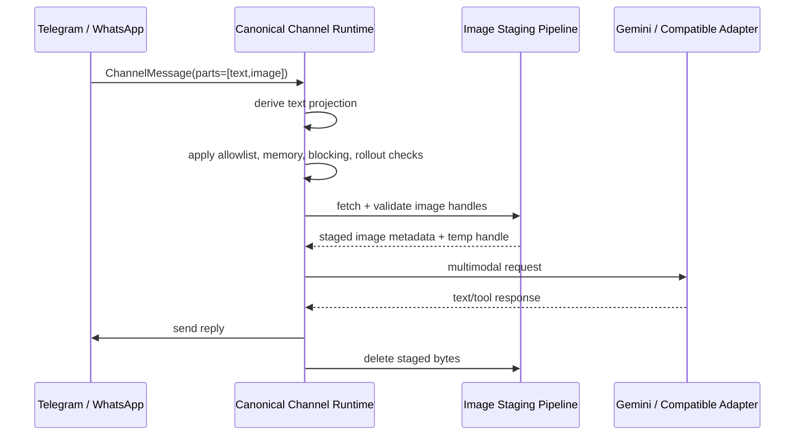
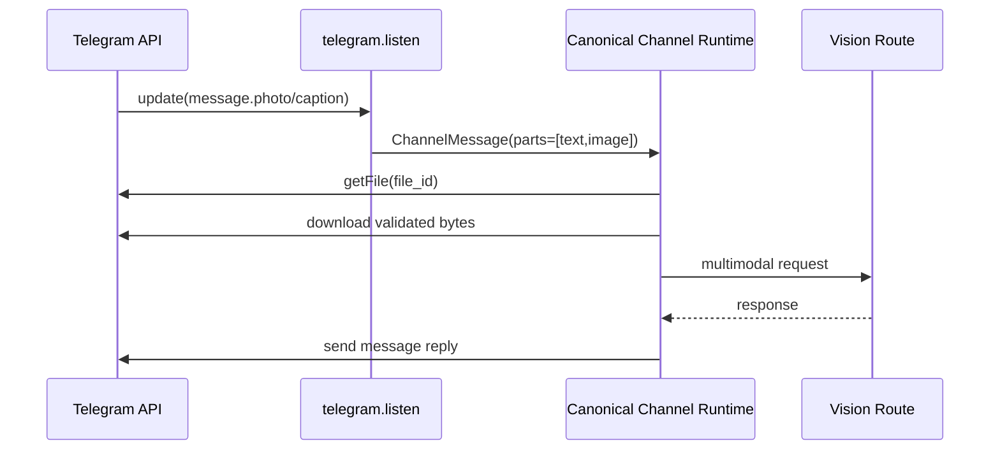
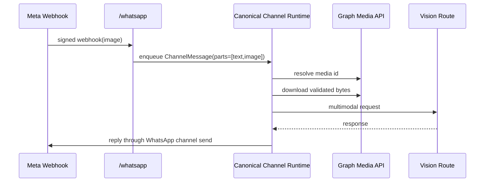

# Design: Multimodal Image Input MVP

## Technical Approach

Corvus will add a minimal multimodal seam that keeps the current channel and provider architecture
intact while admitting inbound `text` + `image` turns for `Telegram` and `WhatsApp` only. The MVP
extends the canonical channel message contract with explicit content parts, stages inbound images
through a Corvus-managed validation pipeline, and hands validated image payloads to a provider
contract that is capability-gated per selected model route.

The design intentionally avoids a broad attachment framework. It introduces only the structures and
runtime behavior needed for a safe, production-credible image-input slice:

- canonical inbound content parts: `text` and `image`
- canonical staged image payloads for the active turn only
- explicit provider capability signaling for image input and accepted transport forms
- shared runtime handling so WhatsApp image turns no longer bypass the canonical channel loop
- default-deny rollout controls so image ingress is opt-in per deployment

This maps to the proposal by keeping scope limited to Telegram, WhatsApp, OpenAI-compatible
providers, and Gemini, while preserving the canonical runtime seam for memory enrichment, blocking,
tool execution, and response handling.

## Architecture Overview

The MVP adds one new internal path between channel parsing and provider formatting:

1. Channel ingress produces a `ChannelMessage` with canonical content parts.
2. The canonical channel runtime derives a text projection for existing memory/blocking behavior.
3. If the turn contains image parts, the runtime stages each image through a channel-specific
   fetch-and-validate pipeline.
4. The runtime selects a provider/model route that is explicitly marked as image-capable.
5. The provider adapter converts staged images into provider-native request blocks.
6. Staged bytes are deleted immediately after the provider call finishes or aborts.



## Architecture Decisions

### Decision: Keep `content` as a derived compatibility field

**Choice**: `ChannelMessage` and provider-facing chat messages gain canonical part arrays, while the
existing plain-text `content` field stays as a derived text projection for backward-compatible
runtime paths.

**Alternatives considered**:

- Replace all text fields with part arrays immediately.
- Keep the runtime fully text-only and tunnel images through sidecar summaries.

**Rationale**: A full replacement would widen the change far beyond the MVP and create unnecessary
churn across channels, memory, tests, and gateway code. Keeping `content` as a derived projection
lets existing text-first behaviors continue to work while the new part array becomes the canonical
source of truth for image turns.

### Decision: Use Corvus-managed staging, not provider-side URL fetch

**Choice**: The runtime fetches inbound media itself, validates it, and passes only validated inline
payloads to providers.

**Alternatives considered**:

- Hand raw channel URLs to providers.
- Persist inbound images directly in memory or on disk for later reuse.

**Rationale**: Provider-side fetch weakens security and makes behavior nondeterministic across
providers. Corvus-managed staging keeps webhook verification, allowlists, size limits, MIME checks,
and redaction under one trusted boundary. It also avoids storing user images beyond the active turn.

### Decision: Make image routing explicit through a dedicated vision model hint

**Choice**: Image turns use a rollout-controlled `vision_model_hint` that resolves through existing
`hint:<name>` routing. The selected route must be explicitly marked as image-capable.

**Alternatives considered**:

- Assume the default provider/model can accept images.
- Infer vision support from provider name or model string heuristics.

**Rationale**: OpenAI-compatible backends vary too much for implicit detection to be safe. Reusing
the existing route mechanism keeps the MVP configurable and conservative: operators opt into a known
vision route, and text turns keep their current routing behavior.

### Decision: Converge WhatsApp onto the canonical runtime seam now

**Choice**: Gateway `/whatsapp` remains a transport/authentication boundary only. After validation,
it forwards parsed messages into the same canonical channel runtime loop used by other channels.

**Alternatives considered**:

- Keep a WhatsApp-specific `simple_chat()` multimodal adapter in the gateway.
- Delay WhatsApp until a later change.

**Rationale**: The current gateway-only path would duplicate image validation, provider gating,
memory behavior, blocking, and telemetry. Converging now contains the exception rather than
expanding it.

### Decision: Keep image context single-turn for the MVP

**Choice**: Staged image bytes exist only for the active turn. Conversation history and long-term
memory retain only the text projection, not raw image data or reusable image handles.

**Alternatives considered**:

- Persist staged image handles in channel history for follow-up turns.
- Generate and store text summaries of every admitted image.

**Rationale**: Reusing prior images would require retention, cleanup, privacy policy, and history
semantics that materially expand scope. The MVP optimizes for safe single-turn image reasoning.

## Canonical Inbound Image Model

### Channel message contract

`ChannelMessage` becomes the canonical inbound envelope for multimodal turns with these semantics:

| Field                                                  | Semantics                                                                    |
|--------------------------------------------------------|------------------------------------------------------------------------------|
| `id`, `sender`, `reply_target`, `channel`, `timestamp` | Unchanged identity and reply routing                                         |
| `content`                                              | Derived plain-text projection used by existing memory/blocking/logging paths |
| `parts`                                                | Canonical ordered content parts for the inbound turn                         |

### Content parts

Only two part kinds are valid in this change:

| Part kind | Required fields                                                                                    | Notes                                              |
|-----------|----------------------------------------------------------------------------------------------------|----------------------------------------------------|
| `text`    | `text`                                                                                             | Used for message body text and captions            |
| `image`   | `channel_handle`, `source_channel`, `declared_mime`, `caption_text`, `file_name`, `declared_bytes` | Represents an image reference before fetch/staging |

### Text projection rules

To remove ambiguity, `content` is defined as:

1. all `text` parts joined in order with two newlines between non-empty blocks
2. `caption_text` for an `image` part is emitted as a `text` part, not duplicated separately
3. no synthetic placeholders like `[image]` are inserted into `content`

This means a captioned image produces a meaningful text projection for memory recall and blocking,
while an image-only turn produces an empty text projection.

### Image staging model

After validation, each admitted image produces a runtime-only staged image record:

| Field            | Semantics                                                  |
|------------------|------------------------------------------------------------|
| `sha256`         | Deterministic content fingerprint for dedupe and telemetry |
| `mime_type`      | Final MIME after sniff/validation                          |
| `byte_len`       | Final admitted size                                        |
| `temp_path`      | Ephemeral runtime path used only during the active turn    |
| `transport_form` | Canonical staging form handed to adapters (`inline_bytes`) |
| `channel_origin` | Minimal source reference for logs and audit correlation    |

Staged images are not serialized into conversation history, memory, or observer payloads.

## Channel Ingest and Staging Strategy

### Shared rules

- Only `Telegram` and `WhatsApp` may emit image parts in this MVP.
- Only one semantic image is admitted per inbound turn.
- If a turn contains an image and the image cannot be admitted, the entire turn is rejected; the
  runtime does not silently continue with a text-only subset.
- Transport validation and sender allowlist checks happen before any media fetch.

### Telegram ingest

Telegram parsing changes from `message.text` only to:

- `message.text` -> `text` part
- `message.photo` -> one `image` part using the largest available photo variant
- `message.document` -> `image` part only when the declared MIME and filename identify it as an
  image; non-image documents remain out of scope
- `message.caption` -> `text` part ordered before the image part's provider projection

Telegram staging flow:

1. parse update and allowlist sender
2. collect canonical parts
3. if an image exists, call Telegram `getFile` for the selected file id
4. download bytes from Telegram using Corvus-managed HTTP
5. validate and stage bytes locally

### WhatsApp ingest

WhatsApp parsing changes from text-only to:

- `type=text` -> `text` part
- `type=image` -> one `image` part using the Graph media id and optional caption
- all other message types remain ignored or rejected as unsupported in this MVP

WhatsApp staging flow:

1. verify `X-Hub-Signature-256`
2. parse payload and apply allowed-number check
3. collect canonical parts
4. if an image exists, resolve the media id to a signed Graph download URL
5. download bytes with the WhatsApp access token
6. validate and stage bytes locally

### Shared runtime handoff

To eliminate the current WhatsApp exception, the design introduces a reusable channel runtime handle
that owns the canonical message queue and processing loop. `start_channels(...)` will bootstrap it
for polling/listener channels, and `run_gateway(...)` will bootstrap the same runtime handle for
gateway-owned ingress such as `/whatsapp`.

```mermaid
sequenceDiagram
  participant Meta as Meta Webhook
  participant Gateway as /whatsapp
  participant Ingress as Channel Runtime Handle
  participant Loop as process_channel_message

  Meta->>Gateway: verified webhook payload
  Gateway->>Gateway: parse WhatsApp ChannelMessage(parts)
  Gateway->>Ingress: enqueue canonical message
  Ingress->>Loop: process through shared runtime path
  Loop-->>Gateway: none (reply sent by channel object)
```

## Validation Pipeline

The validation pipeline is shared across Telegram and WhatsApp image turns.

### Validation order

1. transport authentication and webhook verification
2. sender allowlist / channel authorization
3. rollout enablement for the channel
4. canonical parse into `text` and `image` parts
5. text-based blocking and approval checks using the derived `content`
6. channel-specific fetch of image bytes
7. byte limit enforcement during streaming download
8. MIME allowlist check using declared type plus magic-byte sniffing
9. staging to temp storage with `sha256` computation
10. provider capability gating for the selected model route
11. adapter formatting and provider call

### MVP admission rules

| Rule                                | Decision                                                           |
|-------------------------------------|--------------------------------------------------------------------|
| Allowed MIME types                  | `image/jpeg`, `image/png`, `image/webp`                            |
| Rejected MIME types                 | all others, including document, audio, video, and animated formats |
| Max admitted images per turn        | 1                                                                  |
| Max admitted bytes per image        | 10 MiB                                                             |
| Download policy                     | streamed with bounded timeouts; abort on ceiling exceed            |
| Text-only fallback on image failure | not allowed                                                        |

The runtime must treat declared MIME as advisory only. Final admission depends on sniffed content
and
successful staging.

## Provider Capability Gating

### Capability model

`ProviderCapabilities` is extended so the runtime can make an explicit admission decision before
calling a provider. The capability contract must cover:

| Capability              | Meaning                                                   |
|-------------------------|-----------------------------------------------------------|
| `native_tool_calling`   | Existing meaning, unchanged                               |
| `image_input`           | Whether the provider/model can accept image parts         |
| `image_transport_forms` | Which canonical image transport forms the adapter accepts |

For this MVP, only one canonical transport form is used downstream: `inline_bytes`. Adapters may
internally convert that to provider-native base64/data-url structures.

### Route-level gating

Image support is not inferred from provider identity alone. The selected model route must opt in.

The design adds rollout metadata to the existing model route configuration:

| Route field          | Purpose                                |
|----------------------|----------------------------------------|
| `hint`               | Existing route selector                |
| `provider` / `model` | Existing provider target               |
| `allow_image_input`  | Explicit opt-in for multimodal routing |

The runtime also adds a global multimodal config block:

| Config field        | Purpose                                                        |
|---------------------|----------------------------------------------------------------|
| `enabled`           | Global kill switch for image ingress                           |
| `allowed_channels`  | Channel allowlist; MVP-valid values are `telegram`, `whatsapp` |
| `vision_model_hint` | Existing route hint used only for image turns                  |
| `max_image_bytes`   | Operator override for the default limit                        |

### Gating behavior

- If `multimodal.enabled` is false, channels reject image turns before fetch.
- If the channel is not in `allowed_channels`, the turn is rejected.
- If `vision_model_hint` is missing, the turn is rejected.
- If the resolved route is not marked `allow_image_input`, the turn is rejected.
- If the provider adapter does not advertise `image_input` for the resolved route, the turn is
  rejected.

No automatic provider downgrade or heuristic reroute occurs in the MVP.

## Provider Adapter Responsibilities

### Shared provider contract

Provider-side work is split into two responsibilities:

1. advertise image capability for the selected model route
2. translate the canonical runtime message parts into provider-native request bodies

The runtime remains responsible for fetching, validation, staging, and transport redaction.

### OpenAI-compatible adapter

The OpenAI-compatible adapter accepts staged `inline_bytes` and converts them to Chat Completions
content blocks using text blocks plus image blocks backed by data URLs. For image turns:

- do not use the legacy string-only `messages[].content` shape
- do not use the Responses API fallback path
- reject image turns when the endpoint only supports the current text-only fallback mode

This keeps image input deterministic across compatible backends and avoids remote media fetch by the
provider.

### Gemini adapter

The Gemini adapter accepts staged `inline_bytes` and converts them to Gemini `parts[]` with text
parts plus `inline_data` parts. The adapter must preserve the current auth split:

- API key users stay on the public endpoint
- OAuth users stay on the internal cloudcode endpoint

The same staged image payload is used for both auth modes.

### Router, pool, and reliability wrappers

These wrappers must propagate image capability correctly:

- `RouterProvider` resolves the image route hint and returns route-aware capabilities
- `AccountPoolProvider` delegates capability checks to the selected account provider
- `ReliableProvider` preserves capability information across retries/fallbacks and must not silently
  retry an image turn onto a text-only fallback model

## Fallback and Error Behavior

### User-visible behavior

The runtime returns explicit, channel-safe failure messages for image turns in these cases:

- image ingress disabled
- unsupported channel or route
- fetch/validation failure
- unsupported MIME or oversize payload
- provider route lacks image capability
- provider call fails after staging

### Non-goals for fallback

The MVP will not:

- summarize images through OCR/caption tooling and continue as text-only
- route the same image turn to a different provider automatically unless the same resolved route is
  already configured for image input
- persist images for retry after process restart

### Error handling rules

- rejected turns must emit structured telemetry with a normalized reason code
- user-facing errors must not include raw URLs, hashes beyond a short prefix, or provider payloads
- staged files must be deleted on success, rejection, timeout, and provider error paths

## Retention and Redaction Rules

### Retention

- Raw image bytes are active-turn only.
- Temp files are deleted immediately after the turn completes.
- Startup cleanup removes abandoned staged image files older than the configured staging TTL.
- Conversation history retains only text projection fields.
- Long-term memory stores only text projection when auto-save is enabled.

### Redaction

- Logs must never include channel download URLs, access tokens, data URLs, or base64 payloads.
- Observer payloads must include only channel, provider, model, MIME, byte size, and normalized
  reason/outcome fields.
- Provider error strings must be sanitized before emission, including any accidental echo of request
  bodies.

### Privacy boundary

The MVP explicitly does not add raw inbound user images to memory, search, or durable audit content.

## Telemetry

The existing observer framework is extended with image-specific observability so rollout can be
measured without exposing sensitive payloads.

### New event family

Add one observer event for image ingress lifecycle with fields:

| Field         | Description                                                                                  |
|---------------|----------------------------------------------------------------------------------------------|
| `channel`     | `telegram` or `whatsapp`                                                                     |
| `provider`    | resolved provider label                                                                      |
| `model`       | resolved model label                                                                         |
| `outcome`     | `admitted`, `rejected`, `provider_sent`, `provider_error`                                    |
| `reason`      | normalized reason code such as `disabled`, `mime_rejected`, `oversize`, `capability_missing` |
| `image_count` | admitted image count                                                                         |
| `mime_type`   | final sniffed MIME for admitted images                                                       |
| `byte_len`    | admitted byte size                                                                           |

### Metrics

Add counters or equivalent aggregations for:

- inbound image turns by channel and outcome
- rejected image turns by reason
- provider image turns by provider/model
- staging latency and total request latency for admitted image turns
- admitted byte volume buckets

### Logging

Tracing spans for image turns should include:

- `turn_has_image=true`
- `channel`
- `provider`
- `model`
- `image_count`
- `outcome`
- `reason`

No span may include image bytes, captions beyond the normal text projection path, or channel media
URLs.

## Data Flow

### Telegram image turn



### WhatsApp image turn



## File Changes

| File                                                | Action | Description                                                                                                              |
|-----------------------------------------------------|--------|--------------------------------------------------------------------------------------------------------------------------|
| `clients/agent-runtime/src/channels/traits.rs`      | Modify | Add canonical inbound content parts and image-reference metadata to `ChannelMessage`                                     |
| `clients/agent-runtime/src/channels/mod.rs`         | Modify | Build shared runtime handle, stage/validate images, gate provider routing, and preserve text-only compatibility behavior |
| `clients/agent-runtime/src/channels/media.rs`       | Create | Shared staging types, validation helpers, temp-file lifecycle, and normalized rejection reasons                          |
| `clients/agent-runtime/src/channels/telegram.rs`    | Modify | Parse inbound photo/image-document messages and implement Telegram media fetch helpers                                   |
| `clients/agent-runtime/src/channels/whatsapp.rs`    | Modify | Parse inbound image messages and implement Graph media fetch helpers                                                     |
| `clients/agent-runtime/src/gateway/mod.rs`          | Modify | Replace WhatsApp `simple_chat()` execution with canonical runtime handoff while keeping transport verification in place  |
| `clients/agent-runtime/src/providers/traits.rs`     | Modify | Add image-capability metadata and multimodal message-part contract                                                       |
| `clients/agent-runtime/src/providers/router.rs`     | Modify | Resolve route-aware image capability and prevent text-only fallback for image turns                                      |
| `clients/agent-runtime/src/providers/pool.rs`       | Modify | Delegate image capability through account selection                                                                      |
| `clients/agent-runtime/src/providers/reliable.rs`   | Modify | Keep retries/fallbacks compatible with image-capable route selection                                                     |
| `clients/agent-runtime/src/providers/compatible.rs` | Modify | Format OpenAI-compatible text+image requests with inline data URLs                                                       |
| `clients/agent-runtime/src/providers/gemini.rs`     | Modify | Format Gemini text+image requests with inline image parts                                                                |
| `clients/agent-runtime/src/config/schema.rs`        | Modify | Add rollout controls and route-level image capability flags                                                              |
| `clients/agent-runtime/src/observability/traits.rs` | Modify | Add image-ingress observer event(s) and related metrics                                                                  |
| `openspec/specs/agent-loop/spec.md`                 | Modify | Add WhatsApp canonical runtime requirement for image turns                                                               |
| `openspec/specs/agent-runtime-providers/spec.md`    | Modify | Define provider image capability signaling and transport-form requirements                                               |

## Interfaces / Contracts

### Canonical channel contract

The runtime contract must distinguish three layers clearly:

| Layer                    | Stored in `ChannelMessage` | Persisted past the active turn          |
|--------------------------|----------------------------|-----------------------------------------|
| Text projection          | Yes                        | Yes, under current history/memory rules |
| Image reference metadata | Yes                        | No durable persistence                  |
| Staged image bytes       | No, runtime-only           | No                                      |

### Provider contract

The provider contract must distinguish provider capability from provider transport formatting:

| Concern                                               | Owner                                 |
|-------------------------------------------------------|---------------------------------------|
| Is image input allowed for this route/model?          | Router + provider capability contract |
| How are images fetched and validated?                 | Channel runtime                       |
| How are staged images serialized to the upstream API? | Provider adapter                      |

### Rejection reason taxonomy

To keep rollout and tests unambiguous, the runtime should use a closed set of normalized reason
codes:

- `disabled`
- `channel_not_allowed`
- `missing_vision_route`
- `route_not_image_capable`
- `fetch_failed`
- `mime_rejected`
- `oversize`
- `too_many_images`
- `provider_error`

## Testing Strategy

| Layer       | What to Test                                                                                            | Approach                                                        |
|-------------|---------------------------------------------------------------------------------------------------------|-----------------------------------------------------------------|
| Unit        | Canonical text projection, MIME admission, byte-limit enforcement, staging cleanup, reason-code mapping | Rust unit tests in channel media/runtime modules                |
| Unit        | Telegram photo/document normalization and WhatsApp image payload parsing                                | Channel-specific parser tests with fixture payloads             |
| Unit        | Route-aware provider capability gating and no-fallback behavior for image turns                         | Provider/router tests                                           |
| Unit        | Compatible and Gemini request serialization for text+image turns                                        | Provider request-shape tests with mocked HTTP bodies            |
| Integration | WhatsApp webhook verification plus canonical runtime enqueue path                                       | Gateway tests using signed payload fixtures                     |
| Integration | End-to-end admitted image turn sends one provider request and one channel reply                         | Runtime tests with fake channel + fake provider                 |
| Integration | Rejected image turn never reaches provider and emits normalized telemetry                               | Observer-backed tests                                           |
| Regression  | Text-only Telegram, WhatsApp, `/webhook`, and non-MVP providers preserve current behavior               | Existing channel/provider test suites plus targeted regressions |

## Migration / Rollout

No data migration is required.

### Phased rollout

1. **Phase 0 - dark launch infrastructure**
    - ship contract, staging, telemetry, and provider capability plumbing behind
      `multimodal.enabled = false`
    - no channel emits image parts in production
2. **Phase 1 - provider validation**
    - enable `vision_model_hint` and route-level `allow_image_input` in test environments
    - validate Gemini and OpenAI-compatible adapters with fixture traffic
3. **Phase 2 - Telegram first**
    - enable `telegram` in `allowed_channels`
    - monitor admitted/rejected/provider-error telemetry
4. **Phase 3 - WhatsApp convergence**
    - enable `/whatsapp` canonical runtime handoff with the same image route
    - compare rollout metrics between Telegram and WhatsApp
5. **Phase 4 - broader operator enablement**
    - document supported route configuration and keep non-MVP channels/providers disabled by default

### Rollback

Operators can roll back without code changes by:

- setting `multimodal.enabled = false`
- removing `telegram` or `whatsapp` from `allowed_channels`
- removing or disabling the `vision_model_hint` route

Text-only channel behavior remains intact after rollback.

## Implementation Sequencing

### Phase A - runtime and config foundation

1. Add rollout config, canonical part types, staging types, and normalized rejection reasons.
2. Refactor the canonical channel runtime into a reusable runtime handle that both channel server
   and
   gateway can use.
3. Add image-ingress telemetry and redaction safeguards.

### Phase B - provider capability and adapter work

1. Extend provider traits with image capability signaling and route-aware capability lookup.
2. Update router/pool/reliable wrappers so image turns cannot fall through to text-only backends.
3. Implement Gemini multimodal request formatting.
4. Implement OpenAI-compatible multimodal request formatting.

### Phase C - channel ingest

1. Add Telegram inbound image parsing and media fetch support.
2. Add WhatsApp inbound image parsing and Graph media fetch support.
3. Wire both channels into the shared staging pipeline.

### Phase D - gateway convergence and rollout validation

1. Change `/whatsapp` from gateway-local `simple_chat()` handling to canonical runtime enqueue.
2. Add end-to-end tests for admitted and rejected WhatsApp image turns.
3. Validate rollback switches and telemetry coverage in staging.

## Open Questions

- None. This design intentionally resolves the MVP ambiguities needed for task breakdown and issue
  creation.
