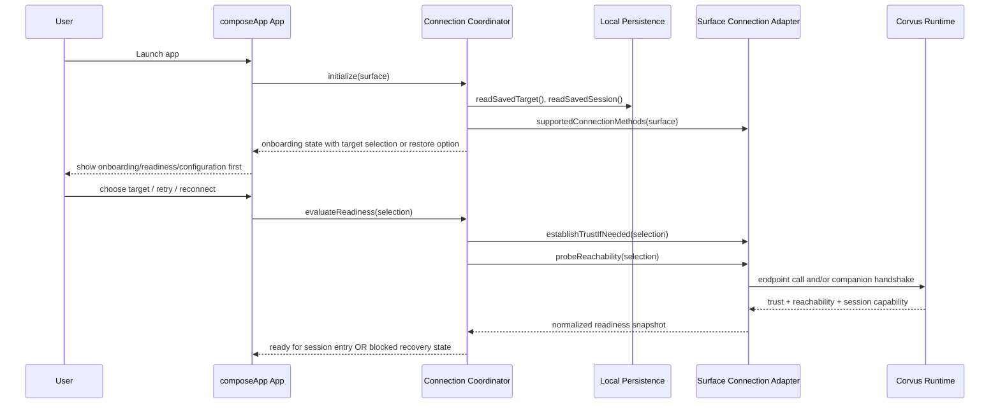
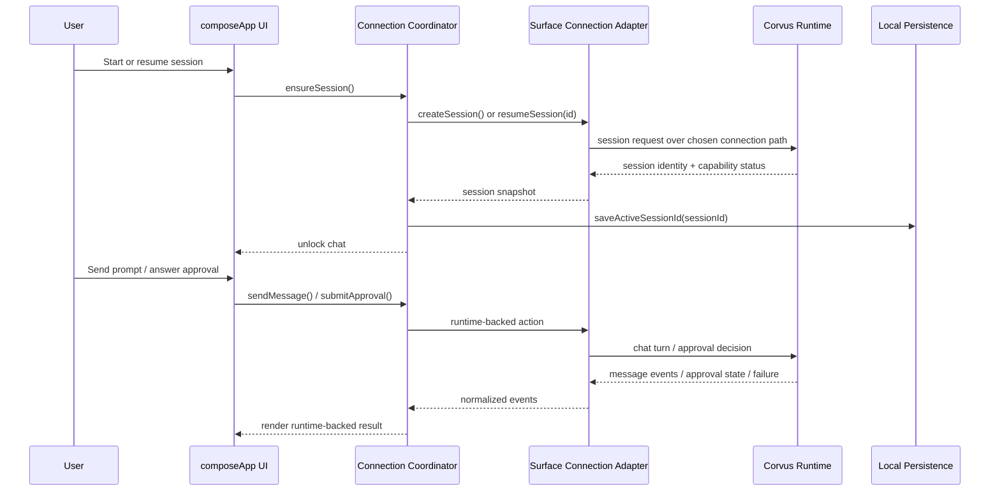

# Design: Mobile Runtime Parity Requirements

## Technical Approach

This change is corrected from a host-first mobile milestone to a **client-first onboarding/readiness
milestone** for `clients/composeApp` across desktop/JVM, Android, and iOS. The implementation focus
is no longer “make each surface launch a local Corvus runtime,” but “make each surface start as a
client, help the user choose or restore a supported connection path, validate trust and
reachability, and unlock session/chat only after readiness succeeds.”

The smallest viable implementation is to keep the recently added shared coordinator and contract
structure, but change their semantics from **local bridge readiness** to **client connection
readiness**:

1. `clients/composeApp` owns startup routing, onboarding/readiness UI, copy, and chat/session
   gating.
2. `modules/agent-core-kmp` owns connection-agnostic readiness/session/approval contracts plus
   per-surface adapter interfaces.
3. Platform source sets own the supported connection methods for that surface (endpoint/URL, trusted
   companion, and any advanced local-host option if later approved), but they do **not** assume
   local hosting by default.

This maps to the corrected proposal and delta specs by making startup onboarding-first, by
permitting endpoint and/or pairing/trusted-companion connection models per surface, and by
explicitly removing the default local-runtime-host assumption from desktop, Android, and iOS.

## Architecture Decisions

### Decision: Make startup onboarding-first for every `composeApp` surface

**Choice**: Desktop/JVM, Android, and iOS all start in onboarding/readiness/configuration unless a
previously selected client connection target can be restored and passes readiness checks.

**Alternatives considered**:

- Keep current behavior where launch immediately probes a default local runtime path.
- Allow desktop/Android to keep host-first startup and only correct iOS.

**Rationale**: The corrected product model says these are clients first. `App.kt` currently calls
`coordinator.refresh()` on launch and the platform dependency factories instantiate local-runtime
adapters immediately, which drives the wrong user journey. Startup must lead with target selection,
trust state, reachability, and recovery—not implicit local process probing.

### Decision: Model connection explicitly instead of inferring “local CLI bridge”

**Choice**: The shared readiness contract will represent a selected or selectable client connection
method and target rather than hard-coding `CLI_BRIDGE` / `BRIDGE_LINKED` as the default
interpretation.

**Alternatives considered**:

- Keep the current `RuntimeTransportMode` and `RuntimeTrustMode` enums and reinterpret them
  informally in UI copy.
- Fork separate desktop, Android, and iOS onboarding models.

**Rationale**: Current common code in `RuntimeContracts.kt` and `CoreContracts.kt` maps nearly every
onboarding path to `CLI_BRIDGE` and `BRIDGE_LINKED`, which keeps the design wrong even if copy
changes. The contract itself must express endpoint-based and trusted-companion-based readiness so
follow-on implementation and tests do not drift back to host-first assumptions.

### Decision: Keep readiness/session/approval separation, but redefine readiness as client readiness

**Choice**: Preserve the recent separation between onboarding/readiness state and active
session/chat state, but redefine readiness to mean: target known, trust/auth established, transport
reachable, and session entry possible on the current surface.

**Alternatives considered**:

- Collapse onboarding and chat into a single state machine.
- Treat “runtime process is locally available” as the primary readiness signal.

**Rationale**: The current coordinator split is still useful, but its readiness inputs are wrong.
Reusing the separation keeps the change smaller and makes follow-on apply work mostly semantic
rewiring rather than another architectural rewrite.

### Decision: Make surface support capability-based and explicit

**Choice**: Each `composeApp` surface declares which client connection methods it supports and which
one is the default user path.

**Alternatives considered**:

- Force all three surfaces to support the same concrete connection mechanism.
- Keep iOS as the only “special case” while desktop and Android remain default local hosts.

**Rationale**: The proposal explicitly allows endpoint/URL and/or pairing/trusted companion paths
depending on surface support. Capability-based support avoids false symmetry while still keeping one
shared onboarding/readiness contract.

### Decision: Treat local runtime hosting as optional advanced infrastructure, not the parity default

**Choice**: Any future local-host or embedded-runtime path is an optional advanced connection method
and must not be the default launch or acceptance path for this change.

**Alternatives considered**:

- Keep Android/desktop local hosting as the main path and describe endpoint/companion paths as
  fallbacks.
- Remove any possibility of advanced local hosting entirely.

**Rationale**: The corrected scope removes local hosting as the default model, but it does not need
to ban future advanced modes. Marking them as explicit non-default options prevents the product
model from drifting back while preserving future flexibility.

## Per-Surface Connection Expectations

| Surface                                               | Default expectation     | Supported connection model for this change                                                | Explicitly invalidated default assumption                                               |
|-------------------------------------------------------|-------------------------|-------------------------------------------------------------------------------------------|-----------------------------------------------------------------------------------------|
| Desktop/JVM (`clients/composeApp` on JVM)             | Client onboarding first | Runtime endpoint/URL plus any required auth/pairing; trusted companion MAY be added later | `PlatformRuntimeDependencies.jvm.kt` defaulting directly to `RustCliBridge()` on launch |
| Android (`clients/composeApp` + `clients/androidApp`) | Client onboarding first | Runtime endpoint/URL and/or trusted companion path appropriate to Android support         | Packaged executable / `corvus` / `libcorvus.so` / `ProcessBuilder` as the normal path   |
| iOS (`clients/composeApp` + `clients/iosApp`)         | Client onboarding first | Trusted companion and/or endpoint path depending on available platform support            | Treating iOS only as an exception to an otherwise host-first desktop/Android model      |

Implementation expectations for follow-on apply work:

- **Desktop/JVM** MUST open to connection setup/readiness and SHOULD behave closest to web-chat
  onboarding when endpoint access is the chosen path.
- **Android** MUST stop assuming shipped local runtime artifacts and MUST treat endpoint or trusted
  companion connection as the primary parity path.
- **iOS** MUST present unsupported or unconfigured states as onboarding/readiness blockers, not as
  “missing local runtime host infrastructure.”

## Invalidated Recent Implementation Assumptions

The following recent assumptions are now invalid and must be corrected rather than extended:

1.

`clients/composeApp/src/jvmMain/kotlin/com/profiletailors/corvus/runtime/PlatformRuntimeDependencies.jvm.kt`
instantiates `RustCliBridge()` as the normal desktop path.

2.

`clients/composeApp/src/androidMain/kotlin/com/profiletailors/corvus/runtime/PlatformRuntimeDependencies.android.kt`
resolves a packaged executable or falls back to `corvus`.

3.

`clients/composeApp/src/androidMain/kotlin/com/profiletailors/corvus/runtime/AndroidRuntimeBridge.kt`
is built around local `ProcessBuilder` execution as the expected Android transport.

4. `clients/androidApp/build.gradle.kts` packages `libcorvus.so` payloads as if local runtime
   hosting is the default Android story.
5. `clients/composeApp/src/commonMain/kotlin/com/profiletailors/corvus/App.kt` refreshes readiness
   immediately on launch instead of routing users into connection onboarding first.
6. `clients/composeApp/src/commonMain/kotlin/com/profiletailors/corvus/runtime/RuntimeContracts.kt`
   and `modules/agent-core-kmp/src/commonMain/kotlin/com/profiletailors/agent/core/CoreContracts.kt`
   normalize readiness around `CLI_BRIDGE` / `BRIDGE_LINKED` defaults.
7. `clients/composeApp/src/commonMain/kotlin/com/profiletailors/corvus/ui/chat/ChatComponents.kt`
   and `ConfigPanel.kt` describe the expected journey as “local Corvus” / “local CLI bridge.”
8. `openspec/changes/2026-03-29-mobile-runtime-parity-requirements/tasks.md` phases 2, 4, and 5
   currently prove host behavior rather than client-first connection behavior and must be re-scoped
   later.

## Data Flow

### Target architecture

```text
composeApp App startup
        |
        v
surface connection coordinator (commonMain)
        |
        +--> load persisted target + supported methods
        |
        v
connection onboarding/readiness UI
        |
        v
surface-specific connection adapter
   /        |         \
  v         v          v
endpoint   pairing    trusted companion
  \         |          /
   \        |         /
    v       v        v
      Corvus runtime / approved companion
```

### Sequence: startup and onboarding-first routing



### Sequence: ready state into session/chat



## File Changes

| File                                                                                                                 | Action             | Description                                                                                                                                       |
|----------------------------------------------------------------------------------------------------------------------|--------------------|---------------------------------------------------------------------------------------------------------------------------------------------------|
| `openspec/changes/2026-03-29-mobile-runtime-parity-requirements/design.md`                                           | Modify             | Correct the technical design to the client-first architecture.                                                                                    |
| `modules/agent-core-kmp/src/commonMain/kotlin/com/profiletailors/agent/core/CoreContracts.kt`                        | Modify             | Replace CLI-bridge-default onboarding/readiness semantics with client connection semantics that can express endpoint and trusted companion paths. |
| `modules/agent-core-kmp/src/commonMain/kotlin/com/profiletailors/agent/core/MobileRuntimeFacade.kt`                  | Modify             | Reframe the facade around client connection readiness plus session/chat/approval operations instead of implicit local-host assumptions.           |
| `modules/agent-core-kmp/src/jvmMain/kotlin/com/profiletailors/agent/core/RustCliBridge.kt`                           | Modify             | Demote local CLI execution from default parity path to optional advanced adapter or test-only adapter unless explicitly selected.                 |
| `clients/composeApp/src/commonMain/kotlin/com/profiletailors/corvus/runtime/RuntimeContracts.kt`                     | Modify             | Add explicit connection-method/target/trust/readiness modeling and remove hard-coded CLI-bridge normalization.                                    |
| `clients/composeApp/src/commonMain/kotlin/com/profiletailors/corvus/runtime/MobileRuntimeCoordinator.kt`             | Modify             | Convert the coordinator from local bridge readiness orchestration to onboarding-first client connection orchestration.                            |
| `clients/composeApp/src/commonMain/kotlin/com/profiletailors/corvus/App.kt`                                          | Modify             | Route startup into onboarding/readiness/configuration first for desktop, Android, and iOS.                                                        |
| `clients/composeApp/src/jvmMain/kotlin/com/profiletailors/corvus/runtime/PlatformRuntimeDependencies.jvm.kt`         | Modify             | Stop defaulting desktop to `RustCliBridge()`; provide desktop-supported client connection methods instead.                                        |
| `clients/composeApp/src/androidMain/kotlin/com/profiletailors/corvus/runtime/PlatformRuntimeDependencies.android.kt` | Modify             | Replace packaged-executable defaulting with Android client connection dependency wiring.                                                          |
| `clients/composeApp/src/iosMain/kotlin/com/profiletailors/corvus/runtime/PlatformRuntimeDependencies.ios.kt`         | Modify             | Keep iOS client-first and expose supported endpoint and/or trusted companion methods without host-first framing.                                  |
| `clients/composeApp/src/androidMain/kotlin/com/profiletailors/corvus/runtime/AndroidRuntimeBridge.kt`                | Modify or delete   | Remove Android’s default local-process-host assumption; either replace it with a client adapter or retain it only as an optional advanced mode.   |
| `clients/composeApp/src/iosMain/kotlin/com/profiletailors/corvus/runtime/IosRuntimeBridge.kt`                        | Modify             | Align iOS adapter and failure states to client-first onboarding/readiness language.                                                               |
| `clients/composeApp/src/commonMain/kotlin/com/profiletailors/corvus/ui/onboarding/OnboardingScreen.kt`               | Modify             | Present connection setup, trust/auth, reachability, and readiness outcomes rather than local-host setup.                                          |
| `clients/composeApp/src/commonMain/kotlin/com/profiletailors/corvus/ui/chat/ChatComponents.kt`                       | Modify             | Replace local-bridge-specific headlines and recovery copy with client-first connection copy.                                                      |
| `clients/composeApp/src/commonMain/kotlin/com/profiletailors/corvus/ui/chat/ConfigPanel.kt`                          | Modify             | Add target/connection diagnostics for the selected client path and remove “local CLI bridge” as the default transport copy.                       |
| `clients/androidApp/build.gradle.kts`                                                                                | Modify             | Remove Android packaging behavior that assumes local runtime payloads are part of the default client journey.                                     |
| `openspec/changes/2026-03-29-mobile-runtime-parity-requirements/tasks.md`                                            | Modify (follow-on) | Re-scope completed/pending tasks around client-first onboarding/readiness validation instead of local-host validation.                            |

## Interfaces / Contracts

The corrected contract should preserve the existing shared/runtime split, but it must express
connection choice explicitly.

```kotlin
enum class RuntimeConnectionMethod {
  ENDPOINT_URL,
  TRUSTED_COMPANION,
  LOCAL_HOST_ADVANCED,
}

data class RuntimeConnectionTarget(
  val id: String,
  val label: String,
  val method: RuntimeConnectionMethod,
  val endpointUrl: String? = null,
)

data class RuntimeTrustState(
  val established: Boolean,
  val requiresPairingOrAuth: Boolean,
)

data class RuntimeReadinessSnapshot(
  val target: RuntimeConnectionTarget?,
  val trustState: RuntimeTrustState,
  val transportReachable: Boolean,
  val sessionCapable: Boolean,
  val activeSessionId: RuntimeSessionId? = null,
  val supportedMethods: Set<RuntimeConnectionMethod> = emptySet(),
)
```

Contract expectations:

- Readiness MUST answer: which runtime target is selected, which connection method is active,
  whether trust/auth is established, whether transport is reachable, and whether session entry is
  allowed.
- Surface adapters MUST expose their supported connection methods so onboarding can render the right
  actions per platform.
- Session/chat/approval contracts remain runtime-backed and UUID-based.
- Persisted metadata MUST describe the selected client target and method, not assume a local
  executable path.
- If an advanced local-host method exists later, it MUST be modeled as an explicit method selection
  rather than an implicit launch default.

## Testing Strategy

| Layer                   | What to Test                                                                                                                                                                      | Approach                                                                                                                                            |
|-------------------------|-----------------------------------------------------------------------------------------------------------------------------------------------------------------------------------|-----------------------------------------------------------------------------------------------------------------------------------------------------|
| Common contract tests   | Connection-method modeling, onboarding/readiness mapping, session-entry gating, persisted target restore                                                                          | Update `CoreContractsTest.kt`, `ComposeAppCommonTest.kt`, and related common tests to assert client-first semantics rather than CLI-bridge defaults |
| Desktop/JVM tests       | Startup no longer defaults to `RustCliBridge()`, persisted endpoint restore, blocked onboarding when unconfigured                                                                 | Add/update JVM tests around `PlatformRuntimeDependencies.jvm.kt` and coordinator startup behavior                                                   |
| Android tests           | No packaged-runtime default, Android-supported client path selection, recovery when endpoint/companion path is unavailable                                                        | Replace packaging/process-host assumptions in Android tests with client connection readiness cases                                                  |
| iOS tests               | Supported method exposure, onboarding blocked state when no companion/endpoint is configured, client-safe recovery mapping                                                        | Update iOS adapter tests to assert client-first blocked/readiness states                                                                            |
| UI state/copy tests     | Onboarding-first routing, target diagnostics, copy no longer refers to “local CLI bridge” as default                                                                              | Extend composeApp common/UI tests for onboarding and config-panel copy/state                                                                        |
| Manual smoke validation | Desktop, Android, and iOS each reach onboarding, configure a supported path, pass readiness, create/resume session, send chat, and handle approval without local-host assumptions | Replace current local-runtime smoke checklist with per-surface client connection checklist                                                          |

## Migration / Rollout

No data migration is required, but active implementation assumptions do require controlled
correction.

Recommended sequence:

1. Correct shared contracts and coordinator semantics first.
2. Correct startup routing in `App.kt` so all `composeApp` surfaces are onboarding-first.
3. Replace platform dependency factories so each surface reports supported client connection methods
   instead of instantiating local-host adapters by default.
4. Rewrite settings/onboarding/recovery copy to describe client connection readiness.
5. Remove Android packaging and smoke-validation assumptions tied to default local hosting.
6. Re-scope tasks and verification artifacts to the corrected milestone.

During rollout, the app MUST fail closed into onboarding/readiness if no supported target is
configured. It MUST NOT silently fall back to a local runtime path, demo reply path, or hidden host
behavior.

## Open Questions

- [ ] Which exact endpoint auth/pairing model should desktop/JVM use first when the selected target
  is a remote runtime: reuse existing gateway pairing semantics directly, or expose a thinner
  endpoint credential flow for `composeApp`?
- [ ] For Android and iOS, is trusted companion intended to ship in this change as a required
  method, or is endpoint/URL connection enough for the corrected parity milestone when companion
  support is unavailable?
