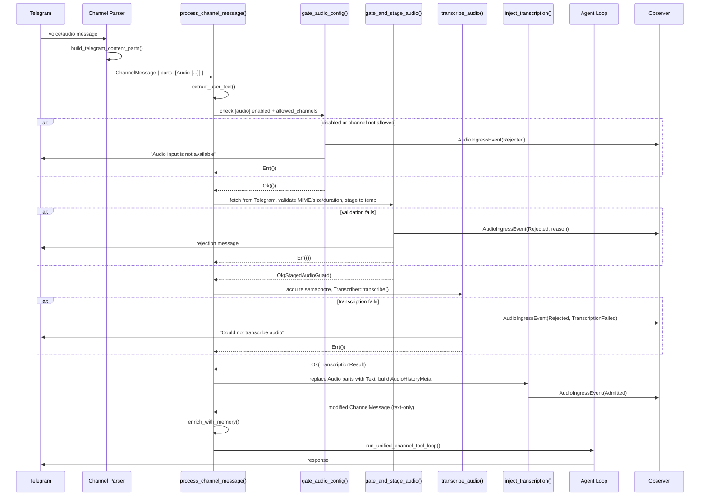
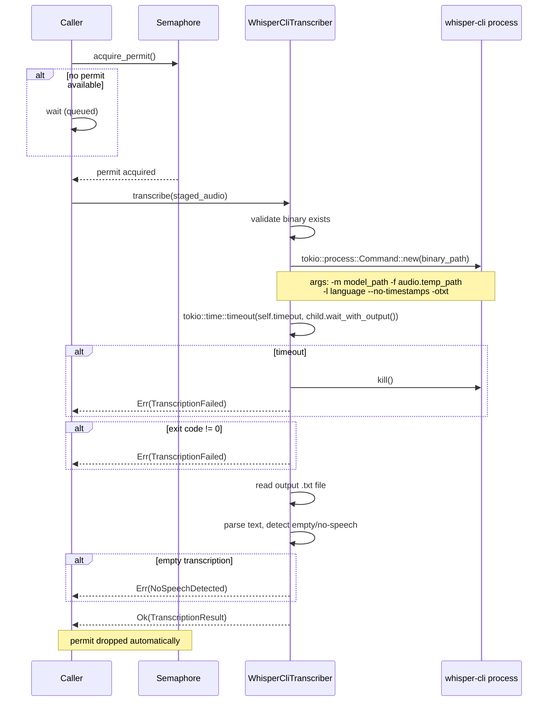

# Design: Audio Input Support for Agents (Phase 1: Core + Telegram)

**Change**: `audio-input-support`
**Issue**: #246 / DALLAY-150
**Date**: 2026-04-03

## Technical Approach

Audio input extends the existing multimodal pipeline (`ContentPart` → gate → stage → process →
history) with one critical difference: audio is **transcribed locally to text before the agent
loop** — the provider never sees audio bytes. This mirrors the image pipeline's architecture
(gate → stage → dispatch) but replaces provider dispatch with local transcription + text injection.

The implementation adds a new `ContentPart::Audio` variant, a `Transcriber` trait as a runtime
extension point, a whisper.cpp CLI wrapper (proven pattern from `crates/robot-kit/src/listen.rs`),
and four pipeline stages inserted into `process_channel_message()` between `extract_user_text()`
and `enrich_with_memory()`.

## Architecture Overview

### End-to-End Pipeline



### How Audio Diverges from the Image Pipeline

| Aspect | Image Pipeline | Audio Pipeline |
|--------|---------------|----------------|
| Provider interaction | `ChatRequest { images: &[StagedImage] }` | No provider field — transcribed text injected as normal message |
| Processing stage | Stage → provider dispatch | Stage → **local transcription** → text injection |
| Route resolution | Requires `vision_model_hint` route | No route needed — transcription is pre-provider |
| Config section | `[multimodal]` | `[audio]` (separate — different concerns) |
| History metadata | `ImageHistoryMeta` (description populated post-response) | `AudioHistoryMeta` (transcription stored at ingestion) |

### Integration with `process_channel_message()`

Current flow in `src/channels/mod.rs` line 604:

```text
extract_user_text()                           // existing
→ enrich_with_memory()                        // existing
→ gate_multimodal_config()                    // existing (images)
→ gate_and_stage_images()                     // existing (images)
→ run_unified_channel_tool_loop()             // existing
```

New flow with audio inserted **between** `extract_user_text()` and `enrich_with_memory()`:

```text
extract_user_text()                           // existing
→ gate_audio_config()                         // NEW: check [audio] enabled + allowed_channels
→ gate_and_stage_audio()                      // NEW: fetch, validate MIME/size/duration, stage
→ StagedAudioGuard                            // NEW: RAII cleanup
→ transcribe_audio()                          // NEW: semaphore + Transcriber::transcribe()
→ inject_transcription()                      // NEW: replace Audio→Text, store AudioHistoryMeta
→ enrich_with_memory()                        // existing (now sees text-only message)
→ gate_multimodal_config()                    // existing (images, unchanged)
→ gate_and_stage_images()                     // existing (images, unchanged)
→ run_unified_channel_tool_loop()             // existing
```

Audio processing MUST happen before `enrich_with_memory()` because the memory enrichment needs the
final text (including transcription) to retrieve relevant context.

## Architecture Decisions

### Decision: Separate `[audio]` Config vs Extending `[multimodal]`

**Choice**: Separate `[audio]` TOML section with its own `AudioConfig` struct.

**Alternatives considered**: Extending `MultimodalConfig` with audio fields (e.g.,
`audio_enabled`, `audio_allowed_channels`, `max_audio_bytes`).

**Rationale**: Audio and image configs have fundamentally different concerns. Images need
`vision_model_hint` for provider routing; audio needs `transcription_model`, `transcription_language`,
and `max_audio_duration_secs`. Combining them would create a bloated struct where half the fields
are irrelevant per modality. An operator might enable images but not audio, or vice versa.
Separate sections make independent toggling clean and self-documenting in TOML:

```toml
[multimodal]
enabled = true
allowed_channels = ["telegram"]

[audio]
enabled = true
allowed_channels = ["telegram"]
transcription_model = "base"
```

### Decision: whisper.cpp CLI Wrapper vs Embedded Library

**Choice**: whisper.cpp CLI wrapper (spawn external process).

**Alternatives considered**:
1. `whisper-rs` (Rust bindings to whisper.cpp C library) — adds ~5–10 MB binary, C/C++ build complexity
2. `candle-whisper` (pure Rust) — experimental, slower, no GGML optimization

**Rationale**: The robot-kit crate (`crates/robot-kit/src/listen.rs`, line 85) already uses this
exact pattern: `tokio::process::Command::new(whisper_path)`. Zero Rust dependency impact — no new
crates, no binary size increase, no C/C++ build complexity. The `Transcriber` trait abstracts the
engine, so `whisper-rs` can be added as a feature-gated alternative in Phase 2 without changing
any calling code.

### Decision: Transcription Before Agent Loop (Not Passing Audio to Provider)

**Choice**: Transcribe audio locally and inject the resulting text before the agent loop. The
provider `ChatRequest` struct is NOT modified.

**Alternatives considered**: Adding an `audio: &[StagedAudio]` field to `ChatRequest` and letting
providers handle audio natively (like images).

**Rationale**:
1. **NFR1 (privacy)**: All transcription must be local. Passing audio to providers would violate this.
2. **Provider compatibility**: Most LLM providers don't accept audio input. Transcribing first makes
   audio work with every existing provider.
3. **Simplicity**: No provider trait changes. The transcribed text flows through the existing text
   path — zero impact on all provider implementations.
4. **Decoupling**: Transcription engine is independent of LLM provider choice.

### Decision: Concurrency Semaphore vs Queue vs Unbounded

**Choice**: `tokio::sync::Semaphore` with configurable permit count (default: 1).

**Alternatives considered**:
1. Unbounded — risk CPU overload with concurrent whisper processes
2. Dedicated task queue with worker pool — over-engineered for Phase 1
3. Mutex (one-at-a-time only) — too rigid, can't configure higher concurrency

**Rationale**: Whisper transcription is CPU-intensive (~500 MB RAM per process). A semaphore with
default 1 permit prevents resource exhaustion while allowing operators with powerful hardware to
increase concurrency via config. `tokio::sync::Semaphore` is zero-cost when permits are available
and naturally queues excess requests. This matches the simplicity principle without limiting future
scaling.

### Decision: Audio Media in Separate File (`audio_media.rs`) vs Extending `media.rs`

**Choice**: New `src/channels/audio_media.rs` file.

**Alternatives considered**: Adding audio types and functions to the existing `media.rs` (851 lines).

**Rationale**: `media.rs` is already 851 lines focused entirely on image concerns. Adding audio
types (5 new structs/enums + validation functions + tests) would push it past 1200+ lines and mix
two distinct media domains. A separate file keeps each media type cohesive and independently
testable. Cross-references are minimal — audio staging follows the same pattern but doesn't share
any image-specific types.

## Data Models (Exact Rust Types)

### `ContentPart::Audio` Variant

In `src/channels/traits.rs`, extend the existing enum:

```rust
pub enum ContentPart {
    Text { text: String },
    Image { /* existing, unchanged */ },
    /// Audio reference before fetch/staging/transcription.
    Audio {
        channel_handle: String,
        source_channel: String,
        declared_mime: Option<String>,
        caption_text: Option<String>,
        file_name: Option<String>,
        declared_bytes: Option<u64>,
        /// Channel-reported duration in seconds (e.g., Telegram voice duration).
        declared_duration_secs: Option<u64>,
    },
}
```

Companion helpers on `ChannelMessage`:

```rust
impl ChannelMessage {
    pub fn has_audio_parts(&self) -> bool { .. }
    pub fn audio_parts(&self) -> Vec<&ContentPart> { .. }
}
```

`text_projection()` must be updated to include `caption_text` from `Audio` parts (same pattern
as `Image` captions).

### `AllowedAudioMime` Enum

In `src/channels/audio_media.rs`:

```rust
#[derive(Debug, Clone, Copy, PartialEq, Eq)]
pub enum AllowedAudioMime {
    OggOpus,   // Telegram voice notes; magic: OggS (0x4F676753)
    Mp3,       // MPEG audio; magic: 0xFFE0..0xFFFF or ID3 (0x494433)
    Wav,       // RIFF WAVE; magic: RIFF....WAVE
    M4a,       // MPEG-4 audio; magic: ....ftyp (offset 4)
}

impl AllowedAudioMime {
    pub fn from_mime_str(s: &str) -> Option<Self> { .. }
    pub fn as_str(&self) -> &str { .. }
    pub fn file_extension(&self) -> &str { .. }
}
```

Magic byte validation function:

```rust
pub fn validate_audio_mime(
    declared: Option<&str>,
    sniffed_bytes: &[u8],
) -> Result<AllowedAudioMime, AudioRejectionReason> {
    // OGG: bytes 0-3 = "OggS" (0x4F 0x67 0x67 0x53)
    // MP3: bytes 0-1 = 0xFF 0xE0+ (sync word) OR bytes 0-2 = "ID3"
    // WAV: bytes 0-3 = "RIFF", bytes 8-11 = "WAVE"
    // M4A: bytes 4-7 = "ftyp" (ISO base media)
}
```

### `AudioRejectionReason` Enum

```rust
#[derive(Debug, Clone, PartialEq, Eq, thiserror::Error)]
pub enum AudioRejectionReason {
    #[error("disabled")]
    Disabled,
    #[error("channel_not_allowed")]
    ChannelNotAllowed,
    #[error("fetch_failed")]
    FetchFailed,
    #[error("mime_rejected")]
    MimeRejected,
    #[error("oversize")]
    Oversize,
    #[error("too_long")]
    TooLong,
    #[error("corrupted")]
    Corrupted,
    #[error("transcription_failed")]
    TranscriptionFailed,
    #[error("no_speech_detected")]
    NoSpeechDetected,
    #[error("channel_not_supported")]
    ChannelNotSupported,
    #[error("system_error")]
    SystemError,
}
```

### `StagedAudio` Struct

```rust
#[derive(Debug, Clone)]
pub struct StagedAudio {
    pub sha256: String,
    pub mime_type: AllowedAudioMime,
    pub byte_len: u64,
    pub duration_secs: Option<f64>,
    pub temp_path: PathBuf,
    pub channel_origin: String,
}

impl StagedAudio {
    /// Best-effort cleanup of the staged temp file.
    pub fn cleanup(&self) {
        if self.temp_path.exists() {
            if let Err(e) = std::fs::remove_file(&self.temp_path) {
                tracing::warn!(
                    "Failed to remove staged audio {}: {e}",
                    self.temp_path.display()
                );
            }
        }
    }
}
```

### `StagedAudioGuard` RAII Wrapper

In `src/channels/mod.rs`, mirroring `StagedImageGuard` (line 127):

```rust
struct StagedAudioGuard(Vec<audio_media::StagedAudio>);

impl Drop for StagedAudioGuard {
    fn drop(&mut self) {
        for audio in &self.0 {
            audio.cleanup();
        }
    }
}
```

### `AudioHistoryMeta` Struct

```rust
#[derive(Debug, Clone, Serialize, Deserialize)]
pub struct AudioHistoryMeta {
    pub mime: String,
    pub sha256: String,
    pub byte_len: u64,
    pub duration_secs: Option<f64>,
    pub channel_origin: String,
    /// The transcribed text from this audio.
    pub transcription: String,
    /// User-provided caption, if any.
    pub caption: Option<String>,
}

impl AudioHistoryMeta {
    pub fn from_staged(
        staged: &StagedAudio,
        transcription: String,
        caption: Option<String>,
    ) -> Self { .. }

    /// Render as synthetic context for history injection.
    /// Example: "[Prior audio: audio/ogg, 45s, sha256:abc123. Transcription: Hola...]"
    pub fn to_context_string(&self) -> String { .. }
}
```

### `TranscriptionResult` Struct

In `src/transcription/traits.rs`:

```rust
pub struct TranscriptionResult {
    /// The transcribed text.
    pub text: String,
    /// Detected or forced language code.
    pub language: Option<String>,
    /// Actual audio duration as reported by the transcription engine.
    pub duration_secs: f64,
    /// Engine-reported confidence (0.0–1.0), if available.
    pub confidence: Option<f64>,
}
```

### `AudioConfig` Struct

In `src/config/schema.rs`:

```rust
#[derive(Debug, Clone, Serialize, Deserialize)]
pub struct AudioConfig {
    /// Global kill switch (default: false, deny-by-default).
    #[serde(default)]
    pub enabled: bool,
    /// Channel allowlist for audio ingress.
    #[serde(default)]
    pub allowed_channels: Vec<String>,
    /// Maximum audio file size in bytes (default: 25 MiB).
    #[serde(default = "default_max_audio_bytes")]
    pub max_audio_bytes: u64,
    /// Maximum audio duration in seconds (default: 600 = 10 min).
    #[serde(default = "default_max_audio_duration_secs")]
    pub max_audio_duration_secs: u64,
    /// Whisper model name (default: "base").
    #[serde(default = "default_transcription_model")]
    pub transcription_model: String,
    /// Language hint for transcription (default: "es").
    #[serde(default = "default_transcription_language")]
    pub transcription_language: String,
    /// Path to whisper.cpp binary (default: "whisper-cli").
    #[serde(default = "default_whisper_binary")]
    pub whisper_binary: String,
    /// Max concurrent transcriptions (default: 1).
    #[serde(default = "default_max_concurrent_transcriptions")]
    pub max_concurrent_transcriptions: usize,
    /// Per-transcription timeout in seconds (default: 120).
    #[serde(default = "default_transcription_timeout_secs")]
    pub transcription_timeout_secs: u64,
}

impl Default for AudioConfig {
    fn default() -> Self {
        Self {
            enabled: false,
            allowed_channels: Vec::new(),
            max_audio_bytes: 26_214_400,       // 25 MiB
            max_audio_duration_secs: 600,       // 10 minutes
            transcription_model: "base".into(),
            transcription_language: "es".into(),
            whisper_binary: "whisper-cli".into(),
            max_concurrent_transcriptions: 1,
            transcription_timeout_secs: 120,
        }
    }
}
```

TOML mapping:

```toml
[audio]
enabled = false
allowed_channels = ["telegram"]
max_audio_bytes = 26214400
max_audio_duration_secs = 600
transcription_model = "base"
transcription_language = "es"
whisper_binary = "whisper-cli"
max_concurrent_transcriptions = 1
transcription_timeout_secs = 120
```

### Observability Types

In `src/observability/traits.rs`:

```rust
#[derive(Debug, Clone, PartialEq, Eq)]
pub enum AudioIngressOutcome {
    Admitted,
    Rejected,
}

#[derive(Debug, Clone, PartialEq, Eq)]
pub enum AudioIngressReason {
    Disabled,
    ChannelNotAllowed,
    FetchFailed,
    MimeRejected,
    Oversize,
    TooLong,
    Corrupted,
    TranscriptionFailed,
    NoSpeechDetected,
    ChannelNotSupported,
    SystemError,
}

impl std::fmt::Display for AudioIngressReason { .. }

#[derive(Debug, Clone)]
pub struct AudioIngressEvent {
    pub channel: String,
    pub outcome: AudioIngressOutcome,
    pub reason: Option<AudioIngressReason>,
    pub mime_type: Option<String>,
    pub byte_len: Option<u64>,
    pub duration_secs: Option<f64>,
    pub transcription_duration_ms: Option<u64>,
}
```

Add to `ObserverEvent`:

```rust
pub enum ObserverEvent {
    // ... existing variants ...
    AudioIngress(AudioIngressEvent),
}
```

Add to `Observer` trait:

```rust
fn on_audio_ingress(&self, event: &AudioIngressEvent) {
    self.record_event(&ObserverEvent::AudioIngress(event.clone()));
}
```

## Transcriber Trait & whisper.cpp CLI Implementation

### Transcriber Trait

New file `src/transcription/traits.rs`:

```rust
use crate::channels::audio_media::StagedAudio;
use async_trait::async_trait;

pub struct TranscriptionResult {
    pub text: String,
    pub language: Option<String>,
    pub duration_secs: f64,
    pub confidence: Option<f64>,
}

#[async_trait]
pub trait Transcriber: Send + Sync {
    /// Human-readable name of the transcription engine.
    fn name(&self) -> &str;

    /// Transcribe a staged audio file to text.
    async fn transcribe(&self, audio: &StagedAudio) -> anyhow::Result<TranscriptionResult>;

    /// Whether the engine is ready (binary found, model available).
    async fn health_check(&self) -> bool;
}
```

### whisper.cpp CLI Wrapper

New file `src/transcription/whisper_cli.rs`:

```rust
pub struct WhisperCliTranscriber {
    binary_path: String,
    model_path: PathBuf,
    language: String,
    timeout: Duration,
    semaphore: Arc<tokio::sync::Semaphore>,
}
```

**Process spawning** (following `crates/robot-kit/src/listen.rs` line 85 pattern):



**Model path resolution** (matching robot-kit pattern at line 75):

```rust
fn resolve_model_path(model_name: &str) -> PathBuf {
    // 1. Check ~/.corvus/models/whisper/ggml-{model}.bin
    // 2. Fallback: /usr/local/share/whisper/ggml-{model}.bin
    directories::UserDirs::new()
        .map(|d| d.home_dir()
            .join(format!(".corvus/models/whisper/ggml-{model}.bin")))
        .unwrap_or_else(|| {
            PathBuf::from(format!("/usr/local/share/whisper/ggml-{model}.bin"))
        })
}
```

**Error handling**:

| Error Condition | Detection | Result |
|----------------|-----------|--------|
| Binary not found | `Command::new()` returns `io::ErrorKind::NotFound` | `anyhow!("whisper-cli binary not found at '{path}'")` |
| Model not found | `model_path.exists()` check before spawn | `anyhow!("Whisper model not found at '{path}'")` |
| Process crash | Non-zero exit code | `anyhow!("whisper-cli exited with code {code}: {stderr}")` |
| Timeout | `tokio::time::timeout` wrapping `wait_with_output` | `anyhow!("Transcription timed out after {n}s")` |
| No speech | Empty or whitespace-only output text | Return `AudioRejectionReason::NoSpeechDetected` |

**Concurrency semaphore**: Constructed at runtime initialization from `AudioConfig::max_concurrent_transcriptions`. Stored in `WhisperCliTranscriber`. The semaphore permit is acquired in `transcribe()` and released automatically when the permit guard is dropped (even on error/panic).

## Audio Pipeline Stages (in `process_channel_message`)

### Stage 1: `gate_audio_config()`

```rust
async fn gate_audio_config(
    ctx: &ChannelRuntimeContext,
    msg: &traits::ChannelMessage,
    session_id: &str,
    target_channel: Option<&Arc<dyn Channel>>,
) -> Result<(), ()> {
    if !msg.has_audio_parts() {
        return Ok(());  // no audio, pass through
    }
    let audio_cfg = &ctx.config.audio;
    if !audio_cfg.enabled {
        // reject + emit AudioIngressEvent(Rejected, Disabled)
        // send user message: "Audio input is currently disabled."
        return Err(());
    }
    if !audio_cfg.allowed_channels.contains(&msg.channel) {
        // reject + emit AudioIngressEvent(Rejected, ChannelNotAllowed)
        // send user message: "Audio input is not enabled for this channel."
        return Err(());
    }
    Ok(())
}
```

### Stage 2: `gate_and_stage_audio()`

```rust
async fn gate_and_stage_audio(
    ctx: &ChannelRuntimeContext,
    msg: &traits::ChannelMessage,
    session_id: &str,
    target_channel: Option<&Arc<dyn Channel>>,
) -> Result<StagedAudioGuard, ()> {
    if !msg.has_audio_parts() {
        return Ok(StagedAudioGuard(Vec::new()));
    }
    // 1. For each Audio part: call channel-specific fetch+stage
    //    (Telegram: fetch_and_stage_audio via getFile + download)
    // 2. Validate MIME via magic bytes (AllowedAudioMime)
    // 3. Validate size (max_audio_bytes)
    // 4. Validate duration via declared_duration_secs (pre-transcription check)
    // 5. Write to temp file, compute SHA-256
    // 6. Return StagedAudioGuard for RAII cleanup
}
```

### Stage 3: `transcribe_audio()`

```rust
async fn transcribe_audio(
    ctx: &ChannelRuntimeContext,
    staged: &[audio_media::StagedAudio],
    session_id: &str,
    target_channel: Option<&Arc<dyn Channel>>,
    msg: &traits::ChannelMessage,
) -> Result<Vec<TranscriptionResult>, ()> {
    let mut results = Vec::new();
    for audio in staged {
        match ctx.transcriber.transcribe(audio).await {
            Ok(result) => {
                // Post-transcription duration check (actual vs config limit)
                if result.duration_secs > ctx.config.audio.max_audio_duration_secs as f64 {
                    // reject TooLong
                    return Err(());
                }
                results.push(result);
            }
            Err(e) => {
                // emit AudioIngressEvent(Rejected, TranscriptionFailed)
                // send user message: "Could not transcribe audio. Please try again."
                return Err(());
            }
        }
    }
    Ok(results)
}
```

### Stage 4: `inject_transcription()`

```rust
fn inject_transcription(
    msg: &mut traits::ChannelMessage,
    staged: &[audio_media::StagedAudio],
    transcriptions: &[TranscriptionResult],
) -> Vec<audio_media::AudioHistoryMeta> {
    let mut history_metas = Vec::new();
    // Replace each ContentPart::Audio with ContentPart::Text containing:
    //   "[Voice message transcription]: {transcription_text}"
    // Build AudioHistoryMeta for each (stored in conversation history later)
    // Update msg.content (legacy text projection) with transcription
    history_metas
}
```

## Telegram Integration

### Parsing Voice Notes and Audio Files

In `build_telegram_content_parts()` (`src/channels/telegram.rs`, line 21), add two new blocks
after the existing photo/document parsing:

```rust
// Voice note → Audio part (always OGG/Opus)
if let Some(voice) = message.get("voice") {
    let file_id = voice.get("file_id")
        .and_then(Value::as_str).unwrap_or_default();
    let duration = voice.get("duration")
        .and_then(Value::as_u64);
    let file_size = voice.get("file_size")
        .and_then(Value::as_u64);
    parts.push(ContentPart::Audio {
        channel_handle: file_id.to_string(),
        source_channel: "telegram".to_string(),
        declared_mime: Some("audio/ogg".to_string()),
        caption_text: caption.clone(),
        file_name: None,
        declared_bytes: file_size,
        declared_duration_secs: duration,
    });
}

// Audio file → Audio part (has mime_type field)
if let Some(audio) = message.get("audio") {
    let file_id = audio.get("file_id")
        .and_then(Value::as_str).unwrap_or_default();
    let mime = audio.get("mime_type")
        .and_then(Value::as_str).map(String::from);
    let duration = audio.get("duration")
        .and_then(Value::as_u64);
    let file_size = audio.get("file_size")
        .and_then(Value::as_u64);
    let file_name = audio.get("file_name")
        .and_then(Value::as_str).map(String::from);
    parts.push(ContentPart::Audio {
        channel_handle: file_id.to_string(),
        source_channel: "telegram".to_string(),
        declared_mime: mime,
        caption_text: caption.clone(),
        file_name,
        declared_bytes: file_size,
        declared_duration_secs: duration,
    });
}
```

### `fetch_and_stage_audio()` Method

On `TelegramChannel`, reusing the same `getFile` → download URL pattern as
`fetch_and_stage_image()` (line 1566):

```rust
pub async fn fetch_and_stage_audio(
    &self,
    file_id: &str,
    declared_mime: Option<&str>,
    declared_duration_secs: Option<u64>,
    max_bytes: u64,
    max_duration_secs: u64,
) -> Result<audio_media::StagedAudio, audio_media::AudioRejectionReason> {
    // 1. Pre-flight duration check (from Telegram API declared duration)
    if let Some(dur) = declared_duration_secs {
        if dur > max_duration_secs {
            return Err(AudioRejectionReason::TooLong);
        }
    }
    // 2. Call getFile to resolve file_path (same as image)
    // 3. Download bytes with streaming size limit (same as image)
    // 4. Validate MIME via validate_audio_mime() magic bytes
    // 5. Validate size via validate_audio_size()
    // 6. Compute SHA-256, write to temp file
    // 7. Return StagedAudio
}
```

### Voice Note Specifics

Telegram voice notes are always OGG/Opus format with the `duration` field always present. The
`declared_mime` will be `"audio/ogg"`. The `declared_duration_secs` comes directly from Telegram's
API, providing a reliable pre-download duration check. This avoids needing an OGG header parser
for Phase 1.

## Config & Doctor

### `AudioConfig` Wiring

In `src/config/schema.rs`, add to the `Config` struct (after line 123):

```rust
#[serde(default)]
pub audio: AudioConfig,
```

### Default Values

| Field | Default | Rationale |
|-------|---------|-----------|
| `enabled` | `false` | Deny-by-default, matches multimodal pattern |
| `allowed_channels` | `[]` | Explicit allowlist, no implicit channels |
| `max_audio_bytes` | 26,214,400 (25 MiB) | Telegram max file size is 20 MB; 25 MiB gives headroom |
| `max_audio_duration_secs` | 600 (10 min) | Reasonable limit for voice messages |
| `transcription_model` | `"base"` | ~150 MB, good speed/quality balance for Spanish |
| `transcription_language` | `"es"` | Primary use case language |
| `whisper_binary` | `"whisper-cli"` | Standard whisper.cpp binary name |
| `max_concurrent_transcriptions` | 1 | Conservative; prevents CPU overload |
| `transcription_timeout_secs` | 120 | 2 minutes; whisper base processes 10 min audio in ~30s |

### `corvus doctor` Checks

The doctor module exists at `src/doctor/mod.rs` and is invoked via the `corvus doctor` CLI command.
Audio health checks are added to this module:

```rust
fn check_audio_config(config: &AudioConfig) -> Vec<DoctorWarning> {
    let mut warnings = Vec::new();
    if config.enabled {
        // 1. Check whisper binary is in PATH or at configured path
        if which::which(&config.whisper_binary).is_err() {
            warnings.push(DoctorWarning::new(
                "audio",
                format!("whisper binary '{}' not found in PATH", config.whisper_binary),
            ));
        }
        // 2. Check model file exists
        let model_path = resolve_model_path(&config.transcription_model);
        if !model_path.exists() {
            warnings.push(DoctorWarning::new(
                "audio",
                format!("Whisper model not found at {}", model_path.display()),
            ));
        }
    }
    warnings
}
```

## File Changes

| File | Action | Description |
|------|--------|-------------|
| `src/channels/traits.rs` | Modify | Add `ContentPart::Audio` variant; add `has_audio_parts()`, `audio_parts()` helpers; update `text_projection()` for Audio captions |
| `src/channels/audio_media.rs` | **Create** | `AllowedAudioMime`, `AudioRejectionReason`, `StagedAudio`, `AudioHistoryMeta`, `validate_audio_mime()`, `validate_audio_size()`, `stream_validate_and_stage_audio()` |
| `src/channels/mod.rs` | Modify | Add `pub mod audio_media`; add `StagedAudioGuard`; add `gate_audio_config()`, `gate_and_stage_audio()`, `transcribe_audio()`, `inject_transcription()`; wire into `process_channel_message()` |
| `src/channels/telegram.rs` | Modify | Parse `message.voice` and `message.audio` in `build_telegram_content_parts()`; add `fetch_and_stage_audio()` method |
| `src/transcription/mod.rs` | **Create** | Module exports (`pub mod traits; pub mod whisper_cli;`) |
| `src/transcription/traits.rs` | **Create** | `Transcriber` trait, `TranscriptionResult` struct |
| `src/transcription/whisper_cli.rs` | **Create** | `WhisperCliTranscriber` struct, `Transcriber` impl, model path resolution, process spawning, output parsing |
| `src/config/schema.rs` | Modify | Add `AudioConfig` struct with defaults; add `pub audio: AudioConfig` to `Config` |
| `src/config/validation.rs` | Modify | Add startup validation for `[audio]` section (valid channel names, sane limits) |
| `src/observability/traits.rs` | Modify | Add `AudioIngressOutcome`, `AudioIngressReason`, `AudioIngressEvent`, `ObserverEvent::AudioIngress`, `on_audio_ingress()` |
| `src/lib.rs` | Modify | Add `pub mod transcription;` (line ~65, after `pub mod tools;`) |

## Interfaces / Contracts

### Transcriber Trait Contract

```rust
#[async_trait]
pub trait Transcriber: Send + Sync {
    fn name(&self) -> &str;
    async fn transcribe(&self, audio: &StagedAudio) -> anyhow::Result<TranscriptionResult>;
    async fn health_check(&self) -> bool;
}
```

### Channel-Specific Staging Contract

Each channel that supports audio must implement fetching and staging. For Phase 1, only Telegram:

```rust
impl TelegramChannel {
    pub async fn fetch_and_stage_audio(
        &self,
        file_id: &str,
        declared_mime: Option<&str>,
        declared_duration_secs: Option<u64>,
        max_bytes: u64,
        max_duration_secs: u64,
    ) -> Result<audio_media::StagedAudio, audio_media::AudioRejectionReason>;
}
```

### Config TOML Contract

```toml
[audio]
enabled = false                    # bool, default false
allowed_channels = ["telegram"]    # string[], default []
max_audio_bytes = 26214400         # u64, default 25 MiB
max_audio_duration_secs = 600      # u64, default 10 min
transcription_model = "base"       # string, default "base"
transcription_language = "es"      # string, default "es"
whisper_binary = "whisper-cli"     # string, default "whisper-cli"
max_concurrent_transcriptions = 1  # usize, default 1
transcription_timeout_secs = 120   # u64, default 120
```

## Testing Strategy

| Layer | What to Test | Approach |
|-------|-------------|----------|
| Unit | `AllowedAudioMime::from_mime_str()` round-trip | Direct assertion tests in `audio_media.rs` |
| Unit | `validate_audio_mime()` magic byte sniffing (OGG, MP3, WAV, M4A) | Test with real magic bytes and garbage bytes |
| Unit | `validate_audio_size()` boundary cases | Same pattern as `validate_size()` tests in `media.rs` |
| Unit | `AudioRejectionReason` Display impl | String equality checks for all variants |
| Unit | `AudioHistoryMeta::to_context_string()` | Formatting assertions |
| Unit | `ContentPart::Audio` in `text_projection()` | Caption inclusion, empty handling |
| Unit | `has_audio_parts()` / `audio_parts()` helpers | Same pattern as image helper tests in `traits.rs` |
| Unit | `build_telegram_content_parts()` with voice JSON | Mock Telegram voice message JSON |
| Unit | `build_telegram_content_parts()` with audio JSON | Mock Telegram audio message JSON |
| Unit | `WhisperCliTranscriber` output parsing | Mock whisper output text file |
| Unit | `AudioConfig` default values | Serde deserialization of empty `[audio]` section |
| Integration | `gate_audio_config()` enabled/disabled/channel filtering | With mock context |
| Integration | Full Telegram voice note → transcription → text injection | With mock whisper binary (shell script returning known text) |
| Integration | Semaphore concurrency limiting | Spawn multiple transcribe calls, verify serial execution |
| Integration | RAII cleanup (`StagedAudioGuard`) | Verify temp files deleted on drop |
| Integration | Observability events emitted correctly | Capture events via test observer |

## Migration / Rollout

No migration required.

- `[audio]` defaults to `enabled = false` — zero impact on existing deployments.
- No database schema changes.
- No provider contract changes.
- No existing behavior modified.
- Rollout: operator adds `[audio]` section to `config.toml` and sets `enabled = true`.
- Rollback: set `enabled = false` or remove `[audio]` section entirely.

## Module Structure

```text
src/
├── transcription/              # NEW module
│   ├── mod.rs                  # pub mod traits; pub mod whisper_cli;
│   ├── traits.rs               # Transcriber trait, TranscriptionResult
│   └── whisper_cli.rs          # WhisperCliTranscriber implementation
├── channels/
│   ├── audio_media.rs          # NEW: audio validation, staging, MIME sniffing
│   ├── media.rs                # existing image media (UNCHANGED)
│   ├── traits.rs               # MODIFIED: add ContentPart::Audio + helpers
│   ├── telegram.rs             # MODIFIED: parse voice/audio, fetch_and_stage_audio
│   └── mod.rs                  # MODIFIED: audio pipeline stages, StagedAudioGuard
├── config/
│   ├── schema.rs               # MODIFIED: add AudioConfig + wire to Config
│   └── validation.rs           # MODIFIED: audio config validation
├── observability/
│   └── traits.rs               # MODIFIED: AudioIngress types + on_audio_ingress()
└── lib.rs                      # MODIFIED: add pub mod transcription
```

## Open Questions

- [x] Audio config: separate `[audio]` or under `[multimodal]`? → **Separate `[audio]`** (decided)
- [x] Transcriber location: `src/transcription/` or `src/providers/`? → **`src/transcription/`** (decided)
- [x] Transcription timing: sync or async? → **Synchronous within message processing** (decided)
- [ ] Should `whisper-cli` be the default binary name or `whisper` or `main` (whisper.cpp build output varies by platform)?
  Recommendation: default to `whisper-cli` which is the standard name in recent whisper.cpp releases; allow override via config.
- [ ] Should audio transcription text be prefixed with `[Voice message]:` or `[Audio transcription]:` in the injected text?
  Recommendation: `[Voice message transcription]:` for voice notes, `[Audio transcription]:` for uploaded audio files — distinguishes the origin for the agent.
