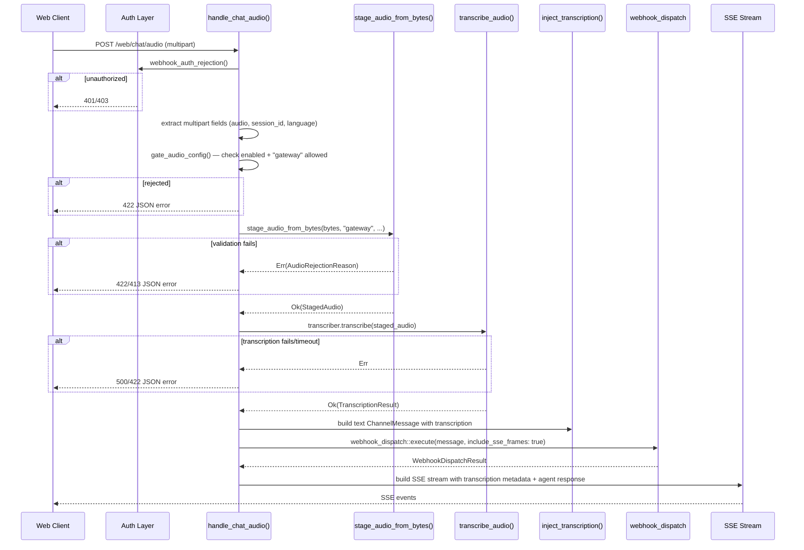
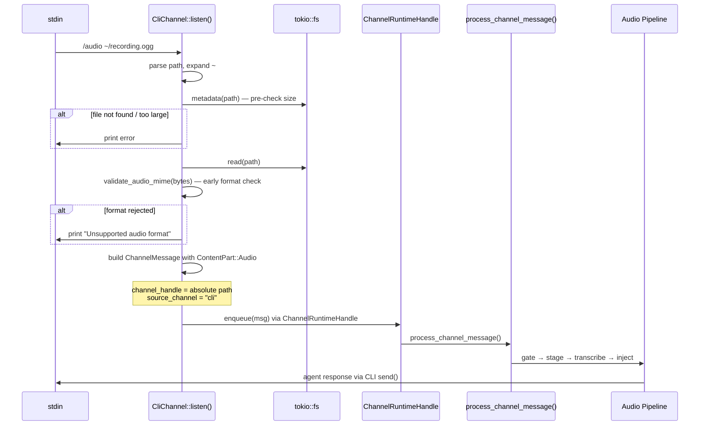

# Design: Audio Input Phase 2 — HTTP Gateway + CLI

**Change**: `audio-input-phase2`
**Issue**: #412
**Date**: 2026-04-04
**Depends on**: Phase 1 audio infrastructure (merged, commit 258d3c39)

## Technical Approach

Phase 1 delivered the full audio pipeline (gate → stage → transcribe → inject) in
`process_channel_message()`, proven through Telegram. The pipeline is channel-agnostic after
byte acquisition — only the "how do we get bytes?" step differs per channel.

Phase 2 extends audio to two new entry points:

1. **HTTP Gateway**: `POST /web/chat/audio` multipart endpoint with per-route body limit override
2. **CLI**: `/audio <path>` slash command reading local files

The design extracts a shared `stage_audio_from_bytes()` utility from Telegram's fetch-and-stage
logic so all three channels (Telegram, gateway, CLI) share one validation+staging path. Gateway
gets a dedicated axum handler with nested router body-limit override. CLI gets a new command
parsed in `CliChannel::listen()` that builds a `ChannelMessage` with `ContentPart::Audio` and
routes it through `process_channel_message()` via the `ChannelRuntimeHandle`.

## Architecture Overview

### Byte Acquisition Per Channel

```
Telegram:  Bot API getFile → HTTP download → bytes
Gateway:   multipart/form-data → axum::extract::Multipart → bytes
CLI:       /audio <path> → tokio::fs::read() → bytes
                              │
                              ▼
                  stage_audio_from_bytes(bytes, metadata)
                              │
                              ▼
               ┌──────────────────────────────┐
               │   Shared Pipeline (Phase 1)  │
               │  validate_mime → validate_size│
               │  → SHA-256 → temp file write  │
               │  → StagedAudio                │
               └──────────────┬───────────────┘
                              │
                              ▼
               process_channel_message()
               gate → stage → transcribe → inject → agent
```

### Gateway Audio Endpoint Flow



### CLI `/audio <path>` Flow



## Architecture Decisions

### Decision 1: SSE Stream Response for Gateway Audio

**Choice**: Return SSE stream (same pattern as `/web/chat/stream`), not a JSON response.

**Alternatives considered**:

1. JSON response — simpler, but blocks the client for the full transcription + agent duration
2. SSE with separate transcription event — adds a pre-response event with transcription metadata

**Rationale**: Audio processing (transcription + agent turn) takes 5–60+ seconds. A blocking JSON
response creates poor UX and timeout risk. The existing `/web/chat/stream` SSE pattern is proven
and the web client already handles SSE. By reusing the same SSE event format, the web client
needs minimal changes. A leading `transcription` SSE event carries the transcription metadata
before the agent response events begin, giving the client immediate feedback.

SSE event sequence:

```
event: transcription
data: {"text":"transcribed text","language":"es","duration_secs":12.5}

event: message
data: {"id":"...","session_id":"...","content":"agent response chunk..."}

event: done
data: {"session_id":"..."}
```

### Decision 2: CLI Routes Through `ChannelRuntimeHandle` (Full Pipeline)

**Choice**: CLI `/audio` builds a `ChannelMessage` with `ContentPart::Audio` and enqueues it
via `ChannelRuntimeHandle` into `process_channel_message()`.

**Alternatives considered**:

- **Option A (pre-pipeline)**: CLI handler does staging+transcription locally, sends only text
  through `Agent::turn()`. Simpler but bypasses the pipeline and duplicates transcription logic.
- **Option B (full pipeline, chosen)**: CLI builds an Audio message and routes through the
  channel runtime. The existing audio pipeline (gate, stage, transcribe, inject) handles everything.

**Rationale**: Option A seems simpler but has critical problems:

1. Duplicates the transcription→inject→observability logic that already exists in the pipeline
2. Bypasses `process_channel_message()` observability (audio ingress events, metrics)
3. The semaphore for concurrent transcription lives in the `Transcriber`, not the CLI handler —
   Option A would still need access to the transcriber, making the "simplicity" argument moot
4. Future audio features (language detection, confidence threshold) would need to be duplicated

The `ChannelRuntimeHandle` already exists (line 102, `channels/mod.rs`) and supports `enqueue()`.
The CLI just needs a reference to it. This requires a small change: `CliChannel::listen()` must
accept a `ChannelRuntimeHandle` for `/audio` messages instead of using the raw `mpsc::Sender`
for text messages. However, since `ChannelRuntimeHandle` wraps an `mpsc::Sender<ChannelMessage>`,
the simplest approach is to use the same `tx` sender that `listen()` already receives — audio
messages go through the same channel as text messages, both processed by
`process_channel_message()`.

**Key insight**: Regular text messages from CLI currently bypass `process_channel_message()` via
`Agent::run_interactive()` → `self.turn()` (line 1597, agent.rs). But the `/audio` command in
`listen()` sends through the `tx` sender, which feeds the channel runtime's receiver loop. This
means `/audio` goes through the full pipeline while regular text continues through the existing
direct path — **no change to the text flow**.

### Decision 3: Nested Router for Gateway Body Limit Override

**Choice**: Axum nested router with `DefaultBodyLimit::max(25 * 1024 * 1024)` for the audio route.

**Alternatives considered**:

1. Per-handler body limit via `axum::extract::DefaultBodyLimit` as layer on individual route
2. Increase global body limit to 25 MiB (weakens security for all routes)
3. Manually check Content-Length in handler (doesn't protect against slow-drip attacks)

**Rationale**: The global 64KB `RequestBodyLimitLayer` (line 1261) protects all routes from
memory exhaustion. Audio uploads need 25 MiB. A nested router with its own `DefaultBodyLimit`
layer overrides the global limit only for the audio route, preserving the 64KB protection for
all other endpoints. This is axum's recommended pattern for per-route body limits.

```rust
// Audio route with elevated body limit
let audio_router = Router::new()
    .route("/web/chat/audio", post(handle_chat_audio))
    .layer(DefaultBodyLimit::max(25 * 1024 * 1024));

// Main router — audio_router merged BEFORE global body limit layer
let app = Router::new()
    .route("/health", get(handle_health))
    // ... existing routes ...
    .merge(audio_router)  // ← merged here, gets its own body limit
    .with_state(state)
    .layer(RequestBodyLimitLayer::new(MAX_BODY_SIZE))  // 64KB global
    // ...
```

The `merge()` must happen before `.layer(RequestBodyLimitLayer)` so the audio route's
`DefaultBodyLimit` takes precedence over the global layer for that specific path.

### Decision 4: `stage_audio_from_bytes()` is Async

**Choice**: `async fn stage_audio_from_bytes()`.

**Alternatives considered**: Sync function (all operations are fast in-memory except temp file
write).

**Rationale**: The function writes to a temp file via `tokio::fs::write()`. While MIME sniffing,
size validation, and SHA-256 hashing are CPU-bound and fast (sub-millisecond for 25 MiB), the
file write must be async to avoid blocking the tokio runtime. Telegram's existing staging code
(line 1869) already uses `tokio::fs::write()`. Making the function async keeps the contract
consistent and avoids `spawn_blocking` indirection.

### Decision 5: Gateway Timeout Strategy

**Choice**: `tokio::time::timeout()` in the handler with `transcription_timeout_secs + 60s`.

**Alternatives considered**:

1. Rely on global 30s `TimeoutLayer` — too short for transcription
2. Remove global timeout and let each handler manage its own — weakens protection for other routes
3. Per-route `TimeoutLayer` via nested router — adds complexity for little benefit

**Rationale**: The global 30s timeout (line 1262-1265) protects against slow-loris attacks on
text endpoints. Audio transcription takes 5-60+ seconds. The handler wraps its processing in
`tokio::time::timeout(Duration::from_secs(config.audio.transcription_timeout_secs + 60), ...)`.
The +60s buffer accounts for multipart extraction, staging, and agent turn time beyond just
transcription. If the global `TimeoutLayer` fires first (30s), the handler returns 408 — but
for audio, the handler's own timeout will typically be the controlling limit. To avoid the global
layer conflicting, the audio route's nested router can include its own `TimeoutLayer` with the
elevated timeout, overriding the global one.

## Data Flow

### `stage_audio_from_bytes()` — Shared Staging Utility

```rust
// In src/channels/audio_media.rs
pub async fn stage_audio_from_bytes(
    bytes: &[u8],
    channel_abbrev: &str,       // "tg", "gw", "cli"
    declared_mime: Option<&str>,
    declared_duration_secs: Option<u64>,
    audio_config: &crate::config::AudioConfig,
) -> Result<StagedAudio, AudioRejectionReason> {
    // 1. Validate MIME via magic-byte sniffing
    let mime = validate_audio_mime(declared_mime, bytes)?;

    // 2. Validate size
    validate_audio_size(bytes.len() as u64, audio_config.max_audio_bytes)?;

    // 3. Validate declared duration (pre-transcription check)
    if let Some(dur) = declared_duration_secs {
        validate_audio_duration(dur, audio_config.max_audio_duration_secs)?;
    }

    // 4. Compute SHA-256
    use sha2::Digest;
    let sha256 = {
        let mut hasher = sha2::Sha256::new();
        hasher.update(bytes);
        hex::encode(hasher.finalize())
    };

    // 5. Write to temp file with secure naming
    let random_suffix: u64 = {
        use std::collections::hash_map::RandomState;
        use std::hash::{BuildHasher, Hasher};
        let s = RandomState::new();
        let mut h = s.build_hasher();
        h.write(sha256.as_bytes());
        h.finish()
    };
    let temp_path = std::env::temp_dir().join(format!(
        "corvus-{channel_abbrev}-aud-{random_suffix:016x}.{}",
        mime.file_extension()
    ));

    // Atomic creation — fails if file exists (prevents symlink attacks)
    let file = std::fs::OpenOptions::new()
        .write(true)
        .create_new(true)
        .open(&temp_path)
        .map_err(|e| {
            tracing::warn!("Failed to create temp file {}: {e}", temp_path.display());
            AudioRejectionReason::FetchFailed
        })?;
    drop(file);

    tokio::fs::write(&temp_path, bytes).await.map_err(|e| {
        tracing::warn!("Failed to stage audio to {}: {e}", temp_path.display());
        AudioRejectionReason::FetchFailed
    })?;

    // 6. Return StagedAudio
    Ok(StagedAudio {
        sha256,
        mime_type: mime,
        byte_len: bytes.len() as u64,
        duration_secs: declared_duration_secs.map(|d| d as f64),
        temp_path,
        channel_origin: channel_abbrev.to_string(),
    })
}
```

### Telegram Refactoring to Use Shared Utility

After downloading bytes (line 1828), Telegram's `fetch_and_stage_audio()` replaces lines
1831-1882 with:

```rust
// After streaming download completes (line 1828):
let audio = audio_media::stage_audio_from_bytes(
    &bytes,
    "tg",
    declared_mime,
    declared_duration_secs,
    &audio_config_from_limits(max_bytes, max_duration_secs),
).await?;
Ok(audio)
```

The pre-flight checks (lines 1750-1757: declared duration/size before download) remain in
Telegram's method since they avoid a wasted download. The shared utility handles post-download
validation.

### `stage_channel_audio()` Updates

In `src/channels/mod.rs`, line 1367-1382. Add `"gateway"` and `"cli"` match arms:

```rust
let audio = match msg.channel.as_str() {
    "telegram" => { /* existing Telegram logic */ }
    "gateway" | "cli" => {
        // For gateway and CLI, bytes are pre-loaded into ContentPart::Audio
        // via a new `raw_bytes` field. stage_audio_from_bytes() handles
        // validation and staging.
        let abbrev = if msg.channel == "gateway" { "gw" } else { "cli" };
        audio_media::stage_audio_from_bytes(
            raw_bytes,
            abbrev,
            declared_mime.as_deref(),
            *declared_duration_secs,
            &config.audio,
        )
        .await?
    }
    _ => return Ok(Vec::new()),
};
```

**Bytes transport mechanism**: Gateway and CLI have bytes in-memory at the point they build the
`ChannelMessage`. Rather than adding a `raw_bytes: Option<Vec<u8>>` field to `ContentPart::Audio`
(which would be wasteful for Telegram where bytes are fetched later), the approach is:

For **gateway**: The handler calls `stage_audio_from_bytes()` directly before building the
`ChannelMessage`, then includes the `StagedAudio` temp path in the `channel_handle` field.
The `stage_channel_audio()` function detects that `channel_handle` is an existing staged path
and returns it directly (skip re-staging).

For **CLI**: Same approach — `listen()` calls `stage_audio_from_bytes()` directly, stores the
temp path in `channel_handle`. The pipeline detects the pre-staged file.

This avoids carrying raw bytes in the `ChannelMessage` struct.

**Alternative considered**: A `pre_staged_path: Option<PathBuf>` field on `ContentPart::Audio`.
Rejected because it adds an Option field that only gateway/CLI use. Using `channel_handle` for
the temp path is a simpler convention — Telegram uses it for `file_id`, gateway/CLI use it for
the pre-staged temp path. The `stage_channel_audio()` function distinguishes by channel name.

## Interfaces / Contracts

### Gateway Audio Handler

```rust
/// POST /web/chat/audio — multipart audio upload with SSE response.
async fn handle_chat_audio(
    State(state): State<AppState>,
    ConnectInfo(peer_addr): ConnectInfo<SocketAddr>,
    headers: HeaderMap,
    mut multipart: axum::extract::Multipart,
) -> Result<
    Sse<impl futures::stream::Stream<Item = Result<Event, std::convert::Infallible>>>,
    WebhookResponse,
>
```

**Multipart fields**:

| Field        | Type | Required | Description                                   |
|--------------|------|----------|-----------------------------------------------|
| `audio`      | file | Yes      | Audio file (OGG, MP3, WAV, M4A)               |
| `session_id` | text | No       | Session identifier (auto-generated if absent) |
| `language`   | text | No       | Language hint override (e.g. "en", "es")      |

### AppState Changes

```rust
pub struct AppState {
    // ... existing fields ...
    /// Transcriber instance for audio processing (None if audio disabled).
    pub transcriber: Option<Arc<dyn Transcriber>>,
    /// Audio configuration snapshot for gateway handler.
    pub audio_config: AudioConfig,
}
```

### Error Mapping: `AudioRejectionReason` → HTTP Status

| Rejection Reason         | HTTP Status               | Error Code                  |
|--------------------------|---------------------------|-----------------------------|
| `Disabled`               | 422 Unprocessable Entity  | `audio_disabled`            |
| `ChannelNotAllowed`      | 422 Unprocessable Entity  | `audio_channel_not_allowed` |
| `MimeRejected`           | 422 Unprocessable Entity  | `audio_format_unsupported`  |
| `Oversize`               | 413 Payload Too Large     | `audio_too_large`           |
| `TooLong`                | 422 Unprocessable Entity  | `audio_too_long`            |
| `TranscriberUnavailable` | 503 Service Unavailable   | `transcriber_unavailable`   |
| `TranscriptionFailed`    | 500 Internal Server Error | `transcription_failed`      |
| `NoSpeechDetected`       | 422 Unprocessable Entity  | `no_speech_detected`        |
| `FetchFailed`            | 500 Internal Server Error | `audio_processing_failed`   |
| `SystemError`            | 500 Internal Server Error | `system_error`              |

Error response body:

```json
{
  "error": "audio_format_unsupported",
  "message": "The uploaded audio format is not supported. Accepted: OGG, MP3, WAV, M4A."
}
```

### SSE Transcription Event

```rust
#[derive(Debug, Serialize)]
struct AudioTranscriptionEvent {
    /// The transcribed text.
    text: String,
    /// Detected or forced language code.
    language: Option<String>,
    /// Audio duration in seconds.
    duration_secs: f64,
    /// Transcription processing time in milliseconds.
    processing_ms: Option<u64>,
}
```

### CLI `/audio` Command

```
/audio <path>     Transcribe audio file and send to agent
```

Path expansion:

- `~` → home directory
- Relative paths resolved against CWD
- Absolute paths used as-is

User feedback printed to stdout:

```
[Transcribing audio: recording.ogg (245 KB)...]
[Transcription (12.5s, es)]: "Buenos días, quiero preguntar sobre..."

Agent response here...
```

### Config Validation Updates

```rust
// In src/config/schema.rs
const VALID_AUDIO_CHANNELS: &[&str] = &["telegram", "gateway", "cli"];
```

Replace `PHASE1_VALID_AUDIO_CHANNELS` (line 302) with the expanded list. The validation
function (line 3354) warns on unknown channel names but does not reject — this preserves
forward compatibility for future channels.

## File Changes

| File                          | Action | Description                                                                                                                                                                                                                                         |
|-------------------------------|--------|-----------------------------------------------------------------------------------------------------------------------------------------------------------------------------------------------------------------------------------------------------|
| `Cargo.toml`                  | Modify | Add `"multipart"` to axum features list                                                                                                                                                                                                             |
| `src/channels/audio_media.rs` | Modify | Add `stage_audio_from_bytes()` shared utility function                                                                                                                                                                                              |
| `src/channels/mod.rs`         | Modify | Add `"gateway"` and `"cli"` match arms in `stage_channel_audio()`; handle pre-staged audio path convention                                                                                                                                          |
| `src/channels/cli.rs`         | Modify | Parse `/audio <path>` command; read file; validate format; build `ChannelMessage` with `ContentPart::Audio`; pre-stage via `stage_audio_from_bytes()`                                                                                               |
| `src/channels/telegram.rs`    | Modify | Refactor `fetch_and_stage_audio()` to call `stage_audio_from_bytes()` after download (lines 1831-1882 replaced)                                                                                                                                     |
| `src/gateway/mod.rs`          | Modify | Add `handle_chat_audio()` handler; create nested `audio_router` with 25 MiB body limit and elevated timeout; merge into main router; add `transcriber` and `audio_config` to `AppState`; add error mapping for `AudioRejectionReason` → HTTP status |
| `src/config/schema.rs`        | Modify | Rename `PHASE1_VALID_AUDIO_CHANNELS` → `VALID_AUDIO_CHANNELS`; add `"gateway"` and `"cli"` to list                                                                                                                                                  |
| `src/agent/agent.rs`          | Modify | In `run_interactive()`, pass `ChannelRuntimeHandle` reference to CLI for `/audio` messages (or accept that `/audio` in `listen()` already sends through the `tx` channel which feeds the runtime)                                                   |

## Testing Strategy

| Layer       | What to Test                                          | Approach                                                                            |
|-------------|-------------------------------------------------------|-------------------------------------------------------------------------------------|
| Unit        | `stage_audio_from_bytes()` — happy path all 4 formats | Call with real magic bytes, verify `StagedAudio` fields, temp file exists           |
| Unit        | `stage_audio_from_bytes()` — MIME rejection           | Call with garbage bytes, expect `MimeRejected`                                      |
| Unit        | `stage_audio_from_bytes()` — size rejection           | Call with bytes exceeding `max_audio_bytes`, expect `Oversize`                      |
| Unit        | `stage_audio_from_bytes()` — duration rejection       | Call with `declared_duration_secs` exceeding limit, expect `TooLong`                |
| Unit        | `stage_audio_from_bytes()` — temp file naming         | Verify prefix matches `corvus-{abbrev}-aud-` pattern                                |
| Unit        | CLI `/audio` path parsing                             | Test `~` expansion, relative paths, quoted paths, missing path                      |
| Unit        | CLI `/audio` non-existent file                        | Verify error message printed, no crash                                              |
| Unit        | CLI `/audio` unsupported format                       | Verify MIME rejection printed, no crash                                             |
| Unit        | Error mapping `AudioRejectionReason` → HTTP status    | Assert each variant maps to correct status code                                     |
| Unit        | SSE `AudioTranscriptionEvent` serialization           | Verify JSON structure matches contract                                              |
| Integration | Gateway endpoint happy path                           | `axum::test` with mock transcriber returning known text; verify SSE events          |
| Integration | Gateway endpoint — auth required                      | Send without bearer token, expect 401                                               |
| Integration | Gateway endpoint — audio disabled                     | Set `audio.enabled = false`, expect 422                                             |
| Integration | Gateway endpoint — channel not allowed                | Set `allowed_channels = ["telegram"]` (no "gateway"), expect 422                    |
| Integration | Gateway body limit — 25 MiB accepted                  | Upload 20 MiB file, expect success                                                  |
| Integration | Gateway body limit — 30 MiB rejected                  | Upload 30 MiB file, expect 413                                                      |
| Integration | Gateway timeout                                       | Mock transcriber that sleeps beyond timeout, expect timeout error                   |
| Integration | Telegram refactor — staging still works               | Existing Telegram audio tests pass after refactor to use `stage_audio_from_bytes()` |
| Integration | CLI `/audio` → full pipeline                          | Mock transcriber + capture agent output, verify transcription injected              |
| Integration | Transcription semaphore across channels               | Concurrent gateway + CLI audio, verify semaphore limits total concurrency           |
| Integration | Observability events from gateway                     | Capture `AudioIngressEvent` via test observer, verify channel = "gateway"           |
| Integration | Observability events from CLI                         | Capture `AudioIngressEvent` via test observer, verify channel = "cli"               |
| Integration | Config validation accepts new channels                | `validate_audio_config()` with `["telegram", "gateway", "cli"]` — no warning        |

## Migration / Rollout

No migration required.

- `[audio]` defaults to `enabled = false` — zero impact on existing deployments.
- Adding `"gateway"` or `"cli"` to `allowed_channels` is opt-in per channel.
- No database schema changes.
- No provider contract changes.
- No existing behavior modified for text or image flows.
- Rollout: operator adds `"gateway"` and/or `"cli"` to `audio.allowed_channels` in `config.toml`.
- Rollback: remove `"gateway"` / `"cli"` from `allowed_channels` — immediate effect, no restart.

The `axum/multipart` feature addition pulls in the `multer` crate (~50KB compiled). This is the
only new dependency and is acceptable for file upload support.

## Open Questions

- [x] SSE vs JSON for gateway audio → **SSE** (decided, matches existing `/web/chat/stream`)
- [x] CLI pipeline routing: Option A (pre-pipeline) vs Option B (full pipeline) → **Option B** (
  decided)
- [x] Nested router vs per-handler body limit → **Nested router** (decided)
- [x] `stage_audio_from_bytes()` async vs sync → **Async** (decided, temp file write is I/O)
- [ ] Should the gateway audio endpoint support chunked/resumable uploads for very large files?
  Recommendation: No for Phase 2 — 25 MiB limit is sufficient; resumable uploads add significant
  complexity and can be a Phase 3 enhancement.
- [ ] Should CLI `/audio` support piping from stdin (e.g., `cat file.ogg | corvus /audio -`)?
  Recommendation: No for Phase 2 — file path is sufficient; stdin piping can be added later.
