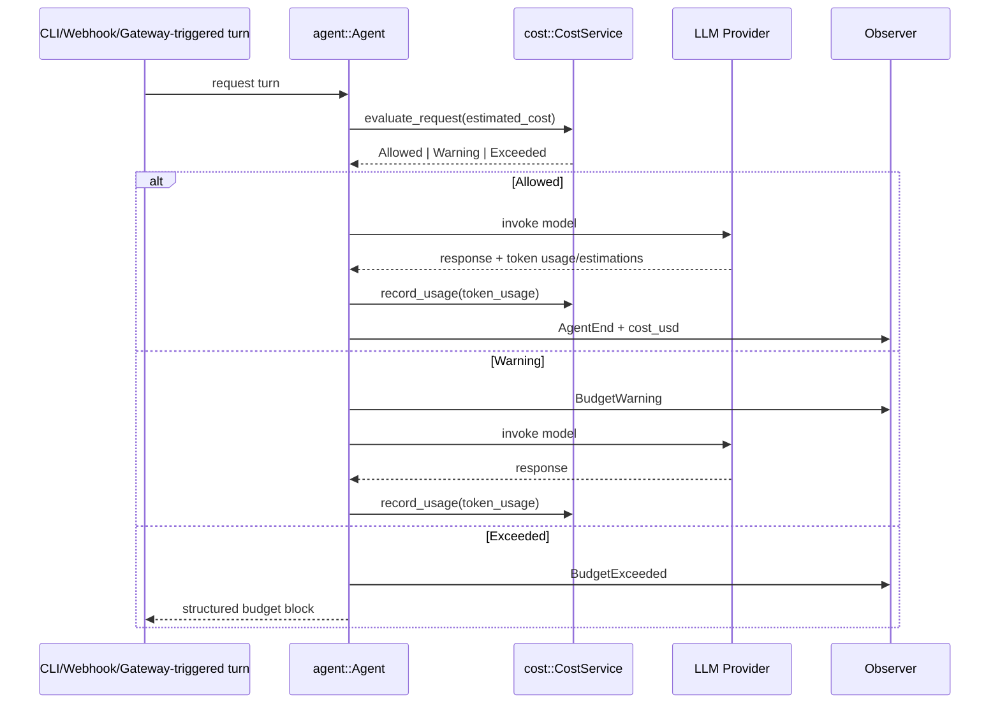
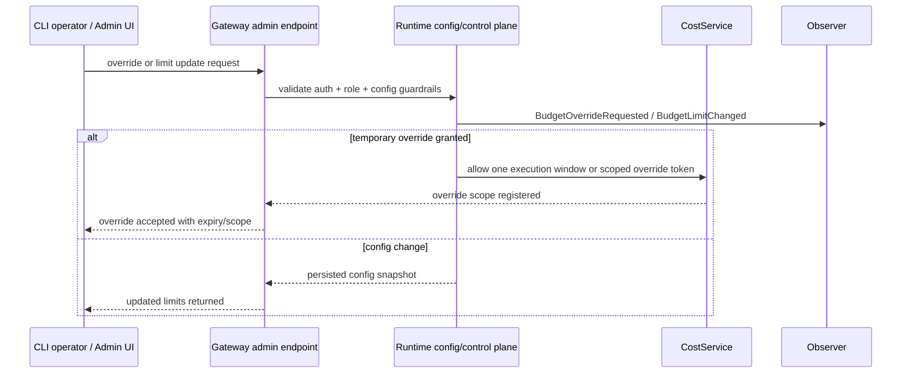

# Design: Cost Governance Productization

## Technical Approach

This change productizes the cost wiring that already exists in the runtime baseline by making the
runtime the single enforcement point for token-spend governance, then projecting that runtime state
outward through CLI, gateway admin/API, dashboard, reporting, and observability surfaces.
`CostService` is already instantiated at the runtime boundary in `clients/agent-runtime/src/bootstrap/mod.rs`
and enforced in `clients/agent-runtime/src/agent/agent.rs`, delegating to an internal `CostTracker`;
this design treats that as completed baseline
(Issue A) and focuses on the remaining architecture needed to turn runtime-local accounting into a
coherent platform feature.

The core strategy is to separate two governance concerns that are currently conflated:

1. **Token-spend governance** lives in the `cost` subsystem and is enforced by `CostService`
   over an internal `CostTracker`.
2. **Action-rate governance** lives in `SecurityPolicy` and remains a tool-execution guardrail.

All user-facing surfaces MUST consume this split model instead of re-implementing budget logic.
Gateway and dashboard remain presentation/control layers over runtime-owned state. Mission-level
accounting becomes an adapter over runtime cost records rather than a competing budget system.

## Architecture Decisions

### Decision: Split token-spend governance from action-rate governance

**Choice**: `CostService` is the runtime contract for token-spend governance, backed by
`CostTracker` as the internal source of truth for token spend, budget thresholds, overrides, and
budget history. `SecurityPolicy` continues to own tool/action-rate limits only, with
`max_cost_per_day_cents` renamed to `max_actions_per_hour`-family semantics.

**Alternatives considered**: Keep both concerns inside `SecurityPolicy`; move all governance into a
new combined "governance" module.

**Rationale**: The runtime already has working spend accounting in `clients/agent-runtime/src/cost/`.
Reusing that path avoids duplicating persistence and budget math. Keeping action-rate limits inside
`SecurityPolicy` preserves current tool-safety boundaries and prevents mixing unrelated concepts.

### Decision: Runtime evaluates budgets once; surfaces consume results

**Choice**: Budget evaluation MUST happen in runtime-owned code before LLM execution, with CLI,
gateway, dashboard, and reporting consuming persisted summaries, audit events, and admin mutation
endpoints.

**Alternatives considered**: Let each surface enforce its own limits; move checks into the gateway
only.

**Rationale**: The same agent loop can run from CLI, webhook, or future surfaces. A single
runtime-owned evaluator guarantees consistent behavior and avoids divergence in warning/block rules.

### Decision: Warning, block, and override form an audited state machine

**Choice**: Budget outcomes are modeled as `allowed -> warning -> exceeded`, with explicit override
transitions that are always operator-initiated and always audited.

**Alternatives considered**: Silent automatic override when `allow_override=true`; warning-only
behavior with no hard stop.

**Rationale**: Silent override weakens governance and breaks trust. The platform needs explainable,
reviewable transitions that can be shown in admin and reporting surfaces.

### Decision: Admin config and operational cost APIs stay separate

**Choice**: Configuration remains under `/web/admin/config`, while live spend, history, resets, and
audit/reporting use dedicated `/web/cost/*` and admin-scoped override/reset endpoints.

**Alternatives considered**: Put all cost reads/writes into `/web/admin/config`; create an entirely
separate dashboard backend.

**Rationale**: The current dashboard already reads `/web/admin/config` for configuration snapshots.
Operational spend data has different freshness, pagination, and authorization needs, so it should be
separated from static config reads.

### Decision: Mission governance adapts to runtime cost state instead of duplicating it

**Choice**: `MissionCoordinator.accumulated_cost_cents` becomes a derived mission view backed by
runtime cost records/session summaries, not an independent counter of truth.

**Alternatives considered**: Keep mission-local counters forever; fully remove mission cost fields.

**Rationale**: Mission flows still need mission-specific termination decisions, but duplicated cost
storage would reintroduce drift. A derived mission view preserves mission UX while aligning on one
accounting system.

### Decision: Deprecate the misleading config key with a compatibility alias

**Choice**: Keep reading `autonomy.max_cost_per_day_cents` through Release N+2 as a deprecated
alias, emit warnings everywhere it is loaded or displayed, and write back only the renamed field.

**Alternatives considered**: Hard break the old key immediately; keep both names indefinitely.

**Rationale**: Immediate breakage is risky for existing operators. Permanent dual naming would keep
confusion alive. A bounded alias window is the safest migration path.

## Data Flow

### System overview

```text
                 token usage + pricing
Provider ─────────────────────────────────────┐
                                              ▼
CLI / webhook / gateway / agent loop ──> Agent runtime
                                              │
                                              ├─ pre-flight budget check
                                              ├─ post-call usage record
                                              ├─ warning / exceeded / override audit
                                              └─ persisted cost history (state/costs.jsonl)
                                              │
                       ┌──────────────────────┼──────────────────────┐
                       ▼                      ▼                      ▼
                 CLI summaries          Gateway cost API       Observability events
                       │                      │                      │
                       └──────────────> Dashboard / reports <────────┘
```

### Sequence: runtime budget evaluation



### Sequence: override and admin mutation flow



### Budget evaluation flow across runtime surfaces

1. **Agent loop baseline** (`clients/agent-runtime/src/agent/agent.rs`) already performs pre-flight
   `CostService::evaluate_request()` and post-call recording through the runtime cost contract.
2. **CLI** uses the same runtime-owned tracker. The CLI surface only adds operator affordances:
   session summary on exit, `corvus cost` reads/history/reset, and explicit `--override-budget`.
3. **Gateway-triggered requests** reuse the same `Agent` path, so there is no separate gateway
   budget engine. Gateway adds API exposure and admin authorization only.
4. **Mission flows** query/derive spend from runtime tracker data so mission guardrails and global
   budgets stay aligned.
5. **Dashboard/reporting** are read models over runtime state and observer/audit events; they never
   make independent budget decisions.

## File Changes

| File | Action | Description |
|------|--------|-------------|
| `openspec/changes/2026-04-06-cost-governance-productization/design.md` | Create | Design artifact for the remaining productization work |
| `clients/agent-runtime/src/cost/tracker.rs` | Modify | Add APIs for history, reset, override scoping, and richer summaries/audit context |
| `clients/agent-runtime/src/cost/types.rs` | Modify | Add transport-friendly summary/history/audit DTOs and explicit warning/exceeded payloads |
| `clients/agent-runtime/src/cost/service.rs` | Create | Runtime-facing orchestration layer over tracker reads, resets, override evaluation, and reporting projections |
| `clients/agent-runtime/src/cost/mod.rs` | Modify | Re-export service/types used by gateway, CLI, and agent surfaces |
| `clients/agent-runtime/src/agent/agent.rs` | Modify | Replace ad hoc warning logging with first-class budget events and override-aware flow |
| `clients/agent-runtime/src/agent/mission.rs` | Modify | Derive mission cost accounting from runtime cost data instead of separate counters as source of truth |
| `clients/agent-runtime/src/config/schema.rs` | Modify | Add deprecated alias handling and clear field documentation for action-rate vs spend budgets |
| `clients/agent-runtime/src/config/mod.rs` | Modify | Normalize deprecated autonomy key during load and emit deprecation warnings |
| `clients/agent-runtime/src/security/policy.rs` | Modify | Remove misleading spend naming from `SecurityPolicy` and keep only action-rate governance |
| `clients/agent-runtime/src/main.rs` | Modify | Update CLI config/status output and add `corvus cost` / `--override-budget` surface wiring |
| `clients/agent-runtime/src/gateway/admin.rs` | Modify | Expose cost config separately from autonomy naming and support cost-specific admin updates |
| `clients/agent-runtime/src/gateway/cost.rs` | Create | Cost summary/history/reset/override/report endpoints following existing gateway module layout |
| `clients/agent-runtime/src/gateway/mod.rs` | Modify | Route new cost endpoints and include restart/validation semantics for cost config patches |
| `clients/agent-runtime/src/observability/traits.rs` | Modify | Add budget warning/exceeded/override event variants and audit payload shape |
| `clients/agent-runtime/src/observability/log.rs` | Modify | Log cost governance lifecycle without leaking sensitive payloads |
| `clients/agent-runtime/src/observability/otel.rs` | Modify | Export budget outcome and override attributes/events for tracing |
| `clients/agent-runtime/src/observability/prometheus.rs` | Modify | Add counters/gauges for warnings, blocks, overrides, and current spend snapshots where appropriate |
| `clients/web/apps/dashboard/src/types/admin-config.ts` | Modify | Extend cost/admin view models for live usage and deprecation metadata |
| `clients/web/apps/dashboard/src/composables/useAdmin.ts` | Modify | Fetch cost summary/history/reporting data alongside existing admin resources |
| `clients/web/apps/dashboard/src/composables/useCostGovernance.ts` | Create | Focused dashboard data loader for spend, history, alerts, and operator actions |
| `clients/web/apps/dashboard/src/components/config/CostOverview.vue` | Modify | Move from config-only card to config + live usage + alerts + action affordances |
| `clients/web/apps/dashboard/src/components/config/CostOverview.spec.ts` | Modify | Cover config-only fallback, live usage rendering, and alert states |

## Interfaces / Contracts

### Runtime ownership model

```ts
interface CostGovernanceState {
  config: {
    enabled: boolean;
    session_limit_usd: number;
    daily_limit_usd: number;
    monthly_limit_usd: number;
    warn_at_percent: number;
    allow_override: boolean;
  };
  summary: {
    session_cost_usd: number;
    daily_cost_usd: number;
    monthly_cost_usd: number;
    total_tokens: number;
    request_count: number;
    budget_state: "allowed" | "warning" | "exceeded";
    period?: "session" | "day" | "month" | "mission";
    percent_used_session: number;
    percent_used_daily: number;
    percent_used_monthly: number;
  };
  warnings: Array<{
    budget_state: "warning" | "exceeded";
    period: "session" | "day" | "month" | "mission";
    current_usd: number;
    projected_usd: number;
    limit_usd: number;
    percent_used: number;
    surface?: string;
    observed_at: string;
  }>;
}
```

### Operational cost API shape

```json
GET /api/web/cost/summary
{
  "summary": {
    "session_cost_usd": 1.42,
    "daily_cost_usd": 7.11,
    "monthly_cost_usd": 31.48,
    "total_tokens": 128044,
    "request_count": 63,
    "percent_used_session": 47.3,
    "percent_used_daily": 71.1,
    "percent_used_monthly": 31.48,
    "budget_state": "warning",
    "period": "day"
  },
  "config": {
    "enabled": true,
    "session_limit_usd": 3.0,
    "daily_limit_usd": 10.0,
    "monthly_limit_usd": 100.0,
    "warn_at_percent": 80,
    "allow_override": true
  }
}
```

```json
GET /api/web/cost/summary
{
  "summary": {
    "session_cost_usd": 0.92,
    "daily_cost_usd": 7.11,
    "monthly_cost_usd": 31.48,
    "total_tokens": 128044,
    "request_count": 63,
    "percent_used_session": 92.0,
    "percent_used_daily": 71.1,
    "percent_used_monthly": 31.48,
    "budget_state": "warning",
    "period": "mission"
  }
}
```

```json
GET /api/web/cost/history?period=day&window=30
{
  "period": "day",
  "points": [
    { "bucket": "2026-04-01", "cost_usd": 1.2, "tokens": 18000, "requests": 8 },
    { "bucket": "2026-04-02", "cost_usd": 2.1, "tokens": 26000, "requests": 11 }
  ],
  "totals": {
    "cost_usd": 31.48,
    "tokens": 128044,
    "requests": 63
  }
}
```

```json
POST /api/web/admin/cost/reset
{
  "scope": "session",
  "reason": "operator reset after test run"
}
```

```json
POST /api/web/admin/cost/override
{
  "scope": "next_request",
  "reason": "incident mitigation"
}
```

The acting principal is derived from the authenticated admin session on the server side. Requests
that include a client-provided `actor` field are rejected.

```json
PATCH /api/web/admin/config
{
  "cost": {
    "enabled": true,
    "daily_limit_usd": 20.0,
    "monthly_limit_usd": 250.0,
    "warn_at_percent": 75,
    "allow_override": true
  },
  "autonomy": {
    "max_actions_per_hour": 20
  }
}
```

### Audit / observability event shape

```rust
BudgetWarning {
    budget_state: BudgetState,
    period: UsagePeriod,
    current_usd: f64,
    projected_usd: f64,
    limit_usd: f64,
    percent_used: f64,
    session_id: String,
    surface: Option<String>,
}

BudgetExceeded {
    budget_state: BudgetState,
    period: UsagePeriod,
    current_usd: f64,
    projected_usd: f64,
    limit_usd: f64,
    percent_used: f64,
    session_id: String,
    surface: Option<String>,
}

BudgetOverride {
    action: BudgetOverrideAction,
    actor: String,
    scope: String,
    reason: String,
    session_id: Option<String>,
    previous_state: String,
    period: Option<UsagePeriod>,
    override_id: Option<String>,
    surface: Option<String>,
}
```

Observability outputs MUST redact sensitive governance fields before emission. In logs, metrics,
and traces: `actor` and `reason` are fully redacted, `session_id` is masked or omitted unless the
surface explicitly requires an internal correlation token, and any PII must be redacted before
recording. The runtime redaction implementation lives in the observability helpers so operators
should expect structured events without raw operator identity, free-form reasons, or directly
reusable session identifiers.

### Dashboard/reporting surface shape

The dashboard keeps the existing `CostOverview.vue` placement under config, but the component becomes
an operational panel with four conceptual zones:

1. **Policy**: enabled flag, limits, warning threshold, override policy.
2. **Current usage**: session/day/month spend, percent used, request count, tokens.
3. **Alerts**: active warning/exceeded banner and recent override/reset activity.
4. **Reporting**: trend chart plus model/session breakdown backed by history endpoints.

Reporting is intentionally API-first: the same history/report shapes should support dashboard charts,
CSV export later, and external admin/reporting tools without requiring a second backend.

## Warning / Block / Override / Audit Flow

1. **Warning**: when projected spend crosses `warn_at_percent`, the request proceeds, but the
   runtime emits a budget warning event and exposes the state in summary/history responses.
2. **Block**: when projected spend exceeds the applicable hard limit, the runtime rejects the next
   LLM request with structured budget metadata. In-flight requests are not interrupted.
3. **Override**: only available when `cost.allow_override=true` and initiated explicitly by an
   operator through CLI flag or admin API. Overrides MUST be scoped (for example, next request or
   temporary window), not global and silent.
4. **Audit**: every warning, block, override, config change, and reset emits observer events and is
   queryable via reporting-oriented history/audit responses.
5. **Surface behavior**: CLI shows immediate warning/block text; gateway returns machine-readable
   error bodies; dashboard surfaces current state and recent audit records.

## Testing Strategy

| Layer | What to Test | Approach |
|-------|-------------|----------|
| Unit | Budget threshold math, override scope expiry, deprecated config alias normalization, mission cost derivation | Extend `clients/agent-runtime/src/cost/*`, `config/*`, and `agent/mission.rs` tests with focused deterministic cases |
| Integration | Agent loop warning/block behavior, gateway cost endpoints, admin config patch semantics, reset/override audit emission | Rust integration-style tests around gateway handlers and `Agent` execution paths using temp workspace cost storage |
| E2E | Dashboard rendering of live usage/history/alerts, CLI operator flows, config migration behavior | Vitest component tests for dashboard plus targeted CLI/gateway end-to-end smoke paths in runtime tests |

### Rollback & Feature-Flag Strategy

- Budget-governance enforcement stays behind `cost.enabled` and the gateway dispatcher path, so the
  first rollback step is to disable `cost.enabled` for affected workspaces or environments.
- If a rollout causes false budget blocks, gateway instability, or noisy operator actions, revert to
  dispatcher-disabled or cost-disabled configuration before shipping code rollback.
- Roll out gradually by workspace/environment scope (or percentage of selected workspaces if an
  operator automation layer exists), then watch budget warning/exceeded rates, gateway error rates,
  and override frequency before widening exposure.
- Monitoring/alert thresholds should trigger rollback when budget-exceeded errors spike without a
  matching spend increase, gateway cost endpoints return elevated 5xx responses, or admin config
  mutations fail to propagate consistently.

### Threat / Risk Notes

- **Security:** override and reset paths are privileged actions; unexpected actor/reason exposure or
  auth bypasses require an emergency patch.
- **Runtime:** reservation/accounting bugs can over-block or under-block requests; signals include
  sudden drift between estimated and recorded spend or repeated blocked requests after resets.
- **Gateway:** dispatcher bypass or handler startup failure can silently disable governance; signals
  include legacy path usage while `cost.enabled=true`, elevated 5xx on cost endpoints, or missing
  structured budget-exceeded responses.

## Migration / Rollout

### Naming migration for `SecurityPolicy.max_cost_per_day_cents`

1. **Release N**
   - Runtime reads both `autonomy.max_cost_per_day_cents` and the new action-rate field mapping.
   - If the deprecated key is present, config loading emits a warning explaining that the field is
     action-rate governance, not token-spend governance.
   - Admin/dashboard responses include only the new action-rate name for writes and primary display,
     while optionally exposing `deprecated_fields` metadata for operator awareness.
2. **Release N+1**
   - Deprecated key remains readable but warnings are escalated in CLI/admin UX and docs.
3. **Release N+2**
   - Remove read support for `autonomy.max_cost_per_day_cents` once adoption is complete.

### Delivery sequencing

- **Issue A — Runtime wiring**: already complete baseline on main (PR #448). This design does not
  re-plan that work.
- **Issue B — CLI product surface**: add `corvus cost`, exit summaries, explicit override flow.
- **Issue C — Gateway/API surface**: add operational cost endpoints, admin mutations, and machine-
  readable block responses.
- **Issue D — Dashboard/reporting UX**: consume summary/history/audit endpoints and replace the
  config-only cost card.
- **Issue E — Naming/model cleanup**: unify mission cost accounting with tracker state and execute
  the `max_cost_per_day_cents` deprecation path.
- **Issue F — Observability/audit hardening**: add first-class observer events, OTel attributes,
  Prometheus metrics, and reporting hooks.

This sequencing keeps the current baseline stable while shipping user-visible value in thin vertical
slices from runtime outward.

## Open Questions

- [ ] Should override scope support only `next_request`, or also time-boxed/session-boxed windows?
- [ ] What operator identity source is canonical for gateway-admin audit records: paired token id,
      user label, or both?
- [ ] How much history retention/rotation is required for `state/costs.jsonl` before reporting
      becomes too expensive for long-lived runtimes?
- [ ] Should dashboard reporting include export/download in this change, or only API-ready report
      shapes for a later iteration?
