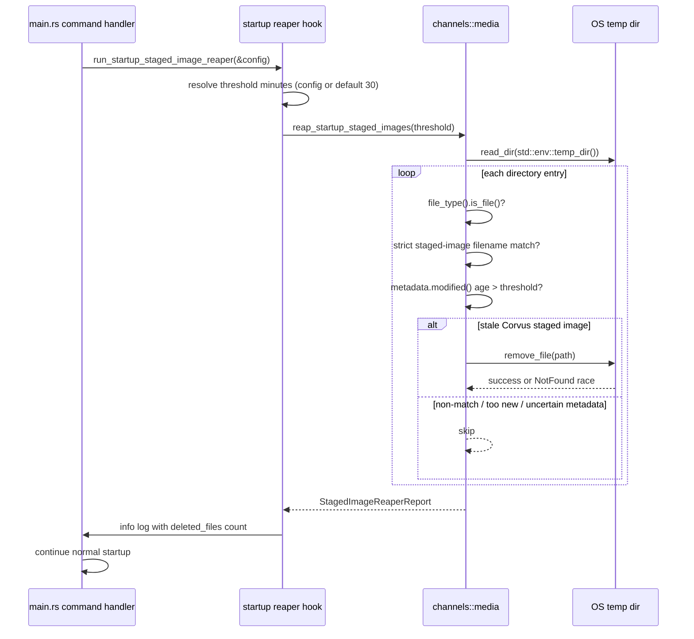

# Design: Startup Staged Image Reaper

## Technical Approach

This change adds a best-effort, startup-only staged-image reaper that is owned by
`clients/agent-runtime/src/channels/media.rs`, close to the existing staged-image lifecycle.
`main.rs` will invoke a shared startup hook before entering the long-running command paths for
`gateway`, `daemon`, `channel start`, and onboarding autostart. The reaper will scan only the OS
temp directory root, target only filenames that exactly match Corvus staged-image conventions, use
conservative modification-time checks, and log only aggregate cleanup results.

The design follows the proposal's constraints directly:

- no background thread or periodic loop
- strict matching for current shared and legacy Telegram filename formats
- optional config `multimodal.staged_image_reaper_threshold_minutes` with default 30
- duplicate execution remains non-fatal and idempotent
- uncertainty in metadata handling biases toward skipping deletion

## Architecture Decisions

### Decision: Keep the reaper in `channels/media.rs` and run it synchronously at startup

**Choice**: Implement the cleanup sweep in `clients/agent-runtime/src/channels/media.rs` as a
small synchronous filesystem pass, then call it from thin startup hooks in `clients/agent-runtime/src/main.rs`.

**Alternatives considered**: Put the logic in `main.rs`; add a background task in daemon/gateway;
attach cleanup to request handling only.

**Rationale**: `media.rs` already owns staged-image naming and lifecycle behavior, so it is the
right place for matching and deletion rules. Running once in startup handlers keeps command flow
explicit, avoids new concurrency surfaces, and satisfies the requirement to avoid a background
thread.

### Decision: Use strict filename parsing instead of broad prefix matching

**Choice**: Match only regular files whose basenames exactly fit one of these shapes:

- current shared format: `corvus-{channel}-img-{sha16}-{nonce8}.{ext}`
- legacy Telegram format: `corvus-tg-img-{sha16}.{ext}`

with `{sha16}` and `{nonce8}` restricted to lowercase hex and `{ext}` restricted to `jpg`, `png`,
or `webp`.

**Alternatives considered**: Delete any file beginning with `corvus-`; rely on extension-only
checks; use a permissive regex that allows arbitrary suffixes.

**Rationale**: False-positive deletion is the highest-risk failure mode. Exact structural matching
on the basename keeps the deletion surface narrow and aligned with the filenames Corvus actually
creates today.

### Decision: Use conservative `mtime`-based age checks and fail closed on ambiguity

**Choice**: Determine staleness from `std::fs::Metadata::modified()` and compare it with
`SystemTime::now()`. If metadata is unavailable, the timestamp is in the future, or age cannot be
computed reliably, skip the file. Treat `NotFound` during deletion as a safe race and continue.

**Alternatives considered**: Use creation time; fall back to access time; delete when metadata is
missing; fail startup on timestamp/delete errors.

**Rationale**: `modified()` is the most portable signal available in the standard library for this
runtime. It is still imperfect across platforms, so the design intentionally biases toward keeping
files rather than deleting uncertain candidates. This addresses both cross-platform behavior and
concurrent-process races.

### Decision: Make threshold configuration optional but validate explicit values

**Choice**: Add `multimodal.staged_image_reaper_threshold_minutes: Option<u64>` to
`MultimodalConfig`, use 30 minutes when unset, and reject explicit `0` values during config
validation.

**Alternatives considered**: Make the threshold mandatory; interpret `0` as disabled; add a second
boolean enable/disable flag.

**Rationale**: Optional-with-default preserves backwards compatibility and keeps operator surface
small. Rejecting `0` avoids ambiguous semantics and matches the proposal's intent that operators can
effectively disable cleanup by using a very large threshold instead of a separate control.

## Data Flow

### Startup Reaper Sequence



### Control Flow Notes

```text
Gateway command  ─┐
Daemon command   ├─> main.rs startup hook ─> media.rs reaper ─> continue command startup
Channel start    ┤
Onboard autostart┘
```

- The sweep runs once per startup path invocation.
- Repeated invocations are safe because matching is deterministic and deletion is best-effort.
- The log output reports counts only, never file names.

## File Changes

| File | Action | Description |
|------|--------|-------------|
| `clients/agent-runtime/src/channels/media.rs` | Modify | Add strict staged-image filename recognition, conservative age evaluation, best-effort temp-dir sweep, and focused unit tests using a test-local directory helper. |
| `clients/agent-runtime/src/config/schema.rs` | Modify | Extend `MultimodalConfig` with `staged_image_reaper_threshold_minutes`, add default/deserialize/validation coverage, and preserve existing backwards-compatible config behavior. |
| `clients/agent-runtime/src/main.rs` | Modify | Add a shared startup hook that invokes the reaper before gateway, daemon, channel start, and onboarding autostart flows, then logs the cleaned file count at info level. |

## Interfaces / Contracts

```rust
// clients/agent-runtime/src/config/schema.rs
pub struct MultimodalConfig {
    pub enabled: bool,
    pub allowed_channels: Vec<String>,
    pub vision_model_hint: Option<String>,
    pub max_image_bytes: Option<u64>,
    pub staged_image_reaper_threshold_minutes: Option<u64>,
}
```

```rust
// clients/agent-runtime/src/channels/media.rs
pub const DEFAULT_STAGED_IMAGE_REAPER_THRESHOLD_MINUTES: u64 = 30;

#[derive(Debug, Clone, Copy, PartialEq, Eq)]
pub struct StagedImageReaperReport {
    pub scanned_entries: usize,
    pub matched_files: usize,
    pub deleted_files: usize,
}

pub fn reap_startup_staged_images(
    threshold: std::time::Duration,
) -> StagedImageReaperReport;

fn reap_startup_staged_images_in_dir(
    dir: &std::path::Path,
    threshold: std::time::Duration,
) -> StagedImageReaperReport;

fn is_corvus_staged_image_file_name(file_name: &str) -> bool;
```

```rust
// clients/agent-runtime/src/main.rs
fn run_startup_staged_image_reaper(config: &Config) {
    let threshold_minutes = config
        .multimodal
        .staged_image_reaper_threshold_minutes
        .unwrap_or(media::DEFAULT_STAGED_IMAGE_REAPER_THRESHOLD_MINUTES);

    let report = media::reap_startup_staged_images(
        std::time::Duration::from_secs(threshold_minutes * 60),
    );

    tracing::info!(
        cleaned_files = report.deleted_files,
        matched_files = report.matched_files,
        "startup staged image reaper completed"
    );
}
```

### Behavioral Contract

- The reaper MUST inspect only the root entries of `std::env::temp_dir()`.
- The reaper MUST target only regular files with exact Corvus staged-image filename matches.
- The reaper MUST support both current shared names and legacy Telegram names.
- The reaper MUST skip files when age cannot be determined safely.
- The reaper MUST NOT fail command startup because of scan, metadata, or delete errors.
- The reaper MUST treat `NotFound` during deletion as a safe concurrent-process race.

## Testing Strategy

| Layer | What to Test | Approach |
|-------|-------------|----------|
| Unit | Current shared filename matching accepts exact shapes only | Add `media.rs` tests covering valid `corvus-{channel}-img-{sha16}-{nonce8}.{ext}` names and rejecting near-misses (wrong prefix, wrong hex length, unsupported extension, extra suffixes, non-files). |
| Unit | Legacy Telegram compatibility | Add `media.rs` tests covering `corvus-tg-img-{sha16}.{ext}` acceptance and ensuring it remains eligible for cleanup. |
| Unit | Threshold and conservative age behavior | Use a test-local directory helper in `media.rs` plus controlled file mtimes to verify old files are deleted, fresh files are retained, and future/undeterminable timestamps are skipped. |
| Unit | Duplicate execution and concurrent-process safety | Run the sweep twice against the same test directory and assert the second pass is non-fatal with zero additional deletions; include delete-race handling expectations for already-removed files. |
| Unit | Config defaults and validation | Extend `schema.rs` tests to cover missing field -> `None`, explicit value deserialization, and rejection of `staged_image_reaper_threshold_minutes = 0`. |
| Unit | Startup hook coverage | Add focused `main.rs` tests around extracted startup helpers or command-specific wrappers so gateway, daemon, channel start, and onboarding autostart all route through the same reaper hook without launching full long-running services. |
| Integration | No dedicated integration suite required | Keep verification focused on module-level tests because the behavior is a local filesystem sweep invoked from thin command handlers. |
| E2E | Not planned | Startup behavior is deterministic and low-level; E2E coverage would add cost without materially increasing confidence beyond focused unit tests. |

## Migration / Rollout

No migration required.

Rollout is immediate once the binary includes the new startup hook. Existing configs continue to
work because the new threshold field is optional and defaults to 30 minutes when omitted.

## Open Questions

- [ ] None.
