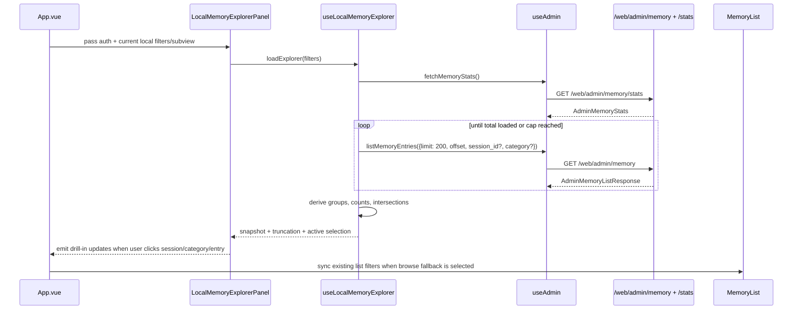

# Design: Dashboard Memory Graph Explorer

## Technical Approach

Implement the issue as a **dashboard-local visualization layer** inside the existing dashboard memory page, without changing the Rust admin contract in v1.

The current runtime already exposes the only stable structural signals needed for a first release:

- `/web/admin/memory` returns local memory entries with `id`, `key`, `content`, `category`, `timestamp`, and optional `session_id`
- `/web/admin/memory/stats` returns aggregate category/session counts
- the SQLite backend stores and lists entries by `session_id`, and runtime stats only aggregate `by_category` rather than explicit edges

Because the gateway does **not** expose relationship edges, graph nodes, or cross-session semantics, the explorer will derive relationships in the dashboard from existing entry data only:

- **Session → Memory Entry** via `session_id`
- **Category → Memory Entry** via `category`
- **Session ↔ Category** via grouped counts computed from entries in the same session

This keeps the feature aligned with the proposal constraint to prefer local dashboard shaping over backend changes, preserves the clear separation from remote Cerebro semantics already shown in `App.vue`, `MemoryStats.vue`, and the Cerebro panels, and keeps rollback additive and low-risk.

At design time, no delta spec artifact was present under `openspec/changes/dashboard-memory-graph-explorer/specs/`, so this design is grounded in the approved proposal plus code evidence from the dashboard app and runtime handlers.

## Alternatives and Recommendation

### Option A — Dashboard-local inferred explorer (recommended)

- **What**: Fetch local entries + stats, derive timeline groups and session/category relationships in the dashboard.
- **Pros**: No backend change, low risk, matches proposal, easy rollback, preserves local/remote boundary.
- **Cons**: Requires client-side pagination and data shaping; relationship graph remains intentionally inferred.

### Option B — Add a new backend graph endpoint

- **What**: Introduce a runtime endpoint that returns pre-shaped session/category/entry graph data.
- **Pros**: Simpler frontend state, fewer client transforms.
- **Cons**: Violates stated preference for dashboard-local shaping, expands gateway contract, raises testing and long-term maintenance cost, and risks implying semantics the local store does not actually own.

### Option C — Add a third-party graph/chart library for the full v1 experience

- **What**: Use a dependency such as Cytoscape/ECharts/VisX for graph and chart rendering.
- **Pros**: Rich interaction faster in the short term if requirements expand.
- **Cons**: No such dependency exists in the dashboard package today, bundle/runtime cost goes up, testing becomes heavier, and the current v1 problem can be solved with native Vue + HTML/SVG.

### Recommendation

Proceed with **Option A** and keep the dependency decision at **no new visualization dependency for v1**. If implementation reveals a specific interaction that becomes disproportionately hard with native rendering, revisit a very small chart-only dependency in a follow-up change, not in the initial implementation.

## Architecture Decisions

### Decision: Keep the runtime contract unchanged for v1

**Choice**: Reuse `/web/admin/memory` and `/web/admin/memory/stats` exactly as they exist today.

**Alternatives considered**: Add a new admin graph endpoint or extend stats to return session/category edge data.

**Rationale**: Runtime evidence shows the contract exposes entries plus aggregate stats only, and the proposal explicitly says v1 should remain inferred-only unless hard evidence forces a minimal extension. The current fields are sufficient for session/category navigation, while a new contract would encode semantics that the local memory layer does not currently claim.

### Decision: Add a dashboard-local explorer subview under Local Memory

**Choice**: Keep the top-level Memory page and existing `memoryMode` split (`local` vs `cerebro`), then add a second-level local subview such as `browse | explorer` within the local mode.

**Alternatives considered**: Replace the existing local list, add a new top-level page, or merge local visualization into the Cerebro area.

**Rationale**: `App.vue` already uses page-local state instead of router navigation and already enforces a clear local/remote split. A nested local explorer preserves the current list as fallback, minimizes navigation churn, and avoids conflating local inferred relationships with remote semantic memory.

### Decision: Keep shaping logic outside presentational components

**Choice**: Introduce a dedicated dashboard composable/helper to orchestrate fetches, pagination, caps, and inferred relationship shaping, while keeping presentational components focused on rendering.

**Alternatives considered**: Put all shaping directly in `App.vue`, or embed grouping logic separately inside each visualization component.

**Rationale**: Existing dashboard code already centralizes API behavior in `useAdmin.ts` and keeps components like `MemoryList.vue`, `MemoryStats.vue`, and `CerebroSearchPanel.vue` fairly focused. A dedicated local explorer composable/pure helper makes unit testing cheaper and prevents duplicated grouping logic across timeline, category chart, and explorer panels.

### Decision: Use native HTML/CSS/SVG rendering for v1

**Choice**: Implement the timeline, category bars, and relationship cluster view with standard Vue templates plus lightweight SVG or div-based rendering.

**Alternatives considered**: Add a chart/graph dependency immediately.

**Rationale**: `clients/web/apps/dashboard/package.json` currently has no charting dependency. The required visuals are straightforward: chronological lanes, proportional category bars, and inferred relationship clusters. Native rendering keeps the bundle and maintenance cost lower and improves testability with the current Vitest + Vue Test Utils setup.

### Decision: Explicitly cap explorer data volume in the dashboard

**Choice**: Load visualization data in paged batches from `/web/admin/memory`, with a dashboard-side cap and a visible truncation indicator when the cap is reached.

**Alternatives considered**: Always load all entries, or require a backend aggregation endpoint first.

**Rationale**: Runtime evidence shows each admin memory request is capped at 200 items and the SQLite `list()` path caps returned rows at 1000. A dashboard-side cap makes performance predictable, keeps v1 shippable, and matches the proposal risk mitigation for larger datasets.

## Component Architecture

```text
App.vue
└── Memory page
    ├── MemoryStats
    └── LocalMemoryWorkspace (new container)
        ├── MemoryFilters (existing)
        ├── LocalMemorySubviewTabs (inline in container)
        ├── MemoryList (existing browse fallback, enhanced drill-in)
        └── LocalMemoryExplorerPanel (new)
            ├── LocalMemoryTimeline (new)
            ├── LocalMemoryCategoryChart (new)
            └── LocalMemoryRelationshipExplorer (new)
```

### Component responsibilities

- **`App.vue`**
  - Keep top-level page state and `local | cerebro` mode split.
  - Add local subview state and drill-in handlers.
  - Continue to keep Cerebro components isolated.

- **`MemoryStats.vue`**
  - Continue to show local-vs-Cerebro stats separation.
  - Emit category-selection intent or expose clickable category affordances for the explorer workflow.

- **`MemoryList.vue`**
  - Remains the non-visual fallback.
  - Gains optional drill-in events (`select-session`, `select-category`, `open-explorer`) so existing rows can hand off context to the explorer.

- **`useAdmin.ts`**
  - Continue to own HTTP details and shared request bucket state.
  - Add response-returning helpers for memory stats/list pagination so explorer code can batch requests without re-implementing fetch behavior.

- **`useLocalMemoryExplorer.ts`** (new)
  - Orchestrate loading stats + paged entry slices.
  - Build derived timeline groups, category facets, session/category intersections, and filtered node lists.
  - Track truncation, active selection, and focus/drill state.

- **`LocalMemoryExplorerPanel.vue`** (new)
  - Container for explorer state, empty/loading/error states, and explanatory copy.

- **`LocalMemoryTimeline.vue`** (new)
  - Render chronological entries grouped into session lanes.
  - Highlight active category/session filters.

- **`LocalMemoryCategoryChart.vue`** (new)
  - Render category breakdown from stats.
  - Drive explorer selection/highlight when a category is clicked.

- **`LocalMemoryRelationshipExplorer.vue`** (new)
  - Render inferred cluster navigation: sessions, categories, and the entries at their intersection.
  - Emphasize this is an inferred operational view, not semantic truth.

## Data Flow

### High-level flow

```text
App.vue local state
  └─► LocalMemoryWorkspace / Explorer container
       ├─► useAdmin.fetchMemoryStats()
       ├─► useAdmin.listMemoryEntries(page by page, per_page=200)
       └─► useLocalMemoryExplorer builds:
            - timeline groups by session_id
            - category facets from stats + loaded entries
            - session/category intersections
            - filtered entry subset for current selection
```

### Sequence diagram



### Derived relationship model

```text
entry.session_id ─────► Session lane / session node
entry.category   ─────► Category facet / category node
(session_id, category) pairs
                   └──► derived intersection counts
```

No explicit edge data is persisted or requested from the backend.

## State and Interaction Model

### Source-of-truth state

- **App-level state**
  - `memoryMode: "local" | "cerebro"` (existing)
  - `localMemorySubview: "browse" | "explorer"` (new)
  - `memoryCategoryFilter`, `memorySessionIdFilter`, `memorySearchFilter` (existing, retained)
  - selected drill-in context for session/category handoff (new lightweight refs)

- **Explorer-level state**
  - `isLoading`, `error`, `isTruncated`
  - loaded `entries` and `stats`
  - `activeSessionId`, `activeCategory`
  - derived `timelineGroups`, `categoryBreakdown`, `relationshipClusters`, `visibleEntries`

### Interaction rules

1. Entering **Local Explorer** loads stats and a capped, paged snapshot of local memory.
2. Clicking a **category bar/card** highlights the category, narrows the relationship explorer, and can optionally sync the existing list filter.
3. Clicking a **session lane/node** narrows the timeline + explorer to that session and offers a handoff to the browse list.
4. Clicking an **intersection cluster** reveals the entries that belong to that session/category combination.
5. Switching back to **Browse** preserves the current local filters so operators do not lose context.
6. Switching to **Cerebro Memory** clears only remote-specific selection state, preserving the local/remote boundary already enforced in `App.vue`.

## File Changes

| File | Action | Description |
|------|--------|-------------|
| `openspec/changes/dashboard-memory-graph-explorer/design.md` | Create | Technical design artifact for the change |
| `clients/web/apps/dashboard/src/App.vue` | Modify | Add local explorer subview state, drill-in handlers, and local-only navigation wiring |
| `clients/web/apps/dashboard/src/App.spec.ts` | Modify | Cover local explorer navigation and local/remote boundary behavior |
| `clients/web/apps/dashboard/src/composables/useAdmin.ts` | Modify | Add response-returning helpers for paged local memory loading while preserving existing API usage |
| `clients/web/apps/dashboard/src/composables/useAdmin.spec.ts` | Modify | Verify new memory helper behavior, pagination params, and non-breaking legacy behavior |
| `clients/web/apps/dashboard/src/composables/useLocalMemoryExplorer.ts` | Create | Dashboard-local orchestration for batched loading and inferred relationship shaping |
| `clients/web/apps/dashboard/src/composables/useLocalMemoryExplorer.spec.ts` | Create | Unit tests for grouping, filtering, truncation, and intersection derivation |
| `clients/web/apps/dashboard/src/types/admin-sessions.ts` | Modify | Add local explorer view-model types and selection contracts |
| `clients/web/apps/dashboard/src/components/memory/MemoryStats.vue` | Modify | Make local category breakdown interactive for explorer drill-in while preserving remote stats separation |
| `clients/web/apps/dashboard/src/components/memory/MemoryStats.spec.ts` | Modify | Cover clickable local category interaction and continued local/remote separation |
| `clients/web/apps/dashboard/src/components/memory/MemoryList.vue` | Modify | Add drill-in affordances/events from rows or badges into the explorer without replacing the list |
| `clients/web/apps/dashboard/src/components/memory/MemoryList.spec.ts` | Modify | Cover new drill-in events and filter handoff behavior |
| `clients/web/apps/dashboard/src/components/memory/LocalMemoryExplorerPanel.vue` | Create | Container for local visualization states and explanatory copy |
| `clients/web/apps/dashboard/src/components/memory/LocalMemoryExplorerPanel.spec.ts` | Create | Component integration tests for loading/error/truncation and coordinated selections |
| `clients/web/apps/dashboard/src/components/memory/LocalMemoryTimeline.vue` | Create | Timeline lane rendering grouped by session and ordered chronologically |
| `clients/web/apps/dashboard/src/components/memory/LocalMemoryCategoryChart.vue` | Create | Native chart-like category breakdown visualization for local memory only |
| `clients/web/apps/dashboard/src/components/memory/LocalMemoryRelationshipExplorer.vue` | Create | Inferred relationship cluster navigator for sessions, categories, and entries |
| `clients/web/apps/dashboard/src/components/memory/CerebroTimelinePanel.vue` | Modify | Copy-only clarification if needed so remote semantic timeline remains explicitly Cerebro-only |

## Interfaces / Contracts

### Existing backend contract used as-is

```ts
export interface AdminMemoryEntry {
  id: string;
  key: string;
  content: string;
  category: string;
  timestamp: string;
  session_id?: string | null;
  score?: number | null;
}

export interface AdminMemoryStats {
  total_entries: number;
  by_category: Record<string, number>;
  total_sessions: number;
  active_sessions: number;
  backend: string;
  cerebro_configured: boolean;
}
```

### New dashboard-local view models

```ts
export type LocalMemorySubview = "browse" | "explorer";

export interface LocalMemoryExplorerSelection {
  sessionId?: string;
  category?: string;
  entryId?: string;
}

export interface LocalMemoryTimelineGroup {
  sessionId: string | null;
  label: string;
  entryCount: number;
  firstTimestamp: string;
  lastTimestamp: string;
  categories: Record<string, number>;
  entries: AdminMemoryEntry[];
}

export interface LocalMemoryCategoryFacet {
  category: string;
  total: number;
  sessionCount: number;
  isActive: boolean;
}

export interface LocalMemoryRelationshipCluster {
  sessionId: string | null;
  category: string;
  count: number;
  entries: AdminMemoryEntry[];
}

export interface LocalMemoryExplorerSnapshot {
  entries: AdminMemoryEntry[];
  stats: AdminMemoryStats | null;
  timelineGroups: LocalMemoryTimelineGroup[];
  categoryFacets: LocalMemoryCategoryFacet[];
  relationshipClusters: LocalMemoryRelationshipCluster[];
  selection: LocalMemoryExplorerSelection;
  loadedEntries: number;
  totalEntries: number;
  isTruncated: boolean;
}
```

### `useAdmin` extension shape

```ts
export interface MemoryVisualizationParams {
  category?: string;
  session_id?: string;
  page?: number;
  per_page?: number;
}

interface UseAdminApi {
  fetchMemoryEntries(params?: MemoryListParams): Promise<void>; // existing behavior retained
  listMemoryEntries(params?: MemoryListParams): Promise<AdminMemoryListResponse | null>; // new
  fetchMemoryStats(): Promise<AdminMemoryStats | null>; // return value added, ref behavior retained
}
```

### Loading algorithm

```ts
const MEMORY_EXPLORER_PAGE_SIZE = 200;
const MEMORY_EXPLORER_MAX_ENTRIES = 600; // final value can be tuned during implementation
```

- Load first page.
- Continue paging while:
  - `loadedEntries < totalEntries`
  - `loadedEntries < MEMORY_EXPLORER_MAX_ENTRIES`
- If cap is hit before total is loaded, set `isTruncated = true` and show an operator-facing notice.

## Dependency Decision

**Decision**: do not add a new visualization dependency in v1.

**Why**:
- the dashboard package currently has no charting/graph dependency
- the required visuals are simple enough for Vue + CSS/SVG
- bundle size, accessibility, and testability stay easier to control
- the proposal explicitly allows a library only if it materially reduces complexity; current evidence does not force one

If a future follow-up needs pan/zoom, force layout, or large graph virtualization, re-evaluate then with a targeted dependency review.

## Testing Strategy

| Layer | What to Test | Approach |
|-------|-------------|----------|
| Unit | Explorer derivation logic (timeline grouping, category facets, session/category intersections, truncation state) | Add focused Vitest coverage for `useLocalMemoryExplorer.spec.ts` with synthetic entry fixtures |
| Unit | `useAdmin` response-returning helpers | Extend `useAdmin.spec.ts` to verify pagination query params, returned payloads, and legacy ref updates |
| Component | Local explorer container states | Mount `LocalMemoryExplorerPanel.vue` with mocked composable/admin responses and assert loading, empty, error, and truncation notices |
| Component | Timeline rendering and selection | Verify entries are ordered chronologically, grouped by session, and visually react to selected category/session |
| Component | Category chart interactions | Verify clicking a category updates selection and does not affect Cerebro components |
| Component | Relationship explorer drill-in | Verify session/category intersections surface the right entry subset and emit handoff events |
| Component | Existing surfaces remain stable | Extend `MemoryStats.spec.ts`, `MemoryList.spec.ts`, and `App.spec.ts` to prove browse fallback and local/remote tab boundaries still behave correctly |
| E2E | Optional follow-up smoke path only if Playwright coverage is already practical in dashboard | Navigate to Memory → Local Explorer, select a category, drill into a session, then return to Browse with filters intact |

## Migration / Rollout

No migration required.

Rollout is additive and dashboard-local:

1. Ship the explorer as a **secondary local subview** under the existing Memory page.
2. Keep the current `MemoryList` as the stable fallback and operator escape hatch.
3. Preserve the existing top-level Local vs Cerebro tabs and make local explanatory copy explicit.
4. If implementation reveals a dataset-size or UX issue, rollback is limited to removing the explorer subview and new components; existing memory list/stats remain intact.

## Risks

- **Local/remote semantics confusion**: Operators may confuse inferred local relationships with Cerebro semantic relationships. Mitigation: explicit labels, explanatory copy, and keeping the explorer physically under Local Memory only.
- **Large dataset rendering cost**: Admin memory responses are paginated and SQLite list paths cap around 1000 rows. Mitigation: batch loading with a dashboard cap, truncation banner, and selection-first rendering.
- **Composable sprawl**: Adding shaping logic to the wrong place could bloat `App.vue` or `useAdmin.ts`. Mitigation: isolate visualization-specific transforms in `useLocalMemoryExplorer.ts`.
- **Interaction creep**: Requests may drift toward a true graph editor or semantic explorer. Mitigation: enforce session/category/entry relationships only in v1.
- **Spec alignment**: No delta spec artifact was present during design. Mitigation: ensure the tasks phase reconciles naming and acceptance checks against the spec once written.

## Open Questions

- [ ] Should the local explorer default to `browse` or open directly into `explorer` when the user arrives from a session-memory drill-in? Recommendation: open `explorer` only for explicit visualization handoff, otherwise default to `browse`.
- [ ] What exact dashboard-side cap (`400`, `600`, `800`) gives the best balance between fidelity and responsiveness? Recommendation: start at `600` and adjust during implementation based on test fixtures.
- [ ] Should `MemoryStats.vue` emit selection events directly, or should the explorer render its own dedicated interactive category chart while `MemoryStats` remains summary-only? Recommendation: keep `MemoryStats` lightly interactive only if the UX stays obvious; otherwise place the primary click target inside the explorer panel.
