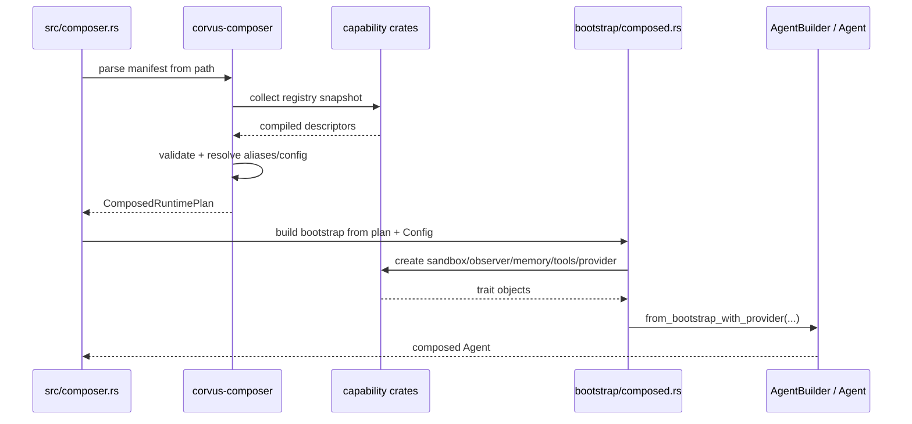
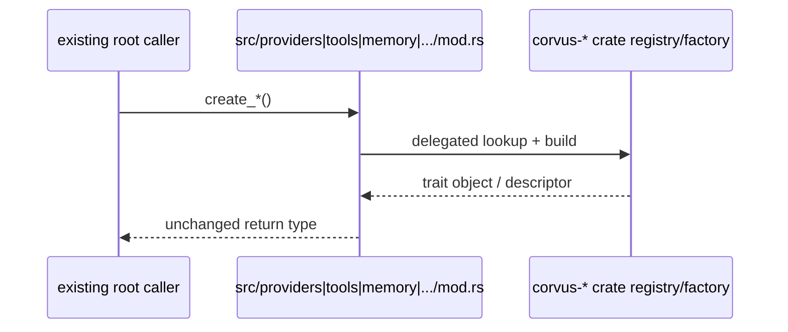

# Design: Capability-Based Agent Composition

## Technical Approach

This change delivers a boot-time composition MVP for `clients/agent-runtime` by moving capability discovery and construction into reusable capability crates, then resolving a PRD-aligned manifest into the existing runtime `AgentBuilder` path.

The design explicitly keeps the current monolithic bootstrap as the behavioral baseline:

- `src/bootstrap/mod.rs` remains the source of truth for full-runtime assembly.
- `src/agent/agent.rs` remains the only path that constructs `Agent` instances.
- Root runtime modules (`src/providers/mod.rs`, `src/tools/mod.rs`, `src/memory/mod.rs`, `src/observability/mod.rs`, `src/security/mod.rs`, and channel registry code in `src/channels/mod.rs`) stay in place as compatibility shims.
- Full runtime inversion, generalized dependency solving, and execution-pipeline replacement are deferred.

The MVP adds one new path beside the existing one:

1. parse manifest in `corvus-composer`
2. validate against live compiled registries from capability crates
3. resolve selected capabilities into a `ComposedRuntimePlan`
4. materialize runtime objects through compatibility shims / crate factories
5. feed the resolved provider, tools, memory, observer, and security-backed bootstrap state into `AgentBuilder`

That gives us real composition without rewriting the agent loop, gateway, or channel execution architecture.

## Current vs Target Architecture

### Current architecture

Today the runtime is partially extracted but still fundamentally monolithic:

- `crates/corvus-traits` already holds shared provider/channel/tool/memory/security contracts.
- Capability crates such as `crates/corvus-providers`, `crates/corvus-tools`, and peers are thin re-export shells with no real registry or factory behavior.
- Root runtime modules own construction:
  - providers: `src/providers/mod.rs`
  - tools: `src/tools/mod.rs`
  - memory: `src/memory/mod.rs`
  - observer: `src/observability/mod.rs`
  - sandbox/security: `src/security/detect.rs`
  - channels: registry and builder tables inside `src/channels/mod.rs`
- `src/bootstrap/mod.rs` assembles memory, observer, runtime, sandbox, tools, and cost tracking into `BootstrapContext`.
- `Agent::from_bootstrap_with_provider` in `src/agent/agent.rs` is the real integration point into `AgentBuilder`.
- `crates/corvus-composer/src/lib.rs` still uses stale hardcoded capability lists and a placeholder `into_agent_builder()` implementation.
- Existing capability descriptors under `src/capabilities/` are M2 tool-descriptor infrastructure only; they do not provide family-wide composition.

### Target architecture for this change

This change keeps the root runtime intact but makes extracted crates the reusable source of truth for capability availability and construction:

```text
PRD manifest
   │
   ▼
corvus-composer
  - parse v1 TOML
  - validate against live registries
  - resolve selected capabilities
   │
   ▼
ComposedRuntimePlan
   │
   ├── corvus-providers registry/factory
   ├── corvus-channels registry/factory
   ├── corvus-tools registry/factory
   ├── corvus-memory registry/factory
   ├── corvus-observability registry/factory   (new)
   └── corvus-security registry/factory
   │
   ▼
root compatibility shims + bootstrap helpers
   │
   ▼
Agent::from_bootstrap_with_provider / AgentBuilder
```

Key constraint: the target is still boot-time wiring into the existing runtime. It is NOT a full inversion where agent, channel, gateway, and bootstrap all become registry-driven first-class runtimes.

## Crate Topology

### Current topology

```text
clients/agent-runtime/
├── Cargo.toml
├── crates/
│   ├── corvus-traits/
│   ├── corvus-providers/       # thin re-export
│   ├── corvus-channels/        # thin re-export
│   ├── corvus-tools/           # thin re-export
│   ├── corvus-memory/          # thin re-export
│   ├── corvus-security/        # thin re-export
│   ├── corvus-composer/        # placeholder manifest + validation
│   └── robot-kit/
└── src/
    ├── bootstrap/mod.rs        # real assembly
    ├── agent/agent.rs          # real AgentBuilder integration
    ├── providers/mod.rs        # real provider factory
    ├── channels/mod.rs         # real channel registry/builders
    ├── tools/mod.rs            # real tool factory
    ├── memory/mod.rs           # real memory factory
    ├── observability/mod.rs    # real observer factory
    └── security/detect.rs      # real sandbox factory
```

### Target topology for MVP

```text
clients/agent-runtime/
├── Cargo.toml
├── crates/
│   ├── corvus-traits/
│   ├── corvus-providers/
│   │   ├── src/lib.rs
│   │   ├── src/registry.rs
│   │   └── src/factory.rs
│   ├── corvus-channels/
│   │   ├── src/lib.rs
│   │   ├── src/registry.rs
│   │   └── src/factory.rs
│   ├── corvus-tools/
│   │   ├── src/lib.rs
│   │   ├── src/registry.rs
│   │   └── src/factory.rs
│   ├── corvus-memory/
│   │   ├── src/lib.rs
│   │   ├── src/registry.rs
│   │   └── src/factory.rs
│   ├── corvus-observability/   # new
│   │   ├── Cargo.toml
│   │   └── src/lib.rs
│   ├── corvus-security/
│   │   ├── src/lib.rs
│   │   ├── src/registry.rs
│   │   └── src/factory.rs
│   ├── corvus-composer/
│   │   ├── src/lib.rs
│   │   ├── src/manifest.rs
│   │   ├── src/registry_snapshot.rs
│   │   ├── src/resolver.rs
│   │   └── src/plan.rs
│   └── robot-kit/
└── src/
    ├── bootstrap/mod.rs
    ├── bootstrap/composed.rs   # new helper path, not replacement
    ├── composer.rs
    ├── providers/mod.rs        # shim -> crate-backed registry/factory
    ├── channels/mod.rs         # shim -> crate-backed registry/factory
    ├── tools/mod.rs            # shim -> crate-backed registry/factory
    ├── memory/mod.rs           # shim -> crate-backed registry/factory
    ├── observability/mod.rs    # shim -> crate-backed registry/factory
    └── security/mod.rs         # shim -> crate-backed registry/factory
```

## Architecture Decisions

### Decision: Preserve `AgentBuilder` and bootstrap as the integration target

**Choice**: Resolve manifest-selected capabilities into the existing `BootstrapContext`/`AgentBuilder` path instead of creating a new runtime construction pipeline.

**Alternatives considered**:
- Build a new `ComposedAgent` runtime parallel to `Agent`
- Make registries the only assembly mechanism immediately
- Fully invert bootstrap, channels, and gateway in one change

**Rationale**: `Agent::from_bootstrap_with_provider` already encapsulates the runtime’s real wiring contract. Reusing it minimizes drift, preserves parity, and matches the architecture spec requirement that the centralized bootstrap path remains the compatibility baseline.

### Decision: Make extracted capability crates the source of truth for compiled availability

**Choice**: Capability crates expose registries and factories; `corvus-composer` validates manifests against those live registries rather than hardcoded constant tables.

**Alternatives considered**:
- Keep validation tables in `corvus-composer`
- Infer availability from file names or Cargo features only
- Continue using root-module static matches as the only registry

**Rationale**: Hardcoded composer tables are already stale. Composition must reflect what is compiled into the binary, not what documentation or constants claim exists.

### Decision: Keep root runtime modules as compatibility shims

**Choice**: Existing public construction functions in root modules remain callable, but delegate into capability-crate registries/factories where practical.

**Alternatives considered**:
- Move all factory logic out of root modules immediately
- Delete root factories and force all callers onto new registries

**Rationale**: Root modules are used widely across bootstrap, channel startup, and tests. Shims let implementation move underneath stable call sites and make rollback a matter of path selection, not repository-wide repair.

### Decision: Limit MVP composition to boot-time selection, not runtime inversion

**Choice**: Composition decides what gets built at startup. It does not change how the agent loop, tool dispatch, gateway, or channel runtime execute after construction.

**Alternatives considered**:
- Dynamic plugin loading
- Runtime hot-swapping
- Dependency graph execution orchestration in this change

**Rationale**: This follows the PRD non-goals and the capability architecture migration boundary. It keeps scope small, reversible, and testable.

### Decision: Add `corvus-observability` now

**Choice**: Introduce a dedicated observability crate during this change instead of leaving observer creation in the root module.

**Alternatives considered**:
- Leave observers unextracted for now
- Fold observers into `corvus-composer` or `corvus-traits`

**Rationale**: Observers are a first-class capability family in the PRD target topology. Deferring them would leave the composition story incomplete and keep a critical family outside registry-backed validation.

### Decision: Separate manifest resolution from object materialization

**Choice**: `corvus-composer` produces a typed runtime plan first, then root runtime code materializes that plan into trait objects.

**Alternatives considered**:
- Have `corvus-composer` directly depend on the root crate and instantiate runtime objects
- Parse TOML directly inside `src/composer.rs`

**Rationale**: A resolution plan keeps `corvus-composer` reusable, testable, and free from unnecessary heavy runtime coupling. It also gives a stable seam for future build-time composition.

## Registry API Shapes

The registry API stays intentionally simple for MVP: descriptive metadata + deterministic factory entrypoints.

### Shared registry patterns

```rust
pub struct CapabilityDescriptor {
    pub key: &'static str,
    pub display_name: &'static str,
    pub compiled: bool,
    pub aliases: &'static [&'static str],
}

pub struct RegistrySnapshot {
    pub providers: &'static [ProviderDescriptor],
    pub channels: &'static [ChannelDescriptor],
    pub tools: &'static [ToolDescriptor],
    pub memory_backends: &'static [MemoryDescriptor],
    pub observers: &'static [ObserverDescriptor],
    pub sandboxes: &'static [SandboxDescriptor],
}
```

### Provider registry/factory

```rust
pub struct ProviderFactoryContext<'a> {
    pub api_key: Option<&'a str>,
    pub api_url: Option<&'a str>,
    pub runtime_options: &'a ProviderRuntimeOptions,
    pub provider_config: Option<&'a toml::Value>,
}

pub struct ProviderDescriptor {
    pub key: &'static str,
    pub display_name: &'static str,
    pub aliases: &'static [&'static str],
    pub feature: &'static str,
    pub supports_native_tools: bool,
}

pub fn list_providers() -> &'static [ProviderDescriptor];
pub fn resolve_provider_key(name: &str) -> Option<&'static str>;
pub fn create_provider(
    key: &str,
    ctx: &ProviderFactoryContext<'_>,
) -> anyhow::Result<Box<dyn Provider>>;
```

### Channel registry/factory

```rust
pub struct ChannelFactoryContext<'a> {
    pub root_config: &'a Config,
    pub channel_config: Option<&'a toml::Value>,
}

pub struct ChannelDescriptor {
    pub key: &'static str,
    pub display_name: &'static str,
    pub feature: &'static str,
}

pub fn list_channels() -> &'static [ChannelDescriptor];
pub fn create_channel(
    key: &str,
    ctx: &ChannelFactoryContext<'_>,
) -> anyhow::Result<Option<Arc<dyn Channel>>>;
```

### Tool registry/factory

```rust
pub struct ToolFactoryContext<'a> {
    pub root_config: Arc<Config>,
    pub security: &'a Arc<SecurityPolicy>,
    pub runtime: Arc<dyn RuntimeAdapter>,
    pub sandbox: Arc<dyn Sandbox>,
    pub memory: Arc<dyn Memory>,
    pub workspace_dir: &'a Path,
    pub tool_config: Option<&'a toml::Value>,
}

pub struct ToolDescriptor {
    pub key: &'static str,
    pub display_name: &'static str,
    pub feature: &'static str,
    pub risk_tags: &'static [&'static str],
}

pub fn list_tools() -> &'static [ToolDescriptor];
pub fn create_tool(
    key: &str,
    ctx: &ToolFactoryContext<'_>,
) -> anyhow::Result<Option<Box<dyn Tool>>>;
```

### Memory / observer / security registries

```rust
pub fn list_memory_backends() -> &'static [MemoryDescriptor];
pub fn create_memory(
    key: &str,
    ctx: &MemoryFactoryContext<'_>,
) -> anyhow::Result<Arc<dyn Memory>>;

pub fn list_observers() -> &'static [ObserverDescriptor];
pub fn create_observer(
    key: &str,
    ctx: &ObserverFactoryContext<'_>,
) -> anyhow::Result<Arc<dyn Observer>>;

pub fn list_sandboxes() -> &'static [SandboxDescriptor];
pub fn create_sandbox(
    key: &str,
    ctx: &SandboxFactoryContext<'_>,
) -> anyhow::Result<Arc<dyn Sandbox>>;
```

These APIs are deliberately family-specific. The design does not collapse all runtime construction into one generic mega-registry.

## Composer Resolution Flow into `AgentBuilder`

### Resolution stages

1. **Parse manifest**
   - `corvus-composer` parses PRD v1 TOML sections.
2. **Snapshot compiled registries**
   - composer gathers descriptors from capability crates.
3. **Validate manifest**
   - canonicalize aliases
   - reject unknown/disabled capabilities
   - reject invalid default provider / invalid sandbox / invalid tool restrictions
4. **Build `ComposedRuntimePlan`**
   - selected provider key + provider config
   - selected tool keys + per-tool config
   - selected channel keys + default channel
   - memory backend key + config
   - observer keys/config (MVP: single primary observer plus optional fan-out later)
   - sandbox/security selection
   - loop/identity overrides
5. **Materialize composed bootstrap state**
   - create sandbox first
   - create observer and memory
   - create runtime adapter
   - create selected tools
   - create selected provider
6. **Feed existing runtime path**
   - pass resolved objects into `Agent::from_bootstrap_with_provider` or an equivalent helper that wraps `AgentBuilder`

### Sequence diagram



### Integration boundary

The new plan-to-bootstrap path should look like this conceptually:

```rust
pub struct ComposedRuntimePlan {
    pub provider: SelectedProvider,
    pub channels: Vec<SelectedChannel>,
    pub default_channel: Option<String>,
    pub tools: Vec<SelectedTool>,
    pub memory: SelectedMemory,
    pub observer: SelectedObserver,
    pub security: SelectedSecurity,
    pub loop_config: LoopOverrides,
    pub identity: IdentityOverrides,
}

pub fn build_composed_agent(config: &Config, plan: ComposedRuntimePlan) -> Result<Agent> {
    let bootstrap = bootstrap::composed::from_plan(config, &plan)?;
    let provider = bootstrap::composed::create_provider_from_plan(config, &plan)?;
    Agent::from_bootstrap_with_provider(config, bootstrap, provider)
}
```

This keeps `AgentBuilder` unchanged. Composition changes inputs, not the agent construction contract.

## Data Flow

### Current monolithic path

```text
Config
  │
  ├── providers::create_routed_provider()
  ├── security::create_sandbox()
  ├── observability::create_observer()
  ├── memory::create_memory()
  └── tools::all_tools_with_runtime()
          │
          ▼
    bootstrap::BootstrapContext
          │
          ▼
Agent::from_bootstrap_with_provider()
          │
          ▼
AgentBuilder::build()
```

### Target composed path

```text
Config + AgentManifest
        │
        ▼
corvus-composer::resolve()
        │
        ▼
ComposedRuntimePlan
        │
        ├── selected provider
        ├── selected channels
        ├── selected tools
        ├── selected memory backend
        ├── selected observer(s)
        └── selected sandbox
        │
        ▼
bootstrap::composed::from_plan()
        │
        ▼
Agent::from_bootstrap_with_provider()
        │
        ▼
existing runtime loop
```

### Compatibility shim flow



## Compatibility Shims

The compatibility strategy is central to this design.

### Root module behavior after change

- `src/providers/mod.rs`
  - keeps `create_provider`, `create_routed_provider`, `create_resilient_provider`
  - provider selection metadata and alias rules move toward `corvus-providers`
  - root functions delegate to crate factories and keep return types unchanged
- `src/channels/mod.rs`
  - `CHANNEL_REGISTRY`, `build_channel`, and `configured_channel_entries` become crate-backed or derive from crate descriptors
  - channel startup logic remains in root because execution orchestration is out of scope
- `src/tools/mod.rs`
  - `default_tools*` and `all_tools*` become selectors over crate-backed tool registry entries
- `src/memory/mod.rs`
  - backend classification can remain local initially, but backend creation delegates to `corvus-memory`
- `src/observability/mod.rs`
  - creation delegates to new `corvus-observability`
- `src/security/detect.rs` / `src/security/mod.rs`
  - sandbox descriptor listing and explicit backend creation delegate to `corvus-security`

### Why shims stay in MVP

They preserve:

- public function signatures already used by runtime code and tests
- a fast rollback lever
- behavioral parity with existing entrypoints
- room to migrate call sites incrementally in later phases

## Manifest Model and Resolution Rules

The manifest must move from the current flat shape to the PRD v1 shape.

### Current mismatch

Current `AgentManifest` shape in `corvus-composer` uses fields like:

- top-level `version`, `name`
- `[providers] providers = []`
- `[channels] channels = []`
- `[tools] tools = []`
- single `[observer]`

That does not match the PRD structure and cannot express per-capability nested config consistently.

### Target MVP manifest shape

```toml
[agent]
name = "support-bot"
version = "0.1.0"
description = "..."

[providers]
enabled = ["anthropic", "openai"]
default = "anthropic"

[providers.anthropic]
model = "claude-sonnet-4-20250514"

[channels]
enabled = ["slack"]
default = "slack"

[tools]
enabled = ["shell", "http_request", "memory_recall"]

[memory]
backend = "sqlite"

[observability]
enabled = ["log"]

[security]
sandbox = "bubblewrap"
```

### MVP resolution rules

- Providers, channels, tools, memory backends, observers, and sandboxes are canonicalized through live registries.
- Alias normalization happens before validation.
- Validation remains deterministic and local to compiled capabilities.
- Tool config and sandbox config are validated structurally in MVP; cross-family dependency solving remains deferred.
- Channel declarations are part of the resolved plan, but channel runtime orchestration remains on the existing root runtime path.

## Cargo Feature Strategy

Cargo features serve two purposes here: preserve the full monolith and allow smaller composed builds later.

### Family crate strategy

Each capability crate adopts this pattern:

- `default = []`
- per-capability feature flags (`anthropic`, `openai`, `slack`, `shell`, `sqlite`, `log`, `bubblewrap`, etc.)
- `all = [...]` feature enabling every implementation in that family

Example:

```toml
[features]
default = []
anthropic = []
openai = []
openrouter = []
ollama = []
all = ["anthropic", "openai", "openrouter", "ollama"]
```

### Root crate strategy

The root `corvus` package keeps today’s behavior by default:

```toml
[dependencies]
corvus-providers = { path = "crates/corvus-providers", default-features = false, features = ["all"] }
corvus-channels = { path = "crates/corvus-channels", default-features = false, features = ["all"] }
corvus-tools = { path = "crates/corvus-tools", default-features = false, features = ["all"] }
corvus-memory = { path = "crates/corvus-memory", default-features = false, features = ["all"] }
corvus-observability = { path = "crates/corvus-observability", default-features = false, features = ["all"] }
corvus-security = { path = "crates/corvus-security", default-features = false, features = ["all"] }
```

Then root features remain backward compatible:

- existing operational features like `hardware`, `mcp-runtime`, `sandbox-landlock`, `sandbox-bubblewrap` stay intact
- a new aggregate feature like `capabilities-full` may wrap the family `all` flags
- later build-oriented workflows may forward per-capability features, but the MVP does not require full generated feature plumbing to land boot-time composition

### MVP compiled-availability rule

Boot-time composition runs inside the already compiled binary. Therefore:

- manifest validation checks the compiled registry snapshot, not hypothetical feature support
- `corvus agent run --manifest ...` fails fast if a requested capability is known in schema but not compiled into the current binary
- the monolithic default build still compiles everything, so current users see no regression

## Migration Sequence

### Phase 1: finish capability family extraction

- add `crates/corvus-observability`
- add real descriptor/lookup/factory modules to each capability crate
- move family metadata tables into those crates
- keep root callers unchanged

### Phase 2: install compatibility shims

- root modules delegate construction to crate factories
- preserve current function names and return types
- add regression tests proving shim outputs match previous behavior

### Phase 3: align composer manifest and validation

- split `corvus-composer` into manifest, snapshot, resolver, and plan modules
- replace hardcoded `KNOWN_*` arrays with registry snapshot reads
- adopt PRD v1 TOML layout

### Phase 4: add boot-time composition MVP

- add `bootstrap::composed` helper(s)
- resolve `ComposedRuntimePlan` into selected runtime components
- wire `src/composer.rs` `run` path to build and execute a composed `Agent`
- keep existing `Agent::from_config` and bootstrap path unchanged

### Phase 5: parity and failure-mode validation

- compare selected composed outputs against the monolithic path for canonical providers/tools/memory setups
- add unavailable-capability and sandbox-platform tests
- confirm `corvus agent run --manifest` fails predictably when a capability is not compiled

## File Changes

| File | Action | Description |
|------|--------|-------------|
| `clients/agent-runtime/Cargo.toml` | Modify | Add `corvus-observability`, adjust workspace membership, and define family feature strategy while preserving the full monolithic default. |
| `clients/agent-runtime/crates/corvus-observability/Cargo.toml` | Create | New capability crate for observer descriptors and factories. |
| `clients/agent-runtime/crates/corvus-observability/src/lib.rs` | Create | Observer registry/factory surface. |
| `clients/agent-runtime/crates/corvus-providers/src/lib.rs` | Modify | Export real provider registry/factory API instead of re-export only. |
| `clients/agent-runtime/crates/corvus-providers/src/registry.rs` | Create | Provider descriptors, alias lookup, and compiled availability. |
| `clients/agent-runtime/crates/corvus-providers/src/factory.rs` | Create | Provider constructors keyed by canonical registry name. |
| `clients/agent-runtime/crates/corvus-channels/src/lib.rs` | Modify | Export channel registry/factory API. |
| `clients/agent-runtime/crates/corvus-channels/src/registry.rs` | Create | Channel descriptors and lookup. |
| `clients/agent-runtime/crates/corvus-channels/src/factory.rs` | Create | Channel builders that mirror current root behavior. |
| `clients/agent-runtime/crates/corvus-tools/src/lib.rs` | Modify | Export tool registry/factory API. |
| `clients/agent-runtime/crates/corvus-tools/src/registry.rs` | Create | Tool descriptors and feature-backed availability. |
| `clients/agent-runtime/crates/corvus-tools/src/factory.rs` | Create | Tool constructors matching current `all_tools_with_runtime` behavior. |
| `clients/agent-runtime/crates/corvus-memory/src/lib.rs` | Modify | Export memory registry/factory API. |
| `clients/agent-runtime/crates/corvus-memory/src/registry.rs` | Create | Memory backend descriptors and canonical backend names. |
| `clients/agent-runtime/crates/corvus-memory/src/factory.rs` | Create | Memory constructors reusing current backend logic. |
| `clients/agent-runtime/crates/corvus-security/src/lib.rs` | Modify | Export sandbox/security registry/factory API. |
| `clients/agent-runtime/crates/corvus-security/src/registry.rs` | Create | Sandbox descriptors, platform support metadata, and alias resolution. |
| `clients/agent-runtime/crates/corvus-security/src/factory.rs` | Create | Explicit sandbox creation helpers matching current detection rules. |
| `clients/agent-runtime/crates/corvus-composer/src/lib.rs` | Modify | Re-export new manifest/resolver/plan modules and remove hardcoded availability tables. |
| `clients/agent-runtime/crates/corvus-composer/src/manifest.rs` | Create | PRD v1 manifest structs and serde model. |
| `clients/agent-runtime/crates/corvus-composer/src/registry_snapshot.rs` | Create | Live registry snapshot collection from capability crates. |
| `clients/agent-runtime/crates/corvus-composer/src/resolver.rs` | Create | Deterministic manifest validation and canonicalization logic. |
| `clients/agent-runtime/crates/corvus-composer/src/plan.rs` | Create | `ComposedRuntimePlan` and resolved selections. |
| `clients/agent-runtime/src/bootstrap/mod.rs` | Modify | Keep existing path; add entrypoints/hooks for composed bootstrap assembly without replacing current behavior. |
| `clients/agent-runtime/src/bootstrap/composed.rs` | Create | Helper that materializes a `ComposedRuntimePlan` into `BootstrapContext` pieces. |
| `clients/agent-runtime/src/composer.rs` | Modify | Replace placeholder run/build behavior with real plan resolution and composed-agent boot path. |
| `clients/agent-runtime/src/providers/mod.rs` | Modify | Compatibility shim delegating provider lookup/creation to `corvus-providers`. |
| `clients/agent-runtime/src/channels/mod.rs` | Modify | Compatibility shim over crate-backed channel descriptors/builders while keeping execution runtime local. |
| `clients/agent-runtime/src/tools/mod.rs` | Modify | Compatibility shim over crate-backed tool registry/factory selection. |
| `clients/agent-runtime/src/memory/mod.rs` | Modify | Compatibility shim over crate-backed backend creation. |
| `clients/agent-runtime/src/observability/mod.rs` | Modify | Compatibility shim over `corvus-observability`. |
| `clients/agent-runtime/src/security/detect.rs` | Modify | Delegate explicit backend creation and availability reporting to `corvus-security`. |
| `clients/agent-runtime/src/agent/agent.rs` | Modify | Minimal integration helper exposure if needed for composed bootstrap reuse; keep `AgentBuilder` contract intact. |

## Interfaces / Contracts

### `corvus-composer` public contract

```rust
pub struct ComposedRuntimePlan {
    pub agent: AgentIdentity,
    pub provider: SelectedProvider,
    pub channels: Vec<SelectedChannel>,
    pub default_channel: Option<String>,
    pub tools: Vec<SelectedTool>,
    pub memory: SelectedMemory,
    pub observability: SelectedObservability,
    pub security: SelectedSecurity,
    pub loop_overrides: LoopOverrides,
    pub identity_overrides: IdentityOverrides,
}

pub fn load_manifest(path: &Path) -> anyhow::Result<AgentManifest>;
pub fn resolve_manifest(
    manifest: AgentManifest,
    snapshot: &RegistrySnapshot,
) -> Result<ComposedRuntimePlan, ValidationError>;
```

### Runtime composition contract

```rust
pub struct ComposedBootstrapContext {
    pub bootstrap: BootstrapContext,
    pub provider: Box<dyn Provider>,
    pub channels: Vec<Arc<dyn Channel>>,
    pub default_channel: Option<String>,
}

pub fn build_from_plan(
    config: &Config,
    plan: &ComposedRuntimePlan,
) -> anyhow::Result<ComposedBootstrapContext>;
```

### Compatibility baseline contract

Existing public APIs remain valid:

```rust
pub fn create_provider(name: &str, api_key: Option<&str>) -> anyhow::Result<Box<dyn Provider>>;
pub fn all_tools_with_runtime(...) -> Vec<Box<dyn Tool>>;
pub fn create_memory(...) -> anyhow::Result<Box<dyn Memory>>;
pub fn create_observer(config: &ObservabilityConfig) -> Box<dyn Observer>;
pub fn create_sandbox(config: &SecurityConfig) -> Result<Arc<dyn Sandbox>>;
```

Internally they become thin delegators where possible.

## Testing Strategy

| Layer | What to Test | Approach |
|-------|-------------|----------|
| Unit | Manifest v1 parsing and alias canonicalization | `corvus-composer` tests for PRD-shaped TOML, nested sections, and bad references. |
| Unit | Registry snapshot correctness | Per crate tests asserting compiled descriptors match expected canonical names and aliases. |
| Unit | Compatibility shims | Root module tests verifying shim-backed constructors still create the same concrete capabilities. |
| Unit | Sandbox/platform validation | `corvus-security` tests for explicit backend selection, auto fallback, and require=true failure semantics. |
| Integration | Composer resolution into runtime plan | Build plan from manifest and assert selected provider/tools/memory/observer/security align with registry snapshot. |
| Integration | Plan materialization into `AgentBuilder` path | Construct a composed agent through `bootstrap::composed` and assert required `AgentBuilder` inputs are present. |
| Integration | Monolithic vs composed parity | For canonical manifests, compare provider name, tool set, memory backend, observer backend, and dispatcher mode against monolithic bootstrap expectations. |
| Regression | Unknown or uncompiled capability failures | Ensure composed run/build returns deterministic errors when requested capabilities are absent from compiled registries. |
| Regression | Current monolithic path | Preserve existing `Agent::from_config`, `BootstrapContext::from_config`, and channel startup tests unchanged. |

## Migration / Rollout

### Rollout plan

1. land registry/factory extraction behind existing root call sites
2. add `corvus-observability`
3. switch composer validation to registry snapshots
4. enable `corvus agent run --manifest` boot-time composition path
5. keep monolithic default path active and unchanged

### Operational posture

- The default `corvus` binary remains the full-capability build.
- Manifest composition is additive, not replacing current CLI usage.
- Existing config-driven startup continues to work without manifests.

### Rollback path

Rollback is intentionally cheap:

- disable the new `run --manifest` composed boot path in `src/composer.rs`
- keep `Agent::from_config`, `BootstrapContext::from_config`, and current channel/gateway paths as the only supported runtime assembly
- if a crate-backed registry introduces regressions, root shims can temporarily fall back to previous in-module match tables/factory logic without changing external call sites

Because the current bootstrap baseline is preserved, rollback is code-path selection, not architectural reconstruction.

## Open Questions

- [ ] None blocking for MVP. Future phases still need a separate decision on whether channel/gateway runtime orchestration should become fully plan-driven or stay config-driven longer.
- [ ] Build-time minimal binary generation may need a later explicit feature-forwarding design if `corvus agent build` starts producing tailored binaries rather than validating compiled availability in the current binary.
