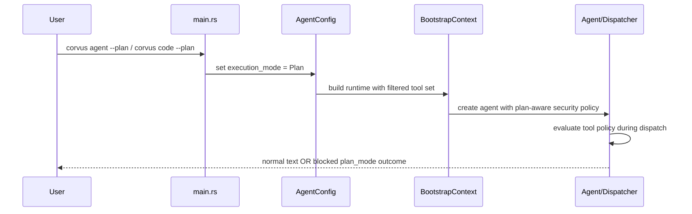
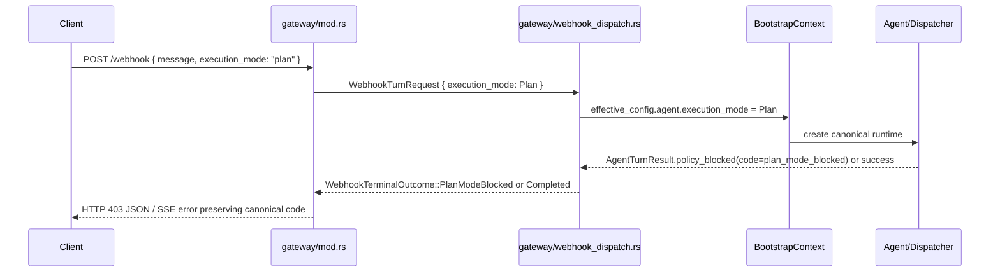

# Design: Claude-Inspired Plan Mode First Slice

## Technical Approach

This change introduces Plan Mode as a narrow execution-mode variant inside the existing
`clients/agent-runtime` architecture rather than as a new capability runtime, plugin system, or
parallel dispatcher.

The implementation stays on the canonical path already used by Corvus:

- CLI and code-session entrypoints set `agent.execution_mode = plan` through existing config seams.
- Gateway `/webhook` accepts an optional `execution_mode` field and passes it into the same
  dispatcher-backed runtime path.
- `SecurityPolicy` remains the policy authority for whether a tool is allowed, approval-gated, or
  denied.
- `agent/dispatcher.rs` preserves canonical dispatch semantics by translating plan-mode denials into
  explicit blocked actions instead of silently downgrading them into approval prompts.
- `gateway/webhook_dispatch.rs` and `gateway/mod.rs` only project canonical runtime outcomes into
  webhook-safe transport payloads.

This matches the proposal intent: reuse the current trait-driven runtime, keep the centralized
bootstrap and dispatcher as the behavioral source of truth, and add only a small capability-shaped
slice focused on analysis-only planning.

## Current vs Target Architecture

### Current baseline

Today Corvus already has:

- a shared `ExecutionMode` config seam in `src/config/schema.rs`
- centralized runtime composition in `src/bootstrap/mod.rs`
- canonical tool-risk evaluation in `src/agent/dispatcher.rs`
- security-policy evaluation in `src/security/policy.rs`
- CLI direct-runtime paths in `src/main.rs`
- gateway transport projection in `src/gateway/webhook_dispatch.rs` and `src/gateway/mod.rs`

### Target for this slice

Plan Mode becomes a policy-constrained execution mode layered onto those seams:

```text
CLI --plan / Gateway execution_mode=plan
                  │
                  ▼
         Config.agent.execution_mode = Plan
                  │
                  ▼
         BootstrapContext tool filtering
                  │
                  ▼
         SecurityPolicy evaluate_tool_policy_outcome(...)
                  │
                  ▼
         Dispatcher -> Execute | ApprovalRequired | Blocked(plan_mode_blocked)
                  │
                  ▼
         Agent turn result carries structured denial payload
                  │
                  ▼
         Gateway transport maps canonical denial to JSON / SSE
```

The important constraint is scope: Plan Mode is a new *mode*, not a new capability registry. The
runtime still composes normal tools, providers, memory, and observers through the existing
bootstrap path.

## Architecture Decisions

### Decision: Model Plan Mode as `ExecutionMode::Plan`

**Choice**: Reuse the existing `ExecutionMode` enum in `clients/agent-runtime/src/config/schema.rs`
and thread that value through CLI, code-session, and gateway request handling.

**Alternatives considered**:

- Introduce a dedicated `PlanModeConfig` tree
- Add a separate `capabilities.plan_only` runtime pipeline
- Encode plan mode in prompt text only

**Rationale**: `ExecutionMode` already exists as the narrowest truthful seam for this behavior.
Using it keeps plan semantics explicit, serializable, testable, and transport-safe without
inventing a second execution stack.

### Decision: Enforce Plan Mode in two places, both fail-closed

**Choice**: Enforce Plan Mode at bootstrap composition time *and* at runtime policy evaluation.

**Alternatives considered**:

- Filter tools only in bootstrap
- Deny tools only at dispatch time
- Rely on provider instructions alone

**Rationale**: Bootstrap filtering reduces exposed tool surface and keeps plan sessions honest, but
runtime policy enforcement is still required because transport input, stale specs, future tool
registration changes, or direct dispatch calls must not bypass Plan Mode. A two-layer deny path is
the correct fail-closed architecture for a security-sensitive slice.

### Decision: Keep approval semantics unchanged outside Plan Mode

**Choice**: Standard execution keeps the existing approval-required behavior for risky native tools
and non-native/MCP tools, while Plan Mode upgrades non-plan-safe actions from approval-required to
explicit blocked outcomes.

**Alternatives considered**:

- Convert all blocked tools into generic `approval_required`
- Make Plan Mode auto-approve read-like tools and auto-reject everything else without preserving
  standard semantics

**Rationale**: The proposal requires callers to distinguish Plan Mode restrictions from normal
approval flow. Preserving standard behavior outside Plan Mode avoids semantic drift for existing CLI
and gateway consumers.

### Decision: Represent plan denials as structured canonical outcomes

**Choice**: Use a machine-readable denial payload with `code: "plan_mode_blocked"`, then project it
through `AgentTurnResult.policy_blocked`, `WebhookTerminalOutcome::PlanModeBlocked`, and final JSON
responses.

**Alternatives considered**:

- Return plain-text denial only
- Reuse `approval_required` for plan denials
- Treat denials as generic `processing_error`

**Rationale**: A dedicated code lets transport callers, tests, and future surfaces distinguish
policy class from transport failure. This is the smallest additive contract that preserves the
canonical dispatcher decision across surfaces.

### Decision: Keep the allowlist explicit and narrow

**Choice**: Use a hard-coded, explicit plan-safe allowlist in
`clients/agent-runtime/src/security/policy.rs` for the first slice.

**Alternatives considered**:

- Infer safety by tool metadata or naming convention
- Allow all read-like tools automatically
- Include MCP search/resources in the first slice

**Rationale**: The proposal is intentionally narrow. An explicit allowlist is auditable, reversible,
and fail-closed. It avoids prematurely turning this slice into a generalized capability-classifier
project.

## Fail-Closed Enforcement Points

Plan Mode enforcement must hold even if one layer drifts.

1. **Entry configuration**
   - `clients/agent-runtime/src/main.rs`
   - `clients/agent-runtime/src/gateway/mod.rs`
   - Set `ExecutionMode::Plan` only from explicit operator/request input; default remains
     `Standard`.

2. **Bootstrap tool exposure**
   - `clients/agent-runtime/src/bootstrap/mod.rs`
   - When `config.agent.execution_mode == ExecutionMode::Plan`, only keep tools that satisfy
     `SecurityPolicy::plan_mode_allows_tool(tool.name())`.
   - This prevents obviously unsafe tools such as `shell`, `file_write`, `delegate`, and
     `git_operations` from being registered into the runtime for plan sessions.

3. **Canonical policy decision**
   - `clients/agent-runtime/src/security/policy.rs`
   - `evaluate_tool_policy_outcome_for_origin(...)` becomes the source of truth for plan-specific
     allow/deny decisions.
   - Unknown tools, MCP tools, and mutating tools MUST deny in Plan Mode unless explicitly added to
     the allowlist.

4. **Dispatcher translation**
   - `clients/agent-runtime/src/agent/dispatcher.rs`
   - `evaluate_tool_risk_with_policy_for_origin(...)` maps plan denials to
     `DispatchAction::Blocked { code, reason }` rather than `ApprovalRequired`.

5. **Agent result shaping**
   - `clients/agent-runtime/src/agent/agent.rs`
   - Structured denial payloads with code `plan_mode_blocked` flow into `policy_blocked` instead of
     `approval_required`, preventing consumers from misclassifying the restriction.

6. **Gateway transport projection**
   - `clients/agent-runtime/src/gateway/webhook_dispatch.rs`
   - `clients/agent-runtime/src/gateway/mod.rs`
   - Only canonical plan denials map to `WebhookTerminalOutcome::PlanModeBlocked` and the final
     HTTP/SSE error payload; the gateway must not reinterpret them as generic errors.

## CLI and Gateway Propagation

### CLI / code-session propagation



CLI remains a direct-runtime operator surface, but this slice intentionally narrows tool execution
when `--plan` is present. No automatic apply transition is introduced.

### Gateway propagation



This preserves the agent-loop spec rule that the gateway is only a transport projection and MUST
NOT change canonical runtime meaning.

## Data Flow

### Tool execution flow in Plan Mode

```text
Prompt
  -> provider emits tool call
  -> dispatcher checks SecurityPolicy with execution_mode=Plan
     -> allowed tool: Execute
     -> non-plan-safe tool: Blocked { code: plan_mode_blocked, reason }
  -> agent records structured denial payload
  -> caller receives machine-readable blocked outcome
```

### Outcome classification

```text
Standard mode
  shell              -> approval_required
  mcp.docs.search    -> approval_required

Plan mode
  file_read          -> execute
  code_search        -> execute
  file_write         -> plan_mode_blocked
  shell              -> plan_mode_blocked
  mcp.docs.search    -> plan_mode_blocked
  unknown_tool       -> plan_mode_blocked
```

This outcome matrix is important: Plan Mode is more restrictive than standard mode, and the block
class is intentional rather than accidental.

## Likely Modules / Touchpoints

| File | Action | Description |
|------|--------|-------------|
| `clients/agent-runtime/src/config/schema.rs` | Modify | Keep `ExecutionMode` as the persisted/configured contract with `standard` and `plan`. |
| `clients/agent-runtime/src/main.rs` | Modify | Add `--plan` to `agent` and `code` commands and propagate mode into runtime config. |
| `clients/agent-runtime/src/bootstrap/mod.rs` | Modify | Filter registered tools to the explicit plan-safe subset during bootstrap. |
| `clients/agent-runtime/src/security/policy.rs` | Modify | Define the plan-safe allowlist and machine-readable denial outcome. |
| `clients/agent-runtime/src/agent/dispatcher.rs` | Modify | Convert plan-mode denials into canonical blocked actions without changing standard-mode semantics. |
| `clients/agent-runtime/src/agent/agent.rs` | Modify | Preserve structured plan-mode denials as `policy_blocked` in `AgentTurnResult`. |
| `clients/agent-runtime/src/gateway/webhook_dispatch.rs` | Modify | Thread webhook execution mode into bootstrap and map canonical plan blocks to webhook outcomes. |
| `clients/agent-runtime/src/gateway/mod.rs` | Modify | Accept optional `execution_mode` in webhook body and project `plan_mode_blocked` into HTTP/SSE payloads. |
| `clients/agent-runtime/tests/cli_loop_events_e2e.rs` | Possible modify | Add or retain CLI-facing regression coverage if loop-event/output expectations change. |
| `openspec/changes/2026-04-13-claude-capability-integration/design.md` | Create | Restore the technical design artifact for the change. |

## Interfaces / Contracts

### Execution mode contract

```rust
#[derive(Debug, Clone, Copy, PartialEq, Eq, Serialize, Deserialize, Default)]
#[serde(rename_all = "snake_case")]
pub enum ExecutionMode {
    #[default]
    Standard,
    Plan,
}
```

### Security policy outcome contract

```rust
pub struct ToolPolicyOutcome {
    pub decision: ToolPolicyDecision,
    pub code: Option<&'static str>,
    pub reason: Option<String>,
}
```

Plan Mode denial contract:

```json
{
  "code": "plan_mode_blocked",
  "tool": "file_write",
  "reason": "Plan Mode allows analysis-only capabilities and blocks `file_write`",
  "execution_mode": "plan"
}
```

### Gateway terminal outcome contract

```rust
pub enum WebhookTerminalOutcome {
    Completed,
    ApprovalRequired { tool: String, reason: String },
    PlanModeBlocked {
        tool: String,
        reason: String,
        execution_mode: ExecutionMode,
    },
    Timeout,
    Fallback,
    Error,
}
```

The gateway contract is additive. Existing consumers that only understand success and
`approval_required` will need a small compatibility update to recognize `plan_mode_blocked`.

## Testing Strategy

| Layer | What to Test | Approach |
|-------|-------------|----------|
| Unit | Plan-safe allowlist behavior | In `src/security/policy.rs`, prove explicit allowlist entries execute and non-listed tools deny in Plan Mode. |
| Unit | Canonical dispatcher mapping | In `src/agent/dispatcher.rs`, prove plan-mode denial becomes `Blocked { code: plan_mode_blocked }` while standard mode keeps `approval_required` semantics. |
| Unit | Bootstrap filtering | In `src/bootstrap/mod.rs`, prove plan mode removes mutating/agentic tools from the registered tool set. |
| Unit | Webhook result mapping | In `src/gateway/webhook_dispatch.rs` and `src/gateway/mod.rs`, prove canonical plan denials become `PlanModeBlocked` and JSON/SSE error payloads. |
| Integration | Webhook end-to-end parity | Execute dispatcher-backed webhook tests with `execution_mode=plan` and assert HTTP 403 + machine-readable body. |
| CLI regression | CLI entry propagation | Assert `--plan` parses for `agent` and `code`, and resulting config uses `ExecutionMode::Plan`. |

### TDD Order

1. **Security policy RED**
   - Add failing tests for the explicit plan-safe allowlist and machine-readable denial payload.
2. **Dispatcher RED**
   - Add failing tests proving Plan Mode returns blocked outcomes instead of approval-required.
3. **Bootstrap RED**
   - Add failing tests proving only plan-safe tools remain registered.
4. **Gateway canonical mapping RED**
   - Add failing tests for `WebhookTerminalOutcome::PlanModeBlocked` and `execution_mode` echo.
5. **Gateway transport RED**
   - Add failing `/webhook` JSON/SSE projection tests for `plan_mode_blocked`.
6. **CLI propagation RED**
   - Add failing CLI parse/config tests for `--plan` on `agent` and `code`.
7. **Green / minimal implementation**
   - Implement only the smallest code needed to satisfy each layer in order.
8. **Refactor**
   - Consolidate repeated denial formatting/helpers only after all proofs pass.

## Non-Goals and Tradeoffs

### Non-goals

- Full Claude capability parity
- Dynamic capability registry or plugin marketplace
- Automatic transition from plan to apply
- Broad web/mobile UX for plan/apply workflows
- General MCP read-only support in the first slice
- Reclassification of the entire runtime tool catalog

### Tradeoffs

- **Explicit allowlist over metadata-driven inference**: safer and smaller now, but requires manual
  edits for every future expansion.
- **Dual enforcement (bootstrap + policy)**: slightly redundant, but correct for fail-closed
  behavior.
- **Dedicated `plan_mode_blocked` outcome**: clearer transport semantics, but downstream consumers
  must handle one more denial code.
- **Native-tool-first slice**: faster to ship and easier to audit, but it intentionally leaves MCP
  capability planning for later work.

## Migration / Rollout

No data migration required.

Rollout is additive and low-risk because:

- default behavior remains `ExecutionMode::Standard`
- Plan Mode is only activated by explicit CLI flag or explicit webhook request field
- rollback is straightforward: remove plan-mode entry propagation, allowlist gating, and transport
  projection together

## Open Questions

- [ ] The original delta specs for this active change are currently missing from
      `openspec/changes/2026-04-13-claude-capability-integration/specs/`; verify they are restored
      before downstream `sdd-verify` runs.
- [ ] Should future follow-up work admit a namespaced subset of MCP read/search tools into Plan
      Mode, or should Plan Mode remain native-tool-only until a capability metadata contract exists?
