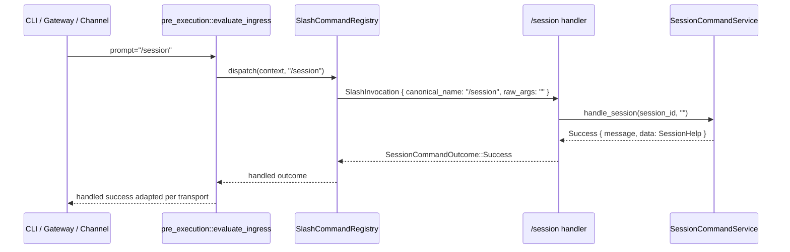
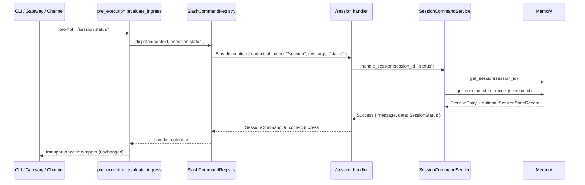

# Design: Slash Session Discoverability

## Technical Approach

This change adds a small, read-only `/session` slash-command family to the existing registry-backed session command seam in `clients/agent-runtime`.

The implementation stays inside the current command architecture:

- register `/session` as a canonical slash command in `session_commands::registry`;
- allow empty trailing args by using the existing `OptionalText` argument shape;
- parse `status` from raw args inside the service layer, matching the current `/mcp` and `/tool` family style;
- build a transport-neutral session-status payload from the authoritative session read model (`get_session` + optional `get_session_state_record`);
- keep all transport adaptation outside the command service so CLI, gateway SSE, and channel paths continue to reuse the existing handled-ingress seam unchanged.

This slice does **not** redesign parser behavior, introduce subcommand-aware registry metadata, mutate session lifecycle state, or change HTTP `/session/*` routes.

## Architecture Decisions

### Decision: Model `/session` as one canonical command with raw subcommand parsing in the service

**Choice**: Add `/session` as a single canonical registry entry with `SlashCommandArgumentShape::OptionalText`, and parse `status` from `invocation.raw_args` inside the service/handler.

**Alternatives considered**:
- Register `/session-status` as a standalone canonical command.
- Introduce registry-level subcommand parsing for `/session status`.
- Treat `/session` like `/mcp` and require text at the registry boundary.

**Rationale**:
- The proposal explicitly scopes this slice to a command family, not a new top-level canonical command.
- Existing family-style commands (`/mcp`, `/tool`) already parse subcommands from raw args inside the service, so this stays aligned with current runtime patterns.
- `OptionalText` is required because `/session` with empty args must succeed and return help/usage; `RequiredText` would reject the root command before the handler runs.
- Adding registry-native subcommand contracts would broaden scope into parser/contract redesign, which is a stated non-goal.

### Decision: Keep descriptor metadata command-level and evaluate `/session status` backend needs inside the service

**Choice**: Keep `/session` descriptor metadata command-level, likely with a new read-oriented capability (for example `SessionRead`) and no command-level backend requirement, while enforcing SQLite-backed read-model requirements only for the `status` subcommand branch.

**Alternatives considered**:
- Mark `/session` as requiring `SqliteSlashSessions` at the descriptor level.
- Add subcommand-level requirement metadata to the registry contract.
- Reuse `SessionLifecycle` capability without clarifying the new read-only semantics.

**Rationale**:
- Root help is static discoverability and should remain available even when slash-session persistence is unsupported.
- `/session status` depends on the authoritative session read model, which is SQLite-backed in the current architecture.
- The current registry contract is command-level, not subcommand-level. Extending it for mixed subcommand requirements would be a larger change than this slice needs.
- A read-oriented capability keeps the descriptor semantically accurate without forcing a parser or contract redesign.

### Decision: Build a dedicated transport-neutral status payload instead of exposing raw persistence records

**Choice**: Add a new structured success payload for `/session status` (and optionally a structured help payload for `/session` root help) under `SessionCommandSuccessData`.

**Alternatives considered**:
- Return only a formatted human-readable message.
- Reuse `SessionEntry` or `SessionStateRecord` directly as the success payload.
- Flatten status into transport-specific JSON in gateway-only code.

**Rationale**:
- The slash-command seam already preserves machine-readable success data separately from user-facing text.
- A dedicated payload avoids coupling consumers to storage-layer record shapes and keeps the contract transport-neutral.
- Gateway, CLI, and channel adapters currently consume the same internal success/failure types and decide their own outward envelopes later.
- This keeps room for future `/session` subcommands without leaking persistence internals into the command contract.

### Decision: Implement `/session status` as a pure read-model assembly path with no lifecycle mutation helpers

**Choice**: Add a new read-only service path that fetches the current session record and optional slash-session state, then assembles a status view and message without reusing mutation-oriented helpers like `require_active_session`.

**Alternatives considered**:
- Reuse `require_active_session` and reject ended sessions as invalid.
- Add new persistence APIs for a combined status query.
- Mutate missing slash-session state rows during status reads.

**Rationale**:
- `/session status` is discoverability-focused and should report the current known state rather than treat read access as a lifecycle operation.
- Existing `Memory` trait methods are already sufficient (`get_session`, `get_session_state_record`), so no persistence-contract expansion is needed for this slice.
- Avoiding mutation during reads preserves the read-only boundary and keeps rollback simple.

## Data Flow

### `/session` root help



### `/session status`



### Internal assembly shape

```text
prompt
  -> SessionCommandParser::parse()
  -> registry lookup for /session
  -> invocation.raw_args
  -> SessionCommandService::handle_session(...)
       -> empty args => structured help success
       -> "status" => session read-model fetch + structured status success
       -> anything else => invalid-arguments failure
  -> pre_execution handled ingress adaptation
  -> transport-specific outward message/error envelope
```

## File Changes

| File | Action | Description |
|------|--------|-------------|
| `openspec/changes/slash-session-discoverability/design.md` | Create | Technical design for the change. |
| `clients/agent-runtime/src/session_commands/registry.rs` | Modify | Register `/session`, add a handler, and extend registry tests for empty-args family behavior and `/session status` dispatch. |
| `clients/agent-runtime/src/session_commands/service.rs` | Modify | Add `/session` family handling, root help generation, `status` read-model assembly, and focused unit tests. |
| `clients/agent-runtime/src/session_commands/types.rs` | Modify | Add new descriptor capability (if introduced) plus structured success payload types for `/session` help/status. |
| `clients/agent-runtime/src/pre_execution/mod.rs` | Modify | Extend ingress tests to assert `/session` and `/session status` stay on the shared handled-command seam. |
| `clients/agent-runtime/src/pre_execution/session_command_adapter.rs` | Verify / maybe modify | No production-path change is expected, but adapter tests may be expanded if coverage is needed for the new success/failure cases. |

## Interfaces / Contracts

### Registry descriptor

```rust
SlashCommandDescriptor {
    canonical_name: "/session",
    aliases: &[],
    description: "Show session help or inspect the current session.",
    argument_shape: SlashCommandArgumentShape::OptionalText,
    requirements: SlashCommandRequirements {
        capabilities: &[CommandCapability::SessionRead],
        permissions: &[],
        backends: &[],
    },
}
```

Notes:
- `OptionalText` is the key contract choice that lets `/session` succeed without subcommand text.
- Backend support for `status` remains enforced by the service branch, not by command-level registry metadata.

### New structured success payloads

A small dedicated payload keeps the outcome structured and transport-neutral.

```rust
pub struct SessionCommandSessionStatus {
    pub session_id: String,
    pub session_status: SessionStatus,
    pub slash_lifecycle: SlashSessionLifecycle,
    pub started_at: String,
    pub last_activity: String,
    pub ended_at: Option<String>,
    pub message_count: u32,
    pub has_tldr_snapshot: bool,
    pub has_compact_snapshot: bool,
    pub resume_hydration_pending: bool,
    pub suspended_at: Option<String>,
}

pub struct SessionCommandHelpEntry {
    pub name: &'static str,
    pub usage: &'static str,
    pub description: &'static str,
}

pub enum SessionCommandSuccessData {
    // existing variants...
    SessionHelp {
        entries: Vec<SessionCommandHelpEntry>,
    },
    SessionStatus {
        status: SessionCommandSessionStatus,
    },
}
```

Implementation notes:
- The payload should expose stable user-meaningful fields, not raw `SessionStateRecord` or snapshot row internals.
- The human-readable `message` remains separately formatted for CLI/chat surfaces.
- Transport adapters remain free to ignore or later serialize the structured payload without changing the internal contract.

### Service contract

```rust
impl<'a> SessionCommandService<'a> {
    pub fn handle_session(&self, session_id: &str, raw_args: &str) -> SessionCommandOutcome;
}
```

Expected branch behavior:

```text
raw_args == ""              => success(SessionHelp)
raw_args == "status"        => async read-model path, success(SessionStatus)
anything else                => failure(InvalidArguments) with /session usage guidance
```

### Status read-model assembly

`/session status` should derive its view from existing persistence APIs only:

```rust
let session = memory.get_session(session_id).await?;
let state = memory.get_session_state_record(session_id).await?;
```

Derived rules:
- missing session row -> `UnknownSession`
- missing slash-session state row -> treat `slash_lifecycle` as `Active`
- ended session row is reportable as status data, not a mutation-time invalid state
- non-SQLite / unsupported slash-session backend -> `UnsupportedBackend` for the `status` branch only

## Testing Strategy

| Layer | What to Test | Approach |
|-------|-------------|----------|
| Unit | `/session` descriptor metadata | Extend `registry.rs` tests to assert canonical registration, `OptionalText` shape, and deterministic lookup. |
| Unit | Empty `/session` returns handled success | Add registry/service tests covering `/session` with no args and asserting structured help payload + human-readable usage message. |
| Unit | `/session status` uses current session read model | Add service tests with fake memory for: active session, suspended slash state, missing state row defaulting to active, unknown session, and unsupported backend. |
| Unit | Family parsing stays inside service | Add tests proving `/session status` succeeds, `/session bogus` fails with `InvalidArguments`, and `/session status extra` fails unless explicitly allowed. |
| Integration | Shared pre-execution seam intercepts `/session` family | Extend `pre_execution/mod.rs` tests so `/session` and `/session status` are recognized as handled slash commands rather than falling through. |
| Integration | Transport-neutral outcome remains intact | Verify success/failure still flow through existing `HandledIngressOutcome::{SessionCommandSuccess, SessionCommandFailure}` without new transport-local branching. |
| Regression | Existing `/mcp`, `/tool`, `/resume`, `/suspend`, `/tldr`, `/compact` behavior | Keep existing registry/service tests green to prove the new family does not change current slash-command routing semantics. |

## Migration / Rollout

No migration required.

This slice reuses existing SQLite session and slash-session state tables. No schema change, no feature flag, and no transport rollout split are needed.

## Open Questions

- [ ] None currently. The existing registry and memory contracts are sufficient for this slice.
