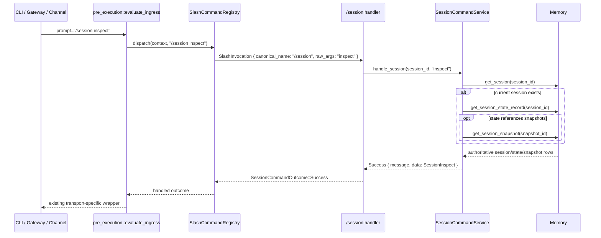

# Design: Slash Session Inspect

## Technical Approach

This change adds `/session inspect` as a richer, read-only subcommand inside the existing canonical `/session` family without changing parser, transport, or persistence boundaries.

The implementation stays inside the current registry-backed session-command seam in `clients/agent-runtime`:

- keep `/session` as the only canonical registry command with `OptionalText` raw-args handling;
- extend `SessionCommandService::handle_session(...)` to recognize three exact branches: empty args, `status`, and `inspect`;
- introduce a small internal current-session read-model loader that composes existing authoritative reads in order: `get_session`, optional `get_session_state_record`, and optional referenced `get_session_snapshot` lookups;
- add a dedicated structured inspect success variant so the richer inspect contract does not overload the lighter `/session status` payload;
- express partial state explicitly with gap metadata and optional sections instead of defaulting or inventing missing lifecycle/snapshot facts;
- keep all outward envelope shaping outside the command service so CLI, gateway, webhook, and channel paths continue to reuse the same handled-ingress contract.

This slice intentionally does **not** add new `Memory` trait methods, SQL schema changes, target-session arguments, list/browse behavior, mutations, HTTP route changes, or a registry redesign.

## Architecture Decisions

### Decision: Keep `/session inspect` as a service-level raw-args branch under canonical `/session`

**Choice**: Implement `inspect` inside `SessionCommandService::handle_session(...)`, matching the existing family-style handling used for `/session status`, `/mcp`, and `/tool`.

**Alternatives considered**:
- Register `/session inspect` as a standalone canonical command.
- Introduce registry-native subcommand descriptors for `/session`.
- Add transport-local `/session inspect` handling outside the shared pre-execution seam.

**Rationale**:
- The proposal and delta specs explicitly keep `/session` as the family hub and forbid `/session inspect` from becoming a separate canonical command or alias.
- The current runtime already preserves raw args for `/session` and routes them through the shared seam, so the smallest conforming change is to extend the existing handler branch.
- Parser or registry redesign would broaden scope well beyond this small slice.

### Decision: Add a dedicated `SessionInspect` structured success variant

**Choice**: Extend `SessionCommandSuccessData` with a new `SessionInspect { inspect: SessionCommandSessionInspect }` variant, separate from the existing `SessionStatus` success payload.

**Alternatives considered**:
- Reuse `SessionCommandSessionStatus` and append more fields to it.
- Return only a human-readable inspect message.
- Expose raw `SessionEntry`, `SessionStateRecord`, and `SessionSnapshotRecord` directly as the success contract.

**Rationale**:
- `/session status` is now explicitly the compact summary view, while `/session inspect` is the richer read model; using one payload for both would either bloat status or underspec inspect.
- A dedicated inspect variant keeps the internal command outcome transport-neutral and machine-readable without leaking storage types as the public command contract.
- The inspect payload needs explicit gap reporting and snapshot-slot detail that the status payload was not designed to carry.

### Decision: Assemble inspect from existing read APIs only, with a shared internal loader

**Choice**: Build inspect by composing the existing reads `get_session(session_id)`, `get_session_state_record(session_id)`, and `get_session_snapshot(snapshot_id)` inside the session-command service.

**Alternatives considered**:
- Add a combined `get_session_inspect(...)` memory method.
- Add a dedicated SQLite join/query just for inspect.
- Add a persistence-layer projection type for this slice.

**Rationale**:
- The user explicitly scoped this slice to reuse existing persistence contracts.
- The current backend already exposes all authoritative data needed for inspect.
- A small internal loader keeps the feature local to `session_commands` and also lets status/inspect share the same unknown-session guard so the service does not attempt state reads for sessions that do not exist.

### Decision: Represent partial data with explicit gaps instead of inferred defaults in inspect

**Choice**: The inspect payload will use optional sections plus an explicit `gaps` list that identifies missing slash-session state and missing/incomplete referenced snapshots.

**Alternatives considered**:
- Default missing state to `active` and missing snapshots to `false`/empty inside inspect, like a summary view.
- Omit missing areas silently.
- Fail the command whenever any referenced data is missing.

**Rationale**:
- The inspect spec requires partial data to be explicit and non-invented.
- Status may use compact derived defaults for usability, but inspect is the deeper diagnostic view and should preserve uncertainty instead of hiding it.
- Returning success with explicit gaps keeps the command useful for operators when storage is partially populated while remaining read-only and truthful.

### Decision: Keep `/session status` lightweight and optionally point to inspect

**Choice**: Preserve the existing `SessionStatus` payload and concise message format, with only small adjustments needed to keep its loader aligned with the new shared read-model guard and optional discoverability hinting.

**Alternatives considered**:
- Replace `/session status` with inspect entirely.
- Make `/session status` return the full inspect payload and let transports trim it.
- Introduce a new generalized “session read model” outward contract for both commands.

**Rationale**:
- The change explicitly keeps `/session status` as the lighter summary view.
- A small-slice design should preserve the current status contract and add inspect incrementally, not collapse both commands into a broader redesign.
- Shared internal assembly is enough; a new outward super-contract is unnecessary for this slice.

## Data Flow

### `/session inspect`



### Internal assembly flow

```text
prompt
  -> SessionCommandParser::parse()
  -> registry lookup for /session
  -> SessionCommandService::handle_session(session_id, raw_args)
       -> ""        => SessionHelp success
       -> "status"  => compact status path
       -> "inspect" => load current-session inspect model
                         -> get_session(session_id)
                         -> if missing: success with unknown-session inspect payload
                         -> get_session_state_record(session_id)
                         -> resolve referenced snapshots from state
                         -> build inspect summary + structured payload from same model
       -> other      => InvalidArguments with /session family usage
  -> pre_execution handled-ingress adaptation
  -> transport-specific outward envelope
```

### Inspect model assembly

```text
SessionEntry?
  ├─ no  -> current_session_known = false
  │       state = None
  │       snapshots = None/empty
  │       gaps = []
  └─ yes -> SessionStateRecord?
           ├─ no  -> session section only
           │       state = None
           │       gaps += slash_session_state_missing
           └─ yes -> resolve latest_tldr / latest_compact / pending_hydration snapshots
                    ├─ snapshot row found -> attach authoritative snapshot details
                    └─ snapshot row missing/incomplete -> keep reference id, add explicit gap
```

## File Changes

| File | Action | Description |
|------|--------|-------------|
| `openspec/changes/slash-session-inspect/design.md` | Create | Technical design for the `/session inspect` slice. |
| `clients/agent-runtime/src/session_commands/service.rs` | Modify | Add the `inspect` branch, shared read-model loader/helpers, richer inspect message formatter, explicit gap handling, help/usage updates, and focused unit tests. |
| `clients/agent-runtime/src/session_commands/types.rs` | Modify | Add inspect-specific structured success types and the `SessionInspect` success variant without changing transport envelopes. |
| `clients/agent-runtime/src/session_commands/mod.rs` | Modify | Re-export any new inspect types added to `types.rs`. |
| `clients/agent-runtime/src/session_commands/registry.rs` | Modify | Keep `/session` canonical registration intact while updating registry/handler tests and any descriptor copy that documents `/session inspect` as a supported family form. |
| `clients/agent-runtime/src/pre_execution/mod.rs` | Modify | Update seam tests so `/session inspect` remains routed through `evaluate_ingress(...)` and now yields the inspect branch outcome instead of invalid-subcommand behavior. |
| `clients/agent-runtime/src/pre_execution/session_command_adapter.rs` | Verify / maybe modify | No production-path change is expected because the adapter already boxes generic `SessionCommandSuccess`, but tests may need extension if they assert concrete success variants. |
| `clients/agent-runtime/src/memory/traits.rs` | Verify / no contract change expected | Existing `get_session`, `get_session_state_record`, and `get_session_snapshot` methods are sufficient for this slice. |
| `clients/agent-runtime/src/memory/sqlite.rs` | Verify / no production change expected | Existing SQLite read paths already expose the authoritative rows needed for inspect; no schema or new query contract should be added in this slice. |

## Interfaces / Contracts

### `/session` family contract

```rust
impl<'a> SessionCommandService<'a> {
    pub async fn handle_session(&self, context: &CommandContext, raw_args: &str) -> SessionCommandOutcome;
}
```

**Pre-list/inspect-slice contract** (for `status` and `inspect` branches only):

```text
raw_args == "status"     => success(SessionStatus)
raw_args == "inspect"  => success(SessionInspect)
raw_args == ""          => success(SessionHelp)
```

For `/session list`, see the separate slice that widens the service boundary to accept `CommandContext` for caller-scoped visibility. Extra trailing tokens remain invalid for this slice:

```text
/session status extra  => InvalidArguments
/session inspect extra => InvalidArguments
```

### Dedicated inspect success contract (preferred)

```rust
pub struct SessionCommandSessionInspect {
    pub session_id: String,
    pub current_session_known: bool,
    pub session: Option<SessionCommandInspectSessionRecord>,
    pub state: Option<SessionCommandInspectStateRecord>,
    pub snapshots: SessionCommandInspectSnapshots,
    pub gaps: Vec<SessionCommandInspectGap>,
}

pub struct SessionCommandInspectSessionRecord {
    pub status: SessionStatus,
    pub started_at: String,
    pub last_activity: String,
    pub ended_at: Option<String>,
    pub message_count: u32,
}

pub struct SessionCommandInspectStateRecord {
    pub lifecycle: SlashSessionLifecycle,
    pub latest_tldr_snapshot_id: Option<String>,
    pub latest_compact_snapshot_id: Option<String>,
    pub pending_hydration_snapshot_id: Option<String>,
    pub suspended_at: Option<String>,
    pub updated_at: String,
}

pub struct SessionCommandInspectSnapshots {
    pub latest_tldr: SessionCommandInspectSnapshotSlot,
    pub latest_compact: SessionCommandInspectSnapshotSlot,
    pub pending_hydration: SessionCommandInspectSnapshotSlot,
}

pub struct SessionCommandInspectSnapshotSlot {
    pub reference_id: Option<String>,
    pub snapshot: Option<SessionCommandInspectSnapshot>,
}

pub struct SessionCommandInspectSnapshot {
    pub snapshot_id: String,
    pub kind: SessionSnapshotKind,
    pub created_at: String,
    pub resume_capable: bool,
    pub payload: serde_json::Value,
}

pub struct SessionCommandInspectGap {
    pub code: SessionInspectGapCode,
    pub reference_id: Option<String>,
    pub detail: String,
}

pub enum SessionInspectGapCode {
    SlashSessionStateMissing,
    SnapshotUnavailableWithoutState,
    ReferencedSnapshotMissing,
    ReferencedSnapshotOwnershipMismatch,
    ReferencedSnapshotKindMismatch,
}

pub enum SessionCommandSuccessData {
    // existing variants...
    SessionStatus {
        status: SessionCommandSessionStatus,
    },
    SessionInspect {
        inspect: SessionCommandSessionInspect,
    },
}
```

Contract notes:
- `SessionInspect` is preferred over expanding `SessionStatus`, because inspect has richer snapshot-slot detail and explicit gap semantics.
- `payload: serde_json::Value` keeps snapshot data authoritative and structured without introducing a new storage contract.
- `current_session_known == false` remains a success result with limited data, matching the existing read-only discoverability pattern used by `/session status`.

### Shared internal loader shape

A small internal helper keeps status and inspect aligned on current-session lookup order and unknown-session behavior:

```rust
struct CurrentSessionReadModel {
    session: Option<SessionEntry>,
    state: Option<SessionStateRecord>,
    snapshots: ResolvedInspectSnapshots,
}
```

Implementation rules:
- Always call `get_session(session_id)` first.
- Only call `get_session_state_record(session_id)` when a session row exists.
- Only call `get_session_snapshot(...)` for snapshot ids explicitly referenced by the state row.
- Preserve authoritative reference ids even when the referenced snapshot row is missing.
- Never mutate state or synthesize defaults inside inspect beyond explicit gap reporting.

### Human-readable inspect summary

The human-readable inspect message should be derived from the same assembled inspect model and should stay balanced rather than verbose-by-default. A typical shape is:

```text
[session:abc-123] current session inspection
Session record: active, started <ts>, last activity <ts>, messages 12
Slash state: suspended, updated <ts>, suspended at <ts>
Snapshots:
- TLDR: tldr-1 @ <ts>
- Compact: compact-2 @ <ts> (resume-capable)
- Pending hydration: none
Gaps:
- referenced snapshot compact-missing is missing from authoritative storage
```

Message rules:
- unknown current session => one short explicit message, no invented lifecycle lines;
- missing state => include session details plus a clear note that slash-session state is missing;
- missing snapshot => include the reference id and the fact that the row could not be confirmed;
- no target-session hints, no mutation suggestions beyond optional `/session status` / `/session inspect` family guidance.

## Testing Strategy

| Layer | What to Test | Approach |
|-------|-------------|----------|
| Unit | `/session` family parsing remains service-level | Extend `service.rs` tests for: empty args -> help, `status` -> compact summary, `inspect` -> inspect success, `inspect extra` -> invalid arguments, and invalid subcommands still returning family usage. |
| Unit | Complete inspect assembly | Add fake-memory tests where session, state, TLDR snapshot, compact snapshot, and pending hydration snapshot are all present; assert message + `SessionInspect` payload are consistent. |
| Unit | Partial data when state is missing | Add a fake-memory test where `get_session` succeeds and `get_session_state_record` returns `None`; assert session details are present, state is absent, and gaps explicitly mark missing slash-session state / snapshot unavailability. |
| Unit | Partial data when referenced snapshots are missing or mismatched | Add tests where state references snapshot ids that are absent, belong to another session, or have an unexpected kind; assert inspect preserves the reference id and records the correct gap without inventing snapshot facts. |
| Unit | Unknown current session stays read-only success | Add tests for `/session inspect` when `get_session` returns `None`; assert success with `current_session_known == false`, no state/snapshot sections, and no follow-on state lookup requirement. |
| Unit | Unsupported backend remains branch-specific | Add tests proving `/session` root help still succeeds on non-SQLite backends while `/session inspect` returns `UnsupportedBackend`, mirroring the existing status behavior. |
| Regression | `/session status` remains compact and safe | Extend status tests so any shared loader refactor preserves compact payload behavior and does not regress unknown-session handling. |
| Integration | Shared ingress seam still owns `/session inspect` | Update `pre_execution/mod.rs` tests so `/session inspect` is recognized as a handled `/session` family command through `evaluate_ingress(...)`, not as transport fallthrough. |
| Integration | Adapter remains transport-neutral | Verify `HandledIngressOutcome::SessionCommandSuccess(Box<SessionCommandSuccess>)` continues to carry the new inspect success without adapter-specific branching. |

Edge cases called out explicitly for test coverage:
- session exists, state missing;
- session exists, state present, one or more referenced snapshots missing;
- state references the same snapshot id from multiple slots;
- state references a snapshot owned by a different session id;
- pending hydration snapshot exists while lifecycle is active;
- current session is unknown and state/snapshot reads must not invent or overstate facts.

## Migration / Rollout

No migration required.

This change reuses existing SQLite session, slash-session state, and snapshot tables. No schema migration, feature flag, or transport rollout split is needed.

## Open Questions

- [ ] None currently. The current registry, pre-execution seam, and memory read contracts are sufficient for this slice.
