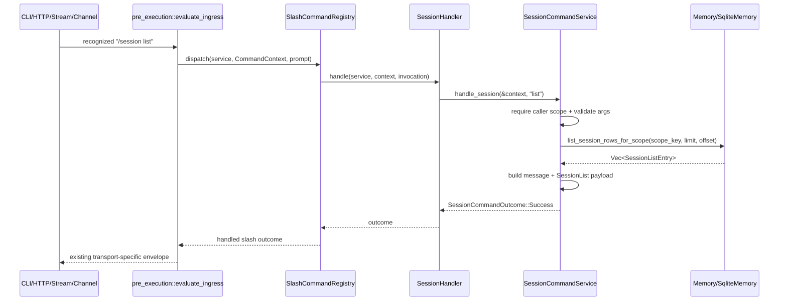

# Design: Slash Session List

## Technical Approach

Add `/session list` as one more raw-args branch under the existing canonical `/session` handler, keeping the shared pre-execution registry path unchanged. The implementation stays small-slice by widening only the `SessionHandler -> SessionCommandService::handle_session(...)` seam so the service receives typed caller-scope facts from `CommandContext`, then introducing a dedicated read-only session-list query in the memory contract that returns the minimal row shape needed by this slice.

This design intentionally does **not** redesign the registry, transport adapters, or the broader session persistence model. It reuses the same authoritative sources already used by `/session status`, `/session inspect`, and `/resume`: `sessions`, `session_state`, and `session_snapshots` in SQLite.

## Architecture Decisions

### Decision: Widen only the `/session` service seam, not the registry core

**Choice**: Change `SessionCommandService::handle_session(&self, session_id: &str, raw_args: &str)` to accept `&CommandContext` (or an equivalent borrowed context view) and update `SessionHandler` to pass the already-available typed context through unchanged.

**Alternatives considered**:
- Add caller-scope fields to `SlashInvocation`
- Redesign the registry to evaluate permission policy centrally
- Thread only `Option<&str>` scope key to the service

**Rationale**: The registry already passes full `CommandContext` into handlers, and only `SessionHandler` currently throws that information away. Accepting `&CommandContext` at the `/session` service boundary is the smallest possible seam change that fixes the caller-scope gap without changing routing, parser behavior, or other slash-command families. Passing the full typed context also preserves the existing distinction between verified gateway scope, derived CLI/channel scope, and unavailable scope, which the OpenSpec registry and sessions specs already require for authorization-sensitive behavior.

### Decision: Add a dedicated read-only session-list query instead of reusing `/resume` listing

**Choice**: Add a new memory contract for caller-scoped session listing that returns `/session list` rows directly, rather than adapting `list_resumable_sessions(...)`.

**Alternatives considered**:
- Reuse `list_resumable_sessions(...)` and reshape the results in service code
- Reuse generic `list_sessions_for_token(...)` and separately load state/snapshot details per row
- Build the list by composing `get_session_for_scope(...)` calls one-by-one

**Rationale**: `/resume` listing is intentionally narrower than this slice: it only returns suspended sessions with valid resume-capable snapshots, and it carries resume-specific fields (`snapshot_id`, `preview`, `snapshot_created_at`) that are out of scope here. A dedicated read-only query keeps `/session list` independent from resume semantics, avoids N+1 lookups, and lets SQLite derive `lifecycle` and `resumable` authoritatively in one ordered query.

### Decision: Keep lifecycle derivation aligned with existing `/session status` semantics

**Choice**: Derive `lifecycle` per listed row from authoritative storage as follows:
- exclude rows where `sessions.status = 'ended'`
- if a `session_state` row exists and `lifecycle_state = 'suspended'`, report `suspended`
- otherwise report `active`

**Alternatives considered**:
- Introduce a new three-state list lifecycle (`active|suspended|ended`)
- Require a `session_state` row for listability
- Omit active sessions that have no state row

**Rationale**: Current `/session status` already treats a missing `session_state` row as effectively active for an existing session. Reusing that rule keeps discoverability behavior consistent across the `/session` family and avoids inflating this slice into a broader historical/admin listing feature. Excluding ended sessions keeps the row contract inside the existing `SlashSessionLifecycle` enum and avoids introducing new lifecycle semantics just for this slice.

### Decision: Derive `resumable` from authoritative current capability, not snapshot existence alone

**Choice**: Report `resumable = true` only when all of the following are true for the listed session:
- the derived lifecycle is `suspended`
- `session_state.latest_compact_snapshot_id` is present
- the referenced snapshot exists in `session_snapshots`
- that snapshot is marked `is_resume_capable = 1`

All other rows report `resumable = false`.

**Alternatives considered**:
- Mark a session resumable whenever any compact snapshot exists
- Mark a session resumable whenever `latest_compact_snapshot_id` is present, without validating the snapshot row
- Reuse a cached boolean from service-level heuristics

**Rationale**: `/session list` should report whether the session is resumable **now**, not whether it once had a compact snapshot. This definition matches current `/resume` requirements and keeps the list row authoritative, deterministic, and robust against stale or broken snapshot references.

### Decision: Preserve balanced human + structured output at the service boundary

**Choice**: Add a dedicated `SessionList` success payload with minimal rows and format a compact human-readable summary from the same row model.

**Alternatives considered**:
- Return structured data only
- Return human-readable text only
- Reuse `/resume` message formatting

**Rationale**: The `/session` family already returns human-readable guidance plus machine-readable payloads. Following the same pattern preserves internal non-lossy outcomes, keeps transport shaping external, and avoids coupling this slice to `/resume` terminology.

## Data Flow

### `/session list` request flow



### Authoritative row derivation

```text
sessions (identity, last_activity, token_hash, ended status)
    LEFT JOIN session_state (lifecycle_state, latest_compact_snapshot_id)
    LEFT JOIN session_snapshots (resume capability for latest compact snapshot)
        -> derive lifecycle
        -> derive resumable
        -> order by last_activity DESC, id DESC
        -> return minimal rows only
```

## File Changes

| File | Action | Description |
|------|--------|-------------|
| `openspec/changes/slash-session-list/design.md` | Create | Technical design for the change. |
| `clients/agent-runtime/src/session_commands/registry.rs` | Modify | Pass typed `CommandContext` through the `/session` handler instead of dropping caller-scope facts. |
| `clients/agent-runtime/src/session_commands/service.rs` | Modify | Add `/session list` branch, caller-scope validation, balanced message formatting, and orchestration for the new list query. |
| `clients/agent-runtime/src/session_commands/types.rs` | Modify | Add structured success payload/types for minimal session-list rows. |
| `clients/agent-runtime/crates/corvus-traits/src/memory.rs` | Modify | Add read-only caller-scoped session-list contract for minimal discoverability rows. |
| `clients/agent-runtime/src/memory/traits.rs` | Modify | Re-export the new session-list memory types/trait method through the runtime shim. |
| `clients/agent-runtime/src/memory/sqlite.rs` | Modify | Implement the ordered caller-scoped query with authoritative lifecycle/resumable derivation. |
| `clients/agent-runtime/src/pre_execution/mod.rs` | Modify | Extend ingress seam tests so `/session list` is treated as a supported `/session` family form. |
| `openspec/changes/slash-session-list/specs/slash-command-registry/spec.md` | Create/Modify in parallel phase | Delta spec should add `/session list` to the canonical `/session` raw-args family. |
| `openspec/changes/slash-session-list/specs/sessions/spec.md` | Create/Modify in parallel phase | Delta spec should define caller-scoped, ordered, read-only `/session list` behavior. |

## Interfaces / Contracts

### Service seam

```rust
impl<'a> SessionCommandService<'a> {
    pub async fn handle_session(
        &self,
        context: &CommandContext,
        raw_args: &str,
    ) -> SessionCommandOutcome;
}
```

The implementation uses:
- `context.session.session_id` for root help and current-session-only views (`status`, `inspect`)
- `context.caller.scope_key()` for authorization-sensitive `list`
- existing typed caller variants unchanged

### New list row contract

```rust
#[derive(Debug, Clone, PartialEq, Eq, Serialize, Deserialize)]
pub struct SessionListEntry {
    pub id: String,
    pub last_activity: String,
    pub lifecycle: SlashSessionLifecycle,
    pub resumable: bool,
}
```

### New success payload

```rust
pub enum SessionCommandSuccessData {
    // existing variants...
    SessionList {
        sessions: Vec<SessionListEntry>,
    },
}
```

### Memory contract

```rust
#[async_trait]
pub trait Memory: Send + Sync {
    async fn list_session_rows_for_scope(
        &self,
        caller_scope_key: &str,
        limit: u32,
        offset: u32,
    ) -> anyhow::Result<Vec<SessionListEntry>> {
        Err(slash_session_unsupported_error(self.name()))
    }
}
```

Notes:
- Keep the method read-only and caller-scoped.
- Keep pagination parameters in the contract for consistency with existing memory APIs, but this slice will call it with a small fixed limit and `offset = 0` because pagination is out of scope.
- Do **not** reuse resume-specific entry types here.

### SQLite query contract

The SQLite implementation should issue one query over authoritative slash-session tables with these semantics:
- filter by `sessions.token_hash IS ?caller_scope_key`
- filter out `sessions.status = 'ended'`
- `LEFT JOIN session_state` so sessions without slash-session state still appear
- `LEFT JOIN session_snapshots` using `session_state.latest_compact_snapshot_id`
- derive:
  - `lifecycle = 'suspended'` only when `session_state.lifecycle_state = 'suspended'`, else `active`
  - `resumable = true` only when lifecycle is suspended and joined snapshot is resume-capable
- order by `sessions.last_activity DESC, sessions.id DESC`
- project only `id`, `last_activity`, derived `lifecycle`, derived `resumable`

## Testing Strategy

| Layer | What to Test | Approach |
|-------|-------------|----------|
| Unit | `/session list` root service behavior | Add `SessionCommandService` tests for: scoped rows returned in descending order; missing caller scope rejected; invalid extra args rejected; empty result message + empty structured payload; help/status/inspect semantics unchanged. |
| Unit | Boundary preservation at handler seam | Update registry tests to prove `SessionHandler` now forwards typed context and that `/session status` and `/session inspect` still use current-session semantics while `/session list` uses caller scope. |
| Integration | SQLite scoping and derivation | Add `SqliteMemory` tests covering: token-scope filtering; exclusion of ended sessions; default-active derivation when state row is missing; suspended + resume-capable row => `resumable=true`; suspended without valid resume-capable snapshot => `resumable=false`; deterministic tie-break on equal `last_activity`. |
| Integration | Shared ingress routing | Extend `pre_execution::evaluate_ingress(...)` tests so `/session list` is intercepted through the canonical `/session` family instead of falling through. |
| Regression | Existing `/resume` and `/session` boundaries | Preserve current `/resume` list semantics and ensure `/session list` does not accept target session args, filters, pagination, or mutation actions. |

## Migration / Rollout

No schema migration required.

The design reuses the existing `sessions`, `session_state`, and `session_snapshots` tables. Implementation is a read-only query and service-layer seam change only.

## Open Questions

- [ ] None at design time.
