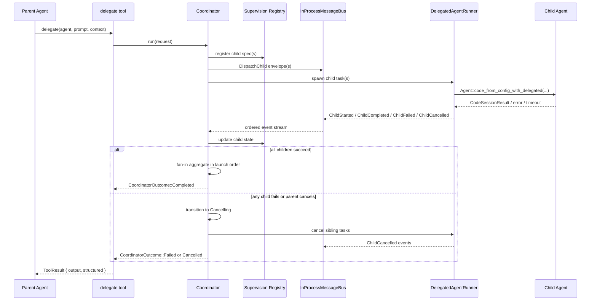
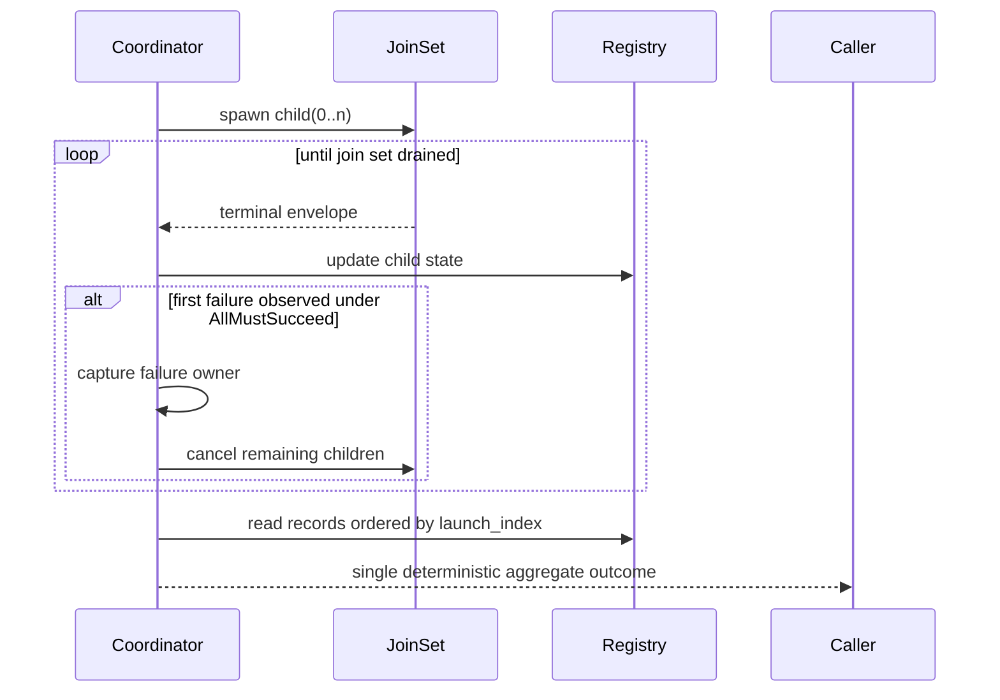

# Design: Track 4 Slice 1 — Coordinator Foundations

## Technical Approach

This slice introduces a dedicated in-process coordinator foundation inside `clients/agent-runtime/src/agent/` and keeps `tools/delegate.rs` as the external trigger rather than the orchestration engine. The implementation reuses Corvus' existing patterns for guarded lifecycle state (`agent/mission.rs`), bounded child execution (`Agent::code_from_config_with_delegated(...)`), and deterministic async supervision (`JoinSet` + `CancellationToken` patterns already used in `channels/mod.rs`).

The first slice is intentionally narrow:

- define a coordinator-owned lifecycle and supervised child registry;
- define typed in-process message envelopes and a bus contract that is not tied to future mailbox/bridge/worktree implementations;
- route delegated **session-mode** child execution through the coordinator seam;
- keep one-shot delegation behavior unchanged;
- make cancellation and failure ownership explicitly parent-driven and fail-closed.

This design maps directly to the proposal and exploration artifacts for `track-4-slice-1-coordinator-foundations`, while avoiding design work for remote transport, persisted mailboxes, worktrees, or permission-escalation flows.

## Architecture Decisions

### Decision: Put coordinator foundations under `agent/`, not inside `delegate`

**Choice**: Add a dedicated coordinator module rooted at `clients/agent-runtime/src/agent/coordinator.rs` and export it through `clients/agent-runtime/src/agent/mod.rs`.

**Alternatives considered**: Embed registry, state machine, and async supervision directly in `clients/agent-runtime/src/tools/delegate.rs`.

**Rationale**: `delegate` is a tool boundary, not the long-term orchestration boundary. Keeping coordinator logic in `agent/` matches the existing mission-layer pattern, isolates orchestration policy from tool parsing, and creates a stable seam for future mailbox/bridge/worktree transports without redesigning the tool surface.

### Decision: Use explicit coordinator and child state machines with deterministic terminal ownership

**Choice**: Model coordinator state and child state explicitly, with terminal outcomes owned by the parent coordinator.

**Alternatives considered**: Ad hoc booleans in registry entries; child-owned terminal decisions; implicit task completion based only on `JoinSet` join order.

**Rationale**: Corvus already uses explicit guarded lifecycle semantics in `mission.rs`. Coordinator behavior needs the same determinism for testability, cancellation safety, and future transport expansion. Parent-owned termination prevents race-prone semantics where multiple children try to define the final aggregate result.

### Decision: Define transport-agnostic envelopes now, but ship only an in-process bus implementation

**Choice**: Define typed coordinator envelopes and bus-facing payload enums that carry stable metadata (`coordinator_id`, `child_id`, sequence, correlation), while implementing only an in-process message bus for this slice.

**Alternatives considered**: Return raw `ToolResult` values directly from spawned tasks; design mailbox or bridge transport now.

**Rationale**: Returning only raw task results would force breaking changes when later slices add mailbox/bridge/worktree transports. Defining stable envelope contracts now gives future slices a safe compatibility target without pulling remote or persistent implementation into this slice.

### Decision: Keep child execution behind a runner trait and reuse the current delegated agent bootstrap

**Choice**: Introduce a small runner abstraction for child execution, with the production path backed by `Agent::code_from_config_with_delegated(...)` and delegate-session config inheritance.

**Alternatives considered**: Make the coordinator instantiate `Agent` directly everywhere; over-design a full trait hierarchy for remote execution now.

**Rationale**: Corvus is trait-driven, and a narrow runner seam keeps unit tests cheap while preserving the current delegated session bootstrap path. It also leaves room for future slices to add mailbox/bridge/worktree runners without changing coordinator state or envelope contracts.

### Decision: Preserve the existing `delegate` tool identity and one-shot behavior

**Choice**: `tools/delegate.rs` remains the user-facing tool. Only session-mode delegation is routed through coordinator foundations; one-shot provider calls stay on the current direct path.

**Alternatives considered**: Add a new coordinator tool; force all delegate modes through the coordinator immediately.

**Rationale**: This minimizes rollout risk and keeps the slice focused. The proposal explicitly avoids redesigning the full `delegate` surface, and one-shot behavior does not need coordinator semantics for this first slice.

## Data Flow

### Coordinator-supervised delegated session flow



### Narrative flow

1. `delegate.execute()` validates security, depth, and target agent config exactly as today.
2. If the target agent is `DelegateExecutionMode::OneShot`, the tool keeps the current provider-only path.
3. If the target agent is `DelegateExecutionMode::Session`, `delegate` creates a `CoordinatorLaunchRequest` and hands execution to the new coordinator module.
4. The coordinator allocates a `coordinator_id`, registers stable child identities, and transitions from initialized state into dispatch/supervision.
5. Each child is launched through the production runner using the same effective config layering already used by delegated code sessions.
6. Child tasks emit typed envelopes onto the in-process bus; the coordinator consumes envelopes, updates registry state, and performs deterministic fan-in.
7. On first terminal failure or explicit parent cancellation, the coordinator becomes the sole owner of cancellation and propagates it to all non-terminal children.
8. The coordinator returns a structured aggregate outcome that `delegate` converts into the existing `ToolResult` contract.

## File Changes

| File | Action | Description |
|------|--------|-------------|
| `clients/agent-runtime/src/agent/coordinator.rs` | Create | Main coordinator domain module: lifecycle state, registry types, message envelopes, runner trait, orchestration entrypoints, and unit tests. |
| `clients/agent-runtime/src/agent/mod.rs` | Modify | Export the new coordinator module. |
| `clients/agent-runtime/src/agent/agent.rs` | Modify | Add narrow helper(s) needed for coordinator-backed delegated child launch and keep canonical child bootstrap on `Agent::code_from_config_with_delegated(...)`. |
| `clients/agent-runtime/src/tools/delegate.rs` | Modify | Route session-mode delegated execution through the coordinator foundation while preserving one-shot behavior. |
| `clients/agent-runtime/src/config/schema.rs` | Modify | Add the minimal safe config surface only if rollout gating is required (default fail-closed / opt-in). |
| `clients/agent-runtime/src/agent/tests.rs` and/or module-local tests | Modify | Add focused regression coverage for coordinator interaction with the existing agent runtime. |
| `tmp/CLAUDIO_ROADMAP.md` | Modify | Record that Track 4 Slice 1 shipped coordinator foundations only, and explicitly list remaining gaps. |

## Interfaces / Contracts

### Module boundary

The slice should keep a single public coordinator module surface and hide internal helpers behind private types:

```rust
// clients/agent-runtime/src/agent/coordinator.rs
pub struct Coordinator {
    state: Arc<Mutex<CoordinatorState>>,
    registry: Arc<Mutex<SupervisionRegistry>>,
    next_sequence: AtomicU64,
}

impl Coordinator {
    pub async fn run(
        &self,
        request: CoordinatorLaunchRequest,
        runner: Arc<dyn CoordinatorChildRunner>,
    ) -> Result<CoordinatorOutcome, CoordinatorError>;
}
```

The module is responsible for:

- lifecycle transition validation;
- stable child registration and lookup;
- message-envelope sequencing;
- fan-out/fan-in aggregation;
- parent-owned cancellation.

The module is **not** responsible for tool parsing, provider creation policy, mailbox persistence, bridge transport, worktree management, or permission escalation.

### Coordinator state model

```rust
#[derive(Debug, Clone, PartialEq, Eq)]
pub enum CoordinatorState {
    Initialized,
    Dispatching,
    Supervising,
    Cancelling,
    Completed,
    Failed,
    Cancelled,
}

impl CoordinatorState {
    pub fn allows_transition_to(&self, target: &Self) -> bool {
        use CoordinatorState::{
            Cancelled, Cancelling, Completed, Dispatching, Failed, Initialized, Supervising,
        };

        matches!(
            (self, target),
            (Initialized, Dispatching)
                | (Dispatching, Supervising | Cancelling | Failed)
                | (Supervising, Completed | Cancelling | Failed)
                | (Cancelling, Cancelled | Failed)
        )
    }

    pub fn is_terminal(&self) -> bool {
        matches!(self, Self::Completed | Self::Failed | Self::Cancelled)
    }
}
```

State transition rules:

- terminal states are idempotent if re-read, but no non-terminal transition is allowed after terminal entry;
- `Failed` means the coordinator owns a terminal error condition;
- `Cancelled` means the parent explicitly cancelled, or the coordinator cancelled siblings and all remaining children converged to cancelled/terminal shutdown.

### Child supervision registry shape

Use a deterministic map keyed by stable child identity, with explicit launch order stored separately so fan-in order does not depend on completion timing:

```rust
pub type SupervisionRegistry = BTreeMap<ChildAgentId, ChildRecord>;

#[derive(Debug, Clone, PartialEq, Eq, PartialOrd, Ord, Hash)]
pub struct ChildAgentId(pub String);

#[derive(Debug, Clone, PartialEq, Eq)]
pub enum ChildState {
    Registered,
    Running,
    Succeeded,
    Failed,
    Cancelled,
}

#[derive(Debug, Clone)]
pub struct ChildRecord {
    pub child_id: ChildAgentId,
    pub agent_name: String,
    pub launch_index: u32,
    pub session_id: Option<String>,
    pub state: ChildState,
    pub last_sequence: u64,
    pub terminal_reason: Option<ChildTerminationReason>,
    pub summary: Option<String>,
}
```

Registry invariants:

- `child_id` is stable for the entire coordinator run;
- `launch_index` is unique and assigned by the parent at registration time;
- terminal child state is write-once;
- fan-in ordering uses `launch_index`, not wall-clock completion order;
- registry stores only operational metadata and summaries, not raw sensitive payloads.

### In-process bus and envelope contracts

The public contract should separate envelope metadata from payload so later mailbox/bridge/worktree transports can reuse the same shape.

```rust
#[derive(Debug, Clone, PartialEq, Eq)]
pub struct EnvelopeMeta {
    pub coordinator_id: String,
    pub child_id: Option<ChildAgentId>,
    pub sequence: u64,
    pub correlation_id: String,
    pub sent_at: chrono::DateTime<chrono::Utc>,
    pub transport: CoordinatorTransport,
}

#[derive(Debug, Clone, PartialEq, Eq)]
pub enum CoordinatorTransport {
    InProcess,
}

#[derive(Debug, Clone)]
pub struct MessageEnvelope<T> {
    pub meta: EnvelopeMeta,
    pub payload: T,
}

#[derive(Debug, Clone)]
pub enum CoordinatorMessage {
    DispatchChild(ChildLaunchRequest),
    CancelChild { reason: CancellationReason },
    ChildStarted { session_id: Option<String> },
    ChildProgress { summary: String },
    ChildCompleted { result: ChildExecutionResult },
    ChildFailed { error: ChildExecutionError },
    ChildCancelled { reason: CancellationReason },
}
```

Contract rules:

- every envelope has a monotonically increasing coordinator-local sequence number;
- `correlation_id` ties child terminal events back to the original dispatch envelope;
- `transport` is additive and future-proof, but only `InProcess` is valid in this slice;
- `ChildProgress` is optional and minimal in Slice 1; the important contract is terminal events;
- the coordinator consumes typed messages, not raw `ToolResult` blobs.

### Child launch and result contracts

```rust
#[derive(Debug, Clone)]
pub struct CoordinatorLaunchRequest {
    pub parent_session_id: Option<String>,
    pub children: Vec<ChildLaunchRequest>,
    pub fan_in: FanInPolicy,
}

#[derive(Debug, Clone)]
pub struct ChildLaunchRequest {
    pub child_id: ChildAgentId,
    pub agent_name: String,
    pub prompt: String,
    pub context: Option<String>,
    pub launch_index: u32,
}

#[derive(Debug, Clone)]
pub enum FanInPolicy {
    AllMustSucceed,
}

#[derive(Debug, Clone)]
pub struct ChildExecutionResult {
    pub session_id: String,
    pub tool_result: ToolResult,
    pub status: ChildTerminalStatus,
}

#[derive(Debug, Clone, PartialEq, Eq)]
pub enum ChildTerminalStatus {
    Succeeded,
    Failed,
    Cancelled,
}
```

Slice 1 only needs `AllMustSucceed`; that is enough to define deterministic failure ownership for delegated sessions and future parallel fan-out. Additional aggregation policies can be additive later.

### Runner abstraction

```rust
#[async_trait::async_trait]
pub trait CoordinatorChildRunner: Send + Sync {
    async fn run_child(
        &self,
        request: ChildLaunchRequest,
        cancellation: CancellationToken,
    ) -> MessageEnvelope<CoordinatorMessage>;
}
```

Production implementation responsibilities:

- build the effective delegated config from `DelegateAgentConfig` and base `Config`;
- launch child execution through `Agent::code_from_config_with_delegated(...)`;
- convert timeout, iteration-budget, and generic failures into typed terminal envelopes;
- never let child tasks define aggregate outcome directly.

## Fan-out / Fan-in Execution Flow

### Fan-out

Slice 1 should support the coordinator launching one or more child requests, even though `delegate` initially uses only a single child request. The flow is:

1. validate launch request and register all children before spawning any work;
2. assign `launch_index` and initial `Registered` state;
3. transition coordinator to `Dispatching`;
4. spawn child tasks in a `tokio::task::JoinSet`;
5. move to `Supervising` once all launch attempts are recorded.

### Fan-in

Fan-in must be deterministic and independent of task completion races:

1. consume child terminal envelopes as they arrive;
2. update registry entries atomically;
3. if a child fails under `AllMustSucceed`, capture the failure owner using the lowest `launch_index` among failed children;
4. trigger parent-owned cancellation for all non-terminal siblings;
5. once `JoinSet` drains, aggregate results sorted by `launch_index`;
6. emit a single `CoordinatorOutcome`.



## Cancellation / Failure Ownership

### Ownership rules

- The **parent coordinator owns cancellation**.
- Children may report failure or observe cancellation, but they do not decide aggregate termination.
- Any sibling shutdown caused by another child failure is still recorded as coordinator-driven cancellation.
- Unknown join errors, poisoned state locks, or bus contract violations are treated as fail-closed coordinator failures.

### Failure semantics

- Child timeout, iteration-budget exhaustion, child runtime error, or invalid terminal envelope => `ChildFailed`.
- First aggregate failure under `AllMustSucceed` transitions coordinator toward `Cancelling` and then `Failed`.
- If the parent explicitly cancels before any child failure, the coordinator transitions `Supervising -> Cancelling -> Cancelled`.
- If cancellation propagation itself fails for any child task, the coordinator returns `Failed` rather than pretending successful cancellation.

### Delegate-facing result ownership

`delegate` remains responsible for rendering the final `ToolResult`, but it must do so from the coordinator's aggregate outcome instead of from an inline session runner. That keeps the tool contract backward-compatible while moving ownership of child lifecycle and cancellation into the coordinator module.

## Interaction with Existing `delegate` Tool and Agent Runtime

### `delegate` tool integration

`tools/delegate.rs` should keep its current input schema, depth checks, security enforcement, and one-shot provider path. The only change is in the session-mode branch:

- current: `delegate` calls `run_session(...)` directly;
- target: `delegate` builds a single-child `CoordinatorLaunchRequest` and awaits `Coordinator::run(...)`.

That gives immediate real usage of the new coordinator seam without changing the tool name or expanding user-facing orchestration syntax in Slice 1.

### Agent runtime integration

The coordinator should not build a parallel agent runtime. Production child execution reuses:

- `Agent::code_from_config_with_delegated(...)` for canonical delegated code sessions;
- current config inheritance from `DelegateAgentConfig` plus `Config` cloning;
- current `CodeSessionResult` parsing and `ToolResult.structured` behavior;
- current observer/audit behavior emitted by delegated child sessions.

If a small helper is needed in `agent.rs`, it should be narrowly scoped to “run delegated child from effective config” rather than exposing coordinator concerns across the agent module.

## Testing Strategy

| Layer | What to Test | Approach |
|-------|-------------|----------|
| Unit | Coordinator state transition invariants | Table-driven tests in `agent/coordinator.rs` mirroring the style used in `mission.rs`, including invalid and already-terminal transitions. |
| Unit | Registry behavior and deterministic ordering | Tests for stable `ChildAgentId`, unique `launch_index`, terminal write-once behavior, and launch-order fan-in sorting. |
| Unit | Envelope metadata and sequencing | Tests asserting monotonic sequence assignment, correlation propagation, and additive transport metadata serialization. |
| Unit | Failure and cancellation ownership | Stub runner tests proving first failure triggers parent-owned cancellation and that aggregate outcome is deterministic regardless of task completion order. |
| Integration | `delegate` session mode uses coordinator path | Extend `tools/delegate.rs` tests so session-mode delegation routes through coordinator-backed execution while one-shot behavior stays unchanged. |
| Integration | Child runtime parity with existing delegated sessions | Reuse/mock existing `CodeSessionResult` / `ToolResult` behavior to verify structured results, timeout handling, and budget-exceeded mapping still match current contracts. |
| Regression | No widening of security or permission scope | Assert that coordinator-backed delegated sessions still rely on the same `delegate` policy enforcement and do not bypass existing `SecurityPolicy` checks. |

## Migration / Rollout

- Phase 1: land the coordinator module and tests with no user-facing transport expansion.
- Phase 2: route delegated **session-mode** execution through the coordinator seam.
- Phase 3: keep one-shot mode unchanged and validate parity through targeted Rust tests.
- Optional rollout gate: if implementation risk justifies it, add a minimal config flag such as `agent.coordinator.enabled` with default `false`, so existing session-mode behavior is preserved unless explicitly enabled.

No migration required.

## Roadmap Update Obligations

Implementation for this slice MUST update `tmp/CLAUDIO_ROADMAP.md` in the Track 4 section to:

1. call out that **Coordinator Foundations / Slice 1** shipped;
2. describe the delivered scope in concrete terms:
   - explicit coordinator state machine,
   - supervised child registry,
   - typed in-process messaging contract,
   - deterministic fan-out/fan-in foundation,
   - parent-owned cancel/failure semantics,
   - `delegate` session-mode integration seam;
3. preserve the remaining gaps as still pending for later slices:
   - mailbox/persistent messaging,
   - remote bridge transport,
   - worktree/isolation execution models,
   - permission escalation / approval-broker flows,
   - broader user-facing coordinator UX.

The roadmap update should make it impossible to misread Slice 1 as full Track 4 completion.

## Open Questions

- [ ] Is an opt-in config gate necessary for first rollout, or is direct session-mode routing through coordinator low-risk enough to ship without a new config surface?
- [ ] Should Slice 1 add a lightweight coordinator lifecycle observer event now, or defer that until a later Track 4 observability-focused slice?
