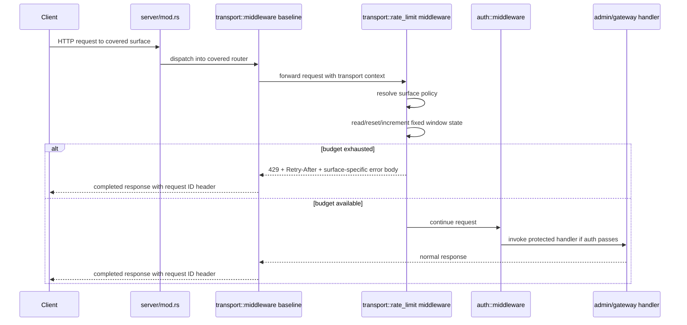

# Design: Add Global Surface Rate Limits for Rook Transport Entry Points

## Technical Approach

This slice adds a dedicated global-by-surface admission-control layer inside Rook's existing
transport boundary composition in `clients/rook/src/server/mod.rs`. The rate-limit boundary sits in
front of covered admin and gateway handlers, but remains separate from the archived inbound auth
boundary and transport middleware baseline by extending the top-level `transport` module rather than
mixing logic into `auth`, `admin`, or `gateway` business handlers.

The implementation approach is:

1. extend `ServerConfig` and `config/mod.rs` with a startup-validated rate-limit subtree that defines
   one global policy per covered surface
2. add a focused transport rate-limit component that owns shared in-memory counters/windows,
   admission decisions, and `Retry-After` derivation
3. compose that component as surface-specific middleware around only these covered surfaces:
   - all `/api/*`
   - `GET /v1/models`
   - `POST /v1/chat/completions`
4. return transport-boundary `429 Too Many Requests` responses without invoking downstream handler
   logic when the applicable surface budget is exhausted
5. preserve existing error-envelope contracts by shaping `/api/*` rejections with the admin error
   body and `/v1/*` rejections with the gateway/OpenAI-style error body

This matches the proposal and delta spec by keeping the slice intentionally coarse-grained:
startup/config-driven, global-by-surface only, and limited to three covered HTTP surfaces. It does
not introduce per-client partitioning, streaming behavior, idempotency, TLS, RBAC, or outbound
provider-auth changes.

## Architecture Decisions

### Decision: Put the rate-limit boundary at server router composition, outside handlers

**Choice**: Apply rate limiting in `clients/rook/src/server/mod.rs` where the combined axum server
already nests `/api` and `/v1` routers.

**Alternatives considered**:
- add checks inside each admin and gateway handler
- attach separate ad hoc middleware inside individual handler modules only

**Rationale**:
- `server/mod.rs` is already the shared composition point for covered transport surfaces.
- The spec requires rejection before normal handler business logic executes.
- Composition-level placement keeps dashboard routes and other uncovered routes out of scope by router
  topology instead of fragile path checks spread across handlers.
- It preserves rollback simplicity: remove the transport admission layer without redesigning admin or
  gateway business code.

### Decision: Keep rate limiting in the transport module, separate from archived auth and baseline slices

**Choice**: Add rate-limit types/helpers under `clients/rook/src/transport/` and keep archived auth
middleware unchanged except for composition order.

**Alternatives considered**:
- extend `clients/rook/src/auth/middleware.rs` to own throttling decisions
- fold rate limiting into `gateway/handlers.rs` and duplicate admin behavior separately

**Rationale**:
- The archived inbound auth slice owns credential validation, not traffic shaping.
- The archived transport baseline already established the correct home for cross-cutting transport
  policy.
- Separating modules keeps this slice independently reversible and avoids reopening unrelated auth,
  request ID, forwarded-header, or vendor-auth concerns.

### Decision: Model coverage as three distinct surface budgets, not one `/v1/*` budget

**Choice**: Introduce a new covered-surface enum/value set for:
- `AdminApi`
- `GatewayModels`
- `GatewayChatCompletions`

and map requests to exactly one of those budgets when they are in scope.

**Alternatives considered**:
- reuse the existing `RouteSurface::{AdminApi, GatewayV1}` only
- use one shared budget for all `/v1/*` traffic
- key budgets by full request path string

**Rationale**:
- The spec requires `/v1/models` and `/v1/chat/completions` to have independent budgets.
- Reusing `GatewayV1` would collapse two required policies into one.
- Full-path keys would over-generalize the slice and create accidental behavior for future routes.
- A narrow dedicated enum keeps scope explicit and testable.

### Decision: Use fixed-window admission with integer-second `Retry-After`

**Choice**: Represent each configured policy as `max_requests` within `window_seconds`, backed by an
in-memory fixed window per surface. Rejections return `Retry-After` as the number of whole seconds
until the current window resets, with a minimum emitted value of `1` on rejection.

**Alternatives considered**:
- token bucket / leaky bucket
- sliding window with per-request timestamps
- hard-coded `Retry-After` independent of remaining window time

**Rationale**:
- Startup-configured coarse surface protection does not need the complexity of token-bucket refill
  math or timestamp queues.
- Fixed windows are simple to validate, easy to explain to operators, and easy to test with a
  controllable clock.
- Deriving `Retry-After` from a known window reset time gives deterministic rejection guidance.
- This slice values clarity and rollbackability over fairness smoothness.

### Decision: Make configuration fail closed and explicit for all three covered surfaces

**Choice**: Add a required `RateLimitConfig` subtree that includes explicit policies for all three
covered surfaces and validate them during startup alongside existing inbound-auth and transport
validation.

**Alternatives considered**:
- optional per-surface config with implicit defaults
- enable rate limiting only for configured surfaces and silently skip missing ones
- infer limits from unrelated gateway/admin settings

**Rationale**:
- The spec requires startup/config initialization to fail closed when the configuration is missing,
  malformed, or contradictory.
- Explicit per-surface entries prevent ambiguous partial protection.
- Keeping config separate from auth and vendor credentials preserves slice boundaries.

### Decision: Preserve existing surface-specific error envelopes for 429s

**Choice**: Add rate-limit response helpers that reuse the established response shapes:
- `/api/*` → `AdminErrorResponse`
- `/v1/models` and `/v1/chat/completions` → `GatewayErrorResponse`

Each helper sets status `429` and the `Retry-After` header.

**Alternatives considered**:
- one shared generic JSON error shape for all surfaces
- plain-text `429` body
- pushing 429 shaping down into handlers

**Rationale**:
- The delta spec explicitly requires different body contracts for `/api/*` and `/v1/*`.
- Rook already centralizes those shapes in `admin/types.rs` and `gateway/types.rs`.
- Middleware-owned shaping guarantees the rejection contract without invoking business handlers.

### Decision: Place rate limiting outside auth so 429s can short-circuit before auth/handler work

**Choice**: For covered routes, compose rate-limit middleware outside the archived inbound auth
middleware and outside handler execution.

**Alternatives considered**:
- authenticate first, then rate limit
- combine auth and rate limiting in one new middleware layer

**Rationale**:
- The proposal's goal is to shed excess request volume before admin or gateway handlers are
  overloaded.
- Keeping middleware separate avoids reinterpreting the archived auth slice.
- The only behavioral change to auth ordering is earlier rejection by this slice's own `429`
  contract, which the spec explicitly allows.

## Data Flow

### Covered Request Flow

```text
Client Request
   |
   v
Combined Router (`server/mod.rs`)
   |
   +--> `/api/*`
   |       |
   |       v
   |   transport baseline
   |       |
   |       v
   |   admin global rate-limit middleware
   |       |
   |       +--> reject -> 429 admin error + Retry-After
   |       |
   |       v
   |   archived inbound auth middleware
   |       |
   |       v
   |   admin handler
   |
   +--> `/v1/models`
   |       |
   |       v
   |   transport baseline
   |       |
   |       v
   |   models global rate-limit middleware
   |       |
   |       +--> reject -> 429 gateway error + Retry-After
   |       |
   |       v
   |   archived inbound auth middleware
   |       |
   |       v
   |   gateway models handler
   |
   +--> `/v1/chat/completions`
   |       |
   |       v
   |   transport baseline
   |       |
   |       v
   |   chat global rate-limit middleware
   |       |
   |       +--> reject -> 429 gateway error + Retry-After
   |       |
   |       v
   |   archived inbound auth middleware
   |       |
   |       v
   |   gateway chat handler
   |
   \--> dashboard + other routes unchanged
```

### Rate-Limit State Flow

```text
Request enters covered surface
   |
   v
Resolve covered surface key
   |
   v
Load policy for that surface
   |
   v
Read in-memory surface window state
   |
   +--> window expired --> reset count and window_start
   |
   +--> count < max_requests --> increment and admit
   |
   \--> count >= max_requests --> reject and derive Retry-After from window_end - now
```

### Sequence Diagram



## File Changes

| File | Action | Description |
|------|--------|-------------|
| `clients/rook/src/lib.rs` | Modify | Export any new transport rate-limit module/types needed by server composition. |
| `clients/rook/src/server/mod.rs` | Modify | Extend `ServerConfig`, validate rate-limit config at startup, create shared rate-limit state, and compose surface-specific middleware for `/api/*`, `/v1/models`, and `/v1/chat/completions`. |
| `clients/rook/src/main.rs` | Modify | Populate `ServerConfig.rate_limits` with explicit startup values for all three covered surfaces in the current CLI-driven startup path. |
| `clients/rook/src/config/mod.rs` | Modify | Add `RateLimitConfig` and validation helpers separate from inbound auth and transport baseline config. |
| `clients/rook/src/transport/mod.rs` | Modify | Export new rate-limit state, policy, and middleware modules. |
| `clients/rook/src/transport/context.rs` | Modify | Add or extend a dedicated covered-surface enum for global rate-limit routing without changing existing sanitized transport context responsibilities. |
| `clients/rook/src/transport/middleware.rs` | Modify | Keep existing baseline middleware intact; optionally host the new rate-limit middleware state type if colocating transport middleware entrypoints is cleaner. |
| `clients/rook/src/transport/rate_limit.rs` | Create | Own in-memory state model, policy types, decision logic, `Retry-After` derivation, surface-specific rejection helpers, and axum middleware adapters. |
| `clients/rook/src/admin/types.rs` | Modify | Add an admin `429` helper built on `AdminErrorResponse` so `/api/*` rejections match existing admin error shape. |
| `clients/rook/src/gateway/types.rs` | Modify | Add a gateway `429` helper built on `GatewayErrorResponse` so `/v1/*` rejections match existing OpenAI-style error shape. |
| `clients/rook/src/admin/mod.rs` | No business redesign | Admin routes stay mounted as-is under `/api`; rate limiting applies at composition, not in handlers. |
| `clients/rook/src/gateway/mod.rs` | Modify | Optionally split `/models` and `/chat/completions` route composition if needed so each gets its own middleware cleanly without widening coverage to future `/v1/*` routes. |
| `clients/rook/src/admin/handlers.rs` | No business redesign | No handler logic change; requests rejected by this slice never reach these handlers. |
| `clients/rook/src/gateway/handlers.rs` | No business redesign | No handler logic change; requests rejected by this slice never reach these handlers. |

## Interfaces / Contracts

### Startup Configuration

```rust
#[derive(Debug, Clone, PartialEq, Eq)]
pub struct SurfaceRateLimitPolicy {
    pub max_requests: u32,
    pub window_seconds: u64,
}

#[derive(Debug, Clone, PartialEq, Eq)]
pub struct RateLimitConfig {
    pub api: SurfaceRateLimitPolicy,
    pub v1_models: SurfaceRateLimitPolicy,
    pub v1_chat_completions: SurfaceRateLimitPolicy,
}

impl RateLimitConfig {
    pub fn validate(&self) -> Result<(), RookError>;
}
```

Validation rules for this slice:
- all three surface policies are required
- `max_requests > 0`
- `window_seconds > 0`
- no implicit inheritance between surfaces
- config errors return `RookError::Config(...)`

### Server Config Extension

```rust
#[derive(Debug, Clone)]
pub struct ServerConfig {
    pub host: String,
    pub port: u16,
    pub enable_tui: bool,
    pub db_path: Option<String>,
    pub inbound_auth: InboundAuthConfig,
    pub transport: TransportConfig,
    pub rate_limits: RateLimitConfig,
}
```

### Covered Surface Model

```rust
#[derive(Debug, Clone, Copy, PartialEq, Eq, Hash)]
pub enum RateLimitedSurface {
    AdminApi,
    GatewayModels,
    GatewayChatCompletions,
}
```

This enum is intentionally narrower than generic route topology. It represents only the three
surfaces covered by this slice.

### Runtime State Model

```rust
#[derive(Debug, Clone)]
pub struct RateLimitState {
    pub policies: std::collections::HashMap<RateLimitedSurface, SurfaceRateLimitPolicy>,
    pub windows: std::sync::Arc<tokio::sync::Mutex<
        std::collections::HashMap<RateLimitedSurface, SurfaceWindowState>
    >>,
}

#[derive(Debug, Clone)]
pub struct SurfaceWindowState {
    pub window_started_at: std::time::Instant,
    pub request_count: u32,
}
```

Design notes:
- state is process-local and reset on restart, which is acceptable for this startup/config-driven
  slice
- one mutable entry exists per covered surface, not per client/IP/identity
- `tokio::sync::Mutex` matches the async server runtime and keeps state handling simple

### Decision Contract

```rust
pub enum RateLimitDecision {
    Allow,
    Reject { retry_after_seconds: u64 },
}

pub fn evaluate_surface_limit(
    now: std::time::Instant,
    policy: &SurfaceRateLimitPolicy,
    window: &mut SurfaceWindowState,
) -> RateLimitDecision;
```

Decision algorithm:
1. if `now - window_started_at >= window_seconds`, reset `request_count = 0` and
   `window_started_at = now`
2. if `request_count < max_requests`, increment and allow
3. otherwise reject
4. derive `retry_after_seconds` as `ceil((window_end - now).as_secs_f64())`, then clamp to at
   least `1`

This yields deterministic `Retry-After` values and avoids returning `0` on a rejected request.

### Response Shaping Helpers

```rust
pub fn admin_rate_limited_response(retry_after_seconds: u64) -> axum::response::Response;

pub fn gateway_rate_limited_response(retry_after_seconds: u64) -> axum::response::Response;
```

Expected body contracts:

`/api/*`
```json
{
  "error": {
    "code": "rate_limited",
    "message": "global rate limit exceeded for /api surface"
  }
}
```

`/v1/*`
```json
{
  "error": {
    "message": "global rate limit exceeded for this endpoint",
    "type": "rate_limit_error",
    "code": "rate_limited"
  }
}
```

Both helpers set:
- status: `429 Too Many Requests`
- header: `Retry-After: <seconds>`

## Testing Strategy

| Layer | What to Test | Approach |
|-------|-------------|----------|
| Unit | `RateLimitConfig::validate` rejects missing/zero/invalid policies and accepts valid explicit per-surface config | Add focused tests in `clients/rook/src/config/mod.rs` following existing validation-test style. |
| Unit | Fixed-window decision logic resets windows, admits within budget, rejects after exhaustion, and derives `Retry-After` deterministically | Add narrow tests in `clients/rook/src/transport/rate_limit.rs` using injected `Instant` values. |
| Unit | `/api/*` and `/v1/*` 429 helpers preserve required error-envelope shapes and set `Retry-After` | Add response-shape tests in `clients/rook/src/admin/types.rs` and `clients/rook/src/gateway/types.rs`. |
| Integration | Covered surfaces are independently limited | Extend `clients/rook/src/server/mod.rs` router tests to exhaust `/api/*`, `/v1/models`, and `/v1/chat/completions` separately and verify one surface does not consume another surface's budget. |
| Integration | Covered requests are rejected before handler logic when budget is exhausted | Use lightweight probe routes or existing handlers in `server/mod.rs` tests to show 429s occur without downstream business execution. |
| Integration | `Retry-After` is present on every 429 from this slice | Assert header presence and positive integer value in server composition tests for all three covered surfaces. |
| Integration | Dashboard root and unrelated routes remain out of scope | Reuse existing `server/mod.rs` coverage to confirm `/` and assets are not rate-limited by this slice. |
| Integration | Auth and rate limiting remain separate | Add server tests proving a covered route can return 429 from rate limiting without changing auth response shape expectations for non-exhausted requests. |
| E2E | Not required for this slice | Scope stays inside Rook router/unit integration tests; no broader web or provider end-to-end coverage is needed. |

## Migration / Rollout

No data migration required.

Rollout for this slice is startup-config driven:
- add explicit per-surface settings in the Rook startup path
- ship conservative defaults for local/dev startup if the current CLI path requires in-code values
- if operators hit unacceptable throttling, rollback is a code/config reversion that removes the
  rate-limit middleware composition and the new config subtree

## Tradeoffs and Rejected Alternatives

### Tradeoff: Global-by-surface protection is simple but not fair

This design intentionally allows one noisy caller to consume the full budget for a surface. That is
an accepted tradeoff for this slice because per-client/per-IP/per-identity partitioning is explicitly
out of scope.

### Tradeoff: In-memory state is restart-local

Counters reset when the Rook process restarts and are not shared across replicas. That is acceptable
because the slice is startup/config-driven, narrow, and local to the current standalone Rook
deployment model.

### Rejected: Token bucket or sliding-window algorithms

Rejected because they increase implementation and test complexity without clear product value for the
first global coarse-grained protection slice.

### Rejected: One shared `/v1/*` limit

Rejected because the spec explicitly requires `/v1/models` and `/v1/chat/completions` to have
independent budgets.

### Rejected: Path-prefix runtime inspection inside one generic middleware

Rejected because it would make future `/v1/*` routes easier to accidentally throttle. Surface-
specific composition in router topology is more explicit and safer.

### Rejected: Database-backed or distributed rate-limit state

Rejected because it expands the slice into persistence/distribution work and complicates rollback.

## Rollback

Rollback is straightforward and transport-boundary-only:

1. remove rate-limit middleware composition from `clients/rook/src/server/mod.rs`
2. remove `ServerConfig.rate_limits` and the related config validation in `clients/rook/src/config/mod.rs`
3. remove the dedicated transport rate-limit module and 429 helper constructors
4. keep archived inbound auth and transport baseline code intact

After rollback, Rook returns to the previously archived auth-boundary + transport-baseline behavior
with no global request throttling on `/api/*`, `/v1/models`, or `/v1/chat/completions`.

## Open Questions

- [ ] Whether the current CLI startup path should expose explicit `--rate-limit-*` flags now or keep
      the first implementation wired through strict defaults until broader config loading lands.
- [ ] Whether `GatewayState` route composition should be split into subrouters in `gateway/mod.rs`
      or handled directly in `server/mod.rs` for the cleanest surface-specific middleware wiring.
