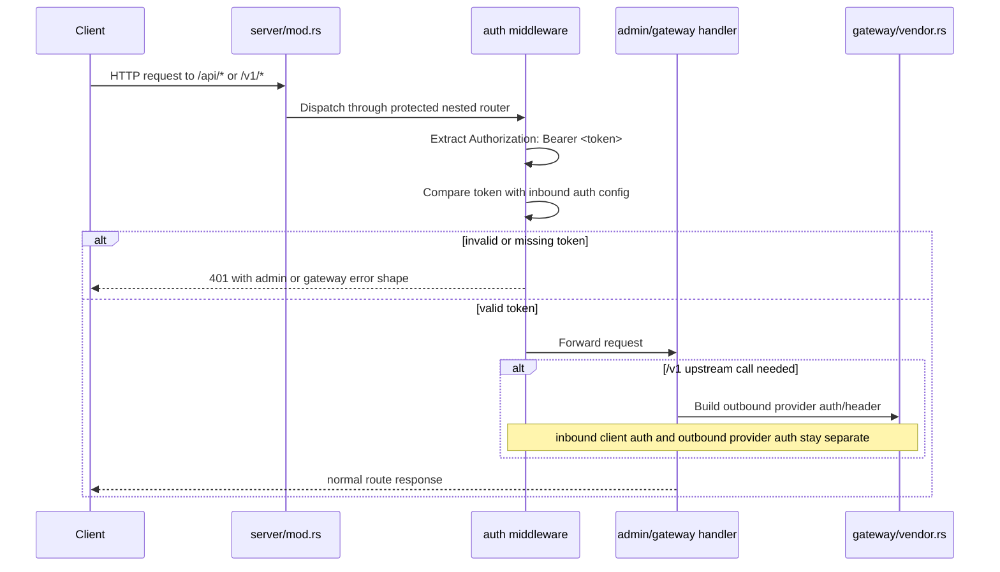

# Design: Harden Rook Inbound Auth Boundary for `/api` and `/v1`

## Technical Approach

This slice adds a small, Rook-specific inbound authentication layer at the HTTP transport boundary in
`clients/rook/src/server/mod.rs`, where the combined axum router currently nests `/api` and `/v1`
routers. The design keeps authentication enforcement outside admin business handlers and outside
gateway upstream/provider logic, so inbound client trust remains separate from outbound provider
auth in `clients/rook/src/gateway/vendor.rs`.

The implementation approach is:

1. extend Rook server/runtime configuration with a dedicated inbound-auth section
2. validate that configuration before router construction
3. apply auth middleware only to the `/api/*` and `/v1/*` nested routers
4. shape unauthorized responses per surface contract:
   - `/api/*` → admin error envelope
   - `/v1/*` → gateway/OpenAI-style error envelope
5. leave dashboard routes (`/`, `/assets/*`) untouched

This matches the proposal and gateway delta spec by enforcing auth before route handlers run,
failing closed when auth is enabled but token configuration is invalid, and preserving the existing
loopback-first bind posture as an additional exposure reduction measure rather than as the
authenticator.

## Architecture Decisions

### Decision: Put the auth boundary at server router composition, not inside handlers

**Choice**: Apply auth as router middleware/wrapper when `/api` and `/v1` are nested in
`clients/rook/src/server/mod.rs`.

**Alternatives considered**:
- add auth checks to each admin and gateway handler
- wrap only individual routes inside `admin::build_router()` and `gateway::build_router()`

**Rationale**:
- The spec requires auth to run before handler business logic.
- `server/mod.rs` is already the composition point for `/api`, `/v1`, and dashboard routes.
- Keeping auth at composition level minimizes changes to existing handler code and prevents drift
  between protected routes.
- It preserves dashboard routes outside scope with a clear, prefix-based boundary.

### Decision: Keep inbound auth implementation in a new Rook-only module

**Choice**: Introduce a dedicated module such as `clients/rook/src/auth/` for inbound bearer
parsing, validation, middleware, and error helpers.

**Alternatives considered**:
- reuse `clients/agent-runtime/src/gateway/utils.rs` directly
- place auth logic under `gateway/` because `/v1` is gateway-facing
- place auth logic under `admin/` and duplicate for gateway

**Rationale**:
- Proposal/spec explicitly require separation from runtime pairing/onboarding trust assumptions.
- Rook needs one shared inbound transport concern for both `/api/*` and `/v1/*`, not a gateway-only
  or admin-only abstraction.
- A dedicated module makes the boundary explicit and avoids accidental coupling to
  `gateway/vendor.rs` outbound auth behavior.

### Decision: Use surface-specific middleware constructors over one generic response adapter

**Choice**: Build one shared token validation core plus two thin middleware entrypoints/helpers:
one for `/api/*`, one for `/v1/*`.

**Alternatives considered**:
- one generic middleware that inspects path prefixes at runtime to choose an error shape
- two fully separate auth implementations

**Rationale**:
- `/api/*` and `/v1/*` have different error contracts and should not negotiate that deep inside a
  generic opaque middleware.
- A shared core avoids duplicated parsing/validation logic.
- Thin surface-specific adapters keep contracts explicit and reduce accidental response drift.

### Decision: Keep auth config on `ServerConfig` for this slice

**Choice**: Extend `clients/rook/src/server/mod.rs::ServerConfig` with inbound-auth settings and
move validation into server startup/build-app flow.

**Alternatives considered**:
- fully implement `clients/rook/src/config/mod.rs::RookConfig` and wire all startup through it now
- store inbound auth token in registry/settings tables

**Rationale**:
- Current executable path already constructs `ServerConfig` in `clients/rook/src/main.rs`.
- This slice must stay narrow and should not expand into a broader config-system redesign.
- Registry-backed settings are the wrong boundary for a transport secret needed before the server
  starts accepting requests.
- The placeholder `config/mod.rs` can still define reusable config types/helpers without requiring a
  full config-loading feature in this slice.

### Decision: Fail closed only when auth is enabled

**Choice**: If inbound auth enforcement is enabled and the token is absent/blank/unresolvable,
startup returns `RookError::Config(...)` and the server does not start.

**Alternatives considered**:
- silently disable auth when token is missing
- allow startup and log a warning
- always require a token regardless of enabled switch

**Rationale**:
- The delta spec requires fail-closed behavior for enabled auth.
- Silent downgrade would create a partially protected state.
- Always-on token enforcement would change the M1 posture more broadly than this slice requires.

### Decision: Do not introduce 403 policy logic in this slice

**Choice**: Design the auth layer so `403 Forbidden` can be added later, but implement only bearer
validity decisions now (`401` on missing/malformed/invalid credentials).

**Alternatives considered**:
- add origin-based or route-based deny policies now
- add placeholder RBAC/scope hooks now

**Rationale**:
- The spec says 403 should not be introduced unless a concrete policy exists.
- Scope is strictly inbound auth boundary, not authorization policy.
- Keeping the decision model binary for now reduces risk and keeps tests small.

## Data Flow

### Request Flow

```text
Client Request
   |
   v
Combined Server Router (`server/mod.rs`)
   |
   +--> `/api/*` nested router -- auth middleware (admin adapter) -- admin handlers
   |
   +--> `/v1/*` nested router  -- auth middleware (gateway adapter) -- gateway handlers
   |
   \--> `/` + `/assets/*` dashboard routes (no auth in this slice)
```

### Auth Validation Flow

```text
Authorization header
   |
   v
Rook auth extractor
   |
   +--> missing / invalid scheme / empty / malformed --> surface-specific 401 response
   |
   \--> parsed bearer token
          |
          v
     compare against configured inbound token
          |
          +--> mismatch --> surface-specific 401 response
          |
          \--> match --> forward request to nested handler
```

### Sequence Diagram



## File Changes

| File | Action | Description |
|------|--------|-------------|
| `clients/rook/src/lib.rs` | Modify | Export the new auth module. |
| `clients/rook/src/server/mod.rs` | Modify | Extend `ServerConfig`, validate inbound auth settings, and compose `/api` + `/v1` routers with auth middleware while leaving dashboard routes unprotected. |
| `clients/rook/src/main.rs` | Modify | Accept minimal CLI/env-facing auth inputs for `serve` and map them into `ServerConfig`. |
| `clients/rook/src/config/mod.rs` | Modify | Add small inbound-auth config types/validation helpers if shared config structures are introduced for startup validation. Keep scope narrow; do not implement full config subsystem. |
| `clients/rook/src/admin/mod.rs` | Optional Modify | If needed, expose a small surface identifier or helper for admin-protected router composition, but avoid moving business logic here. |
| `clients/rook/src/admin/types.rs` | Optional Modify | Add a dedicated auth-failure helper constructor if keeping admin error shaping centralized here is cleaner. |
| `clients/rook/src/admin/handlers.rs` | Optional Modify | Reuse/export existing `admin_error_response(...)` helper from middleware path; no business behavior changes. |
| `clients/rook/src/gateway/mod.rs` | Optional Modify | Keep router contract stable; only minor adjustments if surface-specific middleware layering needs a helper. |
| `clients/rook/src/gateway/types.rs` | Modify | Add a dedicated helper/constructor for unauthorized gateway errors using `invalid_request_error` + `unauthorized`. |
| `clients/rook/src/gateway/handlers.rs` | Optional Modify | Reuse gateway error helper from middleware path; no outbound auth behavior changes. |
| `clients/rook/src/gateway/vendor.rs` | No functional change | Remains the outbound provider auth boundary; design documents its non-involvement. |
| `clients/rook/src/auth/mod.rs` | Create | Shared inbound auth entrypoint: config-facing types, validation core, and surface middleware constructors. |
| `clients/rook/src/auth/bearer.rs` | Create | Rook-specific bearer extraction and parsing rules for `Authorization` headers. |
| `clients/rook/src/auth/middleware.rs` | Create | Axum middleware/guard functions for admin and gateway protected routers. |
| `clients/rook/src/auth/types.rs` | Create | Internal auth decision/error enums and possibly a validated config wrapper. |

## Interfaces / Contracts

The exact names may vary during implementation, but the design expects small interfaces close to the
current code style.

### Inbound Auth Configuration

```rust
#[derive(Debug, Clone, PartialEq, Eq)]
pub struct InboundAuthConfig {
    pub enabled: bool,
    pub bearer_token: Option<String>,
}

impl InboundAuthConfig {
    pub fn validate(&self) -> Result<(), RookError>;
}
```

This config remains independent from provider account credentials and `gateway/vendor.rs`.

### Server Config Extension

```rust
#[derive(Debug, Clone)]
pub struct ServerConfig {
    pub host: String,
    pub port: u16,
    pub enable_tui: bool,
    pub db_path: Option<String>,
    pub inbound_auth: InboundAuthConfig,
}
```

### Bearer Extraction Core

```rust
pub enum BearerExtractionError {
    Missing,
    InvalidScheme,
    EmptyToken,
    Malformed,
}

pub fn extract_bearer_token(headers: &axum::http::HeaderMap)
    -> Result<&str, BearerExtractionError>;
```

Design notes:
- Rook may adapt the parsing pattern from `clients/agent-runtime/src/gateway/utils.rs`
  (`extract_bearer_token`) but MUST keep its own implementation and constraints.
- This slice compares one configured token only.
- If multiple/ambiguous authorization values are observed and cannot be interpreted
  deterministically, extraction returns an error and the request is denied.

### Validation Core

```rust
pub enum InboundAuthFailure {
    Missing,
    Malformed,
    Invalid,
}

pub fn validate_inbound_request(
    headers: &axum::http::HeaderMap,
    config: &InboundAuthConfig,
) -> Result<(), InboundAuthFailure>;
```

### Surface-Specific Unauthorized Responses

```rust
pub fn admin_unauthorized_response() -> (StatusCode, Json<AdminErrorResponse>);

pub fn gateway_unauthorized_response() -> axum::response::Response;
```

Expected bodies:

```json
// /api/*
{
  "error": {
    "code": "unauthorized",
    "message": "valid inbound bearer token required"
  }
}
```

```json
// /v1/*
{
  "error": {
    "message": "valid inbound bearer token required",
    "type": "invalid_request_error",
    "code": "unauthorized"
  }
}
```

The middleware should also set an HTTP `WWW-Authenticate: Bearer` header on `401` responses as a
standard HTTP auth hint, because that does not conflict with either body contract.

### Router Composition Sketch

```rust
let admin_router = admin::build_router(registry)
    .route_layer(auth::middleware::admin_inbound_auth_layer(inbound_auth.clone()));

let gateway_router = gateway::build_router(gateway_state)
    .route_layer(auth::middleware::gateway_inbound_auth_layer(inbound_auth.clone()));

Router::new()
    .nest("/api", admin_router)
    .nest("/v1", gateway_router)
    .merge(dashboard::router())
```

If axum layering details make `route_layer(...)` awkward for nested routers, the acceptable
equivalent is to wrap each nested router with `middleware::from_fn_with_state(...)`. The important
contract is that auth runs before handlers and only for those two prefixes.

## Testing Strategy

| Layer | What to Test | Approach |
|-------|-------------|----------|
| Unit | Bearer parsing rules | Add focused tests in `clients/rook/src/auth/bearer.rs` for missing header, non-bearer scheme, empty token, valid token, case-insensitive scheme, trailing whitespace, and ambiguous/malformed values. |
| Unit | Config validation | Add focused tests for `InboundAuthConfig::validate()` covering enabled+missing token, enabled+blank token, enabled+valid token, and disabled+missing token. |
| Unit | Error shaping | Add tests for admin and gateway unauthorized helpers to verify `401`, body shape, and `WWW-Authenticate` header without involving business handlers. |
| Integration | `/api/*` boundary enforcement | Extend `clients/rook/src/server/mod.rs` tests to verify `/api/health` returns `401` without token when auth is enabled and `200` with valid token; dashboard root remains `200` without token. |
| Integration | `/v1/*` boundary enforcement | Extend `clients/rook/src/server/mod.rs` and/or `clients/rook/src/gateway/handlers.rs` tests to verify `/v1/models` and `/v1/chat/completions` reject unauthorized requests using gateway error shape and allow authorized ones. |
| Integration | Separation from outbound vendor auth | Add a targeted test proving inbound auth success does not alter `gateway/vendor.rs` behavior and that missing provider API key behavior remains whatever gateway tests already define. |
| Integration | Startup fail-closed | Add tests around app/server construction to verify enabled auth with missing token returns `RookError::Config` and does not build the protected app. |
| E2E | None for this slice | No browser/dashboard E2E needed because dashboard remains out of scope and the slice is transport-boundary-only. |

Test scope intentionally excludes rate limiting, origin guard policy, TLS, streaming, and RBAC.

## Migration / Rollout

No data migration required.

Rollout for this slice is configuration-gated:

1. default behavior can remain loopback-first with inbound auth disabled
2. operators can enable inbound auth by supplying the configured token
3. once enabled, startup fails if the token is invalid/missing

This makes the slice deployable without changing registry schema, dashboard assets, or provider
config.

## Tradeoffs and Rejected Alternatives

### Tradeoff: config-gated enforcement vs always-on enforcement

- **Chosen**: config-gated enforcement.
- **Why**: smallest safe slice that satisfies the spec's coexistence language with the current M1
  posture.
- **Cost**: there is still an insecure mode when auth is disabled.
- **Why acceptable now**: the spec explicitly allows current loopback-first behavior when auth is
  inactive.

### Tradeoff: plain configured token vs hashed/managed secret storage

- **Chosen**: one configured bearer token value or secret reference for this slice.
- **Rejected**: token hashing/pairing-state integration/secret lifecycle redesign.
- **Why**: anything more is broader than this transport-boundary slice and would pull in runtime
  trust-state concerns the proposal excludes.

### Tradeoff: no origin guard in primary flow

- **Chosen**: bearer auth is primary control; browser-origin filtering is not part of acceptance.
- **Rejected**: making `Origin` validation mandatory for admin routes in this slice.
- **Why**: proposal/spec allow origin guarding only as an adapted idea and explicitly forbid using it
  as the primary authenticator.

### Tradeoff: one token for both `/api/*` and `/v1/*`

- **Chosen**: single inbound token for both protected surfaces in this slice.
- **Rejected**: separate admin token and gateway token now.
- **Why**: simpler configuration, smaller test surface, and sufficient for first boundary
  establishment. Multi-token or scoped auth can be a later authorization slice.

## Rollback Considerations

Rollback is straightforward because the change is isolated to transport-boundary composition and
startup config validation.

To roll back:

1. remove the new auth middleware from `/api` and `/v1` nesting in `clients/rook/src/server/mod.rs`
2. remove inbound-auth fields added to `ServerConfig` and CLI/config plumbing
3. delete the new `clients/rook/src/auth/` module and its tests
4. revert any unauthorized error helper additions in admin/gateway types if they are only used by
   this slice
5. restore state to the previous loopback-first unauthenticated protected-route behavior

Rollback does **not** require changes to:
- `clients/rook/src/gateway/vendor.rs`
- registry/database schema
- admin business handlers
- dashboard route handling

## Open Questions

- [ ] None blocking for this slice.
