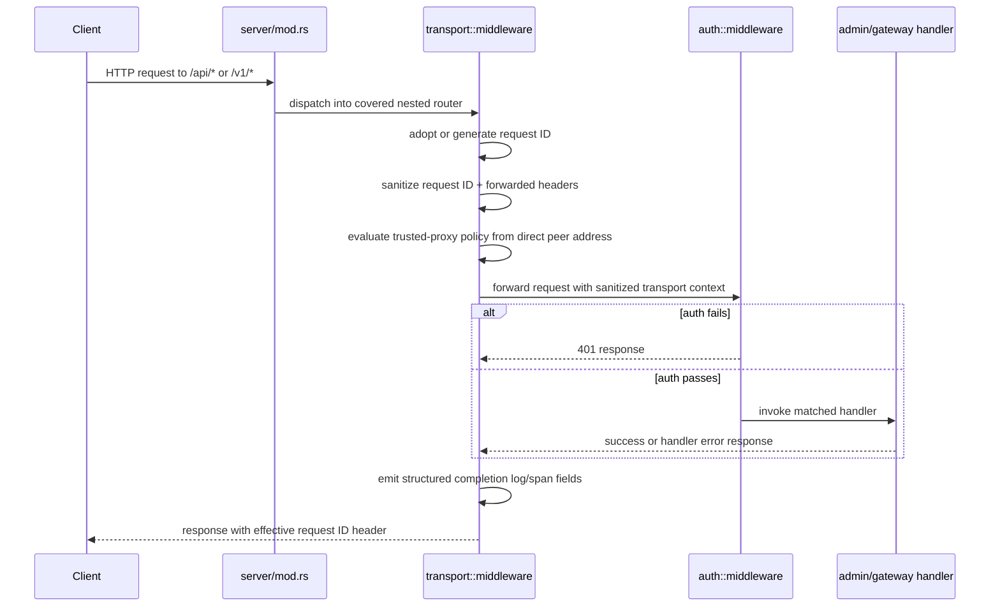

# Design: Establish Rook Transport Middleware Baseline

## Technical Approach

This slice adds a dedicated transport middleware layer at the Rook HTTP composition boundary in
`clients/rook/src/server/mod.rs`, where the combined axum server already nests `/api/*`, `/v1/*`,
and dashboard routes. The middleware baseline is shared by the admin surface (`/api/*`) and the
gateway surface (`/v1/*`), but remains separate from the archived inbound auth boundary by keeping
transport concerns in a new top-level transport module instead of mixing them into
`clients/rook/src/auth/` or into handler code.

The implementation approach is:

1. add a `TransportConfig` subtree to Rook startup configuration, defaulting to strict mode
2. create a transport module that owns request ID validation/generation, trusted-proxy evaluation,
   sanitized transport context, and observability hooks
3. compose that transport layer around the existing `/api` and `/v1` nested routers so it runs for
   both success and error paths, including auth failures
4. expose only a sanitized request-scoped transport context to downstream code through request
   extensions
5. return the effective request ID in the configured response header without changing admin or
   gateway business contracts

This matches the proposal and delta spec by keeping the slice narrow: request IDs,
tracing/logging hooks, header sanitation, and forwarded-header trust policy only. It does not
change inbound bearer auth semantics, rate limiting, streaming, TLS, or outbound provider auth.

## Architecture Decisions

### Decision: Put the transport baseline at server router composition, outside handlers

**Choice**: Apply the transport middleware baseline in `clients/rook/src/server/mod.rs` when the
server nests the admin and gateway routers under `/api` and `/v1`.

**Alternatives considered**:
- add request ID and header handling inside each admin and gateway handler
- place middleware separately inside `admin::build_router()` and `gateway::build_router()` with
  duplicated setup logic

**Rationale**:
- `server/mod.rs` is already the shared composition point for the covered surfaces.
- The spec requires one baseline contract across both `/api/*` and `/v1/*`.
- Keeping transport behavior outside handlers prevents drift and avoids leaking transport policy into
  business code.
- Dashboard routes remain out of scope by simple router topology rather than ad hoc conditionals.

### Decision: Keep transport middleware separate from archived auth-boundary code

**Choice**: Introduce a new top-level module such as `clients/rook/src/transport/` instead of
adding this behavior to `clients/rook/src/auth/`.

**Alternatives considered**:
- extend `clients/rook/src/auth/middleware.rs` to also own request IDs and forwarded-header policy
- fold transport helpers into `gateway/` because `/v1/*` is the OpenAI-compatible surface

**Rationale**:
- The archived `rook-591-inbound-auth-boundary` slice already owns bearer-auth enforcement.
- Request correlation, header sanitation, and trusted-proxy policy are transport-boundary concerns,
  not auth concerns.
- A dedicated module keeps this slice independently rollbackable and prevents accidental scope creep
  into auth semantics.

### Decision: Transport middleware wraps auth middleware so 401s still get request IDs and hooks

**Choice**: Compose middleware so the transport baseline executes before the existing auth layer and
observes the final response after auth or handler execution.

**Alternatives considered**:
- run auth first, then transport only for authenticated requests
- create one combined transport+auth middleware and retire the auth layer

**Rationale**:
- The spec requires request IDs and observability hooks on both success and error responses.
- Auth failures on `/api/*` and `/v1/*` should still carry the effective request ID for support and
  operations.
- Replacing the archived auth middleware would blur slice boundaries and increase rollback risk.

### Decision: Expose a sanitized transport context through request extensions instead of mutating all headers

**Choice**: Store a `SanitizedTransportContext` in request extensions and require downstream
transport-aware code to read that context rather than raw transport/proxy headers.

**Alternatives considered**:
- physically remove or rewrite forwarded headers in the inbound `HeaderMap`
- let downstream code inspect raw headers and merely document which ones are trusted

**Rationale**:
- This slice must govern trusted interpretation, not globally rewrite unrelated application header
  behavior.
- Leaving the raw header map intact avoids unintended side effects for generic request handling.
- A dedicated sanitized context makes the trusted view explicit and testable.

### Decision: Use strict request ID validation with server generation fallback

**Choice**: Treat an inbound request ID as valid only when exactly one configured header value is
present, non-empty after trimming, ASCII-visible, and within a bounded length; otherwise generate a
new UUID v4 request ID.

**Alternatives considered**:
- accept any non-empty string verbatim
- require inbound IDs to already be UUIDs
- reject the request on malformed inbound request ID

**Rationale**:
- Accept-anything risks log injection and poor correlation hygiene.
- UUID-only would reject common upstream correlation formats unnecessarily.
- Generating a replacement preserves deterministic correlation without expanding this slice into a
  client-error policy.

### Decision: Trusted proxy opt-in is allowlist-based and fail-closed

**Choice**: Model trusted-proxy behavior as an explicit allowlist of proxy source CIDRs plus an
explicit allowlist of forwarded header families that may be honored.

**Alternatives considered**:
- a single boolean like `behind_proxy = true`
- trust all `X-Forwarded-*` headers whenever Rook binds to a private address
- trust forwarded metadata if any reverse proxy is “expected” in deployment docs

**Rationale**:
- The spec requires more than a vague “behind a proxy” assumption.
- CIDR/source allowlists are concrete, auditable, and fail closed when missing or malformed.
- Header-family allowlists prevent opt-in from silently widening trust to all proxy-provided data.

### Decision: Use custom middleware hooks, not a generic `TraceLayer`, for this baseline

**Choice**: Implement a small custom transport middleware in Rook that emits structured tracing
events and injects response headers itself.

**Alternatives considered**:
- rely entirely on `tower_http::trace::TraceLayer`
- add logging directly in each handler

**Rationale**:
- This slice needs request ID adoption/generation, response header propagation, forwarded trust
  decisions, and header redaction boundaries in one place.
- Generic trace layers do not express the full trusted/untrusted forwarded metadata contract by
  themselves.
- Handler-level logging would duplicate logic and miss auth failures.

## Data Flow

### Covered Request Flow

```text
Client Request
   |
   v
Combined Router (`server/mod.rs`)
   |
   +--> `/api/*` nested router
   |       |
   |       v
   |   transport middleware baseline
   |       |
   |       v
   |   archived auth middleware
   |       |
   |       v
   |   admin handlers
   |
   +--> `/v1/*` nested router
   |       |
   |       v
   |   transport middleware baseline
   |       |
   |       v
   |   archived auth middleware
   |       |
   |       v
   |   gateway handlers
   |
   \--> dashboard router (`/`, assets) unchanged
```

### Request ID + Transport Context Flow

```text
Inbound request
   |
   +--> read configured request ID header
   |       |
   |       +--> valid single value ----> adopt as effective request ID
   |       |
   |       \--> missing / empty / malformed / multi-value ---> generate UUID v4
   |
   +--> inspect direct peer address (if available)
   |
   +--> sanitize forwarded/proxy headers
   |       |
   |       +--> trusted proxy match + allowed header family + valid syntax --> trusted view
   |       |
   |       \--> otherwise --> ignored for canonical transport interpretation
   |
   +--> store `SanitizedTransportContext` in request extensions
   |
   +--> call next middleware / handler
   |
   +--> emit structured completion hook
   |
   \--> set response request ID header
```

### Sequence Diagram



## File Changes

| File | Action | Description |
|------|--------|-------------|
| `clients/rook/src/lib.rs` | Modify | Export the new `transport` module. |
| `clients/rook/src/server/mod.rs` | Modify | Extend `ServerConfig`, validate transport config, and compose `/api` + `/v1` routers with the shared transport baseline outside the existing auth middleware. |
| `clients/rook/src/main.rs` | Modify | Populate `ServerConfig.transport` with strict defaults and any minimal startup wiring needed for explicit transport settings. |
| `clients/rook/src/config/mod.rs` | Modify | Add `TransportConfig`, `RequestIdConfig`, `TrustedProxyConfig`, and validation helpers separate from inbound auth config. |
| `clients/rook/src/auth/middleware.rs` | No functional redesign | Existing auth middleware stays in place; only composition order changes around it. |
| `clients/rook/src/admin/mod.rs` | No handler logic change | Admin routes remain mounted as-is; transport context becomes available through request extensions if later consumed. |
| `clients/rook/src/gateway/mod.rs` | No handler logic change | Gateway routes remain mounted as-is; transport context becomes available through request extensions if later consumed. |
| `clients/rook/src/gateway/handlers.rs` | Optional narrow modify | Replace ad hoc request logs with transport-context-backed fields only if needed to avoid duplicated correlation logging. |
| `clients/rook/src/admin/handlers.rs` | Optional narrow modify | No business contract changes; only optional use of request ID in error logging if implementation chooses. |
| `clients/rook/src/transport/mod.rs` | Create | Public entrypoint for transport baseline types and middleware helpers. |
| `clients/rook/src/transport/context.rs` | Create | Request-scoped sanitized transport context and trust-status enums stored in request extensions. |
| `clients/rook/src/transport/request_id.rs` | Create | Request ID parsing, syntax validation, generation, and response-header propagation helpers. |
| `clients/rook/src/transport/forwarded.rs` | Create | `X-Forwarded-*` / `X-Real-IP` sanitation, `Via` diagnostics, and trusted-proxy evaluation helpers for this slice. |
| `clients/rook/src/transport/middleware.rs` | Create | Axum middleware that assembles request ID handling, sanitized context injection, completion hooks, and response header propagation. |
| `clients/rook/Cargo.toml` | Modify | Add a small IP/CIDR parsing dependency if needed for trusted-proxy allowlist validation (for example `ipnet`), while keeping the slice transport-only. |

## Interfaces / Contracts

### Startup Configuration

```rust
#[derive(Debug, Clone, PartialEq, Eq)]
pub struct RequestIdConfig {
    pub inbound_header_name: String,
    pub response_header_name: String,
    pub max_length: usize,
}

#[derive(Debug, Clone, PartialEq, Eq)]
pub struct TrustedProxyConfig {
    pub enabled: bool,
    pub trusted_cidrs: Vec<String>,
    pub allowed_headers: TrustedForwardedHeaders,
}

#[derive(Debug, Clone, PartialEq, Eq)]
pub struct TrustedForwardedHeaders {
    pub x_forwarded_for: bool,
    pub x_forwarded_host: bool,
    pub x_forwarded_proto: bool,
    pub x_forwarded_port: bool,
    pub x_real_ip: bool,
}

#[derive(Debug, Clone, PartialEq, Eq)]
pub struct TransportConfig {
    pub request_id: RequestIdConfig,
    pub trusted_proxy: TrustedProxyConfig,
}

impl TransportConfig {
    pub fn validate(&self) -> Result<(), RookError>;
}
```

Design notes:
- `TransportConfig::default()` is strict by default:
  - inbound request ID header = `x-request-id`
  - response request ID header = `x-request-id`
  - `max_length = 128`
  - trusted proxy disabled
  - all forwarded header families disallowed unless explicitly enabled
- if trusted proxy is enabled, validation must reject empty CIDR lists or invalid CIDR syntax
- inbound auth config remains separate and unchanged in meaning

### Server Wiring

```rust
#[derive(Debug, Clone)]
pub struct ServerConfig {
    pub host: String,
    pub port: u16,
    pub enable_tui: bool,
    pub db_path: Option<String>,
    pub inbound_auth: InboundAuthConfig,
    pub transport: TransportConfig,
}
```

The server build path validates `config.transport` before composing routers. The production `run`
path is updated to preserve direct peer information via axum connect-info so trusted-proxy
evaluation can compare the actual remote socket against the configured allowlist.

### Request-Scoped Sanitized Transport Context

```rust
#[derive(Debug, Clone, PartialEq, Eq)]
pub struct SanitizedTransportContext {
    pub request_id: String,
    pub route_surface: RouteSurface,
    pub direct_peer_addr: Option<std::net::SocketAddr>,
    pub forwarded: SanitizedForwardedContext,
}

#[derive(Debug, Clone, Copy, PartialEq, Eq)]
pub enum RouteSurface {
    AdminApi,
    GatewayV1,
}

#[derive(Debug, Clone, PartialEq, Eq)]
pub struct SanitizedForwardedContext {
    pub trust: ForwardedTrust,
    pub client_ip: Option<std::net::IpAddr>,
    pub host: Option<String>,
    pub proto: Option<String>,
    pub port: Option<u16>,
    pub ignored_headers: Vec<&'static str>,
}

#[derive(Debug, Clone, Copy, PartialEq, Eq)]
pub enum ForwardedTrust {
    Absent,
    Ignored,
    Trusted,
}
```

Downstream code sees:
- exactly one effective request ID
- direct peer socket when available
- canonical forwarded metadata only when it was both syntactically valid and allowed under the
  trusted-proxy policy
- an explicit trust status telling the difference between absent, ignored, and trusted metadata

Downstream code does **not** see through this API:
- malformed or empty request ID candidates
- raw `X-Forwarded-*`, `X-Real-IP`, or `Via` values that failed validation
- untrusted forwarded metadata promoted into canonical host/proto/client-IP fields
- secret-bearing headers or cookies in logging/tracing hooks

Raw headers remain on the request because this slice is not a global header-rewrite feature, but
transport-aware consumers must treat `SanitizedTransportContext` as the only trusted source.

### Request ID Rules

```rust
pub enum RequestIdAdoption {
    Adopted(String),
    Generated(String),
}

pub fn resolve_request_id(
    headers: &axum::http::HeaderMap,
    config: &RequestIdConfig,
) -> RequestIdAdoption;
```

Validation rules for request ID adoption in this slice:
- only one effective header value may be adopted
- value must be non-empty after trimming
- value must contain only visible ASCII characters
- value must not contain whitespace, commas, or control characters
- value length must be `<= max_length`
- otherwise the middleware generates a lowercase hyphenated UUID v4 string via the existing `uuid`
  dependency

### Forwarded-Header Policy Enforcement

For this slice, the trusted forwarded/proxy families are limited to `X-Forwarded-*` and
`X-Real-IP`. `Via` remains diagnostic-only and is never elevated into canonical transport context.
The standard `Forwarded` header is intentionally deferred to a future slice so this change stays
narrow and aligned with the implemented scope.

```rust
pub struct ForwardedResolution {
    pub context: SanitizedForwardedContext,
    pub forwarded_present: bool,
}

pub fn resolve_forwarded_context(
    headers: &axum::http::HeaderMap,
    direct_peer_addr: Option<std::net::SocketAddr>,
    config: &TrustedProxyConfig,
) -> ForwardedResolution;
```

Enforcement rules:
- if trusted proxy is disabled, all forwarded metadata is ignored for canonical interpretation
- if trusted proxy is enabled but direct peer info is absent, behave as strict default (`Ignored`)
- if direct peer does not match the trusted CIDR allowlist, behave as strict default (`Ignored`)
- if the header family is not enabled in `allowed_headers`, ignore it even when the proxy source is
  trusted
- if a header value is empty or malformed, ignore it and record that family in `ignored_headers`
- `Via` is sanitized for diagnostics only; it is never elevated into canonical host/proto/client-IP

### Logging / Tracing Hook Contract

The middleware emits one structured completion event per covered request with fields equivalent to:

```rust
tracing::info!(
    request_id = %context.request_id,
    surface = ?context.route_surface,
    method = %method,
    route = %matched_route_or_fallback,
    status = status.as_u16(),
    duration_ms = duration_ms,
    forwarded_trust = ?context.forwarded.trust,
    forwarded_present = forwarded_present,
    ignored_forwarded_headers = ?context.forwarded.ignored_headers,
    "completed rook transport request",
);
```

Redaction boundaries:
- never log raw values for `Authorization`, `Proxy-Authorization`, `Cookie`, or `Set-Cookie`
- never log provider API keys, bearer tokens, or token-like values from arbitrary headers
- do not log request bodies in this slice
- if diagnostics include header information, log only sanitized/trusted derived values or header
  names, never raw secret-bearing values

## Testing Strategy

| Layer | What to Test | Approach |
|-------|-------------|----------|
| Unit | Request ID validation/generation rules | Add focused tests in `transport/request_id.rs` for absent, valid inbound, malformed inbound, multi-value, whitespace, and oversized values. |
| Unit | Trusted-proxy config validation | Add tests in `config/mod.rs` for strict default, enabled-with-empty-list rejection, invalid CIDR rejection, and allowed-header validation. |
| Unit | Forwarded-header sanitation | Add tests in `transport/forwarded.rs` for disabled trust, non-trusted source fallback, trusted source + allowed header family, empty/malformed forwarded values, and `Via` staying diagnostic-only. |
| Integration | Router composition for `/api/*` and `/v1/*` | Extend `clients/rook/src/server/mod.rs` tests to assert covered routes receive response request IDs, dashboard routes remain out of scope, and auth failures still include request ID headers. |
| Integration | Sanitized context availability before handler business logic | Add a narrow test-only probe route or middleware harness in `server/mod.rs`/`transport/middleware.rs` tests that reads request extensions and verifies request ID + forwarded trust state are present before handler execution. |
| Integration | Trusted proxy enforcement | Build request tests that manually attach direct peer info via request extensions for `oneshot` requests, then verify trusted vs ignored forwarded metadata without requiring real sockets. |
| Integration | Logging/tracing hooks redaction | Use a test subscriber or captured tracing output to verify request completion events include request ID/status/duration fields and never include raw `Authorization` or `Cookie` values. |
| E2E | Not required for this slice | The baseline is transport-local to `clients/rook`; targeted integration tests are sufficient and keep scope narrow. |

## Migration / Rollout

No data migration required.

Rollout is runtime-only and strict by default:
- existing deployments get generated/adopted request IDs and transport completion hooks on `/api/*`
  and `/v1/*`
- forwarded metadata remains untrusted unless explicit trusted-proxy configuration is added
- dashboard routes remain unchanged

## Tradeoffs and Rejected Alternatives

### Tradeoff: Trusted interpretation via request extensions instead of destructive header rewriting

This keeps the slice narrow and reduces compatibility risk, but it means downstream code must follow
the new transport context contract instead of casually reading raw forwarded headers.

### Tradeoff: Request ID generation fallback instead of request rejection

This is more operationally forgiving and preserves correlation on malformed input, but it does mean
clients are not explicitly told that their supplied request ID was rejected.

### Rejected: Generic “trust proxy” boolean

Rejected because it weakens the strict-by-default posture and cannot prove which sources or header
families are trusted.

### Rejected: Put transport policy into the archived auth middleware

Rejected because it would blur responsibilities, complicate rollback, and make future auth changes
harder to separate from transport work.

### Rejected: Apply the baseline to dashboard routes now

Rejected because the spec is explicit that this slice only covers `/api/*` and `/v1/*`. Expanding
to `/` would widen scope and create unnecessary risk.

## Rollback

Rollback is straightforward because the slice is isolated at the transport boundary:

1. remove the transport middleware composition from `clients/rook/src/server/mod.rs`
2. remove the `transport` module and `ServerConfig.transport` wiring
3. remove any trusted-proxy configuration fields added for this slice
4. keep archived auth middleware and handler routing unchanged

After rollback, `/api/*` and `/v1/*` return to their prior direct-request behavior with the inbound
auth boundary still intact and dashboard routes still unaffected.

## Open Questions

- [ ] None blocking for this slice.
