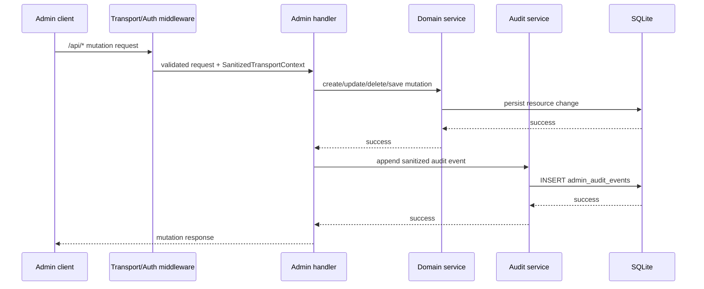
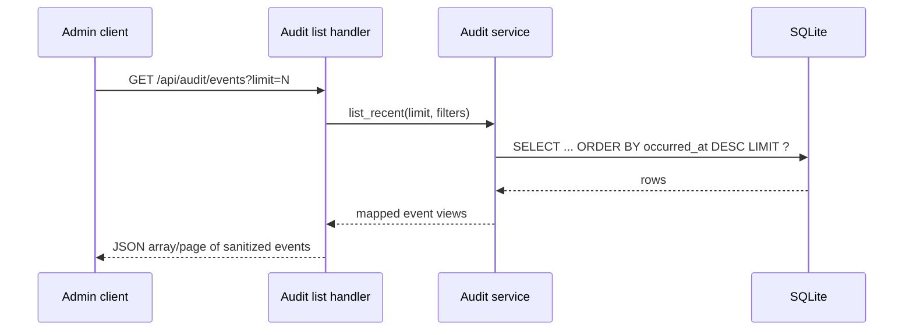

# Design: Rook Admin Audit Trail for Observability Slice

## Technical Approach

This change adds one narrowly scoped persisted capability in the `gateway` domain: an append-only admin audit trail for existing Rook admin mutations. The implementation stays inside the current Rook HTTP control plane and SQLite persistence model rather than introducing a broader observability system.

The design follows the proposal and exploration boundaries:

- emit audit events only from successful admin mutation handlers that already exist today;
- persist those events in SQLite alongside existing Rook tables and services;
- expose a bounded read surface for recent events only;
- keep `GET /api/usage` as the current placeholder contract;
- keep health endpoints as current runtime state backed by `InMemoryHealthService`, with no durable health history added.

This means #599 ships durable operator traceability for admin changes without claiming token accounting, spend summaries, quotas, automatic health snapshots, or historical health analytics.

## Architecture Decisions

### Decision: Emit audit records in admin handlers after successful mutations

**Choice**: Write audit events from `clients/rook/src/admin/handlers.rs` immediately after each mutation succeeds.

**Alternatives considered**:
- Add audit writes inside lower-level account/pool/route/settings services.
- Add generic SQLite triggers.
- Add middleware that inspects request/response bodies generically.

**Rationale**: The handlers already own request validation, path parameters, response shaping, and resource-specific mutation flow. They also sit closest to the admin API boundary where request-scoped metadata is available. Emitting after the service call succeeds ensures the trail reflects committed admin mutations rather than attempted or failed requests. This avoids inventing a cross-cutting event system and keeps scope tightly bounded to the existing admin surface.

### Decision: Store audit records in a dedicated SQLite table in the existing Rook database

**Choice**: Add a new migration and a dedicated `admin_audit_events` table under `clients/rook/migrations`, wired through the existing `SqliteDb` and `RookRegistry` patterns.

**Alternatives considered**:
- Keep audit events in memory.
- Reuse structured tracing logs as the sole source of truth.
- Create a separate database or log sink.

**Rationale**: Rook already persists accounts, pools, routes, settings, and idempotency state in SQLite and wires services through `RookRegistry`. A single append-only SQLite table is the smallest durable extension that matches existing composition patterns. In-memory storage would not satisfy the durability goal, and tracing logs are intentionally transport-oriented rather than queryable admin history.

### Decision: Persist only sanitized metadata, not raw request bodies or secrets

**Choice**: Store a compact event envelope plus a resource-specific sanitized JSON payload. The payload contains identifiers and safe configuration fields only, with explicit redaction for secrets.

**Alternatives considered**:
- Store raw inbound request JSON.
- Store before/after snapshots for every mutation.
- Store full transport context including headers and peer details.

**Rationale**: Current admin flows include secret-bearing inputs such as `api_key`, and the transport layer already treats observability as sanitized. Persisting raw requests would create a new secret-retention problem and broaden the feature into a generic logging system. A sanitized payload preserves operator usefulness while keeping the design aligned with existing redaction posture.

### Decision: Read back recent events through a bounded admin endpoint only

**Choice**: Add a small admin read endpoint for newest-first recent audit events with a conservative limit and optional simple resource filtering.

**Alternatives considered**:
- No read API, persistence only.
- Full-text search, pagination, and rich filtering.
- Dashboard-first read path without an admin API contract.

**Rationale**: The proposal explicitly includes bounded admin read access. A simple recent-events endpoint is enough to make the audit trail operationally useful without turning the change into a broader observability product. Search, retention tooling, and analytics stay out of scope.

### Decision: Do not add durable usage accounting or health history

**Choice**: Preserve `UsageStatusView::placeholder()` and existing runtime-only health endpoints unchanged except for spec clarification.

**Alternatives considered**:
- Add synthetic usage summaries.
- Persist periodic health snapshots or automatic health history.
- Combine audit with a generalized observability timeline.

**Rationale**: Repository evidence shows no existing usage ledger and no durable health store. Adding either would be a separate architecture change and would violate the proposal constraints. This design intentionally narrows the net-new persistence to admin audit records only.

## Data Flow

### Successful admin mutation flow



### Read-back flow



### Mutation sources in scope

Audit writes are emitted from the existing admin mutation handlers in `clients/rook/src/admin/handlers.rs`:

- `handle_create_account`
- `handle_update_account`
- `handle_delete_account`
- `handle_create_pool`
- `handle_update_pool`
- `handle_delete_pool`
- `handle_add_pool_member`
- `handle_remove_pool_member`
- `handle_create_route`
- `handle_update_route`
- `handle_delete_route`
- `handle_put_settings`

Read-only handlers remain out of scope for emission.

### Audit attribution source

The handler will read `SanitizedTransportContext` injected by `apply_transport_baseline` on `/api/*` routes and copy only safe request-scoped metadata into the audit envelope:

- `request_id`
- route surface (`AdminApi`)
- optionally the request path/method if needed for the event envelope

The design does **not** introduce user identity, session identity, raw headers, or durable client network history.

## File Changes

| File | Action | Description |
|------|--------|-------------|
| `openspec/changes/rook-599-observability-usage-health-audit/design.md` | Create | Technical design for the bounded audit trail slice. |
| `openspec/specs/gateway/spec.md` | Modify | Add gateway-domain requirements for append-only admin audit persistence and bounded read-back while preserving placeholder usage and runtime-only health semantics. |
| `clients/rook/migrations/0005_admin_audit_events.sql` | Create | Add the append-only SQLite table and supporting indexes for admin audit events. |
| `clients/rook/src/db/mod.rs` | Modify | Register and apply migration `0005_admin_audit_events`; add migration tests. |
| `clients/rook/src/db/audit.rs` | Create | Implement low-level SQLite insert/list helpers for audit rows. |
| `clients/rook/src/db/mod.rs` | Modify | Export the new `audit` module. |
| `clients/rook/src/services/audit.rs` | Create | Define the audit service trait, event model, and SQLite-backed implementation. |
| `clients/rook/src/services/mod.rs` | Modify | Export the audit service module. |
| `clients/rook/src/registry/mod.rs` | Modify | Wire `SqliteAuditService` into `RookRegistry` and expose an accessor. |
| `clients/rook/src/admin/types.rs` | Modify | Add audit event transport DTOs and sanitized payload/view types. |
| `clients/rook/src/admin/handlers.rs` | Modify | Emit audit records after successful mutations and add a bounded list handler. |
| `clients/rook/src/admin/mod.rs` | Modify | Register the audit read route on the admin surface and add route-level tests. |

## Interfaces / Contracts

### Persistence model

The new table is intentionally append-only and independent of resource tables.

```sql
CREATE TABLE admin_audit_events (
    id            TEXT PRIMARY KEY,
    occurred_at   TEXT NOT NULL,
    request_id    TEXT,
    surface       TEXT NOT NULL,
    action        TEXT NOT NULL,
    resource_kind TEXT NOT NULL,
    resource_id   TEXT,
    payload_json  TEXT NOT NULL
);

CREATE INDEX idx_admin_audit_events_occurred_at
    ON admin_audit_events(occurred_at DESC, id DESC);

CREATE INDEX idx_admin_audit_events_resource
    ON admin_audit_events(resource_kind, resource_id, occurred_at DESC);
```

Notes:

- No update/delete path is added for audit rows.
- Foreign keys are intentionally unnecessary so deleted resources can still be referenced historically.
- `payload_json` stores sanitized structured metadata, not arbitrary request bodies.

### Service contract

```rust
pub trait AuditService: Send + Sync {
    fn append(
        &self,
        event: AdminAuditEvent,
    ) -> impl Future<Output = Result<(), RookError>> + Send;

    fn list_recent(
        &self,
        query: AuditListQuery,
    ) -> impl Future<Output = Result<Vec<AdminAuditEvent>, RookError>> + Send;
}

pub struct AuditListQuery {
    pub limit: u32,
    pub resource_kind: Option<AuditResourceKind>,
    pub resource_id: Option<String>,
}
```

The service mirrors existing Rook service conventions: thin abstraction, SQLite-backed concrete implementation, registry wiring, and simple testability with `open_in_memory()`.

### Domain event envelope

```rust
pub struct AdminAuditEvent {
    pub id: String,
    pub occurred_at: chrono::DateTime<chrono::Utc>,
    pub request_id: Option<String>,
    pub surface: AuditSurface,
    pub action: AuditAction,
    pub resource_kind: AuditResourceKind,
    pub resource_id: Option<String>,
    pub payload: serde_json::Value,
}

pub enum AuditSurface {
    AdminApi,
}

pub enum AuditAction {
    AccountCreated,
    AccountUpdated,
    AccountDeleted,
    PoolCreated,
    PoolUpdated,
    PoolDeleted,
    PoolMemberAdded,
    PoolMemberRemoved,
    RouteCreated,
    RouteUpdated,
    RouteDeleted,
    SettingsUpdated,
}

pub enum AuditResourceKind {
    Account,
    Pool,
    Route,
    Settings,
}
```

### Sanitized payload shape

The payload is resource-specific and intentionally small.

Representative examples:

```json
{
  "display_name": "Primary OpenAI",
  "vendor": "open_ai",
  "enabled": true,
  "weight": 1,
  "priority": 0,
  "api_base_override": "https://example.invalid/v1",
  "has_api_key": true,
  "tags": ["prod"],
  "capabilities": ["chat", "vision"]
}
```

```json
{
  "name": "primary",
  "strategy": "round_robin",
  "member_ids": ["<account-id>"],
  "fallback_pool_id": null
}
```

```json
{
  "pool_id": "<pool-id>",
  "account_id": "<account-id>"
}
```

```json
{
  "logical_model": "gpt-4o",
  "target_pool_id": "<pool-id>",
  "fallback_route_id": null,
  "capability_constraints": ["chat"]
}
```

```json
{
  "gateway_port": 4141,
  "default_routing_policy": {
    "strategy": "round_robin",
    "max_retries": 5,
    "cooldown_seconds": 120
  },
  "log_json": true,
  "log_level": "debug"
}
```

Delete events should carry only enough information to identify what was removed, typically:

```json
{
  "resource_id": "<id>"
}
```

This avoids pre-delete snapshots and keeps the feature append-only rather than versioned.

### Redaction boundaries

The audit payload MUST NOT persist:

- `api_key` raw values
- inbound bearer tokens or authorization headers
- raw request bodies
- full response bodies
- direct peer socket address or forwarded client IP history
- any future secret-bearing config fields by default

For account mutations, the persisted representation uses `has_api_key: bool` and MAY include a coarse change marker such as `api_key_present` or `api_key_updated`, but MUST NOT store the key itself.

For transport attribution, `request_id` is the primary durable correlation field. Any additional metadata copied from `SanitizedTransportContext` must already be safe to log under the current transport posture.

### Admin read contract

The bounded read surface is expected to look like:

```http
GET /api/audit/events?limit=50&resource_kind=account&resource_id=<id>
```

Response shape:

```json
{
  "events": [
    {
      "id": "...",
      "occurred_at": "2025-01-01T00:00:00Z",
      "request_id": "trace-123",
      "surface": "admin_api",
      "action": "account_updated",
      "resource_kind": "account",
      "resource_id": "...",
      "payload": { "has_api_key": true, "display_name": "Primary OpenAI" }
    }
  ]
}
```

Design constraints for the read path:

- newest-first ordering;
- conservative maximum limit enforced server-side;
- no write/update/delete support for audit rows;
- no search backend, export pipeline, or dashboard analytics implied.

## Testing Strategy

| Layer | What to Test | Approach |
|-------|-------------|----------|
| Unit | Audit payload builders redact secrets correctly | Add focused tests in `admin/types.rs` or `services/audit.rs` asserting `api_key`, auth headers, and raw request data never appear in serialized payloads. |
| Unit | SQLite audit row mapping and query ordering | Add tests in `db/audit.rs` using `SqliteDb::open_in_memory()` to verify append/list behavior, ordering, filters, and limit clamping. |
| Unit | Registry wiring exposes audit service | Extend `registry/mod.rs` tests to confirm a fresh in-memory registry can append and list audit events. |
| Integration | Successful admin mutations append one audit row | Extend `admin/mod.rs` router tests to perform account/pool/route/settings mutations, then query `/api/audit/events` and assert expected action/resource/payload fields. |
| Integration | Failed admin mutations do not append audit rows | Add cases for validation failures, not-found paths, and conflict paths to ensure only committed mutations are audited. |
| Integration | Usage and health semantics remain unchanged | Preserve and extend existing tests proving `/api/usage` stays placeholder-only and `/api/health/*` remains runtime-scoped. |
| Integration | Secret-safe responses remain intact | Keep account response tests that verify `api_key` is redacted and add audit-specific checks that only `has_api_key` or similar safe metadata is stored. |

## Migration / Rollout

Migration is required.

Plan:

1. Add `clients/rook/migrations/0005_admin_audit_events.sql`.
2. Register the migration in `clients/rook/src/db/mod.rs` following the existing 0002/0003/0004 pattern.
3. On startup, existing Rook instances apply the new table creation automatically.
4. No backfill is required because there is no prior durable audit source.
5. Rollout is safe-by-default because the new table is additive and existing admin CRUD, health, and usage contracts continue to function without historical reconstruction.

Operationally, if audit writes fail, the preferred implementation is to surface the error for the mutation request rather than silently claim a successful audited change. This preserves the guarantee that successful admin mutations are durably auditable.

## Open Questions

- [ ] Should the read endpoint return a bare array or an envelope with `events` plus pagination metadata? The design currently favors an envelope for forward compatibility.
- [ ] Should resource filtering support only exact `resource_kind`/`resource_id`, or also a minimal `action` filter in the initial contract?
- [ ] Should delete events include a tiny pre-delete label such as `display_name`/`name` when already loaded in handler scope, or remain identifier-only for stricter minimalism?
