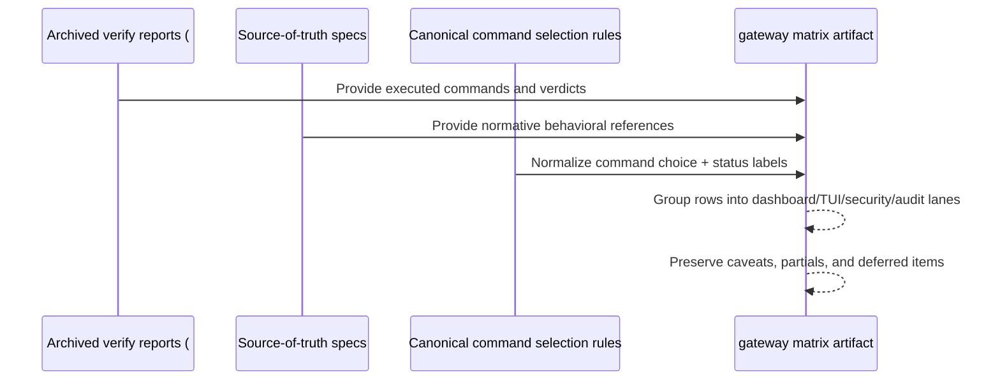

# Design: Rook Acceptance and Regression Matrix

## Technical Approach

This change adds one bounded documentation artifact that consolidates already-shipped Rook acceptance and regression evidence for #592 through #599. The design stays documentation-first and keeps ownership in the `gateway` spec domain because `openspec/specs/gateway/spec.md` already acts as the strongest source-of-truth for Rook HTTP bind posture, auth boundary posture, and the broader acceptance/non-goal framing that the matrix must not contradict.

The implementation should create a dedicated matrix document under the `gateway` spec domain rather than trying to squeeze all evidence into `openspec/specs/gateway/spec.md` itself. The spec file remains the normative behavioral contract; the matrix becomes the operator/reviewer traceability artifact that maps those contracts to existing verification evidence.

Recommended approach:

- create a single matrix artifact at `openspec/specs/gateway/rook-acceptance-regression-matrix.md`;
- add a narrow pointer from `openspec/specs/gateway/spec.md` to that matrix so the `gateway` domain remains the entry point;
- organize the matrix into a small set of operator-facing lanes: dashboard, TUI, security, and audit/observability;
- for each row, record the shipped slice, covered surface, canonical command(s), any focused historical command(s), source-of-truth spec references, archived verification reference, and verification status (`auto`, `manual`, `partial`, `deferred`);
- preserve caveats exactly where archived evidence is incomplete, especially #596's skipped manual interactive verification; and
- keep automation optional and minimal, only by composing commands that already exist in the repository.

This change does **not** add new runtime behavior, new APIs, or a new acceptance harness. It only consolidates and normalizes existing evidence into a single bounded artifact.

## Architecture Decisions

### Decision: Store the matrix as a dedicated file under the `gateway` spec domain

**Choice**: Create `openspec/specs/gateway/rook-acceptance-regression-matrix.md` and reference it from `openspec/specs/gateway/spec.md`.

**Alternatives considered**:
- Expand `openspec/specs/gateway/spec.md` with a very large embedded matrix section.
- Put the artifact under `openspec/changes/rook-600-acceptance-regression-matrix/` only.
- Split the matrix across `dashboard`, `rook-tui`, and `gateway` spec domains.

**Rationale**: The matrix needs to remain discoverable after the change is archived, so change-local storage alone is insufficient as the durable destination. Embedding the full matrix directly inside `spec.md` would make the normative spec noisy and harder to maintain. Splitting the artifact across domains would recreate the fragmentation this change is trying to fix. A dedicated file inside `openspec/specs/gateway/` gives the matrix durable, domain-owned placement while still letting `dashboard` and `rook-tui` remain behavioral sources-of-truth for their surfaces.

### Decision: Structure the artifact by verification lanes, not by chronology alone

**Choice**: Organize the matrix into four top-level lanes:
- Dashboard lane (#592, #593, #594)
- TUI lane (#595, #596, #597)
- Security lane (#598)
- Audit/observability lane (#599)

Each lane will contain compact rows for the covered slice and its scenarios.

**Alternatives considered**:
- One giant chronological table from #592 to #599.
- Separate documents per archived slice.
- Group by code area only (`web`, `tui`, `server`) without operator meaning.

**Rationale**: Operators and reviewers need to answer “which surface is covered and by what command?” faster than they need a historical narrative. Lanes match the shipped operator surfaces described in the proposal and exploration, and they keep cross-slice coverage comprehensible without inventing a new taxonomy.

### Decision: Prefer canonical repo entrypoints over historical one-off commands

**Choice**: For each matrix row, select canonical commands in this order:
1. root `Makefile` targets when they preserve the same scope (`dashboard-build`, `dashboard-check`, `dashboard-test`, `rust-test`, `rust-clippy`, `rust-fmt`),
2. package-local scripts in `clients/web/apps/rook-dashboard/package.json` when the root target is too broad or hides the relevant app-local contract,
3. focused `cargo test --manifest-path clients/rook/Cargo.toml ...` commands when the archived slice proved a specific boundary that broader commands do not isolate cleanly.

Historical commands that remain important should be retained in a separate “focused evidence” column rather than elevated to the default entrypoint.

**Alternatives considered**:
- Copy every archived command verbatim as equally canonical.
- Normalize everything to only `make check` or `make check-all`.
- Invent new wrapper commands per slice.

**Rationale**: The matrix must stay honest and maintainable. Broad repo commands can drift away from the specific Rook slices, while old slice-specific commands can be too narrow or idiosyncratic to serve as the default rerun guidance. The ordered selection rule preserves strong evidence while steering readers toward stable repository entrypoints when they truly represent the same coverage.

### Decision: Preserve caveats as first-class status, not footnotes that weaken later

**Choice**: Every matrix row must include an explicit verification status and caveat field, using values such as:
- `Auto` — covered by existing automated command evidence
- `Manual` — requires an operator/manual verification step
- `Partial` — automated evidence exists but a manual or visual check remains incomplete
- `Deferred` — intentionally not implemented in the covered slice

The matrix should quote or closely paraphrase archived caveats where needed, especially for #596.

**Alternatives considered**:
- Mark everything simply pass/fail.
- Move caveats to a single appendix.
- Omit archived warnings when tests already passed.

**Rationale**: The stated goal is honest regression discipline, not a marketing summary. Flattening `PASS WITH WARNINGS` into plain `PASS` would overstate coverage and undermine the value of consolidation.

### Decision: Keep automation optional and compositional only

**Choice**: If any automation is added, it should be a single thin entrypoint that sequences already-existing commands and is clearly documented as a convenience runner for the matrix, not as a new test harness.

Likely acceptable form:
- one Makefile target such as `rook-acceptance-matrix` or similarly named target,
- composed only from existing dashboard and Rust commands already recorded in the matrix.

**Alternatives considered**:
- No automation at all.
- A new custom script that adds selection logic, reporting, or orchestration semantics.
- A full integrated acceptance runner across dashboard, TUI, and gateway flows.

**Rationale**: The proposal allows minimal automation only if it reuses existing commands. A single thin composition target improves repeatability without turning #600 into CI/platform work.

## Data Flow

The artifact-building flow is a documentation normalization flow, not a runtime flow.



### Matrix assembly flow

```text
archived verify-report.md files (#592-#599)
        │
        ├─ extract executed commands and verdicts
        ├─ extract warnings / partial manual caveats
        │
        ▼
source-of-truth specs
(`gateway`, `dashboard`, `rook-tui`)
        │
        ├─ map each archived slice to normative requirement areas
        │
        ▼
command normalization rules
        │
        ├─ prefer stable Make/package commands
        └─ keep focused historical cargo tests as evidence rows when needed
        │
        ▼
`openspec/specs/gateway/rook-acceptance-regression-matrix.md`
```

### Proposed matrix row shape

Each row should capture the same bounded fields so the artifact is readable and comparable across lanes:

| Field | Purpose |
|------|---------|
| Lane | Dashboard, TUI, Security, or Audit/Observability |
| Slice | Archived source slice (`#592`-`#599`) |
| Covered surface | Human-readable capability or workflow area |
| Canonical command(s) | Preferred rerun command(s) for regression checks |
| Focused evidence | Slice-specific historical command(s) when needed |
| Source-of-truth references | Links to `gateway`, `dashboard`, and/or `rook-tui` requirements |
| Archived evidence | Link to the archived `verify-report.md` |
| Verification status | `Auto`, `Manual`, `Partial`, or `Deferred` |
| Caveats | Honest notes about placeholders, bounded scope, or incomplete manual verification |

An abbreviated example structure:

```markdown
## Dashboard lane

| Slice | Covered surface | Canonical command(s) | Focused evidence | Source-of-truth | Status | Caveats |
|------|------------------|----------------------|------------------|-----------------|--------|---------|
| #592 | overview, providers, accounts | `make dashboard-build`; `make dashboard-test` | `cargo test --manifest-path clients/rook/Cargo.toml admin_router_update_` | `openspec/specs/dashboard/spec.md` | Auto | Account secret handling remains presence-only |
| #593 | pools, routes, health shell packaging | `make dashboard-check`; `make dashboard-test` | `pnpm --dir "clients/web" --filter @corvus/rook-dashboard run test:e2e` | `openspec/specs/dashboard/spec.md` | Auto | Embedded asset packaging evidence is part of the slice |
```

## File Changes

| File | Action | Description |
|------|--------|-------------|
| `openspec/changes/archive/2026-04-23-rook-600-acceptance-regression-matrix/design.md` | Create | Technical design for the consolidated acceptance/regression matrix. |
| `openspec/specs/gateway/rook-acceptance-regression-matrix.md` | Create | Durable consolidated matrix artifact for Rook #592-#599 under the `gateway` domain. |
| `openspec/specs/gateway/spec.md` | Modify | Add a short requirement or traceability pointer establishing the gateway-domain ownership of the matrix artifact. |
| `Makefile` | Maybe Modify | Optionally add one thin compositional target if, and only if, it reuses existing commands without introducing new semantics. |

## Interfaces / Contracts

No runtime interface, API, or transport contract changes are introduced.

The only new contract is the documentation contract for the matrix artifact itself.

### Matrix document contract

```markdown
# Rook Acceptance and Regression Matrix

## Purpose
- scope statement
- non-goals statement

## Canonical command selection rules
- ordered preference for Makefile, package-local, then focused historical commands

## Status legend
- Auto
- Manual
- Partial
- Deferred

## Dashboard lane
- matrix table

## TUI lane
- matrix table

## Security lane
- matrix table

## Audit/Observability lane
- matrix table

## Deferred and caveat notes
- preserved warnings / placeholders / limitations
```

### Canonical command selection contract

```text
If a root Makefile target exists and preserves the same verification scope,
use it as the canonical command.

Else if an app-local package script is the clearest bounded command,
use that script.

Else retain the archived focused cargo test command as focused evidence,
and mark it as historical but still authoritative for that slice.
```

### Status contract

```text
Auto     = automated evidence exists and is the primary proof for this row
Manual   = human/operator verification is required and should be named explicitly
Partial  = automated evidence exists, but archived verification still records an incomplete manual or visual step
Deferred = the capability is intentionally out of scope and must not be described as implemented
```

## Testing Strategy

| Layer | What to Test | Approach |
|-------|-------------|----------|
| Artifact integrity | The matrix file exists in the `gateway` domain and links correctly from `openspec/specs/gateway/spec.md` | Review file placement and link references; run repository link/document checks if the touched paths are included in existing doc validation. |
| Content accuracy | Each lane row traces to a real archived `verify-report.md` and to the correct source-of-truth spec | Manual design review against #592-#599 reports and the `gateway`, `dashboard`, and `rook-tui` specs. |
| Command normalization | Canonical commands come from real repo entrypoints and focused commands remain labeled when necessary | Verify each chosen command exists in `Makefile`, `clients/web/apps/rook-dashboard/package.json`, or archived report evidence. |
| Caveat honesty | Partial/manual/deferred rows remain explicitly marked, especially for #596 and placeholder usage/health semantics | Compare matrix status and caveat text against archived verdicts and warnings. |
| Optional automation | Any helper target only sequences existing commands and does not add new behavior | Review the target body for pure composition of existing commands; do not accept new scripts/harness semantics. |

The testing strategy for this change is primarily traceability verification rather than runtime verification. The artifact is correct when it is complete, accurate, linked, and honest.

## Migration / Rollout

No migration required.

Rollout is documentation-only:

1. create the matrix artifact under `openspec/specs/gateway/`;
2. add the minimal pointer from `openspec/specs/gateway/spec.md`;
3. optionally add one thin Make target only if it stays purely compositional;
4. verify the matrix against archived evidence before considering the change complete.

## Open Questions

- [ ] Should #600 stop at a documentation-only matrix, or is one thin convenience Make target still justified after the matrix content is assembled?
- [ ] Should the gateway spec pointer be a short requirement statement or a lighter traceability/reference section, given that the matrix introduces no runtime behavior?
