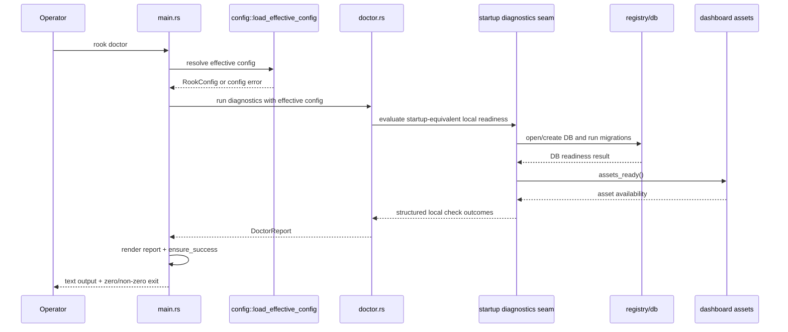
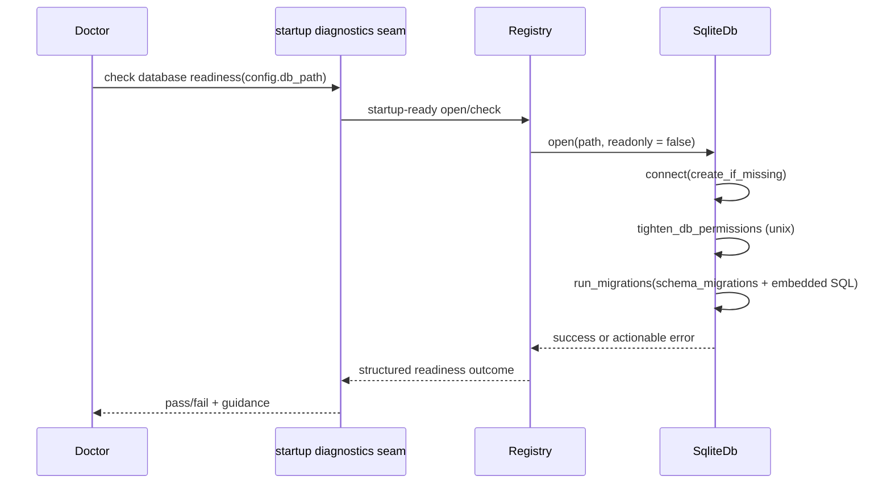
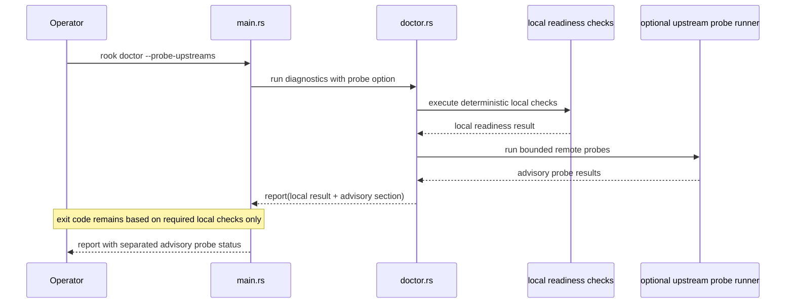

# Design: Rook Doctor Operational Diagnostics

## Technical Approach

This change refines the existing `rook doctor` implementation in `clients/rook/src/doctor.rs` rather than
replacing it. The current command already loads `RookConfig` through
`RookConfig::from_sources_with_path`, checks embedded dashboard assets, validates inbound auth
state, and opens the registry database in read-only mode. The enhancement is to make doctor reflect
startup reality more closely by reusing the same effective configuration and database readiness path
that `serve` depends on.

The design keeps `gateway` as the primary spec domain because the change is about the local gateway
startup contract: effective bind target, startup-safe configuration, local database readiness, and
admin/dashboard availability. The implementation should stay deterministic and local-first by
default, while still allowing a clearly separate opt-in advisory probe mode for upstream checks if
that can be added cleanly.

Concretely, the implementation should:

- keep the existing `rook doctor` CLI entrypoint in `clients/rook/src/main.rs`
- preserve `load_effective_config` in `clients/rook/src/config/mod.rs` as the single config
  assembly path for `serve`, `rook doctor`, and `rook config export`
- extract or expose a startup-readiness helper from the current `serve` startup path so doctor uses
  startup-equivalent config and database checks
- evolve the current `DoctorReport` model from message-only checks into operator-facing structured
  checks with explicit `pass` / `warn` / `fail`, actionable guidance, and secret-safe detail fields
- keep remote provider probing out of the default result and exit code contract

## Architecture Decisions

### Decision: Keep `load_effective_config` as the one effective-config entrypoint

**Choice**: `rook doctor` should continue to resolve config through `load_effective_config` /
`RookConfig::from_sources_with_path`, and `serve` should keep using the same loader before converting
into `ServerConfig`.

**Alternatives considered**:
- Build a doctor-specific config loader that only validates the fields doctor currently prints
- Reconstruct runtime config from `ServerConfig` inside doctor

**Rationale**:
- `clients/rook/src/main.rs` already routes `serve` through `load_effective_config` and doctor
  through `RookConfig::from_sources_with_path`, which delegates to the same loader.
- The spec delta explicitly requires `serve`, `rook doctor`, and `rook config export` to share one
  precedence and validation path.
- Preserving the current central loader is lower risk than adding a second config assembly path.

### Decision: Refactor doctor to reuse startup-readiness helpers instead of open-readonly checks

**Choice**: Replace the current doctor database check based on `RookRegistry::open_readonly()` with a
startup-equivalent readiness helper that exercises the same open/create/migration path used by
`server::run`.

**Alternatives considered**:
- Keep the current read-only open as the only database diagnostic
- Let doctor call `server::run` end-to-end and abort before bind

**Rationale**:
- `server::run` currently opens the runtime registry through `RookRegistry::open`, which in turn
  calls `SqliteDb::open` and applies migrations. Doctor must validate that same readiness contract,
  not a weaker read-only subset.
- The current read-only check can produce false confidence: an existing database might be readable
  while startup still fails because creation, permissions tightening, schema_migrations access, or a
  migration transaction cannot complete.
- Invoking full server startup would couple doctor to network binding and router bootstrapping, which
  is broader than needed and harder to test deterministically.

### Decision: Add a dedicated startup diagnostics seam in server/registry/db layers

**Choice**: Introduce a small startup diagnostics API that returns structured outcomes for config,
DB readiness, and asset readiness without binding a socket.

**Alternatives considered**:
- Keep all logic inline in `doctor.rs`
- Expose `SqliteDb::run_migrations` directly and rebuild startup behavior ad hoc in doctor

**Rationale**:
- The current startup flow is split across `main.rs`, `config/mod.rs`, `server/mod.rs`,
  `registry/mod.rs`, and `db/mod.rs`. Without a shared seam, doctor will continue duplicating or
  approximating startup behavior.
- A small startup diagnostics seam lets both server startup and doctor depend on the same readiness
  building blocks while keeping `doctor.rs` focused on orchestration and rendering.
- Reusing `RookRegistry::open` and/or a new `RookRegistry::check_startup_readiness`-style helper is
  safer than exposing lower-level migration functions directly to doctor.

### Decision: Model doctor results as structured checks with remediation metadata

**Choice**: Expand `DoctorCheckResult` beyond `{ name, status, message }` to include a stable check
identifier, concise summary, optional detail lines, and operator guidance for warn/fail states.

**Alternatives considered**:
- Keep the current flat string message per check
- Return only an overall pass/fail with a combined error string

**Rationale**:
- The spec requires machine-readable status plus human-readable explanation and actionable guidance
  for warn/fail conditions.
- The current rendering and `ensure_success` behavior are already centered on `DoctorReport`; this is
  the right place to enrich semantics without changing the CLI surface.
- Structured checks make it easier to preserve deterministic ordering, support future JSON rendering,
  and keep secret redaction rules centralized.

### Decision: Preserve redaction through presence/state reporting, never value echoing

**Choice**: Doctor output should continue the config module’s existing redaction pattern: report
secret-bearing inputs as enabled/configured/missing/blank, but never print token or API key values.

**Alternatives considered**:
- Include masked token prefixes or suffixes for easier debugging
- Print raw values when `ROOK_DEBUG` is enabled

**Rationale**:
- `InboundAuthConfig::Debug` and `RookConfigExportView` already establish the project pattern that
  secrets are redacted at operator surfaces.
- The gateway spec explicitly forbids exposing raw inbound bearer tokens or equivalent values.
- Avoiding partial secret display removes ambiguity about what is safe to log, test, and copy into
  CI output.

### Decision: Keep optional upstream probes fully separate from default readiness

**Choice**: If implemented, upstream probing should be an explicit opt-in mode layered after local
checks and reported as advisory-only.

**Alternatives considered**:
- Add remote checks to the default doctor run
- Treat unreachable upstreams as fatal when any provider account is configured
- Exclude upstream probing entirely from this change

**Rationale**:
- The proposal and spec allow optional upstream probing only if it does not redefine local
  readiness.
- Default doctor must remain deterministic in offline, CI, or incident conditions.
- A separate advisory section allows future extensibility without contaminating the existing exit code
  contract.

## Data Flow

### Runtime component flow

```text
rook CLI
  |
  +--> load_effective_config(defaults -> file -> env -> CLI)
          |
          +--> serve: to_server_config() -> startup readiness -> bind/listen
          +--> doctor: diagnostics runner -> report renderer -> exit code
          +--> config export: redacted export view
```

### Sequence diagram: default `rook doctor`



### Sequence diagram: database readiness check



### Sequence diagram: opt-in advisory upstream probe



## File Changes

| File | Action | Description |
|------|--------|-------------|
| `openspec/changes/rook-doctor-operational-diagnostics-679/design.md` | Create | Technical design for the doctor diagnostics enhancement. |
| `clients/rook/src/doctor.rs` | Modify | Refactor the existing doctor implementation to call shared startup diagnostics, enrich result modeling, and render actionable pass/warn/fail output. |
| `clients/rook/src/main.rs` | Modify | Preserve the existing `Doctor` command while optionally threading new doctor options and keeping exit behavior based on required failures. |
| `clients/rook/src/server/mod.rs` | Modify | Extract or expose startup-equivalent readiness helpers so doctor and serve evaluate the same effective config and local startup prerequisites. |
| `clients/rook/src/registry/mod.rs` | Modify | Add a safe startup-readiness entrypoint above raw DB access for doctor and server reuse. |
| `clients/rook/src/db/mod.rs` | Modify | Reuse existing open/migration logic through a diagnostics-safe helper and improve operator-actionable error mapping where needed. |
| `clients/rook/src/config/mod.rs` | Modify | Keep shared config resolution as the source of truth and add any small helper views needed for bind-target and secret-safe operator reporting. |
| `clients/rook/src/dashboard/mod.rs` | Verify/Modify | Continue to own the embedded asset readiness check and optionally expose richer asset-check detail if needed. |
| `openspec/specs/gateway/spec.md` | Already modified by spec phase | Remains the governing domain contract for this behavior. |

## Interfaces / Contracts

### Diagnostic result model

The current `DoctorCheckResult` should evolve into a richer but still simple contract.

```rust
pub enum DoctorStatus {
    Pass,
    Warn,
    Fail,
}

pub struct DoctorCheckResult {
    pub name: &'static str,
    pub status: DoctorStatus,
    pub summary: String,
    pub guidance: Option<String>,
    pub details: Vec<String>,
}

pub struct DoctorReport {
    pub checks: Vec<DoctorCheckResult>,
    pub advisory_checks: Vec<DoctorCheckResult>,
}
```

Notes:
- `name` stays stable for tests and future machine parsing.
- `guidance` is populated for `warn` and `fail`.
- `details` can carry bind target, DB path, or config-source observations without overloading the
  summary line.
- `advisory_checks` keeps optional remote probes separate from required local readiness.

### Startup diagnostics seam

A shared startup-readiness seam should accept effective config and return structured local outcomes
without binding the network listener.

```rust
pub struct StartupDiagnosticSnapshot {
    pub bind_target: String,
    pub config_check: DoctorCheckResult,
    pub database_check: DoctorCheckResult,
    pub assets_check: DoctorCheckResult,
    pub inbound_auth_check: DoctorCheckResult,
}

pub async fn diagnose_startup_readiness(
    config: &RookConfig,
) -> Result<StartupDiagnosticSnapshot, RookError>;
```

The exact placement can be `server/mod.rs` or a small adjacent startup module, but the contract
should be shared by doctor and grounded in the same routines `serve` uses.

### Database readiness contract

Database readiness must be equivalent to startup’s local persistence expectations:

- use the configured `db_path`
- allow create-if-missing behavior where startup allows it
- apply the embedded migrations that `SqliteDb::open` already runs
- surface failures such as path invalidity, open/create denial, migration failure, lock/contention,
  or permission tightening failure as operator-actionable messages
- avoid any writes beyond the writes startup itself already performs when opening and migrating the
  DB

This means the doctor check is allowed to create the DB file and write migration metadata if that is
what normal startup would do. The design treats that as acceptable because the command is explicitly
verifying startup readiness, not performing a side-effect-free metadata inspection.

### Secret-redaction contract

Doctor rendering must obey these rules:

- never print `InboundAuthConfig.bearer_token`
- never print provider API keys or equivalent values if later advisory probes inspect configured
  accounts
- report only presence/state, e.g. `enabled with token configured`, `enabled but token missing`, or
  `disabled`
- keep failure and guidance text generic enough that copied logs remain safe for issue reports and CI

## Testing Strategy

| Layer | What to Test | Approach |
|-------|-------------|----------|
| Unit | Config/doctor result modeling | Extend `clients/rook/src/doctor.rs` tests for stable check ordering, warn/fail counting, rendering, guidance presence, and `ensure_success` semantics. |
| Unit | Secret redaction | Add tests proving enabled inbound auth never leaks token values in summaries, details, guidance, or aggregated failure text. |
| Unit | Shared config reuse | Add tests around `load_effective_config` and any new startup diagnostics helper so `serve` and doctor see the same host, port, DB path, and auth validation outcomes. |
| Unit | Database failure mapping | Add tests around startup-readiness DB helpers for invalid path, open failure, migration failure, and permission-related error mapping where practical. |
| Integration | Happy-path doctor run | Execute doctor against a temp DB path that startup can initialize; assert `config`, `database`, `assets`, and `inbound_auth` required checks pass and the bind target matches effective config. |
| Integration | Failing diagnostics paths | Cover invalid config, enabled auth without token, unusable DB path, and missing dashboard asset scenarios with expected `fail` results and non-zero success enforcement. |
| Integration | Advisory upstream mode | If implemented, verify unreachable upstreams appear only in an advisory section and do not turn an otherwise passing local run into a required failure. |
| E2E/CLI | Command behavior | Use CLI-level tests around `main.rs` dispatch to verify `rook doctor` still uses the existing command entrypoint, emits stable output, and returns zero only for pass/warn local results. |

## Migration / Rollout

No migration required.

This change enhances an existing command surface. Rollout is additive:

1. refactor startup readiness into shared helpers
2. switch doctor from read-only DB checks to startup-equivalent checks
3. enrich report rendering and exit semantics
4. optionally add advisory probe mode behind explicit opt-in only

Because the CLI command name remains `rook doctor`, there is no operator migration beyond the richer
output.

## Open Questions

- [ ] Should the doctor command add an explicit machine-readable output mode in this change, or is the
      stable text contract sufficient for now?
- [ ] If opt-in upstream probes are added now, which existing provider/account abstraction should own
      the bounded remote probe logic without creating provider-specific branching inside `doctor.rs`?
