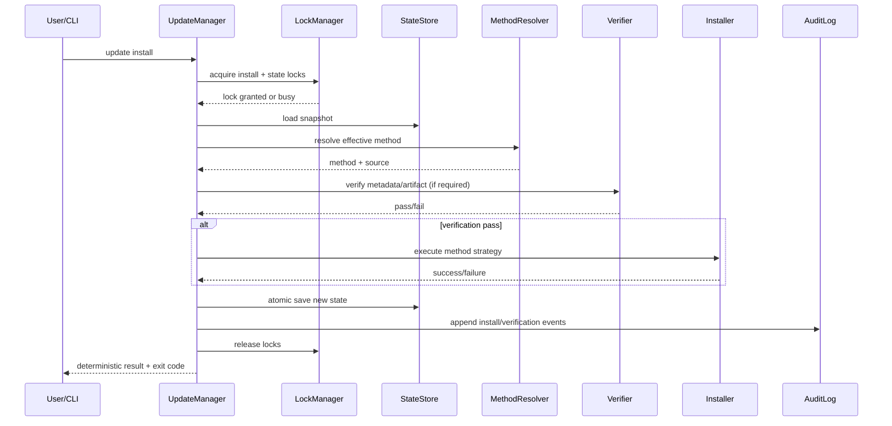
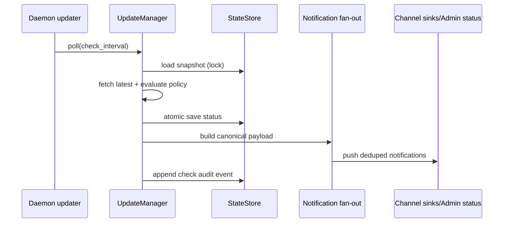

# Design: Enhance Auto-Update System

## Technical Approach

Implement a single `UpdateManager` orchestration in `clients/agent-runtime/src/update/mod.rs` that owns update check, policy resolution, install planning, integrity verification, install execution routing, and audit recording. All runtime surfaces (CLI startup notice, daemon poller, in-conversation flow, admin API/dashboard) consume a single normalized status model so users see the same facts everywhere.

The design keeps current `version_check.json` compatibility, adds process-safe lock files and append-only history, and introduces explicit install method detection with user override. Security-critical verification is fail-closed for artifact paths.

## Architecture Decisions

### Decision: Central update orchestrator with shared state model

**Choice**: Keep update logic centered in `update/mod.rs` but refactor internally into cohesive components (`policy`, `state_store`, `method_detection`, `installer`, `audit`, `notifications`) behind an `UpdateManager` API.

**Alternatives considered**:
- Keep current free functions with incremental patches
- Split update functionality across `main`, `daemon`, and `channels`

**Rationale**: A single orchestrator removes drift between surfaces, enables deterministic command behavior, and makes locking/verification controls enforceable in one place.

### Decision: Fail-closed verification contract for downloadable artifacts

**Choice**: For any installer path that downloads/stages binaries (script/binary mode), require trusted metadata + checksum verification before activation; if metadata is missing/invalid, installation is blocked.

**Alternatives considered**:
- Best-effort verification with warnings
- Trust package manager only for all paths

**Rationale**: Requirement mandates verification fail-closed. This prevents silent integrity bypass and keeps default posture secure.

### Decision: Cross-process lock files + atomic rename persistence

**Choice**: Use file-based advisory locks for cross-process serialization and temp-file/fsync/rename for atomic writes.

**Alternatives considered**:
- Existing in-process `OnceLock<Mutex<()>>` only
- SQLite state store migration in this change

**Rationale**: Satisfies process-safety and interruption-safety without large storage migration risk.

### Decision: Deterministic install method selection with explicit precedence

**Choice**: Effective method resolution order: `user override` -> `detected method` -> `manual fallback (unsupported)`.

**Alternatives considered**:
- Try every installer opportunistically
- Auto-pick first command available in PATH

**Rationale**: Deterministic routing is auditable, scriptable, and avoids unsafe unknown install attempts.

### Decision: Canonical update status contract reused by CLI/channel/admin

**Choice**: Define a single `UpdateStatusView` and consume it in CLI output, channel notices, daemon push payload, and admin response.

**Alternatives considered**:
- Per-surface formatting/state derivation

**Rationale**: Eliminates user confusion from mismatched versions/policy flags across surfaces.

### Decision: JSONL audit history with bounded retention

**Choice**: Append structured events to `workspace/state/update_history.jsonl` with optional max-entry trimming.

**Alternatives considered**:
- Store history in single mutable JSON array file
- No persistence beyond logs

**Rationale**: JSONL is append-friendly, resilient under partial failures, and simple to inspect from CLI.

## Data Models

```rust
// update/mod.rs (or update/types.rs)

#[derive(Debug, Clone, Serialize, Deserialize, PartialEq, Eq)]
pub enum InstallMethod {
    Npm,
    Pnpm,
    Yarn,
    Bun,
    Homebrew,
    Cargo,
    ScriptBinary,
    Unknown,
}

#[derive(Debug, Clone, Serialize, Deserialize)]
pub struct UpdatePolicy {
    pub checks_enabled: bool,
    pub auto_install_enabled: bool, // default false
    pub channel_visibility_enabled: bool,
    pub cli_startup_notice_enabled: bool,
    pub check_interval_minutes: u64,
    pub confirmation_ttl_minutes: u64,
    pub install_method_override: Option<InstallMethod>,
    pub restart_policy: RestartPolicy,
}

#[derive(Debug, Clone, Serialize, Deserialize, PartialEq, Eq)]
pub enum RestartPolicy {
    Never,
    Prompt,
    AutoManagedService,
}

#[derive(Debug, Clone, Serialize, Deserialize)]
pub struct UpdateStateSnapshot {
    pub schema_version: u32,
    pub current_version: String,
    pub latest_version: String,
    pub update_available: bool,
    pub last_check_at_unix: u64,
    pub last_check_outcome: CheckOutcome,
    pub effective_method: InstallMethod,
    pub detected_method: Option<InstallMethod>,
    pub overridden_method: Option<InstallMethod>,
    pub install_state: InstallState,
    pub pending_confirmations: Vec<PendingConfirmation>,
    pub notified_conversations: Vec<NotifiedConversation>,
}

#[derive(Debug, Clone, Serialize, Deserialize, PartialEq, Eq)]
pub enum InstallState {
    Idle,
    Installing { tx_id: String, started_at_unix: u64 },
    InstalledPendingRestart { version: String, installed_at_unix: u64 },
    Failed { tx_id: String, failed_at_unix: u64, reason_code: String },
}

#[derive(Debug, Clone, Serialize, Deserialize, PartialEq, Eq)]
pub enum CheckOutcome {
    Success,
    NetworkError,
    ParseError,
    SourceRejected,
}

#[derive(Debug, Clone, Serialize, Deserialize)]
pub struct UpdateAuditEvent {
    pub event_id: String,
    pub timestamp_unix: u64,
    pub action: AuditAction, // check | install | policy_change | verification
    pub outcome: AuditOutcome,
    pub current_version: String,
    pub target_version: Option<String>,
    pub effective_method: InstallMethod,
    pub actor: String, // cli:<user>, daemon, channel:<name>, admin
    pub reason_code: Option<String>,
    pub verification: Option<VerificationSummary>,
}
```

### Config model additions

`UpdateConfig` in `clients/agent-runtime/src/config/schema.rs` is extended with:

- `auto_install_enabled: bool` (default `false`)
- `channel_visibility_enabled: bool` (default `true`)
- `cli_startup_notice_enabled: bool` (default `true`)
- `install_method_override: Option<String>` (validated enum)
- `restart_policy: String` (`never|prompt|auto_managed_service`, default `prompt`)
- `history_max_entries: u32` (bounded retention)

Environment override keys (deterministic precedence over file):

- `CORVUS_UPDATES_ENABLED`
- `CORVUS_UPDATE_AUTO_INSTALL`
- `CORVUS_UPDATE_CHANNEL_VISIBILITY`
- `CORVUS_UPDATE_CLI_NOTICE`
- `CORVUS_UPDATE_METHOD_OVERRIDE`
- `CORVUS_UPDATE_RESTART_POLICY`
- existing `CORVUS_DISABLE_UPDATE_CHECK` remains hard-disable gate

Invalid env values are ignored with warning and never relax to less-safe behavior.

## State Transitions

Install transaction state machine:

| Current | Trigger | Guard | Next | Notes |
|---|---|---|---|---|
| `Idle` | `update install` requested | lock acquired, policy allows | `Installing` | tx_id generated and persisted before execution |
| `Installing` | installer success + verification success | target version valid | `InstalledPendingRestart` | restart policy evaluated after state write |
| `Installing` | verification failed | always | `Failed` | fail-closed; no activation |
| `Installing` | method unsupported/prereq missing | always | `Failed` | deterministic manual instructions |
| `Installing` | second concurrent request | install lock denied | unchanged | requester gets busy/deferred result |
| `InstalledPendingRestart` | restart completed | managed service restart succeeds/manual restart acknowledged | `Idle` | current version updates on next process start/check |
| `Failed` | new install request | lock acquired | `Installing` | new tx_id |

## Locking and Atomic Write Strategy

### Files

- `workspace/state/version_check.json` (state snapshot; backward-compatible path)
- `workspace/state/update_history.jsonl` (audit append log)
- `workspace/state/update_state.lock` (general state mutation lock)
- `workspace/state/update_install.lock` (single active install transaction)

### Locking model

1. Acquire `update_state.lock` for load-mutate-save of `version_check.json`.
2. For installation, acquire `update_install.lock` first, then `update_state.lock` (fixed order) to avoid deadlock.
3. Lock acquisition timeout returns deterministic busy outcome (`EXIT_BUSY`) without partial changes.
4. Keep existing in-process mutex as secondary guard, but file lock is authoritative across processes.

### Atomic persistence

1. Serialize snapshot to bytes.
2. Write to `version_check.json.tmp.<pid>.<uuid>`.
3. `sync_all` temporary file.
4. `rename` temp -> `version_check.json` (atomic replace).
5. `sync_directory(parent)`.
6. Re-read and parse for post-write sanity; on failure, emit audit failure and preserve last good snapshot.

History append uses lock + append + fsync semantics; truncation/compaction (if entry cap exceeded) writes a new temp file atomically.

## Method Detection Strategy

`resolve_effective_install_method()`:

1. Validate configured override (`updates.install_method_override` or env). If valid, use it and mark source `override`.
2. If no override:
   - detect Homebrew by executable path prefixes and brew metadata query
   - detect Cargo via executable path/cargo home and `cargo install --list`
   - detect npm/pnpm/yarn/bun via package-manager global package inspection
   - detect script/binary via unmanaged binary location heuristics
3. If none detected, set `Unknown` and return manual fallback plan only.

Detection output includes confidence + source for audit/status. Unsupported methods never trigger unsafe generic shell paths.

## Command Flow

New `corvus update` command tree in `clients/agent-runtime/src/main.rs`:

- `update status`
  - loads effective policy + latest snapshot
  - prints current/latest version, update availability, method (detected/effective), policy flags
  - exit 0 on resolvable status

- `update check`
  - forces remote check (bypasses TTL), records check audit event
  - updates snapshot atomically
  - exit 0 when check succeeds (update may or may not be available), non-zero on check failure

- `update install`
  - acquires install lock
  - resolves policy + method
  - verifies artifacts for download paths (fail-closed)
  - executes method strategy or emits deterministic manual fallback
  - records install + verification audit events
  - exit codes: success / no-update / blocked / busy / failed

- `update auto-enable` / `update auto-disable`
  - toggles `updates.auto_install_enabled` in config
  - persists config atomically via existing config save path
  - records policy_change audit event

- `update history`
  - reads `update_history.jsonl` in chronological order
  - supports deterministic text and machine-readable JSON output mode

Compatibility: `corvus update confirm <nonce>` remains for channel nonce confirmations; it is treated as an internal/advanced path and routed through the same install transaction guard.

## Notification Fan-Out Design

Canonical message payload (`UpdateNotificationPayload`) is produced once and routed to sinks:

1. CLI startup banner (`maybe_print_update_notice`) when `cli_startup_notice_enabled`.
2. In-conversation opportunistic mention (`channels/mod.rs`) when `channel_visibility_enabled` and sender authorized.
3. Daemon push notifications (`run_daemon_update_watcher`) to configured destinations.
4. Admin API (`gateway/admin.rs`) exposes latest status/policy for dashboard.

Dedupe key: `(latest_version, channel, recipient, authorized_sender)` using existing conversation dedupe semantics, now aligned with canonical status snapshot.

## Data Flow

```text
CLI/Daemon/Channel/Admin
       |
       v
  UpdateManager
   |   |    |
   |   |    +--> MethodResolver
   |   +-------> Verifier (checksum, fail-closed)
   +-----------> StateStore (lock + atomic write)
                |
                +--> version_check.json
                +--> update_history.jsonl
```

### Sequence: `corvus update install`



### Sequence: daemon check and fan-out



## Interfaces / Contracts

```rust
pub struct UpdateStatusView {
    pub current_version: String,
    pub latest_version: Option<String>,
    pub update_available: bool,
    pub last_check_at_unix: Option<u64>,
    pub last_check_outcome: Option<String>,
    pub effective_install_method: String,
    pub detected_install_method: Option<String>,
    pub install_method_source: String, // override|detected|unknown
    pub policy: UpdatePolicyView,
}

pub struct UpdatePolicyView {
    pub checks_enabled: bool,
    pub auto_install_enabled: bool,
    pub channel_visibility_enabled: bool,
    pub cli_startup_notice_enabled: bool,
    pub restart_policy: String,
}
```

Admin contract extension (`gateway/admin.rs`, dashboard type mirror):

- `config.updates` section in admin payload with policy + effective status fields
- keep secret-safe response discipline (no tokens, no raw lock paths)

## File Changes

| File | Action | Description |
|------|--------|-------------|
| `clients/agent-runtime/src/update/mod.rs` | Modify | Introduce `UpdateManager`, method resolution, lock/atomic state store, verification gate, audit events, history read API |
| `clients/agent-runtime/src/main.rs` | Modify | Add `update` subcommands (`status/check/install/auto-enable/auto-disable/history`) and deterministic exit handling |
| `clients/agent-runtime/src/config/schema.rs` | Modify | Extend `UpdateConfig`, defaults, env overrides, and validation for override enums/policy values |
| `clients/agent-runtime/src/channels/mod.rs` | Modify | Route opportunistic/confirm flows through canonical status + policy gating and unified notification payload |
| `clients/agent-runtime/src/daemon/mod.rs` | Modify | Keep updater supervisor, call new manager APIs, emit health/audit-friendly outcomes |
| `clients/agent-runtime/src/service/mod.rs` | Modify | Add restart integration hook consumption for `InstalledPendingRestart` handling when policy requires managed restart |
| `clients/agent-runtime/src/gateway/admin.rs` | Modify | Extend admin config/status view with update state and policy contract |
| `clients/web/apps/dashboard/src/types/admin-config.ts` | Modify | Add strongly-typed `updates` fields mirroring admin API contract |

## Security Controls

- Release source allowlist: only configured trusted GitHub release endpoints are accepted.
- Verification fail-closed: missing checksum metadata, download failure, or digest mismatch blocks activation.
- No shell-string execution for installer commands; use fixed binary + arg vectors.
- Confirmation nonces remain hashed at rest and validated with sender/channel binding.
- Lock/state/history files created with owner-restricted permissions where supported.
- Env override validation never weakens safety defaults on parse failure (warn + ignore invalid).

## Observability and Audit

- Structured tracing spans: `update.check`, `update.install`, `update.verify`, `update.notify` with outcome tags.
- Audit event classes: check, install_attempt, install_result, verification_result, policy_change, restart_action.
- `corvus update history` reads structured events from `update_history.jsonl` (chronological output).
- Daemon component health remains integrated via `daemon/mod.rs` supervisor markers.

## Testing Strategy

| Layer | What to Test | Approach |
|-------|-------------|----------|
| Unit | method detection precedence, policy/env precedence, invalid override handling, state machine transitions | Rust unit tests in `update/mod.rs` and `config/schema.rs` |
| Unit | atomic writer and lock contention behavior | tempdir-based tests with parallel tasks/process simulation |
| Integration | CLI command exit semantics and output contracts | command tests for `update status/check/install/auto-enable/auto-disable/history` |
| Integration | channel confirmation + opportunistic mention gating | channel test harness in `channels/mod.rs` with fake channel |
| Integration | admin response parity with update status model | gateway admin handler tests + dashboard TS type checks |
| Resilience | interrupted write recovery and busy install response | fault-injection tests around temp write/rename and lock denial |

## Migration / Rollout

No destructive migration required.

- Existing `version_check.json` is read and upgraded in-memory to new snapshot schema (`schema_version`).
- Missing fields default safely.
- History file is additive (`update_history.jsonl`), created on first event.

## Phased Implementation Plan

### Phase 1: Safety + command foundation

1. Add `update status|check|install` command surface and exit code mapping.
2. Implement lock manager + atomic state writes for `version_check.json`.
3. Introduce install state machine and install transaction guard.
4. Add method detection + deterministic unsupported fallback.

### Phase 2: Policy model + multi-surface visibility

1. Extend config schema/env overrides with safe defaults and validation.
2. Add `update auto-enable|auto-disable` and status reflection.
3. Unify canonical payload fan-out for CLI/channel/daemon.
4. Expose update policy/status in admin gateway + dashboard types.

### Phase 3: Verification hardening + auditability

1. Enforce checksum verification fail-closed for artifact paths.
2. Append structured update audit events and expose `update history`.
3. Integrate service restart policy handling for managed daemon mode.
4. Add fault-injection and concurrency tests for interruption/race resilience.

## Open Questions

- [ ] Signature verification backend selection (Sigstore/GPG) is deferred; this design adds extension points but mandates checksum now.
- [ ] Final release source canonicalization (`profiletailors` vs `dallay`) should be confirmed before implementation freeze.
